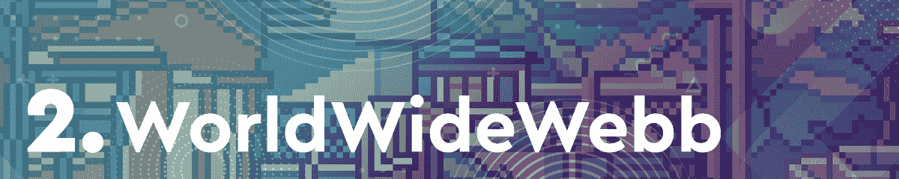
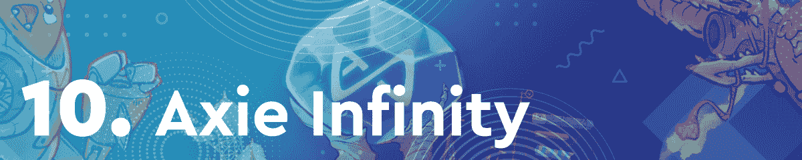

# 《外星世界》在不断下跌的代币价格中瞄准明星

> 原文：<https://web.archive.org/web/https://dappradar.com/blog/alien-worlds-aims-for-the-stars-amidst-falling-token-prices>

## 主要竞争对手 Splinterlands 仍位列前三

《异形世界》在区块链游戏社区中重新获得了吸引力，在本周的区块链十大游戏排行榜中名列榜首。蜡为基础的采矿游戏已经设法在相当悲观的气候中攀升图表。在过去的七天里，榜单上大多数游戏的原生代币的价值都出现了大幅下跌。

虽然《异形世界》占据榜首，但上周排名第一的《分裂的世界》设法保住了前三名的位置。交易卡游戏吸引了超过 50 万个独特的活动钱包，成为榜单上访问量最大的游戏 dapp。

几个月来，区块链游戏一直处于加密活动的前沿。通过这篇文章，DappRadar 看了本周最热门的游戏 dapps。为了编制这个排名，我们考虑了链上活动，NFT 交易量，令牌估值，以及围绕每个 dapp 的新闻和事件。

在下面浏览本周十大区块链游戏的完整列表。单击相应的图片，了解每个平台的更多信息。或者，看看下面的视频，它总结了排名，可以快速查看。

[https://web.archive.org/web/20221007082744if_/https://www.youtube.com/embed/budIvSHeeUI?feature=oembed](https://web.archive.org/web/20221007082744if_/https://www.youtube.com/embed/budIvSHeeUI?feature=oembed)

## 区块链十大运动会–2022 年第 10 周

### 《外星世界》见证了 TLM 价值的小幅下降

《异形世界》本周排名第一，这要归功于活跃玩家的稳定涌入，以及该游戏的原生令牌 TLM 相当稳定的表现。在大多数游戏相关代币估值大幅下降的背景下，TLM 仅损失了约 10%的价值。此外，在过去的七天里，《异世界》在 NFT 创造了超过 10 万美元的交易量。

### 公寓建造者竞赛给万维网带来炒作

由于该平台目前正在举办广泛的公寓建造者竞赛，虚拟世界本周获得了亚军。过去七天，该平台还产生了超过 430 万美元的 NFT 交易量。

### Splinterlands 拥有 50 万活跃用户

上周的最佳表现者[splitterlands](https://web.archive.org/web/20221007082744/https://dappradar.com/hive/games/splinterlands)现在排名第三，因为该平台看到其原生令牌 SPS 的价格下降了超过 16%。尽管有所下降，但在过去的七天里，Splinterlands 仍然吸引了超过 50 万个独特的活动钱包。

### 稀有农业和 Gotchiverse 把 Aavegotchi 推上了排行榜

在发布了两条重要消息后，Aavegotchi 本周取得了相当大的成功。广受欢迎的电子鸡风格游戏[背后的团队宣布将于 3 月 31 日](https://web.archive.org/web/20221007082744/https://dappradar.com/blog/aavegotchi-launches-gotchiverse-on-march-31/)推出电子鸡虚拟世界。此外，Aavegotchi 推出了其稀有农业活动的第三季，进一步增加了玩家的游戏赚取机会。

### 《疯狂防御英雄》的用户群持续增长

基于多边形的移动塔防游戏[疯狂防御英雄](https://web.archive.org/web/20221007082744/https://dappradar.com/ethereum/games/crazy-defense-heroes)已经成为每周十大区块链游戏排行榜的常客。在过去的七天里，该游戏吸引了超过 16 万个独特的活动钱包，成为[多边形区块链](https://web.archive.org/web/20221007082744/https://dappradar.com/rankings/protocol/polygon/category/games)上玩得最多的游戏。

### 产品开发使 DeFi 王国保持在排行榜上

尽管其本土象征珠宝的价值下跌超过 12%，DeFi Kingdoms 本周排名第六。DeFi 王国团队[宣布，他们正致力于推出一个定制的 DFK 区块链](https://web.archive.org/web/20221007082744/https://dappradar.com/blog/defi-kingdoms-launching-own-dfk-blockchain-to-improve-game-experience)，以容纳连接到 DeFi 王国生态系统的各种 dapps。这一声明推动了游戏的活动，在过去的七天里吸引了近 50，000 个不同的活动钱包。

### 新功能让玩家锁定 REVV 赛车

赛车游戏 [REVV Racing](https://web.archive.org/web/20221007082744/https://dappradar.com/polygon/games/revv-racing) 也在排行榜上攀升，尽管市场不景气，其本土品牌 [REVV](https://web.archive.org/web/20221007082744/https://dappradar.com/hub/token/polygon/REVV/MATIC?from=0x70c006878a5a50ed185ac4c87d837633923de296) 的估值也在下跌。REVV Racing 继续为赛道带来改进，玩家现在有机会尝试三种不同的天气设置。这项新功能提高了游戏的活跃度，因为 REVV Racing 在过去一周内看到近 3000 个独特的活动钱包连接到其智能合约。

### 新产品进入 Mobox 游戏平台

NFT 农业游戏 Mobox [宣布了一款名为 Moland Defense](https://web.archive.org/web/20221007082744/https://dappradar.com/blog/user-activity-surges-as-mobox-reveals-moland-defense/) 的新游戏，这提升了该平台的用户活跃度。在过去的七天里， [Mobox](https://web.archive.org/web/20221007082744/https://dappradar.com/binance-smart-chain/games/mobox-nft-farmer) 见证了近 200，000 个独特的活跃钱包，产生了约 400 万美元的 NFT 交易量。尽管其原生令牌 [MBOX](https://web.archive.org/web/20221007082744/https://dappradar.com/hub/token/bsc/MBOX/BNB?from=0x3203c9e46ca618c8c1ce5dc67e7e9d75f5da2377) 大幅下跌超过 20%，该平台本周排名第八。

### 沙盒本周仍有 610 万美元的 NFT 交易量

虚拟世界[沙盒](https://web.archive.org/web/20221007082744/https://dappradar.com/ethereum/games/the-sandbox)继续推动元宇宙的创新。在过去的七天里，它在 NFT 创造了超过 610 万美元的交易量，其中一笔交易进入了每周[十大 NFT 销售额](https://web.archive.org/web/20221007082744/https://dappradar.com/blog/ether-rock-ahead-of-axie-infinity-and-the-sandbox-in-colorful-top-10-nft-sales)排行榜。尽管如此，虚拟世界本周排名垫底，因为其原生令牌[和](https://web.archive.org/web/20221007082744/https://dappradar.com/hub/token/eth/SAND/ETH)在过去一周的定价中下跌了 11%以上。

### Axie Infinity 在令牌暴跌中失去了一点吸引力

游戏赚取巨头 Axie Infinity 本周勉强进入排名，而传统上该平台是表现最好的游戏之一。尽管过去七天 NFT 交易量超过 1000 万美元，但 Axie Infinity 的交易量有所下降。此外，与整个游戏行业保持一致的是， [AXS](https://web.archive.org/web/20221007082744/https://dappradar.com/hub/token/eth/AXS/ETH) ，Axie Infinity 的本地治理标志，在过去一周内估值下降了近 15%。

## 《外星世界》无视悲观的气候

随着日益令人担忧的全球政治和金融气候，加密领域正在经历一个明显的熊市时期。区块链博彩业也在经历动荡，尤其是在博彩代币的估值方面。

尽管如此,《外星世界》还是成功地对抗了这种气候，并登上了每周区块链游戏排行榜的榜首。在 DappRadar 追踪的所有游戏链中，采矿游戏已经证明了自己是访问量最大的游戏之一。此外,《异形世界》仍然是区块链蜡像馆的顶级游戏。

DappRadar 将继续监测区块链的游戏空间，因为项目继续推动对寒冷的冬季风。如果你想更详细地了解这个领域，可以查看一下 [DappRadar 顶级游戏](https://web.archive.org/web/20221007082744/https://dappradar.com/rankings/category/games)排名。此外，你可以在[推特](https://web.archive.org/web/20221007082744/https://twitter.com/dappradar)上关注 DappRadar，抢先获得最新的区块链博彩新闻。

 NewsletterUnsubscribe at any time. [T&Cs](https://web.archive.org/web/20221007082744/https://dappradar.com/terms) and [Privacy Policy](https://web.archive.org/web/20221007082744/https://dappradar.com/privacy-policy)