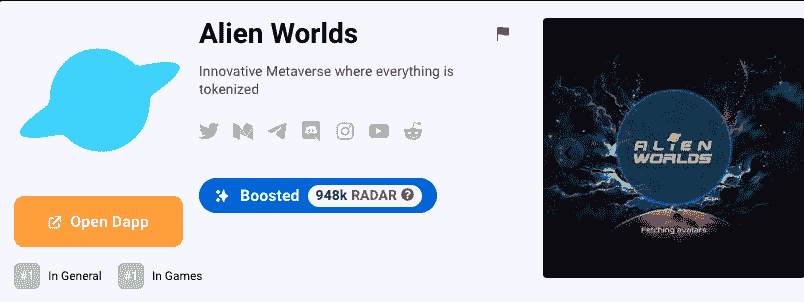

# AMA 外星人世界 DappDays 集锦

> 原文：<https://web.archive.org/web/https://dappradar.com/blog/alien-worlds-ama-dappdays-highlights>

## 银河枢纽格兰特，行星道，雷神穹顶，以及更多来自外星世界

8 月 9 日星期二，作为我们 DappDays 庆祝周的一部分，DappRadar 与外星世界进行了对话。

[外星世界](https://web.archive.org/web/20220930065233/https://dappradar.com/multichain/games/alien-worldsfinity)是一款非常受欢迎的[NFT](https://web.archive.org/web/20220930065233/https://dappradar.com/nft)T4 元宇宙游戏，游戏中的一切都在[以太坊](https://web.archive.org/web/20220930065233/https://dappradar.com/rankings/protocol/ethereum)、[蜡像](https://web.archive.org/web/20220930065233/https://dappradar.com/rankings/protocol/wax)、 [BNB 智能链](https://web.archive.org/web/20220930065233/https://dappradar.com/rankings/protocol/binance-smart-chain)上被令牌化。在《异形世界》的模拟经济中，玩家争夺稀缺资源，包括 NFT 和游戏内代币。

> 我们是，刀，令牌。很快，我们的 DAOs 将上线。自游戏推出以来，他们一直在技术上积极积累财富，很快，我们将邀请公众、玩家和社区参与并运行管理行星 DAO 资源的治理，以及那些使用 Dacoco(发布外星世界的公司)和外星世界本身提供的工具的人
> 
> Stacy Neale

## 什么是银河枢纽补助金？

外星世界支持和资助发展社区和外星世界生态系统的项目。银河枢纽赠款就是这样一个倡议。

> 这笔赠款是拥抱社区的整体精神的一部分，我们希望支持那些希望来到我们的元宇宙并以某种方式改进或利用它的社区成员。我们有一系列不同的补助金。为扩大和使外星世界的元宇宙生态系统更加强大提供资源社区的想法。
> 
> Stacy Neale

## 关于行星道你能告诉我们些什么？

外星世界中的每个星球都是一个令牌化的分散自治组织 [(DAO)](https://web.archive.org/web/20220930065233/https://dappradar.com/blog/what-is-a-dao-how-does-it-work/) ，拥有一个专用的成员客户端门户，供星球令牌持有者投票选举他们的州长，并分配万亿和 NFT 流量。

> 很快，玩家就可以参与治理社区了。道中的保管人和其他玩家可以押上他们的万亿并得到一个行星代币作为回报，这取决于他们是哪个行星的，这给了他们投票权。然后，他们拥有股权加权投票权，这就是每个 DAO 的管理人是如何被选举出来管理它的。
> 
> 一旦发生这种情况，他们就能唾手可得国债了。他们都可以作为一个社区来决定如何分配这些资源，这可能是对该道中所有玩家的社区的回馈。做什么完全取决于社区。
> 
> Stacy Neale

[https://web.archive.org/web/20220930065233if_/https://www.youtube.com/embed/eCgPih8oqKk?feature=oembed](https://web.archive.org/web/20220930065233if_/https://www.youtube.com/embed/eCgPih8oqKk?feature=oembed)

## AMA 时间戳

[00:00](https://web.archive.org/web/20220930065233/https://www.youtube.com/watch?v=eCgPih8oqKk&t=0s)–简介

[04:45](https://web.archive.org/web/20220930065233/https://www.youtube.com/watch?v=eCgPih8oqKk&t=285s)—《外星世界》预告片

[07:05](https://web.archive.org/web/20220930065233/https://www.youtube.com/watch?v=eCgPih8oqKk&t=425s)–什么是外星世界？

[11:00](https://web.archive.org/web/20220930065233/https://www.youtube.com/watch?v=eCgPih8oqKk&t=660s)–为什么外星世界会在 WAX 上启动？

[12:45](https://web.archive.org/web/20220930065233/https://www.youtube.com/watch?v=eCgPih8oqKk&t=765s)–外星世界与 Zilliqa 合作

[15:45](https://web.archive.org/web/20220930065233/https://www.youtube.com/watch?v=eCgPih8oqKk&t=945s)——外星世界的头号地主——JR 的土地

[20:00](https://web.archive.org/web/20220930065233/https://www.youtube.com/watch?v=eCgPih8oqKk&t=1200s)–银河枢纽|拨款计划

[25:00](https://web.archive.org/web/20220930065233/https://www.youtube.com/watch?v=eCgPih8oqKk&t=1500s)——外星世界的行星道

[30:50](https://web.archive.org/web/20220930065233/https://www.youtube.com/watch?v=eCgPih8oqKk&t=1850s)——雷霆万钧:在外星世界战斗

[33:10](https://web.archive.org/web/20220930065233/https://www.youtube.com/watch?v=eCgPih8oqKk&t=1990s)–外星世界的 3D 人物和 3D 星球？互用性

[37:50](https://web.archive.org/web/20220930065233/https://www.youtube.com/watch?v=eCgPih8oqKk&t=2270s)–未来 12 个月外星世界的路线图是什么？

[48:00](https://web.archive.org/web/20220930065233/https://www.youtube.com/watch?v=eCgPih8oqKk&t=2880s)–提案和外星世界开放治理

## 感兴趣的链接

[什么是外星世界？](https://web.archive.org/web/20220930065233/https://dappradar.com/blog/what-is-alien-worlds)

解释:外星世界的 TLM 令牌是什么？

[如何评价外星世界 NFTs？](https://web.archive.org/web/20220930065233/https://dappradar.com/blog/how-to-value-alien-worlds-nfts)

[外星世界在 Zilliqa 找到了另一个家](https://web.archive.org/web/20220930065233/https://dappradar.com/blog/alien-worlds-finds-another-home-on-zilliqa/)

 NewsletterUnsubscribe at any time. [T&Cs](https://web.archive.org/web/20220930065233/https://dappradar.com/terms) and [Privacy Policy](https://web.archive.org/web/20220930065233/https://dappradar.com/privacy-policy)