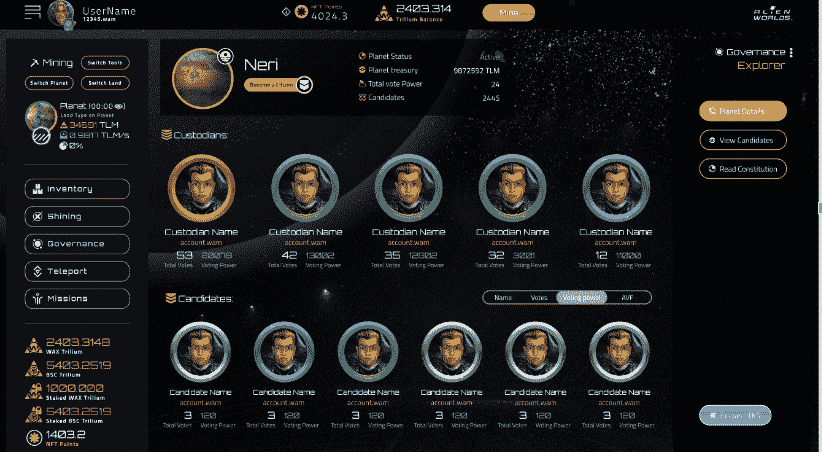

# 随着玩家获得对元宇宙的控制权，外星世界的用户也在增加

> 原文：<https://web.archive.org/web/https://dappradar.com/blog/alien-worlds-user-growth-as-players-get-control-over-metaverse>

## 《异形世界》推出了游戏内 Dao，允许用户设计他们想要的游戏体验。

《异形世界》最近引入了行星辛迪加，改进了游戏中的道机制，让玩家在塑造游戏生态系统方面有了更大的发言权。这种去中心化的治理允许玩家管理他们的社区、创建游戏、分发数字资产等等。辛迪加的推出给外星世界的用户群带来了持续的增长。

DappRadar 的游戏排名中排名第一的超通用游戏生态系统《异形世界》于 2022 年 10 月 20 日推出了其游戏内 DAOs(行星辛迪加)。

分散的所有权和治理已经发展成为游戏行业的一个有影响力的驱动力。这样一个蓬勃发展的景象是由诸如外星世界这样的名字引领的。由 Dacoco 创建的《外星世界》是将 DAO 系统融入其游戏生态系统的早期采用者。

值得注意的是，行星辛迪加是外星世界在道实践中的另一项创新。它让玩家有机会管理他们自己的社区，管理和分配国库，并合作和相互竞争 Trilium (TLM)，外星世界的本地令牌。

辛迪加的推出给《异形世界》独特的活动钱包(UAW)带来了持续的提升。根据 DappRadar 的说法，在过去的 14 天里，这款游戏在 UAW 的销量增长了近 15%。

[Check out Alien Worlds Planetary Syndicates](https://web.archive.org/web/20221127183432/https://alienworlds.io/syndicate)

**内容**

*   什么是刀，它如何赋予游戏玩家力量？
*   什么是外星世界行星辛迪加？
*   [如何加入行星辛迪加](https://web.archive.org/web/20221127183432/https://dappradar.com/blog/alien-worlds-user-growth-as-players-get-control-over-metaverse/#how)
*   [行星辛迪加对外星世界玩家意味着什么](https://web.archive.org/web/20221127183432/https://dappradar.com/blog/alien-worlds-user-growth-as-players-get-control-over-metaverse/#mean)

## 什么是刀，它如何赋予游戏玩家力量？

DAO 代表分散的自治组织。本质上，DAO 是一个虚拟的社区领导的组织，没有任何中央权威。相反，所有的决策和财政管理都是通过区块链基于共识的投票进行的。

DAO 的规则是通过智能契约来实施的。与道有利害关系的人就有了投票权。通过这种方式，合格的选民可以塑造项目的未来发展、国库分配、组织的方向等等。

例如，可以通过以下方式获得合格投票:

*   持有生态系统的本地令牌
*   将本地令牌加入池中

[Learn everything about DAO](https://web.archive.org/web/20221127183432/https://dappradar.com/blog/what-is-a-dao-how-does-it-work)

如果一个游戏项目是由 DAO 运营的，那么这对玩家来说意味着什么？

在 Web2 世界中，游戏由开发它们的公司管理。一旦游戏运营商制定了规则，玩家如果想继续成为游戏的一部分，就必须无条件接受。然而，当 DAO 负责时，情况就完全不同了，因为在这种情况下，社区成员成为系统中的决策者和共同所有者。

让我们用一个最简单的例子来详细说明这一点。

也许，对于游戏玩家来说，没有什么比他们最喜欢的游戏在一夜之间停产更令人头疼的了。然而，有了 DAO，一款游戏的暂停不再是制作它的公司的唯一决定，而是像这样的关键决定由投票决定。

## 什么是外星世界行星辛迪加？

[https://web.archive.org/web/20221127183432if_/https://www.youtube.com/embed/r1kFsvH_XTc?feature=oembed](https://web.archive.org/web/20221127183432if_/https://www.youtube.com/embed/r1kFsvH_XTc?feature=oembed)

外星世界的行星辛迪加是进化成 DAOs 的游戏公会，允许玩家定义他们自己的规则和设计他们的游戏。此外，这些治理系统让玩家控制数百万的加密货币，以建立、维护、开发和进化游戏的生态系统、框架和虚拟世界。

[Learn how to play Alien Worlds like a pro](https://web.archive.org/web/20221127183432/https://dappradar.com/blog/how-to-play-alien-worlds-like-a-pro)

外星世界的六个星球都是辛迪加。玩家可以通过将他们的 TLM 转换成行星代币来支持一个或多个行星，然后这些代币可以被押到玩家选择的辛迪加。一旦下注或“承诺”给一个行星辛迪加，玩家就可以对外星世界社区的未来进行投票，并决定提供什么游戏和活动，举办什么活动，以及如何分配每个星球可观的财富。

## 如何参与行星辛迪加

玩家最初以探险者的身份加入外星世界。值得注意的是，探险者并不局限于参与一个行星辛迪加。例如，他们可以浏览行星细节，如候选人和监护人名单和个人资料。然而，只有行星辛迪加的公民才有投票权。

*Syndicate Planetary details*

### 你如何成为公民？

探索者只需要将至少 1 个 TLM 兑换成相应星球的一个星球令牌，并签署会员条款；然后，探险家将正式成为那个星球的公民。

辛迪加的公民可以投票选举管理行星辛迪加资源的行星委员会的管理者。投票结果反映了社区所信奉的文化和价值观。此外，用户可以使用投票来删除被认为违反辛迪加利益的托管人。

有眼光，想为地球多做贡献的玩家可以成为行星理事会的候选人。为此，公民必须将 5000 TLM 兑换成行星代币，并在登记成为候选人之前投入赌注。

[Learn in detail about how Planetary Syndicates work](https://web.archive.org/web/20221127183432/https://alienworlds.medium.com/getting-started-with-alien-worlds-planetary-syndicates-90598c24366b)

## 行星辛迪加对外星世界玩家意味着什么

外星世界生态系统植根于人际关系，通过社区建设、用户协作和加密激励(如 TLM 和其他数字资产，如 NFTs)赋予玩家目的和意义。

通过启动行星辛迪加,《外星世界》旨在探索一种新的游戏参与模式，在 Web3 游戏中加入 Dao 并释放社交网络的潜力。当在 DAO 中合作时，玩家建立了真正的社会联系，从而使每个 DAO 形成其独特的文化。

在游戏经济方面，到目前为止，玩家可以在 TLM 采矿，在 TLM 入股。在外星世界的生态系统中加入了政治因素，使得玩家能够在适当的时候采取不同的策略来促进经济竞争或合作，从而崛起并控制一个或多个 Dao。宣誓。领先。征服，”是辛迪加网页上的战斗口号，似乎在这个领先的元宇宙，一场权力和霸权的战争已经点燃。这些游戏机制模拟了各种现实生活中的经济活动，它们都影响着每一个道的发展，并最终影响着游戏的方向。

这不是很像我们的现实世界吗？每个人都可以参与，每个人都塑造未来。因此，如果这样的虚拟世界听起来像是你想尝试的东西，请单击下面的按钮，加入每月超过 600，000 个独特的活动钱包，构建未来的游戏！

[Join a Syndicate, play, collaborate and earn now](https://web.archive.org/web/20221127183432/https://alienworlds.io/syndicates)

**了解更多关于外星世界的信息**

*   [玩外星世界](https://web.archive.org/web/20221127183432/https://alienworlds.io/)
*   [加入行星辛迪加](https://web.archive.org/web/20221127183432/https://alienworlds.io/syndicates)
*   [推特](https://web.archive.org/web/20221127183432/https://www.twitter.com/alienworlds)
*   [不和](https://web.archive.org/web/20221127183432/https://discord.io/alienworldsofficial)

**免责声明** —这是一篇赞助文章。DappRadar 不认可本页面上的任何内容或产品。DappRadar 旨在提供准确的信息，但读者应该在采取行动之前总是自己做研究。DappRadar 的文章不能被认为是投资建议。