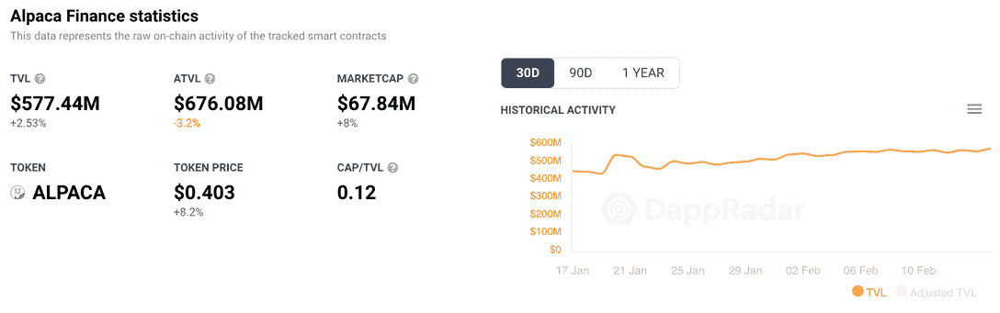
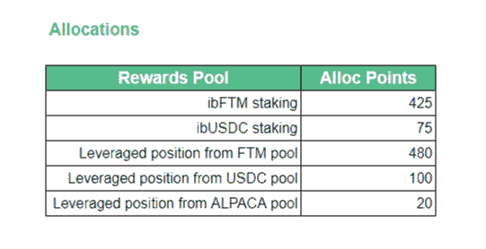

# 羊驼金融为 Fantom 带来杠杆收益农业

> 原文：<https://web.archive.org/web/https://dappradar.com/blog/alpaca-finance-brings-leveraged-yield-farming-to-fantom>

## 领先的币安智能连锁 dapp 扩大其农场

**溢价杠杆和收益率养殖协议羊驼金融在币安智能链上取得持续成功后，今天在 Fantom 网上推出了******。最初，将提供少量羊驼服务，并计划在短期内将其全部能力扩展到 Fantom 和更多连锁店。****

 **[羊驼在 BSC 上成功提供杠杆产量养殖](https://web.archive.org/web/20230125105812/https://dappradar.com/binance-smart-chain/defi/alpaca-finance)。交易者可以通过从流动性池中借钱并将其添加到其流动性中来增加产量的做法。由于拥有更多的流动性，可以期待更高的回报。迄今为止，羊驼的总价值超过 5.77 亿美元。

为了在头四周激励贷款人和杠杆收益农民，羊驼提供了 180，000 只羊驼作为奖励。用户可以像在 BSC 上一样，随时申请羊驼奖励。值得注意的是，在前四周结束时，团队将根据 TVL 的情况重新评估继续提供奖励的价值。

## Fantom 的羊驼路线图

如上所述，羊驼正在推出有限的服务，以期在未来几周和几个月内在 Fantom 全面运营。

**2 月 15 日星期二，世界协调时上午 7 点**

*   用户可以在[出借页面](https://web.archive.org/web/20230125105812/https://app.alpacafinance.org/lend)开始存放 FTM 和 USDC
*   用户可以在[赌注页面](https://web.archive.org/web/20230125105812/https://app.alpacafinance.org/stake)开始下注 ibUSDC 和 ibFTM

**2 月 15 日星期二，世界协调时上午 8 点**

*   羊驼奖励 ibUSDC 和 ibFTM staking 的排放启动

**世界协调时 2 月 15 日星期二上午 10 点**

用户可以在[农场页面](https://web.archive.org/web/20230125105812/https://app.alpacafinance.org/farm)的以下池中开始开立杠杆收益率农场头寸。羊驼奖励发射也开始为 LYF 的立场。

*   USDC(双边借款)
*   BOO-FTM
*   TUSD-USDC
*   wETH-FTM

**世界协调时 2 月 17 日星期四上午 10 点**

*   添加羊驼贷款池
*   增加对羊驼-FTM 杠杆产量养殖池的支持(双边借贷)

**世界协调时 2 月 22 日星期二上午 10 点**

*   BTC-FTM
*   福斯特-福特姆
*   戴-FTM
*   我-FTM

所述时间为近似值，摘自[羊驼官方发布文章](https://web.archive.org/web/20230125105812/https://medium.com/alpaca-finance/announcing-fantom-launch-details-timeli-48c50303f15a)。由于网络流量等各种因素，实际部署时间可能会略有不同。

## 羊驼和凡托姆的桥梁

那些在 BSC 上持有羊驼的人可以通过多链将代币从 BSC 桥接到 Fantom，以获得新的机会。在推出时，Fantom 上的羊驼毛有两种用途:

*   将羊驼存入贷款池以赚取收益
*   在有或没有杠杆的情况下，为 SpookySwap 羊驼-FTM 池提供流动性

对于不熟悉桥接令牌的人，羊驼准备了[一步一步的指南](https://web.archive.org/web/20230125105812/https://medium.com/r?url=https%3A%2F%2Fdocs.alpacafinance.org%2Four-protocol-1%2Fstep-by-step-guide%2Fbridge-alpaca-tokens-between-bsc-and-fantom)。

## 羊驼金融界的利益

多链扩张意味着现有的和新的[羊驼用户](https://web.archive.org/web/20230125105812/https://dappradar.com/binance-smart-chain/defi/alpaca-finance)将有更多的机会获得收益，并接触到 BSC 上目前不存在的不同代币。此外，TVL、贷款和借款的增加意味着每周更多的回购和焚烧，以及更多的收入分配给治理利益相关者。值得注意的是，Fantom 上不会有新的代币，羊驼所有者将从多链增长中受益。

最后，尽管自 2021 年初推出以来，羊驼已经在 BSC 上建立了稳固的声誉，但向 Fantom 的扩张将使羊驼提供的服务受到更多关注。

[https://web.archive.org/web/20230125105812if_/https://www.youtube.com/embed/ffbDaWtJu8Y?feature=oembed](https://web.archive.org/web/20230125105812if_/https://www.youtube.com/embed/ffbDaWtJu8Y?feature=oembed)

## 为什么选择 Fantom 网络

首先，Fantom 是 EVM 兼容的，这简化了许多开发工作。此外，它确保羊驼可以在合理的时间内发布产品。它拥有支持操作子图所需的基础设施，以及在 dapps 和价格 oracle 之间提供精确数据流的 Oracle 服务。此外，羊驼将能够利用 Fantom 领先的 DEX SpookySwap 的流动性。

Fantom 上的 TVL 在过去一个月里增长了 100%以上。根据 [DeFi Llama 的数据，该连锁店目前在总 TVL 排名第六。](https://web.archive.org/web/20230125105812/https://defillama.com/chains)最近，知名项目和开发商也宣布了在 Fantom 上推出产品的计划。随着更多领先的 dapps 发展 Fantom 的生态系统，羊驼可以获得更大的可组合性和更多扩展服务的机会。此外，现在 [DappRadar 正在跟踪 Fantom dapps](https://web.archive.org/web/20230125105812/https://dappradar.com/rankings/protocol/fantom) ，每月超过 100 万的网站访问者可能会在 Fantom 上发现羊驼。

当然，Fantom 也有一个[最有吸引力和最透明的资助项目](https://web.archive.org/web/20230125105812/https://fantom.foundation/blog/announcing-370m-ftm-incentive-program/)用于那里的协议开发。[根据所需的指标](https://web.archive.org/web/20230125105812/https://fantom.foundation/blog/fantom-foundation-awards-grants-to-innovative-projects-growing-the-network/)，羊驼应该有资格获得资助，并有望 100%用于奖励平台参与者。

虽然 BSC 以低费用和快速交易而闻名，但根据 FTM 网络上的当前天然气价格，羊驼金融平台上的典型交易将花费 0.10 至 0.50 美元。

最后，Fantom 使用的 [aBFT 共识机制允许节点在不交换最终块的情况下独立达成共识。节点之间的网络通信越少，区块链的速度越快，可扩展性越好。](https://web.archive.org/web/20230125105812/https://www.fantom.foundation/lachesis-consensus-algorithm/#:~:text=Lachesis%20is%20Fantom's%20aBFT%20consensus,scalable%2C%20and%20more%20secure%20choice.)

 NewsletterUnsubscribe at any time. [T&Cs](https://web.archive.org/web/20230125105812/https://dappradar.com/terms) and [Privacy Policy](https://web.archive.org/web/20230125105812/https://dappradar.com/privacy-policy)

***以上不构成投资建议。此处给出的信息仅供参考。请行使尽职调查，做你的研究。作者持有 ETH、BTC、AGIX、HEX、LINK、GRT、CRO、OMI、不可变 X、GALA、AVASTR、GMEE、CUBE、RADAR、FLOW、FTM、BNB、SPS、WRLD、ATOM 和 ADA。*****