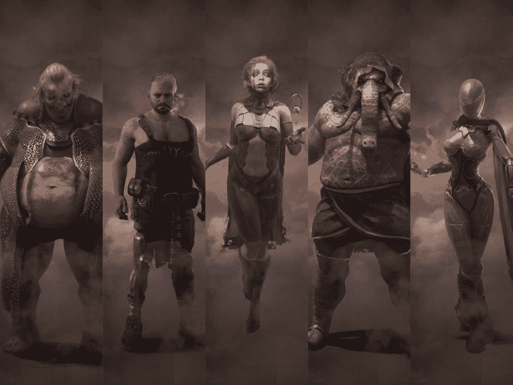
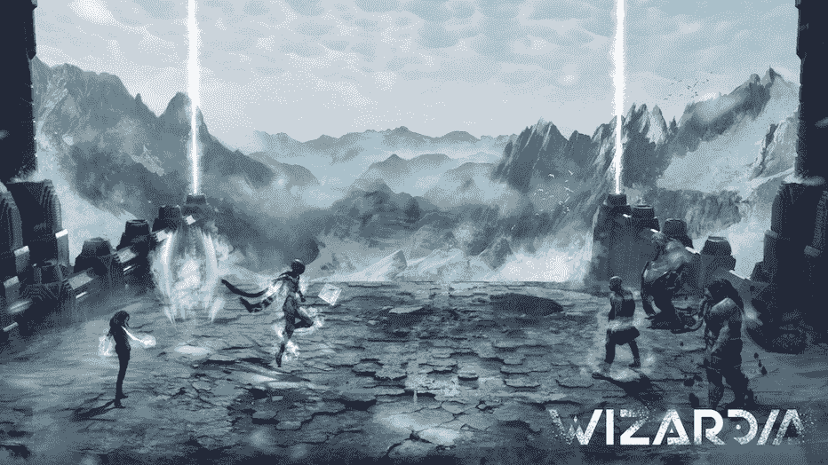
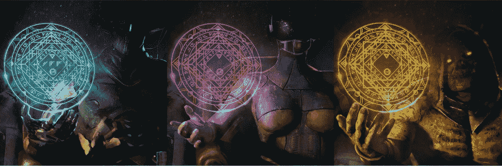
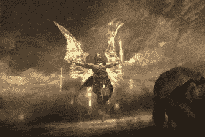
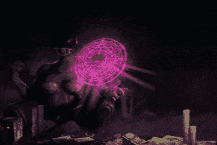

# 一个身临其境的和艺术的从玩到赚的旅程

> 原文：<https://web.archive.org/web/https://dappradar.com/blog/an-immersive-and-artistic-play-to-earn-journey-with-wizardias-arena-genesis-nfts>

## 第三轮竞技场起源 NFTs 销售正在进行中

Wizardia 通过其 Arena Genesis NFTs 为游戏爱好者策划了一场沉浸式艺术之旅。这款备受期待的游戏以艺术视觉设计和生态系统为特色，玩家可以在其中获得现实世界的收入。在巫师的双 NFT 生态系统中，竞技场起源 NFT 作为投资者和早期支持者的工具，在不参与游戏的情况下从项目的经济中获益。

最新的 [DappRadar BGA Games 报告](https://web.archive.org/web/20220925072158/https://dappradar.com/blog/dappradar-x-bga-games-report-february-2022)显示，二月份区块链游戏占据了区块链游戏市场 49%的份额。围绕这一领域的热潮将持续下去。值得注意的是，在区块链游戏中,“玩到赚”( P2E)作为一种新的模式，表明了游戏性和游戏内经济不可阻挡的融合。由于不可替代的令牌(NFT)技术，玩家终于可以拥有他们在游戏中的数字资产，更令人印象深刻的是，通过 P2E 游戏赚取丰厚的回报。

在区块链产业的所有领域中，区块链博彩业的竞争可能最为激烈，尽管游戏开发并非易事。制作一个好的游戏涉及很多东西，从游戏性设计到编剧，音乐和音效，编程等等。但本质上，游戏是一种重度视觉化的媒介。一款游戏的视觉设计不会停留在出色的平面设计上。更重要的是，它利用视觉效果让玩家沉浸在互动的旅程中，并增强整体体验。

自从该项目启动以来，Wizardia 已经成为游戏领域沉浸式视觉之旅的一个很好的例子。明白了这一点，让我们来揭开《巫师》是如何在视觉上抓住玩家的注意力，并诱使他们去了解它的魔法世界的神秘面纱。

## 近距离观察竞技场创世纪 NFTs 的设计

正如在之前的报道中介绍的那样，巫师世界的特色是双 NFT 经济，其中《竞技场起源》的非职能部门占了一半。与巫师 NFT 不同，竞技场创世纪 NFT 允许持有者在不参与游戏的情况下从巫师世界赚取版税。它增加了一个必要的经济层来刺激游戏生态系统的可持续性。

自发布以来，竞技场起源 NFT 以其令人惊叹的设计吸引了用户的眼球。显然，Wizardia 的团队一直通过完善每一个细节来将用户体验放在核心位置。竞技场创世纪 NFTs 的设计，无论是视觉上还是功能上，都是一个极好的例子，说明了巫师界如何确保游戏生态系统中每个角色的包容性。让我们仔细看看竞技场创世纪 NFTs 的设计。

就视觉效果而言，竞技场起源 NFT 是威严的巫师，挥舞着神秘符文象征的魔法契约。它们展示了巫师的独特风格和背景——融合了黑暗幻想和未来科幻元素。正如你在上面的图片中看到的，不同的销售回合有不同的巫师形象和符文符号。从左至右，他们是竞技场创世纪 NFT 设计的第一至第三轮图像。

每一轮后续销售将推出不同的，独特的向导和符文。在剩余的四轮销售中，Wizardia 的内部艺术团队与广受好评的 Locura 艺术工作室一起，仍在制作待售代币的图像。更多细节将于近期在社交媒体渠道公布。

## 为什么要买竞技场创世纪 NFTs？

巫师界推出竞技场起源 NFTs 是给投资者一个独特的机会，也是对那些从第一天起就支持巫师界的人的回报。

除了是一场视觉盛宴，竞技场起源 NFTs 将从购买的那一刻起为持有者产生被动收入。竞技场起源 NFT 以两种方式累积版税:通过游戏推出前的赌注和通过接收游戏战斗竞技场中产生的所有交易的一部分。

一旦所有销售回合结束，PvP 竞技场模式启动，竞技场创世纪 NFTs 持有者将自动在赌注系统中获得 WZRD 代币。被动创收的下一阶段始于从竞技场举行的 PvP 战斗中获得一部分版税。

因此，这个系统允许竞技场起源 NFTs 的持有者在整个项目中赚取版税，而无需积极参与游戏。

鉴于竞技场起源 NFT 从购买时开始产生赌注奖励，它以一种更早购买将给予更大奖励的方式工作。此外，早期回合也为竞技场起源 NFT 提供了更低的价格。具体来说，在第一轮销售中，代币的价格将为每枚 125 美元，到最后一轮时将升至 445 美元。

从 2 月 14 日开始，竞技场创世纪 NFT 的第一轮和第二轮公开销售已经迅速售罄。目前，销售刚刚进入第三轮。关于完整的时间表和即将到来的销售回合，你可以查看 [Wizardia 的官方网站](https://web.archive.org/web/20220925072158/https://wizardia.io/)。或者联系 Wizardia 团队，了解更多关于即将到来的赠品、竞赛和项目更新的信息。

**有用的链接**

[网站](https://web.archive.org/web/20220925072158/https://wizardia.io/ref=l1aiostk6x)

[预告片](https://web.archive.org/web/20220925072158/https://wizardia.co/dappradar-yt)

[记号组学](https://web.archive.org/web/20220925072158/https://wizardia.co/dappradar-lightpaper-tokenomics)

[路线图](https://web.archive.org/web/20220925072158/https://wizardia.co/dappradar-lightpaper-roadmap)

[信纸](https://web.archive.org/web/20220925072158/https://wizardia.co/dappradar-lightpaper)

**社交媒体**

[推特](https://web.archive.org/web/20220925072158/https://wizardia.co/dappradar-tw)

[不和](https://web.archive.org/web/20220925072158/https://wizardia.co/dappradar-dc)

[电报](https://web.archive.org/web/20220925072158/https://wizardia.co/dappradar-tg)

**免责声明** —这是一篇赞助文章。DappRadar 不认可本页面上的任何内容或产品。DappRadar 旨在提供准确的信息，但读者应该在采取行动之前总是自己做研究。DappRadar 的文章不能被认为是投资建议。