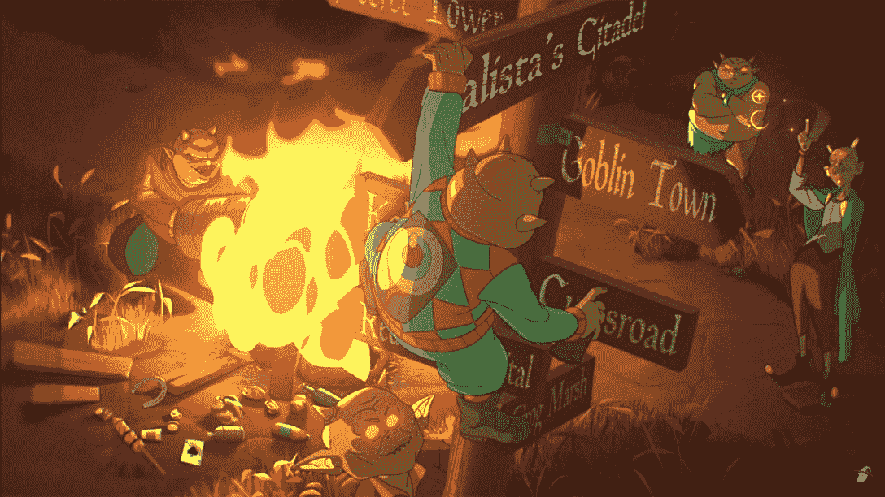
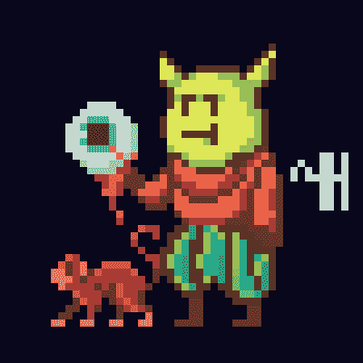
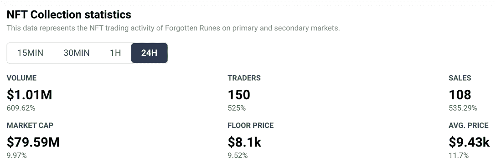
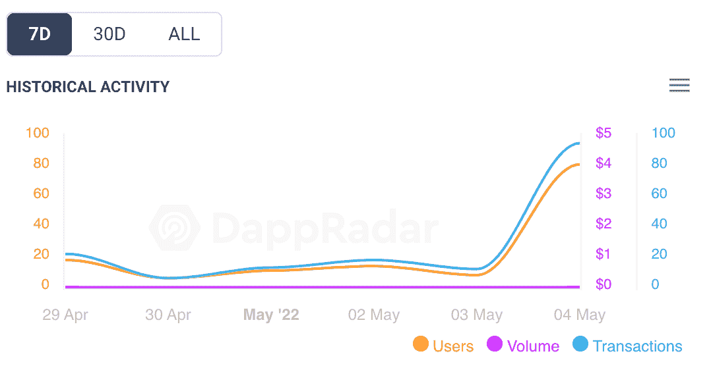

# 动画电视连续剧给遗忘的符文 NFT 收集一个推动

> 原文：<https://web.archive.org/web/https://dappradar.com/blog/animated-tv-series-gives-forgotten-runes-nft-collection-a-boost>

## 这部新的动画电视连续剧是现实世界与区块链相遇的又一个例子

NFT 收藏的《被遗忘的符文》在一部新的基于像素化幻想人物的动画电视系列发布后，其连锁活动激增。该节目的预告片让互联网兴奋不已，这一举动显示了 NFT 品牌未来可能会如何跨媒体发展。

**总结**

*   被遗忘的符文 NFT 收藏将成为一部名为《被遗忘的符文巫师的崇拜》的动画电视连续剧。《疾速追杀》的创作者德里克·科尔斯塔已经签约成为首席作家。
*   NFTs 的拥有者会影响电视剧中人物的故事。建立对 NFT 项目有实际投入的社区是区块链技术的一大进步。
*   DappRadar 对被遗忘的符文 NFT 收藏的连锁分析显示出一个巨大的活动跳跃。 ***价格一天之内上涨了*** ***10%。***

对于被遗忘的符文 NFT 收藏的粉丝来说，梦想真的会成真。本周，通过一个耸人听闻的预告片宣布,《被遗忘的符文巫师的崇拜》将作为一部动画系列上映。

## 电视上被遗忘的符文

预告片于 5 月 4 日出现在 YouTube 上，NFT 的推特陷入混乱。图形，外观，感觉，预告片都有。NFT 系列背后的公司 Magic Machine 正在与 Titmouse 合作开发和制作该节目。

Titmouse 是一家屡获殊荣的动画制作公司，其制作的节目包括*大嘴*、*、风险投资兄弟*和*午夜福音*。

[https://web.archive.org/web/20220925011902if_/https://www.youtube.com/embed/Oye2PdQq7xI?start=29&feature=oembed](https://web.archive.org/web/20220925011902if_/https://www.youtube.com/embed/Oye2PdQq7xI?start=29&feature=oembed)

Forgotten Runes Wizard’s Cult official trailer

更好的是，德里克·科尔斯塔已经签约帮助写这个节目。德里克·科尔斯泰德是《疾速追杀》系列的创作者和作者。

大多数人都知道由山谬·里维主演的疾速追杀电影，他扮演一个对毁灭有着贪得无厌的欲望的前杀手。这些电影越来越引人注目，并因其滑稽的动作和打斗场面而获得了狂热的追随者，但这并不一定是因为写作的质量。因此，看看被遗忘的符文作为一部漫画的表现会很有趣。

## NFTs 开始运行

真正酷的是，这一万个独特的 NFT 巫师的主人会影响漫画中人物的故事。当人们嘲笑 NFT 是二手 JPEGs，并说它们除了作为个人资料图片之外没有任何实际用途时，这是又一个有创意的人找到利用区块链技术开发人们可以参与和享受的概念的例子。

人们最兴奋的是看到他们最喜欢的 NFT 角色被专业渲染成动画。这是孩子们幻想的东西，因为这个节目对孩子们来说是完美的，它承诺将全新一代的人带到 NFTs 的世界。

一名推特用户甚至指出了预告片中一些 NFT 头像的位置。

你这里有一个妖精:

Image taken from Forgotten Runes Wizard’s Cult trailer

这是上图可能描绘的 NFT:

Image of Forgotten Runes avatar

这些角色是寇伯和[四个月前以 16 ETH](https://web.archive.org/web/20220925011902/https://dappradar.com/hub/assets/eth/0x521f9c7505005cfa19a8e5786a9c3c9c9f5e6f42/55)售出的一辆类似的 NFT(当时售价 61123 美元)。

## 被遗忘的符文 NFT 收藏

不出所料，随着动画系列的新闻如此受欢迎，现实世界 NFT 系列的链上分析已经看到了有益的推动。

在过去的 24 小时内，交易量增长了 609.62%，达到 100 万美元以上，交易物品的人数增长了 525%，达到 150 人。下表还显示了过去一天地板价和平均售价分别上涨了 9.5%和 11.7%。

[DappRadar’s on-chain analytics for the Forgotten Runes NFT collection](https://web.archive.org/web/20220925011902/https://dappradar.com/ethereum/collectibles/forgotten-runes)

被遗忘的符文在 NFT 顶级收藏中的排名也上升了。在过去 24 小时的活动中，目前交易人数排名第 53 位，销售人数排名第 57 位。对于一个直到最近都有忠实追随者但没有大量链上活动的收藏来说，这些排名是一个积极的信号。

[DappRadar’s 7-day on-chain activity for Forgotten Runes](https://web.archive.org/web/20220925011902/https://dappradar.com/ethereum/collectibles/forgotten-runes)

关注 DappRadar 的博客和 T2 的推特，及时获得这个故事的最新消息。此外，请收听我们的[离线区块链](https://web.archive.org/web/20220925011902/https://www.youtube.com/watch?v=uASQIhKkczA&list=PL0L1ZfahiAoOq8hl_dUQBxSCiQIGtaGJK)播客，我们一起看看《被遗忘的符文巫师的崇拜》的预告片，并给它一个大拇指。使用 DappRadar 的 [NFT 排名页面](https://web.archive.org/web/20220925011902/https://dappradar.com/nft/collections)和我们的[遗忘符文页面](https://web.archive.org/web/20220925011902/https://dappradar.com/ethereum/collectibles/forgotten-runes)来关注未来几天头像价格的波动。