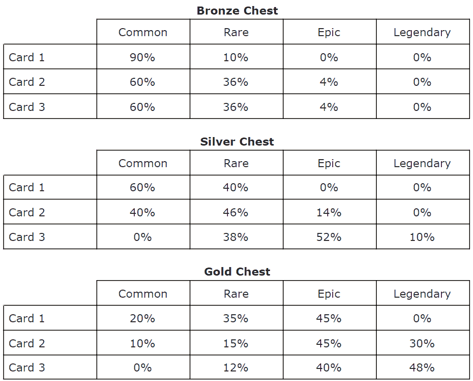
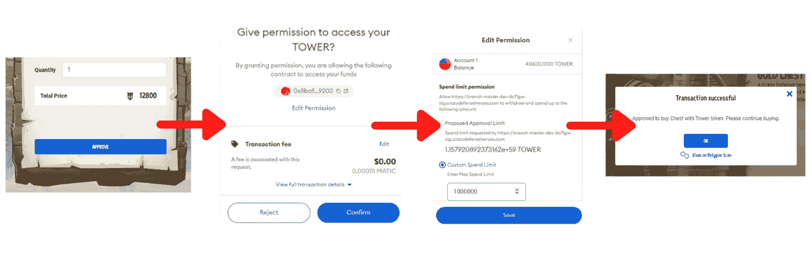

# Animoca Brands 宣布为即将到来的游戏出售塔箱

> 原文：<https://web.archive.org/web/https://dappradar.com/blog/animoca-brands-announced-tower-chest-sale-for-upcoming-game>

## 第一次销售发生在多边形

**Animoca Brands 宣布下一场 TOWER Chest 拍卖会将于 2 月 10 日星期四在** [**多边形区块链**](https://web.archive.org/web/20221006043639/https://dappradar.com/rankings/protocol/polygon) **举行。在 NFT 的出售过程中，该公司将出售剩余资产的 80%，分两批进行，间隔 12 小时。**

TOWER Chest NFT 拍卖会将于 2 月 10 日星期四世界协调时凌晨 2 点和下午 2 点举行。这样，来自不同时区的人可以参与 NFT 的销售，而不会打乱睡眠模式。这些 NFT 箱子包含三张游戏卡，可以在即将到来的疯狂国王塔防系列塔防游戏中使用。

如前所述，有两个销售时刻。在这两次活动中，该团队将售出 200 个金箱子、1000 个银箱子和 1400 个铜箱子。金色的价格为 12800 塔(425 美元)，银色的价格为 4800 塔(160 美元)，青铜箱的价格为 1800 塔或 60 美元。销售将在 crazydefenseheroes.com 举行。

然而，每笔交易有 3 个黄金骗子，10 个银箱，或 30 个铜箱的限制。在这些箱子里，NFT 收藏家可以找到三种不同稀有的塔卡。三张卡中的每一张，都有额外的机会找到最稀有的选项。

在最幸运的情况下，一个黄金宝箱包含 2 张传奇和 1 张史诗塔牌。如果你运气最差，一个金盒子将包括 2 张普通卡和 1 张稀有卡。

这些塔游戏卡 NFT 将在即将到来的塔区块链游戏中变得可用。这将是[疯狂防御英雄](https://web.archive.org/web/20221006043639/https://dappradar.com/polygon/games/crazy-defense-heroes)的精神继承者，后者每周已经吸引了 64，000 个独特的活动钱包。

## 如何在 Polygon 上购买塔胸？

如果你想买塔胸 NFTs，你必须为销售准备一点点。因为箱子数量有限，而疯狂防御英雄的玩家基数很大，我们很可能会看到 NFT 很快售罄。强烈建议在销售开始前完成以下步骤，否则你可能会错失良机。

*   你将需要塔代币来购买 NFT。
    *   通过玩[疯狂防御英雄](https://web.archive.org/web/20221006043639/https://dappradar.com/polygon/games/crazy-defense-heroes)赚取塔牌。如果你还没有这样做，你可能不会在销售前制造足够的代币。每月一次的空投将在 2 月 11 日进行
    *   通过 DappRadar Swap 购买塔代币直接放入你的多边形钱包更有意义。请记住，为了进行交换，您确实需要自动令牌。
    *   或者在 [QuickSwap](https://web.archive.org/web/20221006043639/https://dappradar.com/polygon/exchanges/quickswaphttps://dappradar.com/polygon/exchanges/quickswaphttps://dappradar.com/polygon/exchanges/quickswaphttps://dappradar.com/polygon/exchanges/quickswaphttps://dappradar.com/polygon/exchanges/quickswaphttps://dappradar.com/polygon/exchanges/quickswaphttps://dappradar.com/polygon/exchanges/quickswaphttps://dappradar.com/polygon/exchanges/quickswaphttps://dappradar.com/polygon/exchanges/quickswaphttps://dappradar.com/polygon/exchanges/quickswap) 上购买塔。您的多边形钱包中需要自动令牌。
    *   Animoca Brands 团队将很快推出将 TOWER tokens 从以太坊或 BSC 轻松过渡到 Polygon 的选项。
*   你还需要 MATIC 支付汽油费。不是很多，但是在你的钱包里至少有一个 MATIC 总是有帮助的。
*   批准塔。进入[官方 TOWER token 网站](https://web.archive.org/web/20221006043639/https://www.crazydefenseheroes.com/)，点击“胸部出售”，然后点击“批准”您可以选择调整消费限额，这将需要额外的交易，因此需要更多的汽油费。

 NewsletterUnsubscribe at any time. [T&Cs](https://web.archive.org/web/20221006043639/https://dappradar.com/terms) and [Privacy Policy](https://web.archive.org/web/20221006043639/https://dappradar.com/privacy-policy)