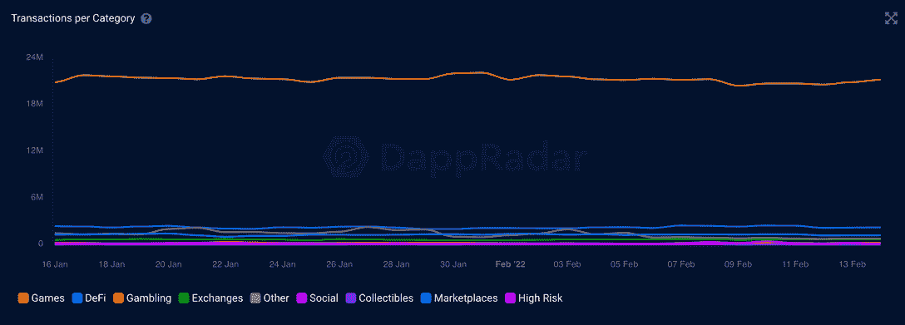
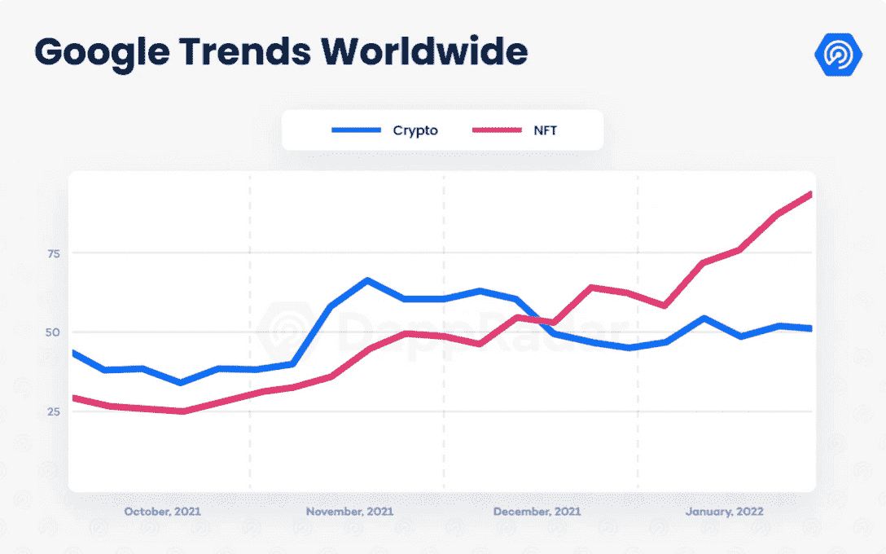

# Animoca Brands 承诺向公会加速器项目投资 3000 万美元

> 原文：<https://web.archive.org/web/https://dappradar.com/blog/animoca-brands-pledges-30-million-to-guild-accelerator-program>

## Animoca 品牌在“玩即赚”游戏的未来中占据了先机

Animoca Brands 已经承诺资助一个行会加速器项目，金额高达 3000 万美元。这位总部位于香港的投资者已经清楚地认识到了玩赚游戏的赚钱潜力。但是他们看到了什么让他们如此自信？

Animoca Brands 昨天宣布计划设立一个公会加速器项目，每个公会的资金高达 50 万美元。目标是促进行业增长和鼓励创新。考虑到这些，Animoca Brands 优先考虑那些致力于生态和社会可持续发展的游戏玩家群体。

随着 Animoca Brands 寻求进入在线游戏行业的全球范围，全球公会都可以获得资金。随着 32 亿游戏玩家遍布全球，[每天有数十亿美元易手，难怪风险投资公司想趁还有空间加入这个派对。对于任何想申请公会加速器计划的人来说，在线申请一直开放到](https://web.archive.org/web/20221127150331/https://dappradar.com/rankings/category/games)[2 月 27 日](https://web.archive.org/web/20221127150331/https://www.brinc.io/guild/)。

## 当今的游戏赚钱市场

Animoca Brands 正在为未来扩大的 P2E 游戏市场定位。这家游戏公司已经拥有各种“玩赚”游戏，并投资了更多游戏。他们拥有沙盒，疯狂防御英雄和 REVV 赛车，而他们投资了 Axie Infinity 和 Star Atlas。这些游戏中的每一个都为玩家提供了一个“玩即赚”的机会。但是对于那些已经在游戏中赚钱的人来说，今天的环境是什么样的呢？

2021 年，该行业在 NFT 交易中创造了 45 亿美元的收入，而且这些数字在未来几年还会继续增长。沙盒是 P2E 游戏巨头之一，它在 2021 年 11 月结束了 B 轮融资，获得了来自著名成长型投资者软银的 9300 万美元投资。正如我们在下图中看到的，游戏中的交易数量远远高于分散化领域的其他交易数量。

[<picture></picture>](https://web.archive.org/web/20221127150331/https://dappradar.com/industry-overview)

还有一点需要注意的是，区块链博彩业本身并不是单一的事物；它包括分散生态系统的所有部分。这意味着加密货币被用于游戏，人们赚取、交易和使用加密货币。区块链技术可以用于支持游戏体验的角色，如在像 [Chainmonsters](https://web.archive.org/web/20221127150331/https://dappradar.com/flow/games/chainmonsters) 这样的游戏中。或者游戏可以完全基于区块链，就像在[和](https://web.archive.org/web/20221127150331/https://dappradar.com/hive/games/splinterlands)这样的游戏中，玩家的每一个动作都会被记录并永久保存。

这就是为什么博彩业被视为未来的好赌注。因为即使一个地区出现下跌，另一个地区也能起到对冲的作用。下图显示了 DeFi 市场如何在 2021 年底转为熊市。但是 NFT 能够收拾残局，因此游戏继续繁荣。

[<picture></picture>](https://web.archive.org/web/20221127150331/https://dappradar.com/blog/dapp-industry-report-january-2022)

## 行会的回归

公会这个词可能会让人联想到中世纪的制服公司或《星球大战》宇宙中一群松散的赏金猎人。但在今天的分散平台上，公会是高度组织化的游戏玩家团体，他们提供奖学金、教育机会和分享他们的 P2E 战利品。

其中许多是权力下放的自治组织，所有这些组织都以通过《区块链议定书》促进真正的权力下放为目标。

*   [**功德圈**](https://web.archive.org/web/20221127150331/https://meritcircle.io/) :该帮会在 20 个平台上玩游戏，有 2750 名书生代其赚钱。学者保留他们收入的 70%,每个月公会吸收 100 名新玩家。功勋圈玩家已经赚了 200 万美元，公会拥有 1.24 亿美元的资产。公会被组织成子组织，每个子组织负责与公会玩的每个游戏相关的资产和金钱。在撰写本文时，功德圈拥有自己的[MC token](https://web.archive.org/web/20221127150331/https://dappradar.com/hub/token/eth/MC?from=0x949d48eca67b17269629c7194f4b727d4ef9e5d6)，标价为 2.95 美元。
*   [**Yield Guild Games**](https://web.archive.org/web/20221127150331/https://yieldguild.io/):Yield Guild Games 是世界上最大的游戏公会之一，目前市值 2.86 亿美元。该协会有 4700 多名学者，每个人都要支付他们收入的 10%作为租金。该协会有自己的[YGG 令牌](https://web.archive.org/web/20221127150331/https://dappradar.com/hub/token/eth/YGG?from=0x25f8087ead173b73d6e8b84329989a8eea16cf73)，传递投票权和未来股息支付计划在路线图上。Yield Guild Games 的[菲律宾分公司也筹集了 145 万美元](https://web.archive.org/web/20221127150331/https://dappradar.com/blog/yield-guild-games-raised-1-45-million-for-typhoon-odette-relief-mission)，作为 2021 年 12 月台风奥德特过后救灾工作的一部分。
*   [**好游戏公会**](https://web.archive.org/web/20221127150331/https://goodgamesguild.com/) :另一个公会，所有的大投资者都已经在背后投资，好游戏公会有超过 300 名学者参与其项目。它还有一个投资部门和一个游戏孵化器 Good Games Labs。其本地令牌称为 GGG，最大令牌供应总量为 1 亿。好游戏公会收取玩家收入的 20%，其代币价格目前为 [$2.10](https://web.archive.org/web/20221127150331/https://coinmarketcap.com/currencies/good-games-guild/) 。