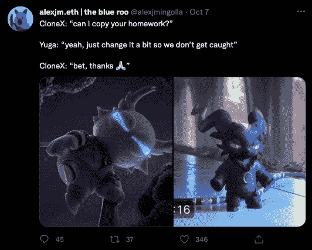

# 阿尼姆斯 NFT 挑逗推克隆 X 底价 55%–地平线上的宇迦实验室/RTFKT Collab？

> 原文：<https://web.archive.org/web/https://dappradar.com/blog/animus-nft-tease-pushes-clone-x-floor-price-55-yuga-labs-rtfkt-collab-on-horizon>

## 潜在的克隆 X 宇迦实验室合作让社区兴奋不已。

**克隆 X NFT 系列的创作者 RTFKT 工作室戏弄了 Animus，这显然是 10 月 7 日与无聊的猿类游艇俱乐部创新者宇迦实验室的新合作，导致 NFT 克隆 X 的交易活动激增。**

新项目将于 2023 年启动，并于 2022 年 11 月 22 日宣布为克隆人提供鸡蛋。RTFKT 之前戏弄过 Clonetober，在 Twitter 上的挑逗者下降[后，将 Clone X 的底价从 7.7 ETH 左右推至 8.8 ETH。](https://web.archive.org/web/20221130150859/https://twitter.com/RTFKT/status/1578144847919468544)

[最新公告](https://web.archive.org/web/20221130150859/https://twitter.com/RTFKT/status/1578470151304855553)预告片非常神秘，但包括一个来自 RTFKT 宇宙的化身，后面走着一个看起来像阿尔法鲨鱼的角色，后面跟着一个类似于另一边 Kodas 的角色——暗示着合作关系。

科达来自元宇宙的另一边。我们还不知道他们在未来元宇宙的角色。我们只能看到他们是游戏中必不可少的一部分。在元宇宙的另一边，有 Koda 元数据的土地比没有元数据的土地更有价值。简而言之，10 万块土地中有 1 万只科达，[使它们变得非常稀有](https://web.archive.org/web/20221130150859/https://dappradar.com/hub/nft-explorer/collection/otherdeed-for-otherside)。

> 为🪬阿尼姆斯项目做好准备🥚[pic.twitter.com/pYAzy6RX8w](https://web.archive.org/web/20221130150859/https://t.co/pYAzy6RX8w)
> 
> — RTFKT (@RTFKT) [October 7, 2022](https://web.archive.org/web/20221130150859/https://twitter.com/RTFKT/status/1578470151304855553?ref_src=twsrc%5Etfw)

一旦宇迦实验室和 RTFKT 之间的潜在合作启动，克隆 X 的底价急剧飙升，因为交易者希望获得一个克隆 X，希望有可能获得一个鸡蛋或优先造币权。现在的底价约为 9.4 ETH，但平均售价略高，为 11.4 ETH，约合 1.6 万美元。

截至发稿时，转手最贵的克隆 X NFT 是 18.18 ETH 的 [CloneX #18704，约合 2.5 万美元。我们还看到 10 小时前的销售价格比现在低了 20 多。这表明，飙升仍在继续，平均价格将继续上涨。可能要等到 11 月份。](https://web.archive.org/web/20221130150859/https://dappradar.com/hub/assets/eth/0x49cf6f5d44e70224e2e23fdcdd2c053f30ada28b/19211)

## 什么是阿尼姆斯？

尽管关于视频或潜在合作的细节很少，谣言工厂开始了，互联网开始寻找线索和复活节彩蛋，这将进一步揭示一些关于 Animus 的信息。

一名侦探强调了鲨鱼头像夹克上的商标。他们指出，这非常类似于在其他 Clone X NFTs 上看到的布洛克 TCTL 背心特征，导致人们猜测 Animus 将是一个以时尚为中心的 NFT 系列。与此同时，其他推文聚焦于 RTFKT 和 [Animus side quest](https://web.archive.org/web/20221130150859/https://twitter.com/Alts_Anonymous/status/1579407389324988416) 。毫无疑问，将有数以百计的骗局遍布互联网，希望在 NFT·亨特的钱上赚钱，[所以要保持警惕](/web/20221130150859/https://dappradar.com/blog/how-to-spot-an-nft-scam/)。

另一位互联网调查员补充道,《彼岸》预告片中描绘的宇迦实验室 Koda 和 RTFKT 预告片中展示的 Koda 非常相似。

虽然有相似之处，但你可能会期待一个关于两家公司合作的预告片，以真实的 Koda 为特色。然而，这是一个难题。与此同时，[其他人推测【RTFKT 只是从宇迦实验室的剧本中复制和粘贴一个成功的策略——这似乎是极不可能的。](https://web.archive.org/web/20221130150859/https://twitter.com/search?q=%23CloneX&src=typed_query&f=top)

## 阿尼姆斯仍然是一个谜

撇开复活节彩蛋和阴谋不谈，没人知道一旦它启动，敌意会是什么。在这个阶段，我们只能推测蛋降将是一个值得观看的事件。一件显而易见的事情是，由于两家公司有可能卷入其中，围绕克隆 X 和 Animus 的炒作显而易见。

宇迦实验室在很短的时间内发展成为一个 Web3 发电站，现在可以忽略 NFT 和区块链世界的一些最重要的知识产权。想想无聊猿游艇俱乐部，隐朋克，女人的世界，等等。随着即将推出的[另一边的元宇宙](/web/20221130150859/https://dappradar.com/blog/what-is-the-otherside-metaverse-how-does-it-work/)，宇迦希望通过其 Apecoin 在 NFTS、游戏和加密方面成为 Web3 的真正玩家。

[Clone X](https://web.archive.org/web/20221130150859/https://dappradar.com/hub/nft-explorer/collection/clonex) 是 RTFKT 制作的以村上隆艺术为特色的个人资料图片 NFT 集。自从[耐克收购 RTFKT](/web/20221130150859/https://dappradar.com/blog/nike-acquired-nft-fashion-company-rtfkt-studios/) 以来，两人已经探索了几个将实体商品与元宇宙收藏品相结合的项目——[在此过程中收集了数十亿美元](https://web.archive.org/web/20221130150859/https://dappradar.com/hub/nft-explorer/collection/clonex)。

## 更广泛的 NFT 行业趋势

通常，在区块链领域，一个行动会引发另一个行动，当一个系列吸引注意力时，它可以带动其他系列。在这种情况下，一个仅仅展示看起来像 Koda 的预告片就获得了 [Clone X NFTs](https://web.archive.org/web/20221130150859/https://dappradar.com/hub/nft-explorer/collection/clonex) 的交易量。

另一件清楚的事情是[以太坊 NFT 仍然是最柔韧的](https://web.archive.org/web/20221130150859/https://dappradar.com/blog/nft-highlights-art-blocks-curated-sales-leap-70-on-fontana-collection-launch)并且刺激着区块链空间。NFT 正在吸引那些在 Web3 上下大注的人的眼球。我要补充的是，尽管主流媒体使用创纪录高点与近期的数据对比，描绘了一幅悲观悲观的画面。

同样有趣的是对秘密艺术的兴趣高涨。尤其是在总部位于以太坊的[艺术街区策划市场](https://web.archive.org/web/20221130150859/https://twitter.com/artblocks_io)交易的艺术品，即使在熊市，艺术品也能以数十万美元的价格转手。艺术品一直是抵御通货膨胀的可靠赌注，精明的密码交易员似乎在 Web3 中建立了新的投资趋势。

许多都是“生成艺术”NFT，可以随着时间的推移而改变，给持有者提供的不仅仅是一张元宇宙或推特头像的通行证。人们说情人眼里出西施，秘密艺术也不例外。艺术板块 30 天近 1000 万美元的交易量也是如此。

Source: Tableau

此外，NFTs 从未像 2022 年初声称的那样从悬崖上掉下来。以太坊之外的其他区块链也加入了这一行动，大多数非金融衍生品稳定下来，不再被称为泡沫或时尚。当然，垃圾收集和骗子被清除，许多[失去了血汗钱](https://web.archive.org/web/20221130150859/https://watcher.guru/news/how-much-is-logan-pauls-623000-nft-worth-today?c=847)。

月销售额稳定在 5 亿美元左右。但交易量在 2021 年夏天达到峰值，在 2021 年 8 月达到 50 多亿美元。对于一个兜售被大多数人描述为价格过高的 jpg 的行业来说，这并不坏。

## 随身携带您的 Web3 之旅

使用 DappRadar 移动应用程序，再也不会错过 Web3。查看最受欢迎的 dapps 的性能，并关注您投资组合中的 NFT。您在 DappRadar 上的帐户会与我们的移动应用程序同步，这样您很快就可以选择实时接收提醒。

[Download the DappRadar app now](https://web.archive.org/web/20221130150859/https://dappradar.app.link/blog)[<picture></picture>](https://web.archive.org/web/20221130150859/https://play.google.com/store/apps/details?id=com.portfolio.dappradar)

***以上不构成投资建议。此处给出的信息仅供参考。请行使尽职调查，做你的研究。作者持有多种加密货币的头寸，包括 BTC、瑞士法郎和雷达。***