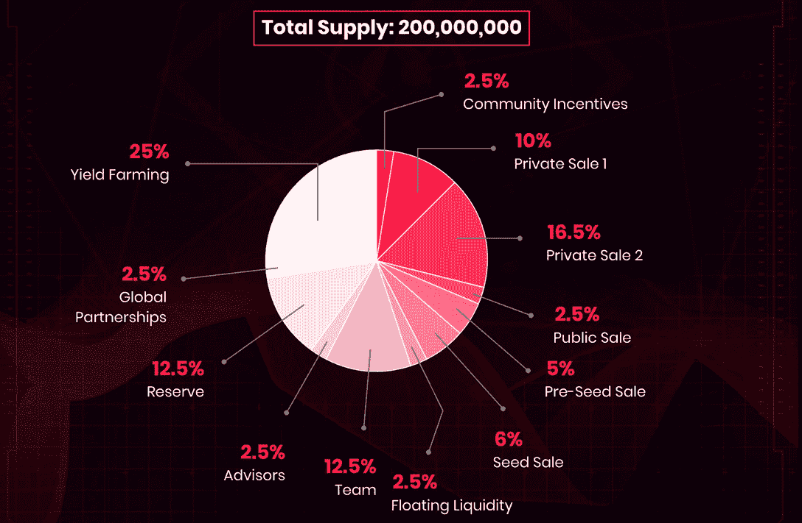

# AnRKey X 及其本机令牌 ANRX

> 原文：<https://web.archive.org/web/https://dappradar.com/blog/anrkey-x-and-its-native-token-anrx>

## 关于基于多边形的游戏平台及其 ANRX 令牌，您需要了解的一切

AnRKey X 是一家创新的游戏工作室，利用 web3 和多边形区块链的力量为玩家带来金钱奖励。该平台的原生令牌 ANRX 是复杂经济的支柱，允许游戏玩家一边玩一边赚钱。

AnRKey 的主要目标是创建一个平台，让游戏玩家可以轻松赚钱和交流。值得注意的是，该团队正在努力将代币化和游戏赚取功能引入传统游戏。

## AnRKey 是什么？

AnRKey 是一个基于多边形的游戏平台，结合了游戏赚取机制和社交方面。目前，该平台为游戏玩家提供了战波 2323 的访问权限，这是一款由 ANRX 令牌支持的交易卡战斗游戏。

结合了 DeFi，play-to-earn 和 NFTs，Battle Wave 2323 是 AnRKey 的终极 web3 项目。这是第一个来到生态系统的游戏，它为即将到来的项目设定了很高的标准。玩家可以交易他们的 NFT 卡，在 PvP 模式下战斗并获得 ANRX 代币。

AnRKey 还致力于在其经济中开发多功能的 NFTs 实施方案。通过创建三种不同类型的 NFT，该团队在 AnRKey 生态系统中启动了市场经济。AnRKey 平台上的游戏内资产、奖品和收藏品都是以 NFTs 的形式出现的。最重要的是，NFT 交易由该平台的本机令牌 ANRX 提供支持。

## 关于 ANRX 令牌的更多信息

ANRX 是整个 AnRKey 生态系统的支柱。它有多种用途。一方面，ANRX 是平台的治理令牌，允许利益相关者参与治理投票，以决定 AnRKey 的未来。此外，下注 ANRX 还会给用户带来被动收入回报。令人印象深刻的是，ARNX token 供应总量的 25%被预留出来用于通过赌注获得农业奖励。

另一方面，令牌方便了 AnRKey 平台上的所有交易。每当玩家购买 NFT，或要求获得“玩即赚”奖励时，这都要归功于 ANRX 令牌。

DappRadar 将继续关注区块链游戏领域，因为 AnRKey 等平台为他们的社区带来了革命性的想法。如果你想了解更多关于 AnRKey 或尝试战波 2323，请查看他们的官方 dapp 页面。你也可以在[的 Twitter](https://web.archive.org/web/20220929121022/https://twitter.com/dappradar) 上关注 DappRadar，首先获得最新的 web3 和区块链游戏更新。

 NewsletterUnsubscribe at any time. [T&Cs](https://web.archive.org/web/20220929121022/https://dappradar.com/terms) and [Privacy Policy](https://web.archive.org/web/20220929121022/https://dappradar.com/privacy-policy)