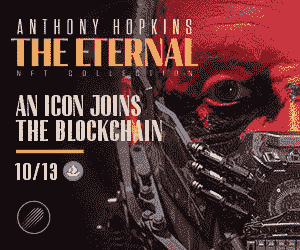
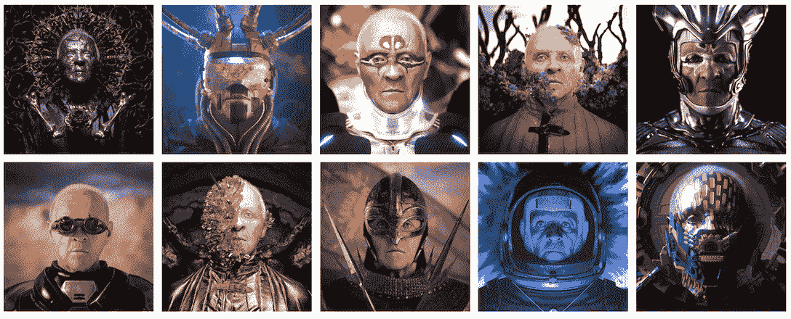
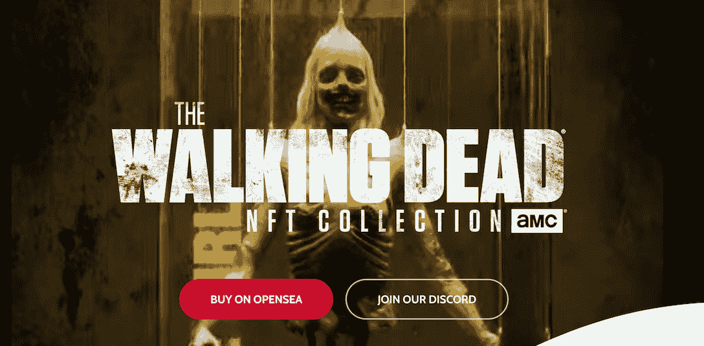

# 安东尼·霍普金斯永垂不朽——10 月 13 日推出永恒的 NFT 系列

> 原文：<https://web.archive.org/web/https://dappradar.com/blog/anthony-hopkins-goes-immortal-debuts-the-eternal-nft-collection-on-10-13>

## 该系列与 Orange Comet 合作制作，灵感来自安东尼·霍普金斯爵士兼收并蓄的电影和艺术生涯。

永恒的《霍普金斯》NFT 首映给了持有者各种专属福利，比如签名画册、与演员的实时聊天等等。

总结:

*   两届奥斯卡奖得主安东尼·霍普金斯爵士是最近在 NFT 社区引起轰动的超级巨星。
*   这位演员将于 10 月 13 日在 OpenSea 上与 Web3 数字娱乐平台 Orange Comet 合作推出他的 NFT 处女作《永恒》
*   橙色彗星此前推出了非常成功的官方 AMC 行尸走肉 NFT 项目，以及其他。

## 什么是永恒 NFT 系列，有哪些额外福利？

奥斯卡奖得主、艺术家和作曲家，安东尼·霍普金斯爵士在艺术界的地位和他的文艺复兴人的称号是毋庸置疑的。霍普金斯先生的画家生涯可以追溯到 2005 年，当时他创作了一系列充满活力的抽象画。从那时起，他的艺术风格不断演变，反映了他的人生旅程。

这一次，他将区块链作为他的“新画布”，自豪地展示他与 Orange Comet 合作的首次 NFT 作品*安东尼·霍普金斯:永恒的 NFT 系列*。该系列从安东尼·霍普金斯爵士刺激而多样的作品中，概念化地诠释了他在辉煌的电影生涯中塑造的大量人物原型。

这个 NFT 集合将于 10 月 13 日在 OpenSea 上提供给 mint。

[Check out The Eternal NFT collection now](https://web.archive.org/web/20230101112452/https://opensea.io/collection/anthony-hopkins-eternal/drop?utm_source=article&utm_medium=article&utm_campaign=dappradar)[Mint on OpenSea](https://web.archive.org/web/20230101112452/https://opensea.io/collection/anthony-hopkins-eternal/drop?utm_source=article&utm_medium=article&utm_campaign=dappradar)

### 近距离观察永恒的 NFT 及其艺术品

永恒系列从他的艺术作品和令人印象深刻的电影生涯中汲取灵感，创作出发人深省的图像和动画。

该系列由安东尼·霍普金斯爵士和 Orange Comet 的首席创意官丹特·费拉里尼策划，展示了 10 种不同的个性。他们是小丑、情人、统治者、反叛者、给予者、英雄、探险家、创造者、魔术师和圣人。

在本系列中，您会发现:

*   10 个独特和随机的 1:1 签名动画 NFT，每个都具有不同的角色原型。
*   基于 10 个原型的 990 个独特的 1:1 图像(每个原型 99 个变体)。
*   一生一次的独家 IRL 活动。
*   在 Zoom 上与安东尼爵士面对面的机会。

用户可以使用下面的链接注册，以便提前了解这一独特的活动。

[Check out The Eternal NFT colletion](https://web.archive.org/web/20230101112452/https://opensea.io/collection/anthony-hopkins-eternal/drop?utm_source=article&utm_medium=article&utm_campaign=dappradar)

### 优势一目了然

该项目为收集者提供各种设施。但是，最重要的是，它为影迷们介绍了一种前所未有的方式来与他们最喜爱的电影明星和人物互动和联系。同时，它展示了一个保持知识产权繁荣的新范例。

让我们来看看这到底是如何工作的。

下降将包括一个千载难逢的机会，十个幸运的收藏家赢得签名动画 NFT。签名 NFTs 将包括安东尼·霍普金斯爵士亲笔签名的《梦境艺术》一书。这本极具收藏价值的书汇集了安东尼·霍普金斯爵士创作的图像、绘画和素描，让读者得以一窥这位传奇的、受人爱戴的威尔士演员的艺术头脑和激情。

更吸引人的是，一名幸运的收藏家将赢得与霍普金斯爵士一对一在线交流的邀请。此外，100 名幸运的持有者将收到一个个性化的 NFT，上面有安东尼·霍普金斯爵士直接空投到他们钱包里的信息。

探索橙色彗星的收藏，了解更多关于艺术及其效用。

[Learn more about the art on Orange Comet](https://web.archive.org/web/20230101112452/https://orangecomet.com/collection/anthony-hopkins-eternal/?utm_source=article&utm_medium=article&utm_campaign=dappradar)

## 好莱坞进军 Web3

NFT 已经从一个新颖的概念发展成为一种授予用户所有权的工具，许多项目利用这种技术来交付更好的用户体验。例如，在游戏中，NFT 和代币允许玩家将游戏中的物品转化为具有现实价值的资产。在体育界，像 NFT TopShot 这样的项目让粉丝收集体育明星的闪光时刻和相关的纪念品。

那么，娱乐圈的粉丝如何从 NFT 带来的所有权中受益呢？

小规模项目、独立创作者和团队发现通过 NFTs 进行众筹可以有效地为他们的梦想融资。同样，电影明星、好莱坞大片和动漫特许经营也使用 NFTs。NFT 项目允许粉丝将他们的情感价值转化为可以获得回报的“代金券”。

例如，DC 漫画公司宣布发布多个 NFT 系列，让粉丝更深入地参与 DC 宇宙。另一个著名的案例是昆汀·塔伦蒂诺将他的经典低俗小说未出版的剧本作为 NFT 收藏品提供给粉丝。

## 橙色彗星是谁？

Orange Comet 是一个高度致力于动态设计、创新和技术的数字平台。他们专注于创造一个在 Web3 世界前所未有的生态系统。该平台的核心任务之一是利用 NFT 来帮助 IP 进一步释放力量。

除了永恒之外，Orange Comet 还与 AMC 合作了今年早些时候推出的 NFT 行尸走肉通行证。通过这一系列，通行证持有者将获得参与独家投放的终身机会，以及额外的独家特权，包括直接访问即将到来的行尸走肉之地，这是一个基于*行尸走肉*宇宙的后世界末日开放世界建造和赚取体验。

如果你不幸错过了参与行尸走肉铸造的机会，不要绝望(查看 OpenSea 上的二级市场)，现在你有机会成为安东尼·霍普金斯爵士永恒小队的一员。

现在就点击下面的链接加入吧！

[Join now!](https://web.archive.org/web/20230101112452/https://opensea.io/collection/anthony-hopkins-eternal/drop?utm_source=article&utm_medium=article&utm_campaign=dappradar)

找到更多关于橙色彗星的信息。

[网站](https://web.archive.org/web/20230101112452/https://orangecomet.com/collection/anthony-hopkins-eternal/?utm_source=article&utm_medium=article&utm_campaign=dappradar)

[推特](https://web.archive.org/web/20230101112452/https://twitter.com/orangecometnft)

[不和](https://web.archive.org/web/20230101112452/https://orangecomet.wpengine.com/discord)

**免责声明** —这是一篇赞助文章。DappRadar 不认可本页面上的任何内容或产品。DappRadar 旨在提供准确的信息，但读者应该在采取行动之前总是自己做研究。DappRadar 的文章不能被认为是投资建议。