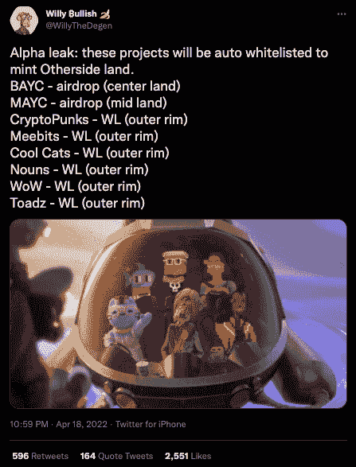
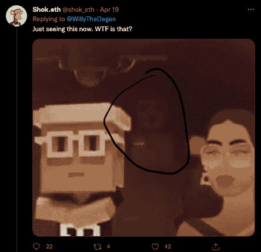
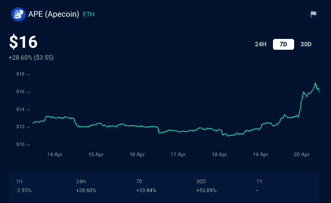
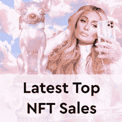

# 在卖地传言中，APE Token 在 3 天内上涨了 46%

> 原文：<https://web.archive.org/web/https://dappradar.com/blog/ape-token-shoots-up-46-in-3-days-amidst-land-sale-rumors>

## 无聊猿和变异猿 NFT 持有者可以在宇迦实验室即将推出的“彼岸元宇宙”中获得虚拟土地

有传言称，无聊猿游艇俱乐部 NFT 收藏的猿代币可能会在即将到来的宇迦实验室土地拍卖中用作支付货币，这导致价格在短短三天内上涨了 55%。谣言始于 4 月 18 日，并暗示 BAYC 和 MAYC NFT 的所有者可能会获得白名单，以购买宇迦实验室备受期待的 Otherside 元宇宙项目中的虚拟土地。

## 摘要

*   4 月 18 日，Willy bully 发了一条推文，建议在即将到来的白名单土地拍卖中列入一份 NFT 藏品清单
*   传言猿需要购买土地[导致价格在三天内上涨了 46%](https://web.archive.org/web/20221127162258/https://dappradar.com/hub/token/eth/APE?from=0x4d224452801aced8b2f0aebe155379bb5d594381)
*   [随着对代币效用的猜测增多，APE 价格可能会进一步走高](https://web.archive.org/web/20221127162258/https://dappradar.com/blog/ape-token-shoots-up-46-in-3-days-amidst-land-sale-rumors/#APE-potentially-needed-to-purchase-land-)
*   另一边的元宇宙世界仍然笼罩在神秘的阴影中

## 传话游戏

谣言始于 Willy Bullish 的一条推文，该推文建议新元宇宙项目 Otherside 即将进行的白名单土地销售中包括一系列 NFT 藏品。值得注意的是，Willy bully 提供的名单[表明，BAYC 和 MAYC 的持有者将排队获得中心和中间土地的特权位置，而其他人只能获得外环的土地。](https://web.archive.org/web/20221127162258/https://twitter.com/WillyTheDegen/status/1516144319874232323?ref_src=twsrc%5Etfw%7Ctwcamp%5Etweetembed%7Ctwterm%5E1516144319874232323%7Ctwgr%5E%7Ctwcon%5Es1_&ref_url=https%3A%2F%2Fcointelegraph.com%2Fnews%2Fapecoin-ape-price-climbs-55-in-three-days-as-a-bayc-land-drop-rumor-goes-viral)

有趣的是，在这条推文发布后的几分钟内，饥饿的投机者开始在图片的引擎盖下寻找他们认为是复活节彩蛋的东西，并可能是另一个将被列入白名单的 NFT 收藏。他们要么是抓住了什么，要么是在抓救命稻草。然而，只有时间能证明这一点。然而，有一点非常清楚，炒作正在形成。

## APE 可能需要购买土地

进一步的谣言开始流传，猿将是在另一边购买土地所需的令牌，这导致了它的价格飙升。在过去的七天里，价格上涨了约 34%，但随着谣言的流传，真正的飙升始于 4 月 18 日。截至发稿时，APE 从 11 美元的低点飙升至目前的 16.07 美元，在不到三天的时间里上涨了 46%。鉴于 APE 的这一潜在用途，对 ApeCoin 的需求现在可能会进一步增长，这可以部分解释 APE 在过去三天的飙升。

## 另一边是什么？

Otherside 是一款即将推出的 MMORPG 游戏，玩家使用他们的 NFT 作为本地化身或角色。2022 年 3 月下旬开始在网上流传的一份泄露的投资者推介资料显示，宇迦实验室预计通过出售虚拟土地赚取 1.78 亿美元，APE 是购买土地所需的主要令牌。《彼岸》将与区块链游戏巨头 Animoca Brands 合作开发。更多的猜测把《元宇宙世界》和其他直接在元宇宙发行的 NFT 收藏品联系起来。

## 进化猿

虽然对 APE 来说仍处于早期阶段，但 BAYC 和更广泛的生态系统的一个不可否认的成功是推出后对 APE 令牌的兴趣。APE 发布五天后，[宇迦实验室宣布](/web/20221127162258/https://dappradar.com/blog/how-yuga-labs-nfts-became-a-dominant-force-with-an-8-1b-market-cap/)完成了一轮 4.5 亿美元的融资，对该公司的估值为 40 亿美元。这是有史以来对专注于 NFT 的公司进行的最大一笔投资。这表明，领导这轮融资的风险投资公司安德森·霍洛维茨(Andreessen Horowitz)等公司已经认识到了这一成功和进一步增长的潜力。

[<picture></picture>](https://web.archive.org/web/20221127162258/https://dappradar.com/blog/what-are-non-fungible-tokens-nfts)[<picture></picture>](https://web.archive.org/web/20221127162258/https://dappradar.com/nft/marketplaces)[<picture></picture>](https://web.archive.org/web/20221127162258/https://dappradar.com/nft/sales)

*以上不构成投资建议。此处给出的信息仅供参考。请行使尽职调查，做你的研究。作者持有多种加密货币的头寸，包括 BTC、瑞士法郎和雷达。*