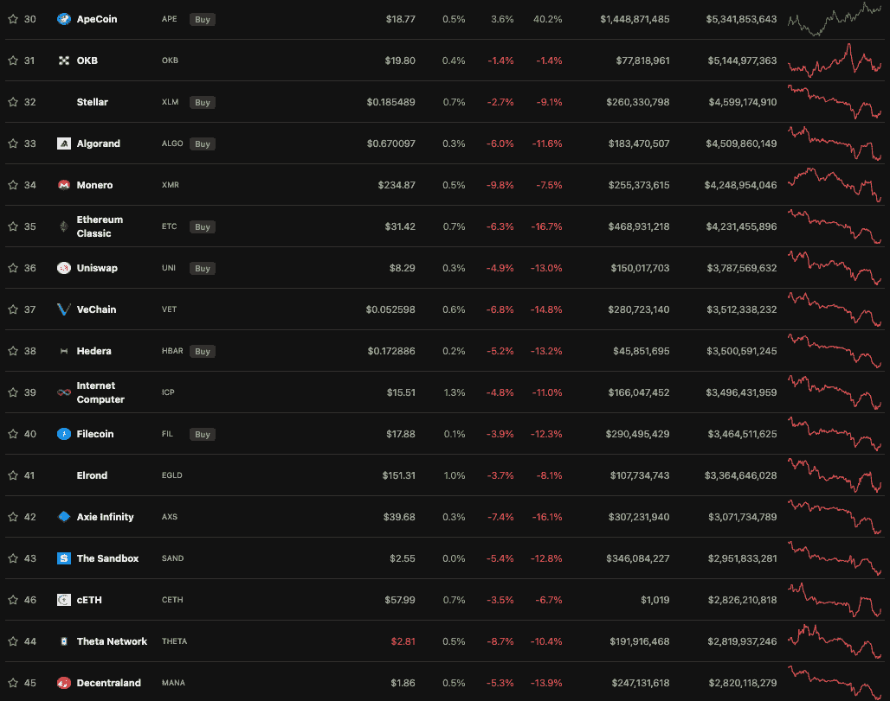
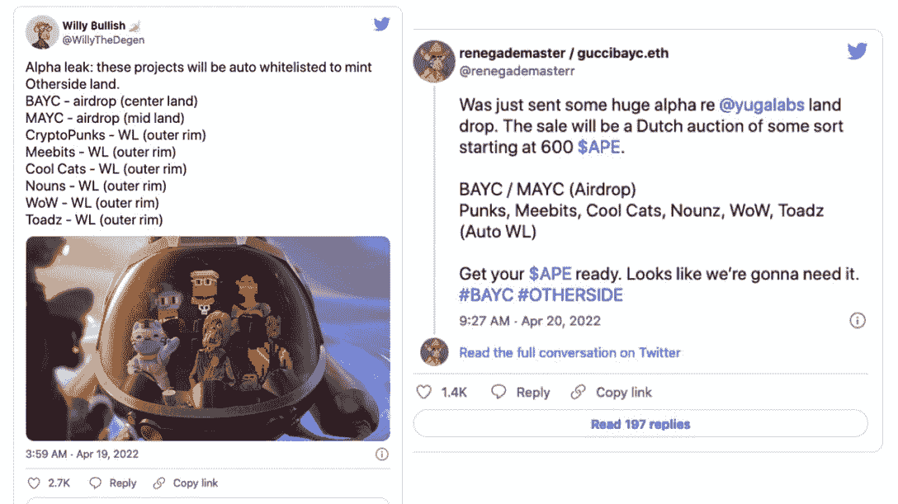
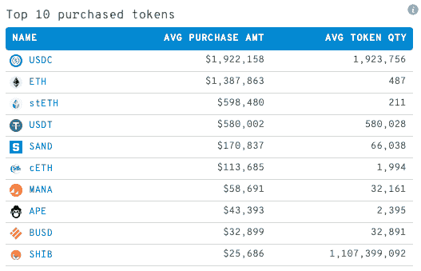
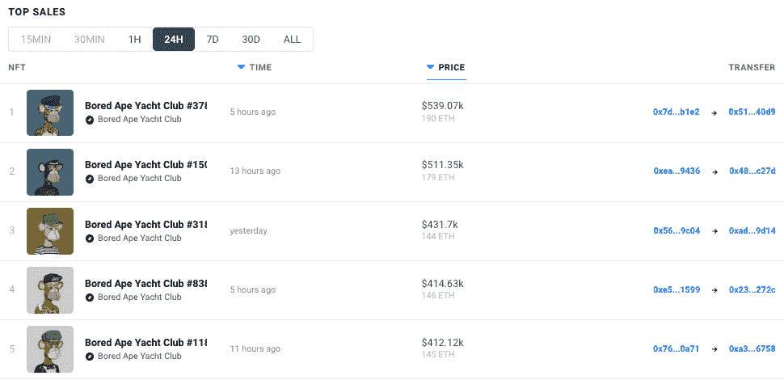

# 硬币翻转元宇宙令牌法力，沙子和 AXS

> 原文：<https://web.archive.org/web/https://dappradar.com/blog/apecoin-flips-metaverse-tokens-mana-sand-and-axs>

## 官方 BAYC token 攀升市值排名为世界准备另一边

BAYC 元宇宙项目的官方标志 ApeCoin 在过去的几周里一直很受欢迎，因为人们对该团队的元宇宙项目 Otherside 的启动抱有越来越高的期望。对 ApeCoin 的需求使其在整体加密排名中排名第 30 位，市值为 53 亿美元。猿现在已经超越了分散之地的法力、沙盒之沙和 Axie Infinity 的 AXS 等令牌。

## 摘要

*   在撰写本文时， [ApeCoin](https://web.archive.org/web/20221006043000/https://dappradar.com/hub/token/eth/APE?from=0x4d224452801aced8b2f0aebe155379bb5d594381) 是市值排名第 30 位的加密货币，其价值为 53 亿美元
*   ApeCoin 在推出一个月后成为排名最高的元宇宙代币
*   过去 14 天，比特币价格上涨了 61.4%
*   [另一边的 NFT 将于本周六](https://web.archive.org/web/20221006043000/https://dappradar.com/blog/bored-ape-metaverse-is-here-see-you-on-the-otherside)4 月 30 日落下帷幕
*   Twitter 上关于另一方 NFTs 的声明导致一枚硬币突破 18 美元

[ApeCoin](https://web.archive.org/web/20221006043000/https://dappradar.com/hub/token/eth/APE?from=0x4d224452801aced8b2f0aebe155379bb5d594381) 由 ApeCoin DAO 拥有和运营，这是一个分散化的组织，每个令牌持有者都可以对生态系统基金的管理和使用进行投票。持有 ApeCoin 是成为 ApeCoin 道会员的唯一要求。道得到了 Ape 基金会的支持，该基金会充当 ApeCoin 的法律管家，并管理 ApeCoin 道社区做出的决定。该团队包括 Reddit 的 Alexis Ohanian 和 Animoca Brands 的 Yat Siu。

市值是一个重要的指标，它让投资者了解一个项目相对于另一个项目的相对规模。市值衡量一家公司在公开市场上的价值，同时也表明投资者对其未来前景的看法。ApeCoin 在如此短的时间内令人印象深刻地上升到前 30 名，这表明虽然更多的成熟项目可能曾经统治了加密丛林，但现在有了一个新的阿尔法。一个提供了坚实的路线图和一大群忠实的崇拜者。

## 另一方面刺激硬币需求

在经历了上周只能被描述为熊市的情景后， [ApeCoin 表现出决心](https://web.archive.org/web/20221006043000/https://dappradar.com/hub/token/eth/APE?from=0x4d224452801aced8b2f0aebe155379bb5d594381)保持超过 40%的涨幅，而 BTC 和 ETH 的价格分别下跌了 5.9%和 6.9%。现在对 APE 需求的一个主要驱动力是《另一边的元宇宙》即将上映。

3 月 19 日，无聊猿游艇俱乐部(BAYC)背后的团队宇迦实验室发布了即将到来的元宇宙项目 other side T1 的预告。从那时起，粉丝们就一直热切期待着 Otherside 的揭露。上周，推特上流传着这样的流言:那些出现在预告片中的蓝筹 NFT 藏品将被自动列入“另一边降落”的白名单。还有人声称，他们得到内部消息，土地价格将从 600 便士开始。

4 月 27 日，[围绕备受期待的元宇宙项目的迷雾消散了](https://web.archive.org/web/20221006043000/https://dappradar.com/blog/everything-you-need-to-know-about-the-otherside-land-sale)，彼岸组在其推特上宣布，NFT 造币厂将于 4 月 30 日开工。ApeCoin 的真正驱动力是，ApeCoin 将成为在另一边购买任何东西的首选货币。

## 关于 NFT 另一边的土地销售

宇迦实验室决定以荷兰拍卖的方式开始铸造 NFT 另一边的土地，只接受以硬币计价的投标。此举可能会导致令牌的价格下跌，因为宇迦实验室团队解释说，从拍卖中收集的 APE 令牌将被锁定一年。它补充说，ApeCoin DAO 也不会组织进一步的投票。

该团队特别提到，造币厂将在 ApeCoin 完成，而汽油费将在 ETH 支付。还提到拍卖的起拍价将在本周晚些时候公布。根据公告，BAYC 和 MAYC 的持有者将可以在拍卖后的 21 天内获得 NFT 的所有权。

## 鲸鱼潜入水中

元宇宙发射的消息激起了鲸鱼对 ApeCoin 和宇迦实验室生态系统的兴趣。在推出 ApeCoin 作为宇迦项目的本地代币仅仅几周后，根据鲸统计公司的数据，代币已经成为第八大被购买的资产。有趣的是，自 2021 年 11 月的高点以来，沙子和法力价格大幅下跌。此外，在过去的 24 小时里，APE 已经成为[前 1000 名以太坊鲸鱼钱包](https://web.archive.org/web/20221006043000/https://www.whalestats.com/analysis-of-the-top-100-eth-wallets)中交易量最大的代币。

也是因为这个消息，来自 DappRadar 的数据显示，在 NFT 购买量激增的情况下，BAYC NFTs 一直卖得很好，该系列的底价跃升至 44 万美元左右。此外，宇迦实验室的其他项目包括突变猿和养狗俱乐部，它们的交易量也出现了峰值。

## 猿象征展望

自 2022 年 3 月推出以来，ApeCoin 的价值增长了 1700%以上。它是过去 7 天和过去 24 小时内交易量最大的 10 种加密货币之一，因为投资者竞相购买 APE 来购买即将发布的数字土地。重要的是，现在有超过 54，000 个钱包持有 ApeCoin。

尽管本周一针对 BAYC Instagram 账户的[攻击导致大约 1370 万美元的损失，但 token 仍然是表现最好的之一。Instagram 账户向粉丝发送了一个非官方的 mint 链接，点击该链接的人的钱包受到了损害。](https://web.archive.org/web/20221006043000/https://dappradar.com/blog/more-than-3-million-stolen-in-another-bored-ape-yacht-club-nft-hack)

 NewsletterUnsubscribe at any time. [T&Cs](https://web.archive.org/web/20221006043000/https://dappradar.com/terms) and [Privacy Policy](https://web.archive.org/web/20221006043000/https://dappradar.com/privacy-policy)

***以上不构成投资建议。此处给出的信息仅供参考。请行使尽职调查，做你的研究。作者持有多种加密货币的头寸，包括 BTC、瑞士法郎和雷达。***