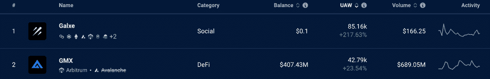
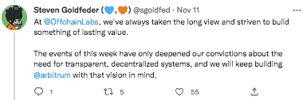

# Arbitrum Dapps 在 FTX 危机中表现出弹性

> 原文：<https://web.archive.org/web/https://dappradar.com/blog/arbitrum-dapps-show-resilience-during-ftx-crisis>

## Arbitrum dapps 的使用越来越多，证明了 Web3 更多的是关于真正的效用，而不是坏演员。

FTX 危机的余波继续主导着网络 3 和主流新闻周期。这是继 Terra Luna 崩盘后，第二起冲击大型集中交易所的黑天鹅事件。然而，Arbitrum 表明，在链上安全透明地完成 Web3 是唯一的出路。

**亮点**

*   unique active wallet(UAW)显示连接到 dapp 的 Web3 钱包的数量。七天之内，Galxe UAWs 上涨 218%，GMX 上涨 24%，Quix 上涨 99%，OpenSea 上涨 18%。
*   FTX 发生的事情前所未有地动摇了投资者和用户的信心。在这场危机中，FTX 的金融联系和对许多其他网络 3 平台的投资加剧了其负面影响。
*   Arbitrum 背后的公司 OffchainLabs 在 FTX 没有资金

[Check Arbitrum Dapp Data](https://web.archive.org/web/20221208025008/https://dappradar.com/rankings/protocol/arbitrum)

## FTX 危机及其对德国民主党的影响

FTX 危机对整个 Web3 领域产生了连锁反应，影响了用户和投资者的信心。也有人担心一些主要平台可能会倒闭。但是需要注意的是，FTX 是一个集中的交易所，分散的应用程序的工作方式非常不同。

*   了解更多关于[集中式和分散式交换的区别](https://web.archive.org/web/20221208025008/https://dappradar.com/blog/dex-vs-cex-which-is-right-for-you)

DappRadar 独特的活跃钱包(UAW)指标衡量在给定时间内有多少个人 Web3 钱包连接到 dapp。通过测量 UAW 的变化，我们可以判断一个 dapp 在用户中的当前和趋势受欢迎程度。

我们注意到过去一周一些 Arbitrum dapps 增加了他们的 UAW，这表明人们渴望继续使用这些工具和平台。也许这表明现在是时候让伟大的项目和伟大的效用在 Web3 中成为最受欢迎的 dapps 了。

## Galxe 和 GMX 的使用量增加

[Arbitrum](https://web.archive.org/web/20221208025008/https://dappradar.com/rankings/protocol/arbitrum) 是以太坊的第二层扩展解决方案。它提供了第 1 层网络的所有安全功能，但交易成本更低，吞吐量更高。

对 Arbitrum 和更广泛的 Web3 生态系统的支持者来说，好消息是 dapps 不会走上 FTX 中央交易所的老路。

[Discover Galxe](https://web.archive.org/web/20221208025008/https://dappradar.com/multichain/social/galxe)

高尔塞和 GMX 是两大巨头，让我们有理由相信，我们的行业将经受住最近的这场风暴。与前者相关的独立活跃钱包增长了 218%。Galxe 是一个使用区块链技术构建的社交网络平台。

[Discover GMX](https://web.archive.org/web/20221208025008/https://dappradar.com/multichain/defi/gmx)

它使用户能够在 Web3 上随身携带他们的安全数字身份，并在多个社交 dapps 上建立他们的单一在线声誉。与传统的社交媒体不同，基于区块链的网络旨在协同工作。

GMX 的 UAW 上涨了 24%。GMX 是一种去中心化的现货交易协议，它为用户提供钱包和用钱包进行交易的权力。像许多其他 DeFi 平台一样，GMX 的活动正在增加，这可能是一个迹象，表明用户最终放弃了像 FTX 这样的集中交易。

## 市场 Quix 和 OpenSea 也表现良好

在 DappRadar 追踪的许多区块链地区，市场似乎表现良好。对于 Abritrum，我们可以看到这种模式在 Quix 和 OpenSea 上也在上演。连接到其平台的无人机分别增长了 99%和 18%。

## OffchainLabs 在 FTX 没有资金

在 FTX 事件之后，Arbitrum 背后的公司 OffchainLabs 的首席执行官 Steven Goldfeder 表示，该公司在 FTX 没有资金或相关的 token holdings，同时向社区保证，该团队有能力继续建设和发展。

同样，他强调了透明、分散的系统的重要性，以及 Arbitrum 将如何继续代表这一愿景。

Source: Twitter (Thread by [Steven Goldfeder](https://web.archive.org/web/20221208025008/https://twitter.com/sgoldfed/status/1590922194540179465))

## 随身携带您的 Web3 之旅

使用 DappRadar 移动应用程序，再也不会错过 Web3。查看最受欢迎的 dapps 的性能，并关注您投资组合中的 NFT。您在 DappRadar 上的帐户会与我们的移动应用程序同步，这样您很快就可以选择实时接收提醒。

[Download the DappRadar app now](https://web.archive.org/web/20221208025008/https://dappradar.app.link/blog)[<picture></picture>](https://web.archive.org/web/20221208025008/https://play.google.com/store/apps/details?id=com.portfolio.dappradar)