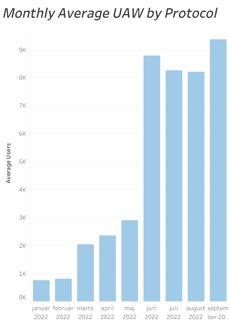
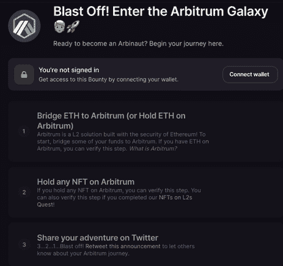
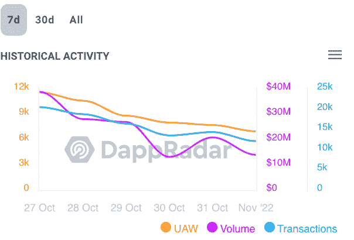
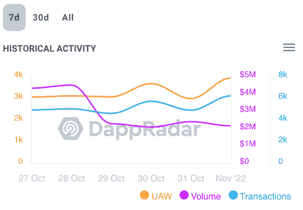

# Arbitrum 暴涨，期待 ARBI 令牌空投

> 原文：<https://web.archive.org/web/https://dappradar.com/blog/arbitrum-skyrockets-in-anticipation-of-arbi-token-airdrop>

## 由于潜在的空投可能即将来临，Arbitrum 活动增加

**正如增加的桥接活动清楚显示的那样，第 2 层解决方案正在掀起波澜。Stargate Finance 本周上涨了 75%，而 GMX，也是 Arbitrum 生态系统的一部分，上涨了 100%，Polygon bridge 的活跃度增加了 63%。这是因为空投猎人还是第二层真的被采用了？让我们深入了解数据背后的故事。**

## **内容**

为什么 Arbitrum 的活性增加了？

有 ARBI 代币来了吗？

*   [GMX](https://web.archive.org/web/20221209213424/https://dappradar.com/blog/arbitrum-skyrockets-in-anticipation-of-arbi-token-airdrop/#GMX-)
*   [星际之门金融](https://web.archive.org/web/20221209213424/https://dappradar.com/blog/arbitrum-skyrockets-in-anticipation-of-arbi-token-airdrop/#Stargate-Finance)

[结束语](https://web.archive.org/web/20221209213424/https://dappradar.com/blog/arbitrum-skyrockets-in-anticipation-of-arbi-token-airdrop/#Closing-thoughts)

## 为什么阿尔比 trum 的活动增加了？

Arbitrum 最近的 Nova 升级吸引了流行的 L2，为开发人员带来了更快的交易、更低的费用和更好的用户体验。

[Check Arbitrum´s Dapps](https://web.archive.org/web/20221209213424/https://dappradar.com/rankings/protocol/arbitrum)

Source: Monthly UAW Arbitrum – DappRadar

看看 8 月份升级后的无人机总数，我们可以看到增加了 12.52%，但更重要的是，无人机活动激增的一部分可以归因于空投猎人寻求增加他们潜在的 ARBI 空投的机会。

增加空投的代币资格总是意味着与网络的 dapps 互动，促进流动性。此外，用户参与第三层、Guild.xyz 和 Galaxy 上的“Arbitrum 任务和任务”。

通过完成相关的测验和任务，用户可以通过理解安装在 L2 解决方案上的知名应用程序获得 NFT。

Source: [LAYER3](https://web.archive.org/web/20221209213424/https://beta.layer3.xyz/quests/introduction-to-arbitrum)

## 有 ARBI 的代币吗？

尽管没有既定的标准，预期的象征性空投也没有得到证实，但敏锐的投资者正在采取行动增加他们的机会。

这些用户正在为第 2 层解决方案筹集资金，并通过任务、mainnet 交易和 Arbitrum Odyssey 活动与 Arbitrum 网络互动。

以下是本周 dapp 生态系统中的一些最大赢家:

### **GMX**

这是 Arbitrum 上领先的 DeFi 令牌交换。在过去的 7 天里，超过 49K UAW 与 dapp 的智能合约进行了交互。这意味着增长了 73.44%，金额为 1.71244 亿美元，增幅为 54.63%。

[Discover GMX](https://web.archive.org/web/20221209213424/https://dappradar.com/arbitrum/defi/gmx)

Source: GMX Statistics

### **星际之门金融**

Stargate 是一个完全可组合的流动性传输协议，位于 omnichain DeFi 的核心。在过去的 7 天里，超过 19.000 个 UAW 与 dapp 的智能合约进行了交互，交易量超过 36，000 笔，峰值达到 26.46%

[Discover Stargate Finance](https://web.archive.org/web/20221209213424/https://dappradar.com/arbitrum/defi/stargate-finance)

Source: Stargate Finance Statistics

你正在寻找多汁的象征空投？我们在我们的网站上为您提供了一个专门的空投区，您可以连接您的钱包并注册您最喜欢的空投。此外，我们建议您阅读我们的[十大加密空投机会](https://web.archive.org/web/20221209213424/https://dappradar.com/blog/top-10-crypto-airdrop-opportunities)。

[Check Airdrops](https://web.archive.org/web/20221209213424/https://dappradar.com/hub/airdrops)

## 随身携带您的 Web3 之旅

使用 DappRadar 移动应用程序，再也不会错过 Web3。查看最受欢迎的 dapps 的性能，并关注您投资组合中的 NFT。您在 DappRadar 上的帐户会与我们的移动应用程序同步，这样您很快就可以选择实时接收提醒。

[Download the DappRadar app now](https://web.archive.org/web/20221209213424/https://dappradar.app.link/blog)[<picture></picture>](https://web.archive.org/web/20221209213424/https://play.google.com/store/apps/details?id=com.portfolio.dappradar)

## 结束语

尽管第 2 层解决方案在熊市中蓬勃发展，但我们可以假设 Arbitrum 网络中活动的增加是由于其最近的发展和 ARBI 令牌空投的前景。

Arbitrum 是 L2 生态系统中的一颗新星，这个项目背后的团队非常合格。Arbitrum 的构建者 Offchain Labs 最近收购了 Prysmatic Labs，这是以太坊过渡到利益相关共识的核心工程团队之一。

此外，Arbitrum 最近与 Reddit 合作，将社交网络的社区点标记到区块链上。这将发生在 Arbitrum 的新平台上:Arbitrum Nova。

后者的设计考虑到了游戏和社交网络应用，同时保持了以太坊的高安全性。我们 DappRadar 看好 Arbitrum，并将继续关注它的发展。