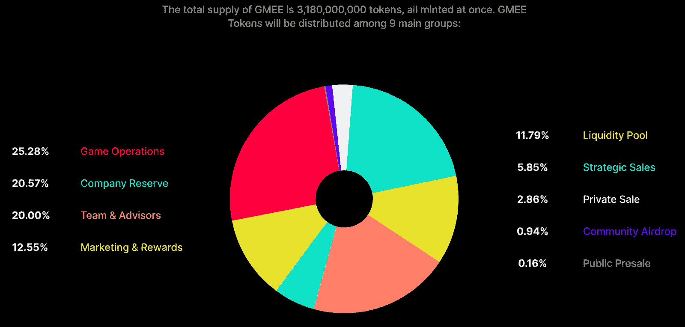
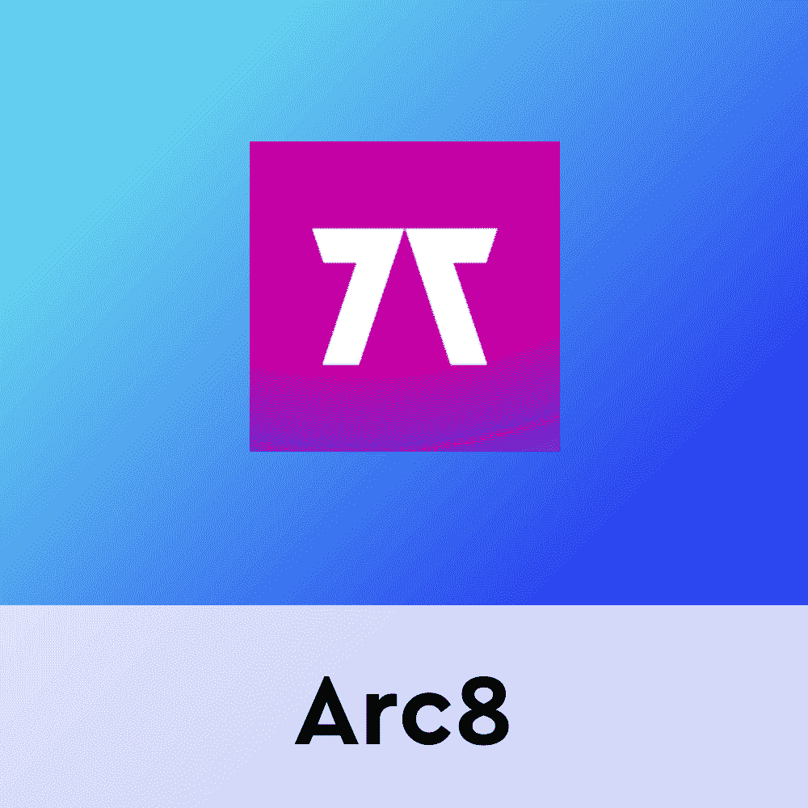

# Arc8 和 GMEE 令牌

> 原文：<https://web.archive.org/web/https://dappradar.com/blog/arc8-and-the-gmee-token>

## 关于基于多边形的 GMEE，您需要了解的一切

Arc8 是多边形区块链上的一个基于移动设备的“玩赚”平台，玩家在迷你游戏中获胜后可以获得 GMEE 代币作为奖励。Arc8 由 Animoca Brands 的子公司 Gamee 开发，是首批完全基于移动设备的游戏之一。

随着热门项目如 [REVV Racing](https://web.archive.org/web/20220929122333/https://dappradar.com/polygon/games/revv-racing) 、[沙盒](https://web.archive.org/web/20220929122333/https://dappradar.com/ethereum/games/the-sandbox)和[疯狂防御英雄](https://web.archive.org/web/20220929122333/https://dappradar.com/multichain/games/crazy-defense-heroes)的成功记录，Animoca Brands 决定通过 GAMEE 平台进一步拓展。Gamee 的原生标志是 [GMEE](https://web.archive.org/web/20220929122333/https://dappradar.com/hub/token/polygon/GMEE/MATIC?from=0xcf32822ff397ef82425153a9dcb726e5ff61dca7) ，是 [Arc8](https://web.archive.org/web/20220929122333/https://dappradar.com/polygon/games/arc8-by-gamee-1) 和 G-bots 的故乡。

Arc8 提供九种不同的迷你游戏。每个都允许玩家互相竞争，并在锦标赛排行榜上赢得一席之地，或在一对一的比赛中战斗。赢得一场比赛会奖励 GMEE 的玩家，并在排行榜上获得更高的名次。

除了 Arc8，Animoca Brands 也推出了 Gamee 平台。它还为玩家提供了在各种迷你游戏中试试运气的机会。与依赖玩家技能的 Arc8 不同，Gamee 专注于通过莱佛士和博彩游戏试试运气的有趣一面。然而，Gamee 也允许玩家直接向 PayPal 提取奖金。

得益于 GMEE 令牌，Arc8 提供了真正的即玩即赚体验。请继续阅读，了解有关 native token 及其革命性的双区块链结构的所有信息。

## 什么是 GMEE？

GMEE 是 Gamee 产品的本土标志。该代币在 Arc8 上占据中心位置，因为赢得锦标赛和比赛的所有奖励都在 GMEE 支付。这是一个基于以太坊的实用令牌，使用 Polygon 作为第二层扩展解决方案。

GMEE 的目的是作为连接 Gamee 平台上多个游戏名称的行动、奖励和激励的媒介，以及分散所有迷你游戏和平台的所有权和治理。总供应量为 31.8 亿代币。

重要的是，为了增加他们在 Arc8 上的 [GMEE](https://web.archive.org/web/20220929122333/https://dappradar.com/hub/token/polygon/GMEE/MATIC?from=0xcf32822ff397ef82425153a9dcb726e5ff61dca7) 奖金，玩家还可以购买 G-bots NFT。这些 NFT 在一个只对主人开放的专属迷你游戏中充当可玩角色。此外，G-bots 游戏和锦标赛提供了 Arc8 游戏中最大的奖励池。当然，他们只出售机器人来换取 GMEE 代币。

除了报酬，GMEE 还是治理的象征。持有令牌的用户可以投票并影响有关 Arc8 平台的产品功能、内容和奖金池的决策。

要了解更多关于 GMEE、Arc8 和“玩到赚”的信息，请查看下面的有用链接。此外，你可以在 Twitter 上关注 DappRadar，第一时间了解最新的区块链博彩新闻。

[<picture></picture>](https://web.archive.org/web/20220929122333/https://dappradar.com/polygon/games/arc8-by-gamee-1)[<picture></picture>](https://web.archive.org/web/20220929122333/https://dappradar.com/hub/token/polygon/GMEE/MATIC?from=0xcf32822ff397ef82425153a9dcb726e5ff61dca7)[<picture></picture>](https://web.archive.org/web/20220929122333/https://dappradar.com/rankings/protocol/polygon/category/games) NewsletterUnsubscribe at any time. [T&Cs](https://web.archive.org/web/20220929122333/https://dappradar.com/terms) and [Privacy Policy](https://web.archive.org/web/20220929122333/https://dappradar.com/privacy-policy)