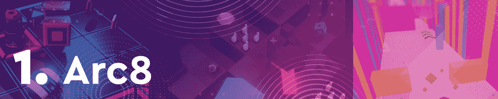
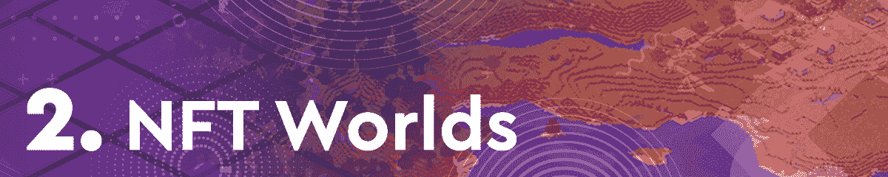
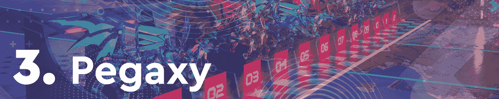
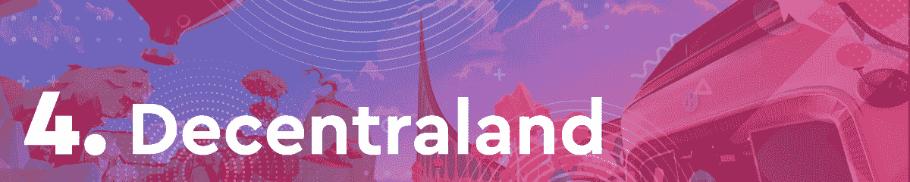
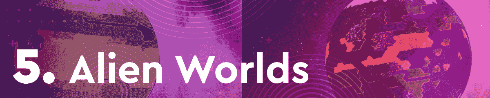
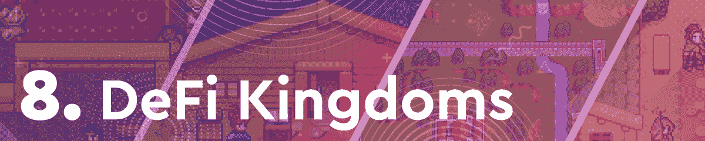
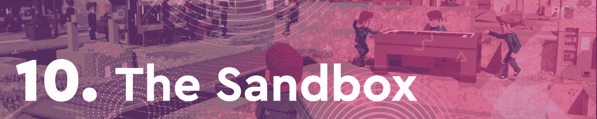
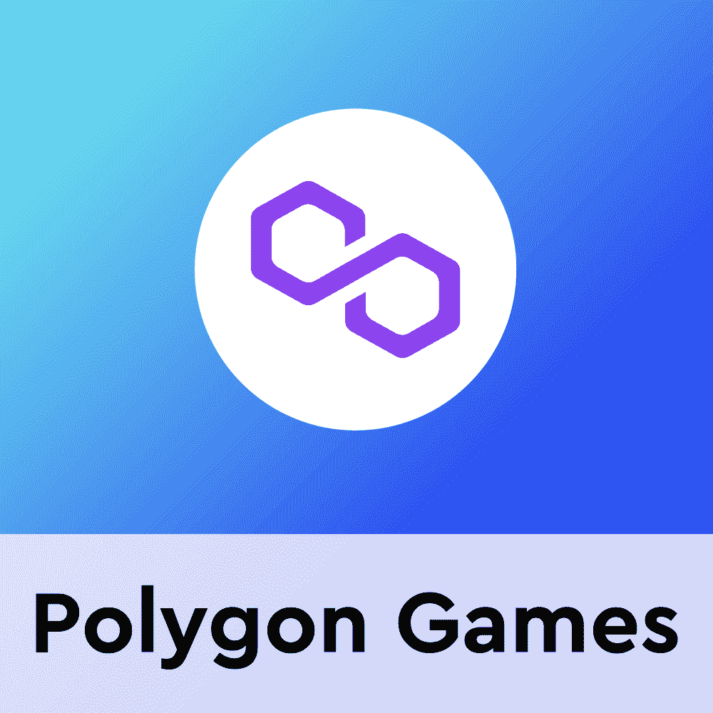

# Arc8 凭借第一季的发布抢占榜首

> 原文：<https://web.archive.org/web/https://dappradar.com/blog/arc8-grabs-the-top-spot-with-season-1-launch>

## 查看本周十大区块链游戏

Arc8 凭借令人印象深刻的第一季发布登上本周排行榜榜首。虽然基于移动的平台经历了测试版和季前赛，但这是第一个正式推出的赛季。由于这一宣布，这款游戏本周的独立活跃用户超过了 32000 人。此外，该平台的本地令牌 GMEE 的价格在过去七天上涨了 42%。

紧随其后的是 NFT 世界，它推出了一个重要的令牌机制，以及基于多边形的游戏 Pegaxy。Pegaxy 凭借其即将推出的 3D 赛车道的封闭测试版的推出，成功进入了每周排名。

在过去的几个月里，区块链游戏一直处于加密活动的前沿。通过这篇文章，DappRadar 了解了最热门的游戏 dapps。为了编制这个排名，我们考虑了链上活动，NFT 交易量，令牌估值，以及围绕每个 dapp 的新闻和事件。

在下面浏览本周十大区块链游戏的完整列表。单击相应的图片，了解每个平台的更多信息。或者，看看下面的视频，它总结了排名，可以快速查看。

[https://web.archive.org/web/20220929105615if_/https://www.youtube.com/embed/WXo9zaQtaxU?feature=oembed](https://web.archive.org/web/20220929105615if_/https://www.youtube.com/embed/WXo9zaQtaxU?feature=oembed)

## 本周十大区块链游戏

由于游戏第一个正式赛季的开始，Arc8 在本周的十大区块链游戏排名中占据首位。到目前为止，移动平台邀请玩家测试其测试版和季前赛。然而，Arc8 现在完全活跃，第一季已经开始。此外，该平台的原生令牌 GMEE 在过去七天中表现出色，其估值上涨了 42%以上。

随着 NFT 交易量的强劲表现，NFT 世界本周排名第二。然而，最重要的是，该平台实现了一种游戏内交易机制，允许玩家发送 WRLD 令牌，而不必支付汽油费。这一新机制也对 WRLD 的估值产生了积极影响，该公司的估值在过去 7 天里上涨了 39%。

Pegaxy 是区块链游戏周刊排名前十的新人。令人印象深刻的是，由于令人印象深刻的测试版——3D 赛道的推出，这款游戏进入了前 3 名。本周，该平台允许创始、传奇、史诗和稀有马 NFT 持有者尝试即将到来的 3D 赛道的测试版。此外，该平台在过去一周吸引了超过 32，000 个独特的活动钱包。

由于宣布虚拟世界将举办首届元宇宙时装周，分散的土地本周排名第四。当时装屋从一个地方到另一个地方旅行时，现实世界充满了新的设计，分散地将迎来第一个虚拟世界时装周。令人印象深刻的是，根据官方声明，想要参与的大品牌数量超过了分散式土地的能力。

与我们上周发布的月度排名相比,下降了几个名次。然而，该游戏仍然吸引了 420.150 个独特的活动钱包，使其成为榜单上访问量第二大的游戏 dapp。在没有任何重大宣布和相当稳定的本地令牌 TLM 表现的情况下，《异形世界》本周排名第五。

基于蜂巢的纸牌交易游戏[splitterlands](https://web.archive.org/web/20220929105615/https://dappradar.com/hive/games/splinterlands)本周排名第六。尽管吸引了 488.280 个独特的活跃钱包，这是该榜单上最大的观众，但该游戏的原生令牌 SPS 的价值下降了 1.8%。这影响了过去七天的性能指标，并将 Splinterlands 置于排名的末尾。

房地产交易游戏[高地](https://web.archive.org/web/20220929105615/https://dappradar.com/eos/games/upland)频繁出现在区块链游戏周排行榜的前十名中。在过去的七天里，游戏为洛杉矶北部社区发起了一场大规模的土地铸造活动。这提高了基于 EOS 的 dapp 的活跃度，吸引了近 20 万个独特的活跃钱包。

尽管失去了 2022 年初看到的一些势头，dapp 仍然是区块链上最受欢迎的游戏体验之一。本周，该平台宣布了一项重大资助计划。该计划旨在推动创新，以造福社区、项目和整个区块链体验。

几个月来，CryptoBlades 一直是区块链游戏领域最大的项目之一。然而，在经历了一些动荡之后，民主进步党很少能进入区块链奥运会前十名。本周，CryptoBlades 排名第九，这要归功于推出了一个重要的燃烧机制。这允许玩家烧掉他们的角色来换取其他有价值的游戏内资产。

最后但同样重要的是，我们有沙盒。虽然传统上虚拟世界在排行榜上排名更高，但本周它勉强排在最后一名。尽管如此，该平台在过去的七天里取得了一些重要进展，包括 NFT 土地智能合同迁移。迁移活动和所有相关费用都由沙盒团队承担，NFT 的业主在将土地转让给新的智能合同时不必担心燃气费。

## Arc8 为您的智能手机带来“玩到赚”

Arc8 一直在有条不紊地打造迄今为止最具革命性的区块链游戏之一。虽然这款游戏还没有像《分裂之地》和《外星世界》那样吸引大量追随者，但它有一个充满希望的基础。在 Animoca 品牌的支持下，Arc8 为组合带来了急需的灵活性。

目前，大多数“玩即赚”和 DeFi 驱动的游戏都是基于浏览器或电脑的。然而，Arc8 是一个专门基于移动设备的平台。这给平台带来了竞争优势，也为用户获取打开了新的视野。

DappRadar 将继续关注 Arc8，因为它将进入第一个正式赛季。如果您想了解更多关于该平台及其本地令牌 GMEE 的信息，请查看下面的链接。此外，你可以在 Twitter 上关注 DappRadar，并加入 T2 DappRadar PRO，第一时间获得最新的区块链博彩新闻。

[<picture></picture>](https://web.archive.org/web/20220929105615/https://dappradar.com/polygon/games/arc8-by-gamee-1)[<picture></picture>](https://web.archive.org/web/20220929105615/https://dappradar.com/hub/token/polygon/GMEE/MATIC?from=0xcf32822ff397ef82425153a9dcb726e5ff61dca7)[<picture></picture>](https://web.archive.org/web/20220929105615/https://dappradar.com/rankings/protocol/polygon/category/games) NewsletterUnsubscribe at any time. [T&Cs](https://web.archive.org/web/20220929105615/https://dappradar.com/terms) and [Privacy Policy](https://web.archive.org/web/20220929105615/https://dappradar.com/privacy-policy)