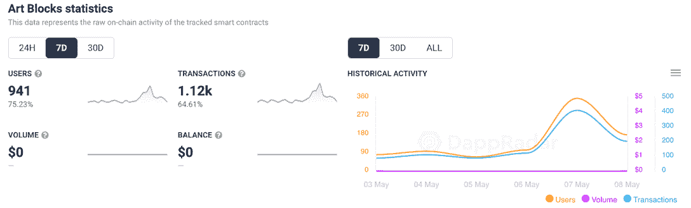
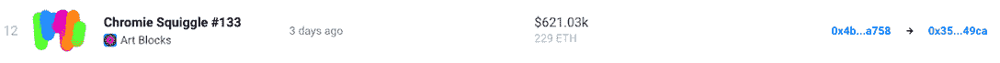
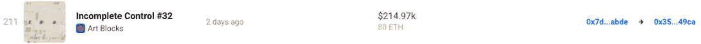
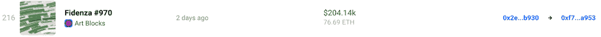
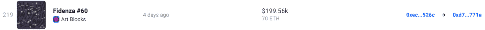
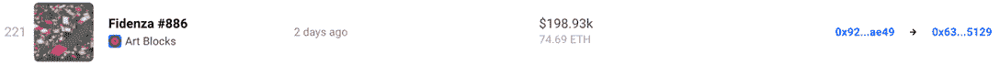

# 熊市中艺术作品能赚钱吗？

> 原文：<https://web.archive.org/web/https://dappradar.com/blog/are-art-blocks-nfts-money-makers-during-a-bear-market>

## 在过去的七天里，生殖艺术项目获得了大量的销售和大量的关注

当 Art Blocks 首次推出时，它成为了 NFT 基本的生成艺术系列之一。更重要的是，它似乎无视我们目前经历的加密市场的整体负面轨迹。在过去的七天里，Art Blocks collections 吸引了 75%以上的独特活动钱包，而该项目的交易量上升了 64%。

## 摘要

*   [Art Blocks 的交易量激增，在过去的七天里，许多交易的成交额超过了 19 万美元](https://web.archive.org/web/20221006045445/https://dappradar.com/blog/are-art-blocks-nfts-money-makers-during-a-bear-market/#activity)
*   [铬黄曲线#133](https://web.archive.org/web/20221006045445/https://dappradar.com/hub/assets/eth/0x059edd72cd353df5106d2b9cc5ab83a52287ac3a/133) 、[不完全控制#32](https://web.archive.org/web/20221006045445/https://dappradar.com/hub/assets/eth/0xa7d8d9ef8d8ce8992df33d8b8cf4aebabd5bd270/228000032) 和[菲登扎#970](https://web.archive.org/web/20221006045445/https://dappradar.com/hub/assets/eth/0xa7d8d9ef8d8ce8992df33d8b8cf4aebabd5bd270/78000970) 是过去一周收藏中最昂贵的 NFT 作品
*   造币商和持有者在艺术品拍卖中获利
*   随着代币价格下跌，投资者开始转向已证实的收藏品，试图增加他们的收益

## 艺术街区活动高峰

加密市场已经陷入赤字有一段时间了，许多人担心另一个加密冬天即将到来。然而，并非所有的希望都破灭了。例如，在过去的一周里，艺术板块和非艺术板块的交易量显著增长。

该系列共吸引了 941 名交易者，他们发起了一千多项交易。对于一个通常会吸引该领域大鱼的项目来说，这是一个不小的壮举，它带来了成千上万的交易量。

此外，在过去的七天里，艺术街区 NFT 也创下了该领域的一些最高销售记录。Chromie Squiggle #133 以 229 ETH 的价格转手，价值超过 62.1 万美元。

不完全控制#32 和 Fidenza #970 记录的销售额超过 20 万美元。

还有几个 Fidenzas 紧随其后，每个都创下了超过 19.8 万美元的销售额。

这表明，艺术街区不仅在数量上加快了步伐，在销售额上也是如此。这五笔交易带来了超过一百万美元的交易额。

## 收藏家是从艺术块中赚钱吗？

在熊市中，要想知道艺术品板块是否真的成功地克服了困难，为所有者创造了利润，一个简单的方法就是跟踪销售情况。让我们仔细看看上面提到的一些最卖座的作品。

Chromie Squiggle #133 以 229 ETH 的价格售出，在拍卖时价值 621，030 美元。NFT 的卖家是去年真正铸造它的人，价格为 0.035 ETH，按当前 ETH 价格计算约 86 美元。您已经可以看到，考虑到最小的初始投资，这笔交易产生了巨大的利润。

不完全控制#32 遵循大致相同的模式。第一个所有者在五个月前铸造了这件作品，并在两天前的拍卖中将其收入囊中。当然，出售一件铸造的 NFT 并不总是能保证这么大的投资回报，但看起来在艺术块 NFTs 的情况下，这并不是一个不可想象的场景。需要注意的重要一点是，不完全控制和 Chromie Squiggle 的买家是相同的。用 [DappRadar 投资组合追踪器](https://web.archive.org/web/20221006045445/https://dappradar.com/hub/)快速检查显示，他们的钱包里总共有 [28 件艺术品 NFT](https://web.archive.org/web/20221006045445/https://dappradar.com/hub/wallet/eth/0xa743c8c57c425b84cb2ed18c6b9ae3ad21629cb5/nfts/1/art-blocks-curated)，总价值超过 180 万美元。

Fidenza #970 拥有更丰富的交易历史。九个月前，它第一次以 21th 的价格售出，这为铸币商赢得了一笔可观的利润。然而，购买 NFT 的人几天前已经以 76 ETH 的价格出售了它。这项投资的回报超过 55 ETH，按照目前的 ETH 价格计算，约为 135，000 美元。这是相当大的胜利，尤其是在当前熊市的情况下。

## 持有经过验证的收藏品可能是值得的

快速浏览一下上述 NFTs 的销售历史，就会发现一种传统和加密市场的投资者早已熟知的模式。等待可能是最好的策略。从这一点上可以得出几个要点。

设法获取利润的卖家很可能根据当前的市场条件为他们的非关税壁垒定价。目前，瑞士联邦理工学院的估值一段时间以来一直在下降。因此，许多精明的投资者会提高他们的 ETH 要价，以满足他们对投资的美元价值的预期。这可能意味着，如果 ETH 的价格逆转趋势并开始攀升，卖方将获得更大的投资回报。

另一方面，熊市让买家更容易买进 ETH 股票，因为它现在的价格更低。因此，在熊市期间，可能更容易买到更稀有或更昂贵的 NFT。当然，这些关系是非常主观的，投资者应该在大笔买入之前进行彻底的研究。尽管如此，看到一个 NFT 收藏如何成功击败熊市趋势并为长期持有人带来利润还是很有趣的。

如果你想了解更多关于艺术块的知识，请查看收藏的官方单 dapp 页面。此外，你还可以加入 DappRadar PRO ，获取最新艺术品拍卖和交易量的最新信息。要获得最新的 NFT 新闻，请在 [Twitter](https://web.archive.org/web/20221006045445/https://twitter.com/dappradar) 上关注 DappRadar。

 NewsletterUnsubscribe at any time. [T&Cs](https://web.archive.org/web/20221006045445/https://dappradar.com/terms) and [Privacy Policy](https://web.archive.org/web/20221006045445/https://dappradar.com/privacy-policy)