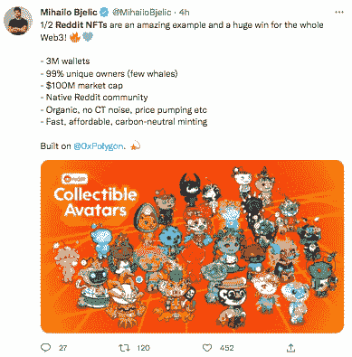
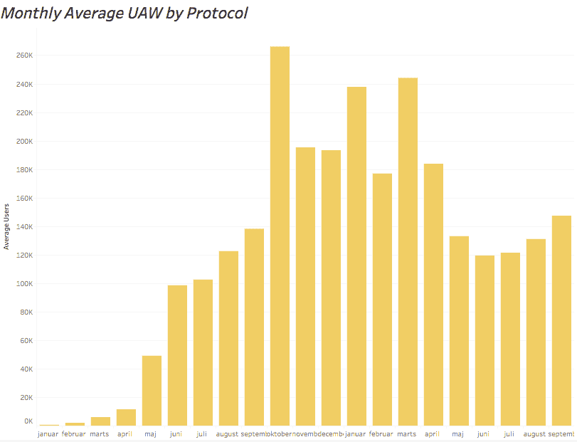
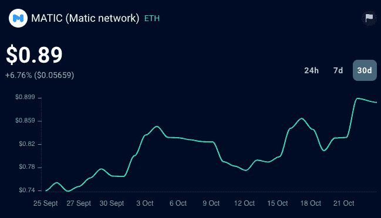
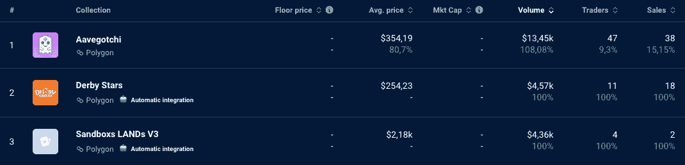

# Reddit & Polygon 是否带回了牛市？

> 原文：<https://web.archive.org/web/https://dappradar.com/blog/are-reddit-polygon-bringing-back-the-bull-market>

## 只需要一个催化剂就能启动下一轮牛市。会不会是 Reddit NFTs？

Reddit 的数字收藏品大受欢迎，在 Reddit 金库中创造了 300 万个 NFT 钱包。流行的 NFT 是在 Polygon 上铸造的，已经有 1 亿美元的市值。这是 NFT 牛市回归的开始吗？让我们揭开数据背后的故事。

## 内容

*   [为什么 Polygon Reddit 钱包会爆炸？](https://web.archive.org/web/20221130142606/https://dappradar.com/blog/are-reddit-polygon-bringing-back-the-bull-market/#Why-are-Polygon-Reddit-wallets-exploding?)
*   [Polygong 是如何引领主流领养的？](https://web.archive.org/web/20221130142606/https://dappradar.com/blog/are-reddit-polygon-bringing-back-the-bull-market/#How-is-Polygon-leading-the-way-to-mainstream-adoption?)
*   [Reddit NFT 有哪些不同类型？](https://web.archive.org/web/20221130142606/https://dappradar.com/blog/are-reddit-polygon-bringing-back-the-bull-market/#What-are-the-different-types-of-Reddit-NFTs?)
*   如何购买 Reddit NFT 头像？
*   如何使用 DappRadar 来追踪 Reddit 的收藏？
*   [结束语](https://web.archive.org/web/20221130142606/https://dappradar.com/blog/are-reddit-polygon-bringing-back-the-bull-market/#Closing-thoughts-)

## 为什么多边形 Reddit 钱包会爆炸？

Reddit 在 7 月份推出了自己的 [NFT 市场](https://web.archive.org/web/20221130142606/https://beincrypto.com/learn/where-to-buy-nft/)，以及自己的 40，000 个 Reddit NFTs 集合。一些人将这一成功归功于一个为不懂密码的新手量身定制的无缝流程，即故意在公告中丢弃“密码词”。

[Check Reddit NFT Sales](https://web.archive.org/web/20221130142606/https://dappradar.com/nft/sales/protocol/polygon)

看涨趋势像野火一样蔓延，在 Twitter 上也是如此。

顶级头像的售价高达 6.9 ETH，24 小时交易量为 2.35 万美元。

NFT 被用作头像，Polygon Reddit 钱包的数量已经超过了 OpenSea，获得了巨大的价值。

[Check Polygon NFTs](https://web.archive.org/web/20221130142606/https://dappradar.com/nft/sales/protocol/polygon)

Senses x Reddit 系列和 Foustlings x Reddit 系列是最成功的。例如，在过去的 30 天里，Senses x Reddit 系列的交易量达到了 387，激增了 516%，而 Foustlings x Reddit 系列的交易量为 369 ETH，增长了 524%。

一个重要的亮点是，那些购买 NFT 的人获得了许可权，使 Redditors 有机会在平台内外使用这些 NFT 头像，这可以释放更多的效用。例如，你可以用虚拟形象构建器中的各种商品来修改他们的外观。

## Polygon 是如何引领主流采用的？

尽管经历了熊市动荡，但 NFT 行业正以前所未有的速度增长。Polygon 是处于这一增长前沿的领先协议之一，通过与除 Reddit 之外的大型品牌(如 Meta、Twitter、Wyre、Starbucks、Mercedes 等)的重要合作伙伴关系，走向主流采用。就 Reddit 而言，有超过 5200 万的每日活跃平台用户接触到 Web3，这是一个非常乐观的情况。

Source: DappRadar

查看 DappRadar 数据，我们可以看到 Polygon 去年 9 月共有 147.370 个独立的活动钱包与其智能合约进行交互。与去年同期相比，增长了 6.28%。

Source: DappRadar

此外，多边形的本机令牌 MATIC 在过去 30 天内增长了 6.76%，多边形上的前三大 NFT 收藏在过去 24 小时内都显示出积极的迹象。

Source: DappRadar

## Reddit NFTs 有哪些不同的类型？

不同类型的 Reddit NFTs 包括那些由独立创作者制作的，最新的免费 NFT 和 CryptoSnoos。

### 独立创作者的 NFT

你可以用加密钱包购买，或者直接用你的借记卡或信用卡。当您导航到[r/collective avatars](https://web.archive.org/web/20221130142606/https://www.reddit.com/r/CollectibleAvatars/)子编辑时，您还可以搜索您最喜爱的艺术家以获取灵感。

### 免费 NFTs

这些 NFT 将被空投到贡献最大的 Redditors 或那些在平台的 karma 等级系统中的高层。顶级会员可以从 4 种不同风格的可收藏头像中进行选择:

*   **奇点**

当前底价:0.02 瑞士法郎

*   **Aww 好友**

当前底价:0.022 瑞士法郎

*   **滴滴小分队**

当前底价:0.025 瑞士法郎

*   **Meme 团队**

当前底价:0.022 瑞士法郎

## 隐孢子虫

史努比是 Reddit 的外星吉祥物。它们可以是传奇的、史诗的或稀有的，传奇的那种是最稀有的，因此也是最有价值的。你可以把它们作为你在 Reddit 上的头像，也可以通过连接你的 Reddit 账户到 OpenSea 页面在 OpenSea 上购买它们。

## 如何购买 Reddit NFT 头像？

Reddit 背后的团队明白，要让数百万用户参与进来，你必须简化事情，这包括放弃加密术语，使用每个人都能理解的词语。流程流畅快速，针对初学者。

在独立创作者和密码探知者的 NFT 的情况下，不需要钱包，只需要银行卡。你也可以在 [OpenSea](https://web.archive.org/web/20221130142606/https://dappradar.com/multichain/marketplaces/opensea) 上获得它们，只要你有一个 Metamask 钱包，并确保将你的 Reddit 账户连接到[cryptosnous OpenSea 页面](https://web.archive.org/web/20221130142606/https://opensea.io/collection/reddit-cryptosnoos)

这些资产被称为可收集的化身，这个过程是如此无缝，以至于一些用户声称甚至没有意识到 NFT 的参与。

Reddit 还向顶级 Reddit 用户发放免费的 Reddit NFT 头像。

当一个成员被设置为接收这些头像之一时，他们会看到一个横幅，将他们带到可以认领 Reddit NFT 的地方。有四种不同风格的可收藏头像可供会员在申请免费的 Reddit NFT 时选择。

一旦你购买了一个头像(即 mint)，你可以把它保存在你的 Reddit 账户(及其各自的多边形地址)中，或者免费转移到你选择的钱包中！

[https://web.archive.org/web/20221130142606if_/https://www.youtube.com/embed/fkEaXYLOW-s?feature=oembed](https://web.archive.org/web/20221130142606if_/https://www.youtube.com/embed/fkEaXYLOW-s?feature=oembed)

## 如何使用 DappRadar 来跟踪 Reddit 的收藏？

使用 DappRadar 的投资组合跟踪器，您现在可以浏览新的 Web3 社交媒体，了解您钱包中有哪些代币和 NFT，以及您资产的详细估价。此外，您可以跟踪 NFT，让您完全控制您的收藏。

获得对您的 NFT 的强大实时可操作洞察，例如:

*   先前底价
*   净销售额
*   当前底价
*   价格变化
*   花费的金额
*   当前持有量
*   利润和损失

## 随身携带您的 Web3 之旅

使用 DappRadar 移动应用程序，再也不会错过 Web3。查看最受欢迎的 dapps 的性能，并关注您投资组合中的 NFT。您在 DappRadar 上的帐户会与我们的移动应用程序同步，这样您很快就可以选择实时接收提醒。

[Download the DappRadar app now](https://web.archive.org/web/20221130142606/https://dappradar.app.link/blog)[<picture></picture>](https://web.archive.org/web/20221130142606/https://play.google.com/store/apps/details?id=com.portfolio.dappradar)

## 结束语

传统的社交媒体平台刚刚开始加入创新潮流，但我们已经看到了大规模加入的巨大潜力。

看到这种暴涨的成功，我们知道只需要一个催化剂就可以开始下一轮牛市，我们想知道，会不会是 Reddit NFTs？

我们 DappRadar 很高兴能跟随 Reddit 的旅程，并将继续关注他们的旅程，因为他们会更深入地研究 Web3。