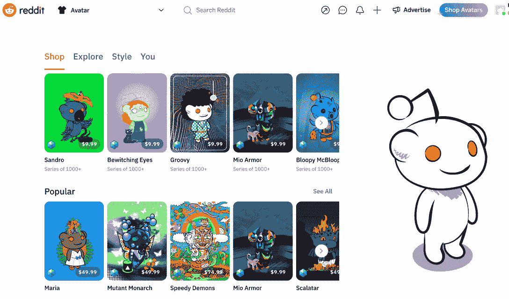

# 你够硬核，能收到 Reddit 的头像空投吗？

> 原文：<https://web.archive.org/web/https://dappradar.com/blog/are-you-hardcore-enough-to-receive-reddits-avatar-airdrop>

## 可收集的化身是多边形网络上的 NFT。

社交媒体网络 Reddit 已经向该平台最活跃的用户空投了多边形 NFT 头像。这些所谓的可收藏头像可以在 Reddit 平台上为所有者提供独特的好处。

**概要:**

*   Reddit 一直在向一些最活跃的用户空投免费的可收藏头像。
*   除了免费获得它们，用户还可以在 Reddit 的平台 avatar 商店购买这些 NFT。
*   可收集的头像是基于[多边形](https://web.archive.org/web/20220926010340/https://dappradar.com/rankings/protocol/polygon)的 NFT，其元数据和内容使用 IPFS 存储。
*   无论你是否是一个可收藏的头像所有者，你都可以使用 DappRadar [NFT 浏览器](https://web.archive.org/web/20220926010340/https://dappradar.com/hub/nft-explorer)来跟踪和估计 NFT，并获得数据驱动的洞察力。

社交媒体公司正蜂拥进入 Web3 的世界，它们的策略、成就和用户反应各不相同。

最受欢迎的社交媒体平台之一 Reddit 上个月宣布，将发布一系列基于其史努比角色的 NFT 头像。用户可以在 Reddit 的平台上购买这些头像，价格从 9.99 美元到 99.99 美元不等。其中，设计师系列的售价相对较高。

最近，一名 Reddit 管理员宣布，该平台将向忠实用户免费空投 [NFT 头像](https://web.archive.org/web/20220926010340/https://dappradar.com/blog/top-10-most-popular-avatar-pfp-nft-collections)，以表彰他们对 Reddit 社区的贡献。在最近几天，更多的用户收到了 Reddit 的头像 airdrop，他们迫不及待地在 Twitter 上炫耀他们的特权。

## 什么是 Reddit 头像？

[可收藏头像](https://web.archive.org/web/20220926010340/https://reddithelp.com/hc/en-us/articles/6213835889044)是 Reddit 用户的限量版头像，为拥有者提供 Reddit 平台上的独特福利。此外，可收藏的头像是高度可定制的。用户可以将头像装备与其他 Reddit 头像装备和配件混合搭配。此外，所有者可以在 Reddit 的区块链钱包 Vault 上存储和管理这些头像。

Reddit 将该系列称为可收藏的头像，并避免公开声称它们是 NFT。这是因为 NFT 往往与投机和诈骗联系在一起，Reddit 可能希望尽量减少这种负面联系。

然而，值得注意的是，用户在 [Polygon](https://web.archive.org/web/20220926010340/https://dappradar.com/rankings/protocol/polygon) 上创造可收集的头像，并使用 IPFS 存储他们的元数据和内容。这证明了不可替代的令牌是赋予用户数字主权的最佳工具，确保了数字资产的真实性和透明性。

这篇文章将让你更深入地了解什么是 NFT，他们有什么特点。

Reddit 选择 [Polygon](https://web.archive.org/web/20220926010340/https://dappradar.com/rankings/protocol/polygon) 是因为它与以太坊的兼容性极佳。更重要的是，Polygon 实现了比当前以太坊 mainnet 更便宜、更快速、更节能的交易。因此， [Polygon 也是许多游戏 dapps 的首选网络。](https://web.archive.org/web/20220926010340/https://dappradar.com/rankings/protocol/polygon/category/games)

*   阅读这篇文章，快速了解多边形。
*   点击此链接查看 Polygon 上的热门游戏。

## 使用 DappRadar NFT 浏览器跟踪 Reddit 收藏头像和您所有的 NFT 资产

无论你是否是 Reddit 收藏头像收藏家，你都可以使用 [DappRadar NFT 浏览器](https://web.archive.org/web/20220926010340/https://dappradar.com/hub/nft-explorer)来查看这个收藏和市场上绝大多数 NFT 的交易和价值。此外， [NFT 价值评估器](https://web.archive.org/web/20220926010340/https://dappradar.com/hub/nft-value-estimator)功能利用机器学习算法来帮助用户评估他们最有价值的资产的价值。

看看下面的视频，了解如何使用这些功能。也欢迎你去 [NFT 探险者](https://web.archive.org/web/20220926010340/https://dappradar.com/hub/nft-explorer)一探究竟，了解 NFT 圈的最新动向！

[https://web.archive.org/web/20220926010340if_/https://www.youtube.com/embed/fkEaXYLOW-s?feature=oembed](https://web.archive.org/web/20220926010340if_/https://www.youtube.com/embed/fkEaXYLOW-s?feature=oembed)

DappRadar 将继续关注 Reddit 参与 Web3 的最新情况。在 [Twitter](https://web.archive.org/web/20220926010340/https://twitter.com/dappradar) 、 [Discord](https://web.archive.org/web/20220926010340/https://discord.gg/4ybbssrHkm) 和 [Youtube](https://web.archive.org/web/20220926010340/https://www.youtube.com/c/DappRadar) 上关注我们，跟上区块链世界的动态。

## 随身携带您的 Web3 之旅

有了 DappRadar 移动应用程序，您再也不会错过 Web3 了。查看最受欢迎的 dapps 的性能，并关注您投资组合中的 NFT。您在 DappRadar 上的帐户与我们的移动应用程序同步，很快您就可以选择实时接收提醒！

[<picture></picture>](https://web.archive.org/web/20220926010340/https://play.google.com/store/apps/details?id=com.portfolio.dappradar)[Download for Android](https://web.archive.org/web/20220926010340/https://play.google.com/store/apps/details?id=com.portfolio.dappradar)