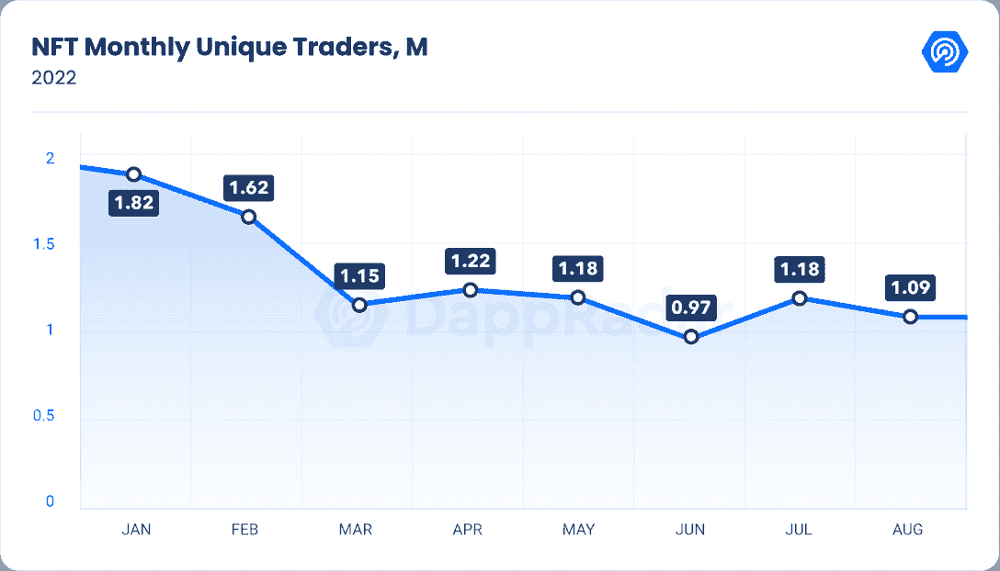
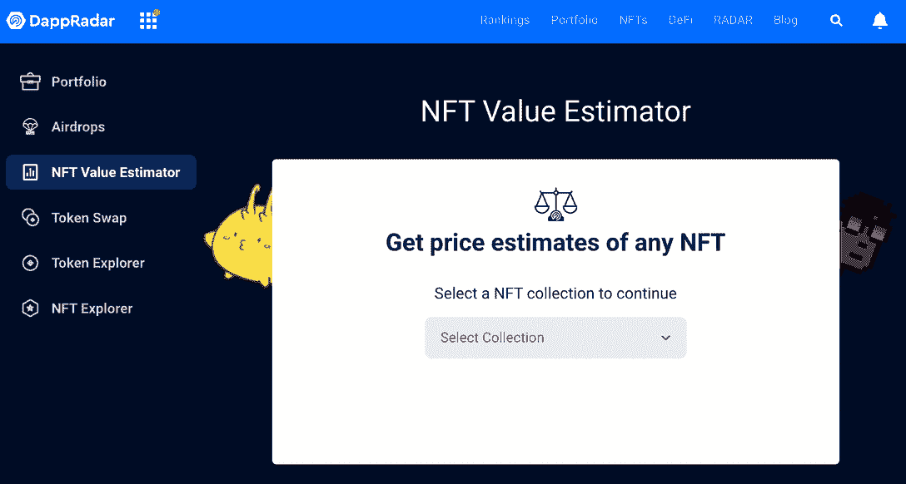
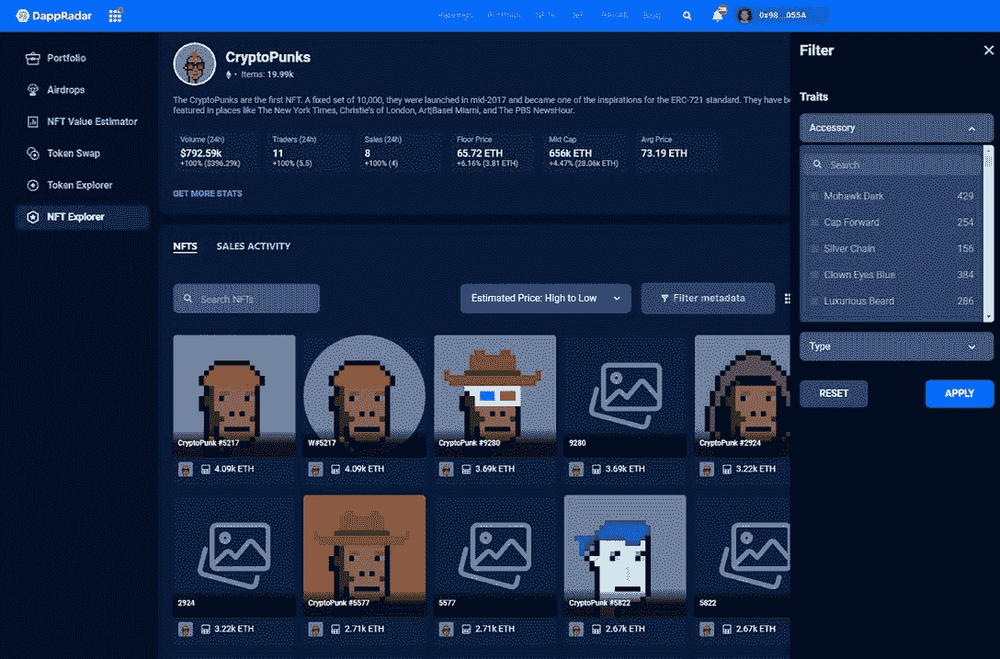
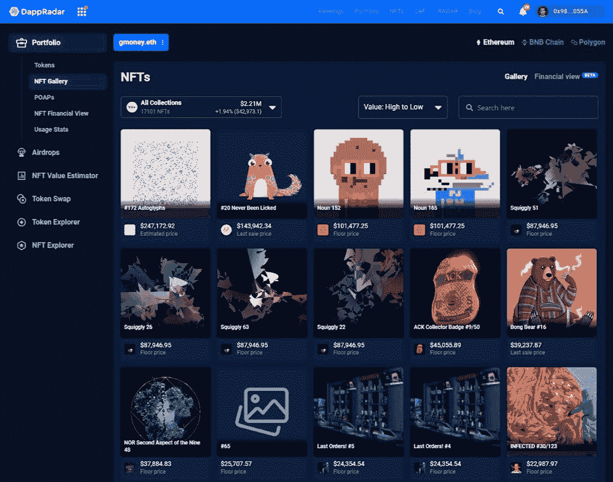

# 你的 NFT 不值钱吗？如何分析它们的价值

> 原文：<https://web.archive.org/web/https://dappradar.com/blog/are-your-nfts-worthless>

## 让我们收拾残局，分析一下你在 NFT 的投资是否还有价值

数字很低。我们的 NFT 行业报告显示，2022 年第三季度，市场交易量下降了 75%，即 20 亿美元。你的 NFTs 的价值去了哪里？现在是宇迦实验室唯一有价值的藏品了吗？为什么元宇宙突然感觉空寂无声？让我们深呼吸一下，看看我们的投资还剩下什么，以及从现在开始你可以期待什么。

## 摘要

*   NFT 市场从 2022 年初的峰值暴跌，但一些藏品仍然强劲；
*   收藏家应该经常研究和管理他们的 NFT 投资组合和一般市场；
*   你可以使用达普拉达 [NFT 价值估算器](https://web.archive.org/web/20221130135943/https://dappradar.com/hub/nft-value-estimator)、 [NFT 探索者](https://web.archive.org/web/20221130135943/https://dappradar.com/hub/nft-explorer)和[投资组合跟踪器](https://web.archive.org/web/20221130135943/https://dappradar.com/hub/wallet)来检查你的投资。

## 对非功能性测试的持续需求

尽管 NFT 市场的交易量大幅下降，但仍有大量交易活动在进行。2022 年 1 月，有 182 万个独立的活跃钱包进行非功能性金融交易，这一数字已经下降。

但自 3 月份以来，每月独立交易者的数量已经巩固在 97 万至 122 万之间。8 月份，在更广泛的 NFT 市场上，有 109 万个独特的钱包进行了 NFT 交易。

Source: [DappRadar](https://web.archive.org/web/20221130135943/https://dappradar.com/blog/dappradar-blockchain-industry-report-august-2022)

在包括供应链中断、能源危机、美国有史以来最高的通货膨胀率以及乌克兰和俄罗斯之间的战争在内的宏观经济动荡中，仍然存在对非功能性食品的持续需求。

但是，加密货币的价格自 2021 年 11 月见顶以来大幅下降。比特币(BTC)的价值从 69000 美元降到了现在的 19000 美元。乙醚(ETH)市值缩水 72%，从 4878 美元跌至目前的 1348 美元。这自然意味着以 ETH 定价的非金融资产损失了类似比例的价值。

或者，也许他们没有？

## NFTs 作为一种价值储存手段

NFT 可以是任何东西，因为这些合同赋予钱包持有者对数字资产的所有权。这种数字资产可以是社区的会员通行证，也可以是音乐节的门票或视频游戏中的一把剑。

然而，在这种情况下，我们主要讨论作为 Web3 品牌或社区一部分的 NFTs。不应低估社交元素和品牌，因为这些特征可以成就或毁掉一个系列。

在 2021 年 1 月 28 日推出 Hashmasks 后，NFTs 作为个人资料图片的概念结合强烈的社区元素点燃了整个 NFT 空间。

[<picture></picture>](https://web.archive.org/web/20221130135943/https://dappradar.com/blog/what-are-non-fungible-tokens-nfts)[<picture></picture>](https://web.archive.org/web/20221130135943/https://dappradar.com/nft/marketplaces)[<picture></picture>](https://web.archive.org/web/20221130135943/https://dappradar.com/nft/sales)

当然，CryptoPunks 已经在那里了，紧接着是 Meebits avatars 和 Bored Ape 游艇俱乐部。由于名人的参与、音乐视频和品牌合作，这最后一个已经成为一个进入流行文化的品牌。

通过 DappRadar 上的 [NFT 探险家](https://web.archive.org/web/20221130135943/https://dappradar.com/hub/nft-explorer)，任何人都可以找到各种 NFT 收藏品的有趣数据。根据过去 30 天的交易量，NFT 收藏的前 10 名中，各种项目在 1 月份就已经出现了。

| NFT 收藏 | 2022 年 1 月 | 2022 年 9 月 | 美元差额 |
| --- | --- | --- | --- |
| **隐朋克** | 59.95 瑞士法郎/161，265 美元 | 63.95 瑞士法郎/85，373 美元 | **47%** |
| **无聊猿游艇俱乐部** | 61.8 瑞士法郎/166，242 美元 | 73 瑞士法郎/97，455 美元 | **41%** |
| **变异猿游艇俱乐部** | 11.49 瑞士法郎/30，908 美元 | 14.3 瑞士法郎/19，090 美元 | **38%** |
| **Meebits** | 3.00 瑞士法郎/8070 美元 | 3.39 瑞士法郎/4525 美元 | 38% |
| **CloneX** | 3.8 瑞士法郎/10，222 美元 | 6.58 瑞士法郎/8784 美元 | **14%** |
| **酷猫** | 8.5 瑞士法郎/22，865 美元 | 2.78 ETH/3711 美元 | **83%** |
| **涂鸦** | 8.88 瑞士法郎/23，887 美元 | 8.88 瑞士法郎/11，854 美元 | **50%** |

*ETH – January closing price $2,690 / September closing price $1,335*

虽然有人在 ETH 的投资会使他们的投资组合自 1 月以来价值下跌 72%，但上述一些 NFT 收藏品已被证明是更好的价值储存手段。当然，它们贬值了，但没有基础货币本身贬值得多。

> 这表明在加密领域的混乱中，NFTs 可以作为一种投资对冲。

并非每一个 NFT 系列都有同样的成功。对于上面提到的每一个收藏，可能还有其他几十个收藏的价值被完全抹去了。

NFT 收藏的价值取决于团队的交付、社区参与、NFT 的效用和项目的路线图。没有努力或附加值，NFT 收藏可能会看到它的价值下降到零。

## 检查您的 NFT 估计价格

从上面的价格分析中，你可以理解了解你投资的市场价值是非常重要的。因此，NFT 收藏家会喜欢 DappRadar 的解决方案:

有三种方法可以计算 NFT 的估计值:

*   使用[NFT 值估计器](https://web.archive.org/web/20221130135943/https://dappradar.com/hub/nft-value-estimator)找到 NFT；
*   在[NFT 探险者](https://web.archive.org/web/20221130135943/https://dappradar.com/hub/nft-explorer)中深入了解 NFT 的收藏及其个人资产；
*   使用[投资组合跟踪器](https://web.archive.org/web/20221130135943/https://dappradar.com/hub/wallet)发现某人钱包里的 NFT。

### 使用 NFT 价值估计量查找价格

[NFT 价值估算器](https://web.archive.org/web/20221130135943/https://dappradar.com/hub/nft-value-estimator/)是一个工具，你可以用它来精确估算 68 件顶级以太坊 NFT 藏品的非艺术藏品的当前价值。

[<picture></picture>](https://web.archive.org/web/20221130135943/https://dappradar.com/hub/nft-value-estimator/)

[Estimate the value of an NFT with the NFT Value Estimator](https://web.archive.org/web/20221130135943/https://dappradar.com/hub/nft-value-estimator/)

机器学习算法根据 NFT 的元数据和最新销售价格，不断计算其估计价值。

*   想要了解更多关于 NFT 估值器的信息，请阅读 DappRadar 文档。

遵循以下步骤来发现单个 NFT 的价值:

1.  进入 [NFT 价值评估器](https://web.archive.org/web/20221130135943/https://dappradar.com/hub/nft-value-estimator)，从下拉列表中选择您喜欢的 NFT 系列。
2.  输入您想要查找的 NFT 的 ID。例如，当您想要搜索 CryptoPunk #1234 时，您需要键入 1234 作为 ID 号。
3.  按“检查价格”
4.  你会得到那幅 NFT 的估价。

### 使用 NFT 探索者探索 NFT 收藏

你可以通过[文件夹中心](https://web.archive.org/web/20221130135943/https://dappradar.com/hub/wallet)找到 NFT 探险家。在左边的菜单中，你会找到 NFT 浏览器。

[<picture></picture>](https://web.archive.org/web/20221130135943/https://dappradar.com/hub/nft-explorer)

[Dive into collections with the DappRadar NFT Explorer](https://web.archive.org/web/20221130135943/https://dappradar.com/hub/nft-explorer)

1.  前往[NFT 探险家](https://web.archive.org/web/20221130135943/https://dappradar.com/hub/nft-explorer)
2.  使用搜索栏或 NFT 排名找到你正在寻找的 NFT 收藏
3.  现在，您可以通过三种方式搜索收藏:
    1.  使用搜索栏通过 ID 号查找特定的 NFT
    2.  根据估计价格或上一次销售价格对收藏进行排序
    3.  或者根据元数据过滤集合

### 发现您钱包中 NFTs 的价值

第三种也是最后一种发现 NFT 价格的方法是通过投资组合跟踪系统。在投资组合跟踪器中，你可以关注自己的钱包，也可以关注别人的钱包。在这些投资组合中，你可以找到代币、DeFi 头寸，当然还有 NFT。对于这些 NFT，你要么得到最后的销售价格，底价，或估计价值。

[<picture></picture>](https://web.archive.org/web/20221130135943/https://dappradar.com/hub/wallet)

[Have a complete view of the NFTs in a wallet with the DappRadar Portfolio Tracker](https://web.archive.org/web/20221130135943/https://dappradar.com/hub/wallet)

1.  转到[投资组合跟踪器](https://web.archive.org/web/20221130135943/https://dappradar.com/hub/wallet)
2.  选择你自己的钱包，或其他人的
3.  使用左边的菜单进入 NFT 画廊
4.  每个 NFT 显示一个估计价格，最后销售价格或底价。

基于特定钱包中所有 NFT 的组合价值，计算出该特定钱包中所有 NFT 的总价值。

## 用 DappRadar 继续学习 NFTs

如果你已经走了这么远，仍然不确定你在 NFT 投资的结果，要知道你并不孤单。但是无论你的 NFT 投资组合的当前价值是多少，你都应该继续投资于知识和教育。

要继续学习收藏品和网络 3，请查看 DappRadar 博客上的[教育指南。](https://web.archive.org/web/20221130135943/https://dappradar.com/blog/)

也欢迎你加入独家的 DappRadar PRO 社区，参与 T2 的不和讨论，并利用最新的 NFT 统计数据。

### 有用的链接

*   [NFT 价值评估者:如何发现代币的价值](https://web.archive.org/web/20221130135943/https://dappradar.com/blog/nft-value-estimator)
*   [通过投资组合跟踪系统全面掌控您的资产](https://web.archive.org/web/20221130135943/https://dappradar.com/blog/dappradar-portfolio-tracker)
*   [介绍全新的 DappRadar NFT 系列浏览器](https://web.archive.org/web/20221130135943/https://dappradar.com/blog/introducing-the-new-dappradar-nft-collection-explorer/)
*   [每个人都应该知道的关于 NFTs 的 10 件事](https://web.archive.org/web/20221130135943/https://dappradar.com/blog/ten-things-everybody-should-know-about-nfts)

***以上不构成投资建议。此处给出的信息仅供参考。请尽职调查并自行研究。***

## 随身携带您的 Web3 之旅

使用 DappRadar 移动应用程序，再也不会错过 Web3。查看最受欢迎的 dapps 的性能，并关注您投资组合中的 NFT。您在 DappRadar 上的帐户会与我们的移动应用程序同步，这样您很快就可以选择实时接收提醒。

[Download the DappRadar app now](https://web.archive.org/web/20221130135943/https://dappradar.app.link/blog)[<picture></picture>](https://web.archive.org/web/20221130135943/https://play.google.com/store/apps/details?id=com.portfolio.dappradar) NewsletterUnsubscribe at any time. [T&Cs](https://web.archive.org/web/20221130135943/https://dappradar.com/terms) and [Privacy Policy](https://web.archive.org/web/20221130135943/https://dappradar.com/privacy-policy)