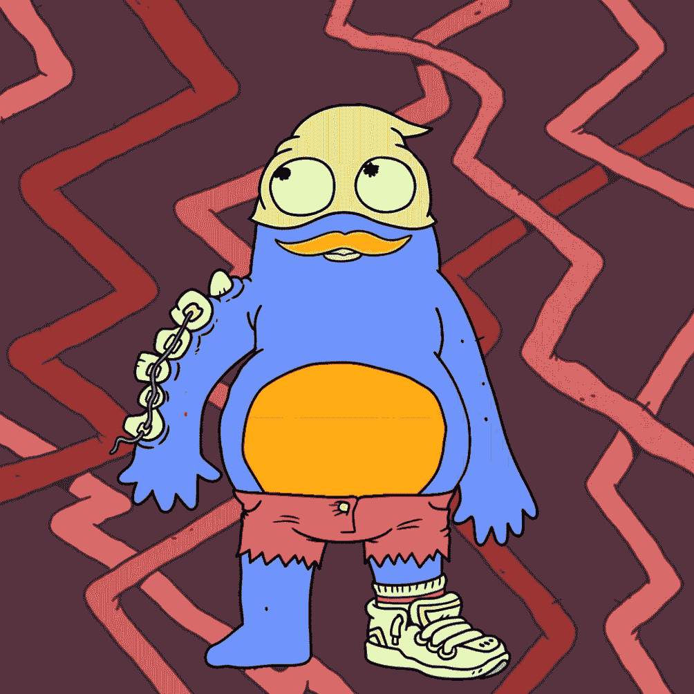
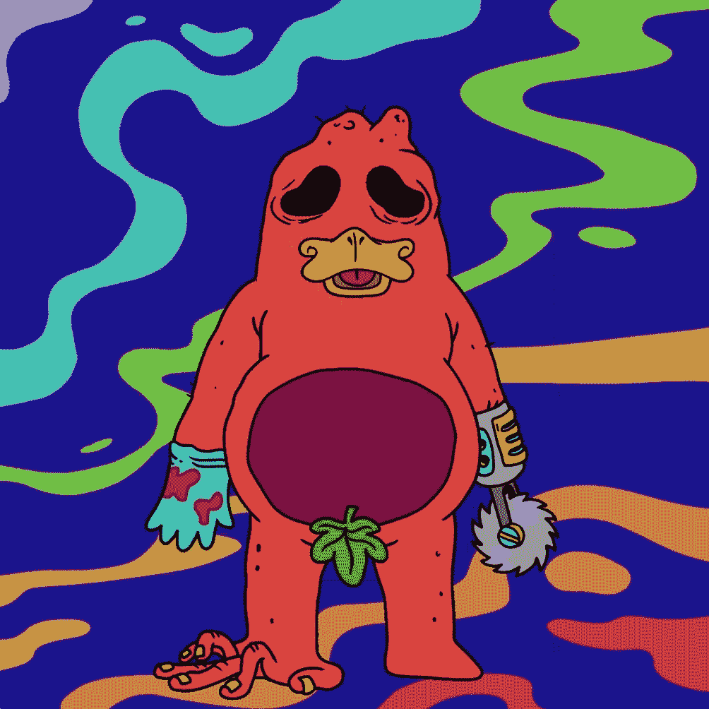
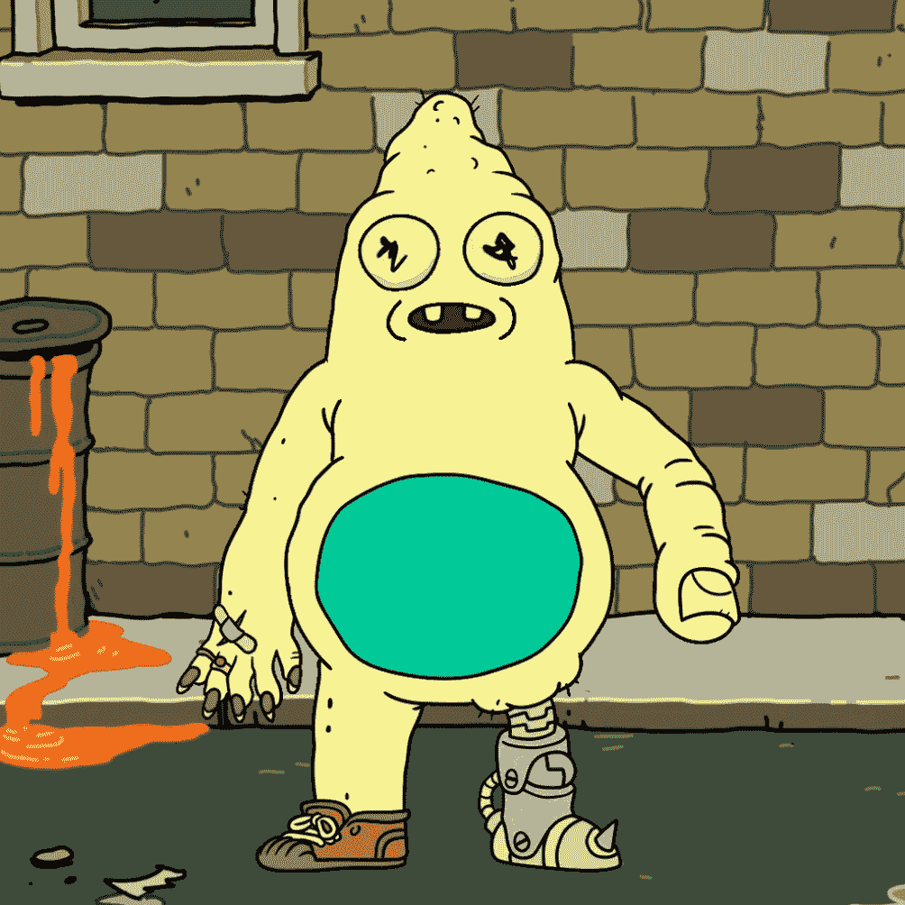
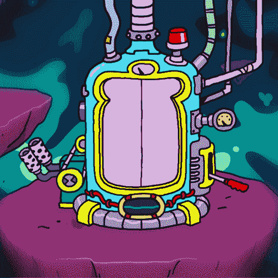
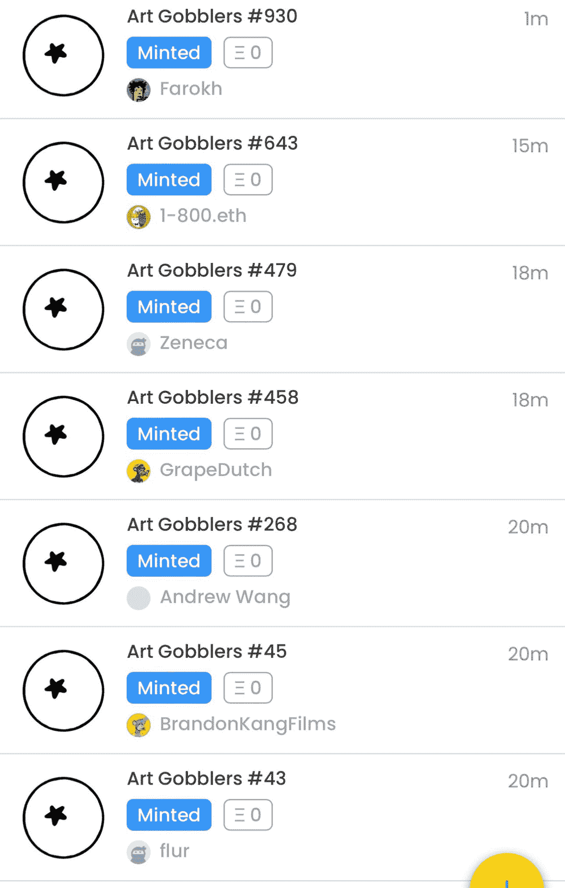
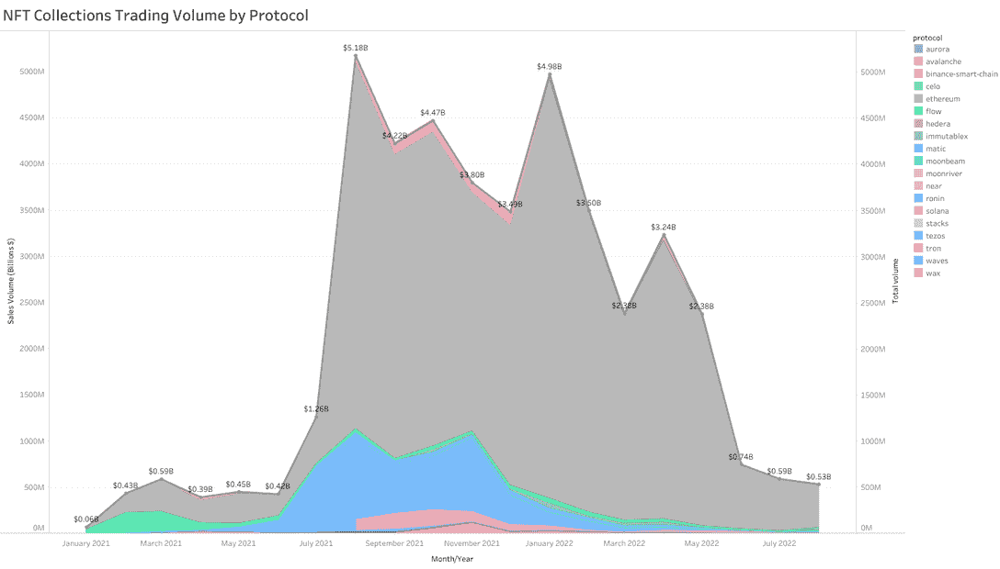

# 艺术饕餮一天创造 1235 万美元的销售额

> 原文：<https://web.archive.org/web/https://dappradar.com/blog/art-gobblers-generates-12-35m-in-sales-in-one-day>

## 这是一个新的蓝筹股集合还是 NFTs 终结的开始？

*于 11 月 2 日更新，展示已披露的作品*。

艺术火鸡是一个新的 NFT 项目，由 Rick 和 Morty 的创作者发起。免费造币活动在美国东部时间 10 月 31 日下午 4:20 举行。不到 24 小时后，未披露的 NFTs 现在的底价为 13.05 ETH，人们开始质疑 NFT 的游戏是否受到了操纵。

**亮点**

*   在免费薄荷之后的 24 小时内，Art Gobblers NFTs 的平均销售价格为 19760 美元。
*   拥有昂贵 NFT 藏品的有影响力的声音是艺术官员精心挑选的白名单的主要受益者。
*   ***DappRadar 数据显示，2022 年 10 月 NFT 累计销售额为 5.3 亿美元。这比 2021 年 9 月下降了约 90%。***
*   ***艺术饕餮艺术揭秘发生在世界协调时 11 月 1 日 21:00。***
*   ***前三名销售额接近 10 万美元。***

[Check Art Gobblers Sales](https://web.archive.org/web/20221130144655/https://dappradar.com/hub/nft-explorer/collection/art-gobblers)

## 自造币厂以来的前三大销量

自 11 月 1 日披露以来，买家和卖家继续以惊人而昂贵的价格交易艺术品。

我们列出了前三名最昂贵的艺术饕餮(到目前为止)和

### 艺术饕餮 9949——打喷嚏的人

[Art Gobbler 9949 – Sneezenschmunt Waffle-Gobbledank](https://web.archive.org/web/20221130144655/https://dappradar.com/hub/assets/eth/0x60bb1e2aa1c9acafb4d34f71585d7e959f387769/1261)

有人花了 21.5 英镑(当时是 33882.92 美元)买下了这只蓝色、橙色和黄绿色相间的火鸡。在到达目前的目的地之前，它经过了好几个钱包。

根据 OpenSea 的工具， [Art Gobbler 9949](https://web.archive.org/web/20221130144655/https://dappradar.com/hub/assets/eth/0x60bb1e2aa1c9acafb4d34f71585d7e959f387769/1261) 属于稀有 Gobbler 的前 5%。

### 艺术饕餮 6016–Schwant Skort

[Art Gobbler 6016 – Schwant Skor](https://web.archive.org/web/20221130144655/https://dappradar.com/hub/assets/eth/0x60bb1e2aa1c9acafb4d34f71585d7e959f387769/190)[t](https://web.archive.org/web/20221130144655/https://dappradar.com/hub/assets/eth/0x60bb1e2aa1c9acafb4d34f71585d7e959f387769/190)

一位狂热的粉丝花了 19.98 英镑(当时是 31，507.43 美元)买下了这只危险的、圆形锯手的橙红色火鸡。类似于上面的 NFT，它也通过一些钱包，人们已经为它支付了超过 32 ETH，累计。

同样与上图相似的是，[艺术饕餮 6016](https://web.archive.org/web/20221130144655/https://dappradar.com/hub/assets/eth/0x60bb1e2aa1c9acafb4d34f71585d7e959f387769/190) 是收藏中最稀有的前 5%

### 艺术饕餮 9160——gilf pinch Hoobiestank

[Art Gobbler 9160 – Gilfpinch Hoobiestank](https://web.archive.org/web/20221130144655/https://dappradar.com/hub/assets/eth/0x60bb1e2aa1c9acafb4d34f71585d7e959f387769/90)

11 月 1 日，就在艺术品展示之前，有人支付了 19.93 [ETH](https://web.archive.org/web/20221130144655/https://dappradar.com/hub/token/eth/ETH) (当时为 31，446.35 美元)[艺术饕餮 9160](https://web.archive.org/web/20221130144655/https://dappradar.com/hub/assets/eth/0x60bb1e2aa1c9acafb4d34f71585d7e959f387769/90) 。有一条机器腿，一只手的拇指和一双呆滞的眼睛，这可能是最昂贵的前三名中看起来最悲伤的一个。

艺术火鸡 9160 在 1560 只火鸡中排名第 419 位，位列前 30%。如果主人选择在展览结束后购买，他们不太可能会花这么多钱买一幅不是藏品中最稀有的 NFT 作品。

## 什么是艺术饕餮？

艺术饕餮是由贾斯汀·罗兰和范型创造的一个新的 NFT 项目。Roiland 是 Rick 和 Morty 的创始人，而 Paradigm 是一家加密和 Web3 投资公司。该团队早在 2022 年 2 月就聚集在一起，并于 10 月 31 日推出了他们的 NFT。

这个项目吸引了 NFT 社区的想象力有几个原因。首先，贾斯汀·罗兰在 Web3 爱好者中很受欢迎，是瑞克和莫蒂背后的声音和作者。

第二，项目背后的理念是创新的。用户可以去艺术饕餮网站，在一个名为“glamination”的过程中，创造自己的艺术，并将其作为 ERC-721 的象征。然后，Gobblers 可以“吞噬”最好的艺术品，并将其作为数字图像佩戴。艺术饕餮客实际上变成了移动的虚拟美术馆。

A pre-reveal Art Gobblers NFT

白名单上的地址可以免费造币，1700 个可用的火鸡在几分钟内就被认领了。300 个国家森林公园已经预留给项目的创建者。其余 8000 人将在 10 年内释放。

## 为什么人们质疑分配过程？

关于 NFTs 的法规很少，也没有规定谁可以启动项目，哪些用户可以从中受益。出于这个原因，艺术饕餮没有做错什么。但人们已经开始质疑谁上了白名单，以及他们是如何获得这个位置的。

Many NFT influencers were Art Gobblers

上面的图像显示了一些被空投艺术 Gobblers NFTs 的钱包。他们都是在 NFT 空间有影响力的名字，可能是因为他们的受欢迎程度而被列入白名单。下面是他们钱包的链接，这样你就可以看到他们还持有哪些昂贵的资产。

*   [法罗克](https://web.archive.org/web/20221130144655/https://dappradar.com/hub/wallet/eth/0xc5F59709974262c4AFacc5386287820bDBC7eB3A)
*   [捷利康 _33](https://web.archive.org/web/20221130144655/https://dappradar.com/hub/wallet/eth/0x886478D3cf9581B624CB35b5446693Fc8A58B787)
*   葡萄庄园(以 15.74 ETH 的价格出售)
*   [王晓康](https://web.archive.org/web/20221130144655/https://dappradar.com/hub/wallet/eth/0x3e25dac1092031116E2A7d59953dCEC2824A6C6A)
*   BrandonKangFilms (以 15 ETH 售出)
*   [flur](https://web.archive.org/web/20221130144655/https://dappradar.com/hub/wallet/eth/0xB32B4350C25141e779D392C1DBe857b62b60B4c9) (转移到另一个钱包)

由于昂贵的非功能性食物疗法的患者过早和廉价获得更昂贵的非功能性食物疗法被认为是不公平的，不满情绪在 Web3 Twitter 上出现。但是没有规则规定谁可以获得 NFT 奖。任何人都没有权利自动得到一个。

艺术饕餮并不是第一个利用大声音的影响力来营销他们的 NFT 的项目，也绝对不会是最后一个。人们称分配过程不公平，但如果他们以接近 0 美元的价格得到了价值 2 万美元的 NFT 艺术品，有多少人会说同样的话？

## 艺术饕餮者和 NFT 产业的下一步是什么？

一位推特用户提出了一个有趣的观点，即这些策略将如何影响 NFT 文化。Pons Asinorum 表示，没有发生任何错误，也没有违反任何法律。但是，当边缘内幕交易和操纵赠品成为常态时，人们还会继续玩 NFT 游戏多久呢？

> 最后一条推文(我希望是)在 Art Gobblers 上
> 
> 这张图片在 NFT 推特上满天飞
> 
> 我不是在指责任何人不正当
> 
> 但是很多人(包括我)认为 NFT 游戏被操纵
> 
> 人们不会继续玩他们认为被操纵的游戏。预计会有更多的人退出 pic.twitter.com/LSIpZHCKIe
> 
> — Pons Asinorum (@Pons_ETH) [October 31, 2022](https://web.archive.org/web/20221130144655/https://twitter.com/Pons_ETH/status/1587220436986855426?ref_src=twsrc%5Etfw)

Source: Twitter

我们可以看到数以百万计的人正在远离非功能性测试。这张来自 DappRadar 的图表显示了市场自 2021 年 9 月至 10 月的峰值以来下跌了多少。就在一年前，所有区块链协议的总销售额超过 50 亿美元。上个月，总销售额为 5.3 亿美元。

Source: [DappRadar](https://web.archive.org/web/20221130144655/https://dappradar.com/nft)

人们在非食物疗法上的花费比 2021 年末少有很多原因。我们知道，更广泛的全球经济的系统性变化意味着用户购买数字资产的自由现金减少。但是 Pons Asinorum 是正确的，他们说，如果游戏持续地、有目的地操纵 NFTs，社区将脱离 NFTs。

大型艺术品展览将在接下来的几个小时内举行，DappRadar 将在明天报告这将如何影响该系列。

[Find Art Gobblers in NFT Rankings](https://web.archive.org/web/20221130144655/https://dappradar.com/nft/collections)

## 随身携带您的 Web3 之旅

使用 DappRadar 移动应用程序，再也不会错过 Web3。查看最受欢迎的 dapps 的性能，并关注您投资组合中的 NFT。您在 DappRadar 上的帐户会与我们的移动应用程序同步，这样您很快就可以选择实时接收提醒。

[Download the DappRadar app now](https://web.archive.org/web/20221130144655/https://dappradar.app.link/blog)[<picture></picture>](https://web.archive.org/web/20221130144655/https://play.google.com/store/apps/details?id=com.portfolio.dappradar)