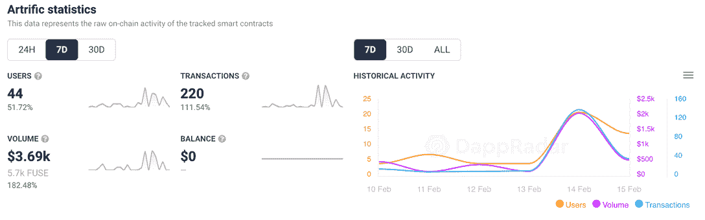
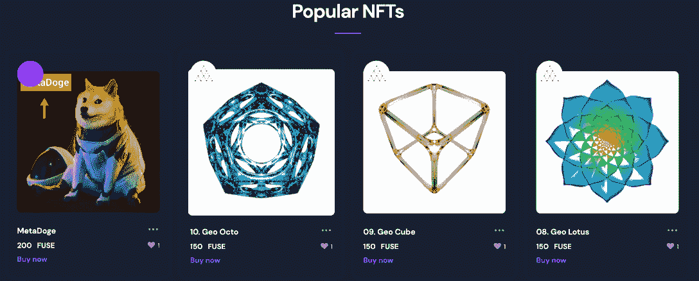
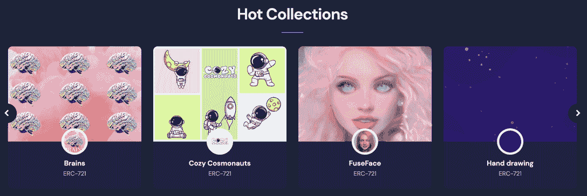
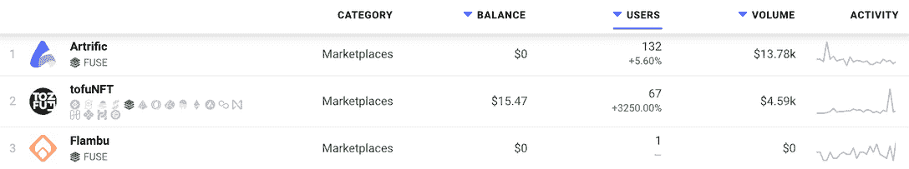
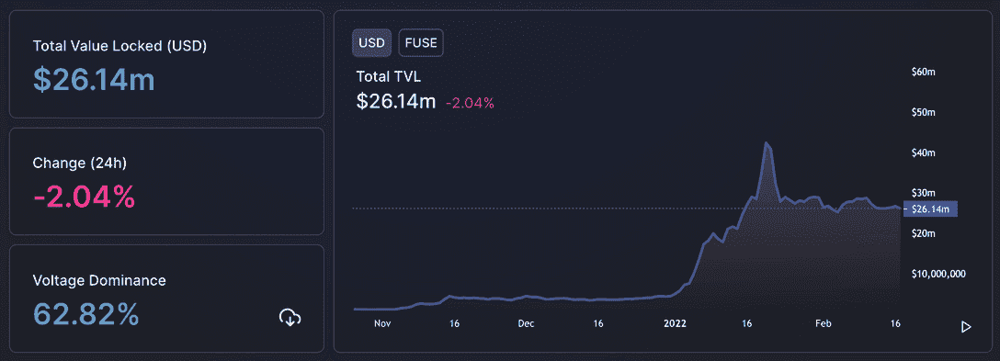
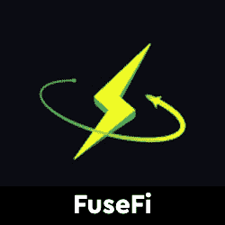

# 巧妙的 nft 市场在融合网络上取得进展

> 原文：<https://web.archive.org/web/https://dappradar.com/blog/artrific-nft-marketplace-gains-ground-on-fuse-network>

## 融合网络策略的先发优势

随着连接到该平台的钱包数量激增超过 50 %, NFT 市场 Artrific 本周受到了关注。该平台目前仅支持 FUSE token 交易，允许用户导入基于以太坊的 NFT 或创建新的 NFT，更多功能即将推出。

Artrific 在 NFT 市场上有各种各样的数字资产，用户可以免费注册和浏览。它还通过提供易于使用的 NFT 铸造过程来支持创作者，其成本比在[以太坊数码商品市场](https://web.archive.org/web/20230118054228/https://dappradar.com/nft/protocol/ethereum)更低。

## 越来越流行的技巧

虽然与更成熟的市场相比，连接到该平台的钱包数量仍然很少，但表现显示出稳定的增长。这表明 Fuse 上的 NFT 开始引起他们社区的注意。连接到 Artrific 的钱包[增长了近 52%，这使得交易数量增长了 100%以上，产生了 3690 美元的交易量。](https://web.archive.org/web/20230118054228/https://dappradar.com/fuse/marketplaces/artrific)

除了在超过 17 个区块链经营服务的多链 [NFT 市场 TofuNFT](https://web.archive.org/web/20230118054228/https://dappradar.com/fuse/marketplaces/tofunft) 之外，Artrific 是 Fuse 上领先的 NFT 本地市场。该平台是为扩张而建立的，已经将市场分为艺术、交易卡、音乐、体育等等。看看卖的是什么，我们看到价格在 150 FUSE 左右或 99 美元的热门商品。

看看热门系列，有趣的是，其中一些是 Fuse 原创，似乎在 Fuse 社区中找到了一些爱。我们在 Tezos 和 [Solana](/web/20230118054228/https://dappradar.com/blog/solana-nft-marketplaces-get-a-lift-as-sol-price-slides/) 看到了一种趋势，即以太坊的汽油费继续达到 50 美元左右的峰值，区块链和 NFT 的爱好者拓宽了他们的视野。

## 发现融合网络上的 dapps

DappRadar 在 Fuse Network 上追踪了[两个 NFT 市场，Artrific 领先一步。如上所述，每周连接的钱包数量相对较少，但对于羽翼未丰的 NFT 市场而言，仍是一个积极的增长信号。以太坊之外的网络上的 NFT 开始受到更多关注，因为投资者在生命周期开始时寻找价格较低的项目，而不是像 BAYC 或 CryptoPunks 这样的高端蓝筹股集合。](https://web.archive.org/web/20230118054228/https://dappradar.com/rankings/protocol/fuse/category/marketplaces)

Last 30 Days

Flambu 是一个有趣的项目,它不是一个 NFT 市场，尽管它在 DappRadar 上把自己列为一个市场。Flambu 是一个现实世界的市场，支持任何东西的点对点租赁，利用区块链技术实现分散的信任和快速、低成本的支付。

除此之外，dapp 项目如 [GoodDollar](https://web.archive.org/web/20230118054228/https://dappradar.com/rankings/protocol/fuse) 和 Voltage 在 Fuse 上表现突出。 [Voltage，正式名称 Fuse.fi，](https://web.archive.org/web/20230118054228/https://dappradar.com/fuse/defi/voltage)为用户提供类似 Uniswap 等 dapps 的令牌交换功能。让他们交换 Fuse 网络上可用的令牌。 [GoodDollar 是一个数字通用基本收入](https://web.archive.org/web/20230118054228/https://dappradar.com/fuse/defi/gooddollar) (UBI)项目，在每日活跃用户数量方面一直名列前十。它利用 DeFi 创建了一个免费的数字货币流，最需要的人可以认领。

保险丝中锁定的[总价值的 60%以上是由电压造成的，该价值在 2022 年有了令人印象深刻的增长——从 2021 年 12 月 31 日的 430 万美元攀升至今天的 2610 万美元。尽管如此，还是有办法赶上竞争对手的连锁店并进入](https://web.archive.org/web/20230118054228/https://defillama.com/chain/Fuse)[50 强](https://web.archive.org/web/20230118054228/https://defillama.com/chains)，但是 Fuse dapps 似乎正在将网络推向正确的方向。

[<picture></picture>](https://web.archive.org/web/20230118054228/https://dappradar.com/fuse/defi/fusefi)[<picture></picture>](https://web.archive.org/web/20230118054228/https://dappradar.com/fuse/defi/gooddollar)[<picture></picture>](https://web.archive.org/web/20230118054228/https://dappradar.com/fuse/marketplaces/tofunft)

***以上不构成投资建议。此处给出的信息仅供参考。请行使尽职调查，做你的研究。作者持有 ETH、BTC、AGIX、HEX、LINK、GRT、CRO、OMI、不可变 X、GALA、AVASTR、GMEE、CUBE、RADAR、FLOW、FTM、BNB、SPS、WRLD、ATOM 和 ADA。***