# 评估 FTX 危机对 Dapp 行业的影响

> 原文：<https://web.archive.org/web/https://dappradar.com/blog/assessing-the-impact-of-ftx-meltdown-in-the-dapp-industry>

## 尽管 FTX 崩溃，游戏 dapps 似乎免疫，在过去两周超过 80 万 dUAW。

FTX 交易所及其所有附属实体的意外崩溃给加密货币市场、Web3 和 dapp 行业带来了冲击波。从正常运营到破产欺诈调查只用了不到一周的时间！这一事件对整个 Web3 行业产生了影响。

一度价值 320 亿美元的 FTX 及其相关硬币的迅速衰落震惊了 Web3 行业。

在 2022 年 11 月不到一周的时间里，FTX 交易所平台经历了关于缺乏资金的猜测，银行挤兑他们的储存资产，冻结提款，币安的预期收购提议(很快被撤回)，美国证券交易委员会的调查，交易所大量代币的可疑转移，黑客以及 FTX 和所有关联方的全球破产声明。

这个故事还没有结束。然而，它已经对市场产生了重大影响。并且很可能是当前加密货币市场价格下跌的主要驱动力。加密货币用户担心一连串的破产浪潮，促使交易所核实他们保留了足够的流动资产来偿还客户存款。尽管如此，由于用户预计会出现一连串的破产，一些交易所还是出现了巨额现金外流。

尽管发生了这一事件，但在过去两周，Web3 行业似乎恢复了活力。虽然活跃度下降了 11.67%，但仍然达到了平均 190 万个[日活跃钱包(UAW)](https://web.archive.org/web/20221216223724/https://dappradar.com/blog/dappradar-tracks-unique-active-wallets-but-what-does-that-mean) 和超过 2500 万笔交易。DeFi UAW 在 11 月 9 日和 10 日达到高峰，这两天都达到了大约 50 万 UAW；DeFi 活动现在恢复到上个月的水平(40 万 dUAW)。游戏玩家似乎对 FTX 的崩溃免疫，过去两周有 814，305 dUAW。

DeFi 项目锁定的总价值下降了 20.60 %，至 650 亿美元。索拉纳区块链在 TVL 经历了最大的下降，从 16.5 亿美元下降到 5.85 亿美元，占美元的 64.66%，但在索尔只有 18%。

[Dapps associated with FTX](https://web.archive.org/web/20221216223724/https://docs.google.com/spreadsheets/d/1JkZzlQtOVaX7r_ipX0o765JMSw_1HFtwvYnmCNabob8/edit#gid=0)

NFT 市场远未死亡，其目前的放缓是由于社会经济因素，而不是兴趣的下降。NFT 销量仅下降 24.50%，NFT 交易量下降 68.60%。平均而言，NFT 每日交易量为 1194 万美元，每日销售计数为 93925。

在下面的报道中，我们将分析 FTX 崩溃对 dapp 行业的影响。

# 关键要点

*   11 月 8 日，FTX 和阿拉米达的研究钱包分别有 17 亿美元和 1.773 亿美元。截至发稿时，这两个钱包的净值分别减少了 94%和 69%。
*   DeFi UAW 在 11 月 9 日和 10 日达到高峰，这两天几乎达到 50 万 UAW；DeFi 活动现在回到了上个月的水平(40 万 dUAW)。
*   EOS、Hive、Wax、Ronin 和 IMX 等游戏公司和游戏连锁店似乎基本上没有受到 FTX 危机的影响；UAW 博彩在 11 月 10 日达到顶峰，有近 90 万 UAW。
*   自 11 月 1 日以来，TVL 赤字已下降 20.60%，从 830 亿美元降至 650 亿美元。
*   自 10 月 31 日以来，Solana 的 dUAW 下降了 6.53% (46K)，交易数下降了 10.42%(150 万)；其活动在 11 月 8 日以 65K UAW 达到高峰。索拉纳在 TVL 下跌了 18%，在 TVL 下跌了 66%。
*   自 11 月 1 日以来，索拉纳的 NFT 交易量增加了 380%，NFT 交易量增加了 396%。DeGods 的 SOL 底价下降了 24.01%，USD 下降了 69.11%；此外，上市的非森林交易数量增加了 58.04%。
*   在 11 月 13 日 Crypto.com 可能破产的传言之后，Cronos 的活动已经达到 15，000 dUAW 和 25，000 交易计数。其 TVL 以美元计算下降了 19%，但在 CRO 却上升了 45%。
*   11 月 1 日以来 NFT 整体交易量下降 68.60%，成交笔数下降 24.50%。蓝筹股系列保持了它们的价值，因为它们的 ETH 值平均下降了 9.78%，美元值平均下降了 30%。

# 内容

*   [尽管发生了 FTX 事件，dapp 行业仍保持强劲势头——过去 7 天连接了 192 万 dUAW】](https://web.archive.org/web/20221216223724/https://dappradar.com/blog/assessing-the-impact-of-ftx-meltdown-in-the-dapp-industry/#The-dapp-industry-keeps-going-strong-despite-the-FTX-drama---1.92M-dUAW-connected-in-the-last-7-days)
*   [分散金融对我们行业的未来至关重要](https://web.archive.org/web/20221216223724/https://dappradar.com/blog/assessing-the-impact-of-ftx-meltdown-in-the-dapp-industry/#Decentralized-finance-is-essential-for-the-future-of-our-industry)
*   [人们对 NFT 收藏品的兴趣仍然很高](https://web.archive.org/web/20221216223724/https://dappradar.com/blog/assessing-the-impact-of-ftx-meltdown-in-the-dapp-industry/#The-appetite-for-NFT-Collections-is-still-high)
*   [在过去两周内，游戏再次证明了他们的韧性，814K dUAW】](https://web.archive.org/web/20221216223724/https://dappradar.com/blog/assessing-the-impact-of-ftx-meltdown-in-the-dapp-industry/#Games-are-proving-once-again-their-resilience-with-814K-dUAW-over-the-past-two-weeks)
*   [FTX 和阿拉米达钱包在 stablecoins 中的余额比例分别为 72.9%和 84.8%](https://web.archive.org/web/20221216223724/https://dappradar.com/blog/assessing-the-impact-of-ftx-meltdown-in-the-dapp-industry/#FTX-and-Alameda-wallets-have-72.9%-and-84.8%,-respectively,-of-their-balances-in-stablecoins)
*   [结束语](https://web.archive.org/web/20221216223724/https://dappradar.com/blog/assessing-the-impact-of-ftx-meltdown-in-the-dapp-industry/#Closing-words)

## 尽管发生了 FTX 事件，dapp 行业仍保持强劲势头——过去 7 天连接了 192 万 dUAW

自 10 月 31 日以来，行业内唯一活跃钱包(UAW)减少 11.67%，11 月份平均达到 190 万 dUAW。相比之下，交易总数仅下降 0.28% (26M)。

DeFi UAW 在 11 月 9 日和 10 日达到高峰，这两天达到近 500，000 UAW，但 DeFi 活动现在回到了前一个月的水平(400，400K dUAW)。FTX 的崩溃似乎对游戏玩家没有什么影响，因为 UAW 在 11 月 10 日达到峰值，有近 90 万 UAW。

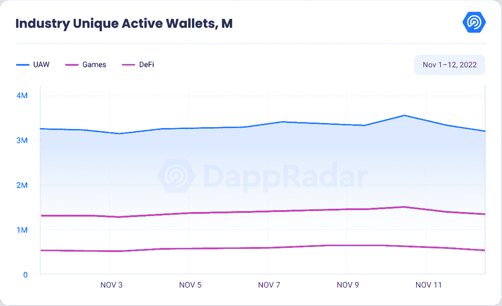

博彩连锁店 [EOS](https://web.archive.org/web/20221216223724/https://dappradar.com/rankings/protocol/eos) 、[蜂巢](https://web.archive.org/web/20221216223724/https://dappradar.com/rankings/protocol/hive)、 [Wax](https://web.archive.org/web/20221216223724/https://dappradar.com/rankings/protocol/wax) 、[浪人](https://web.archive.org/web/20221216223724/https://dappradar.com/rankings/protocol/ronin)、 [IMX](https://web.archive.org/web/20221216223724/https://dappradar.com/rankings/protocol/immutablex) 的活动没有出现明显波动。

过去两周，Arbitrum 的活动增加了 26.36%，平均达到 24，443 dUAW。 [Polygon](https://web.archive.org/web/20221216223724/https://dappradar.com/rankings/protocol/polygon) ，在同一时间段内，其活动增加了 7.11%，平均为 148，752 dUAW。

查看过去两周的交易计数，我们注意到，Arbitrum 的交易计数增加了 22.84% (35K)，Hedera 的交易计数增加了 38.96% (900K)，Hive 增加了 33.78%(210 万)，Polygon 增加了 17.91% (623K)，T2 的交易计数增加了 6.60% (90K)，T4 的交易计数增加了 17.89% (35K)。

相比之下，[以太坊](https://web.archive.org/web/20221216223724/https://dappradar.com/rankings/protocol/ethereum)仍保持之前的下降趋势。在这两周内，独立活跃钱包的数量下降了 51.65%，以太坊现在的日均 UAW 为 71，075。除了以太坊，[流](https://web.archive.org/web/20221216223724/https://dappradar.com/rankings/protocol/flow)和 [BNB 链](https://web.archive.org/web/20221216223724/https://dappradar.com/rankings/protocol/binance-smart-chain)减少了他们的 UAW 数。流量下降了 17.24%，目前日均 UAW 为 36，859，而 BNB 链家下降了 24.72%，日均 UAW 为 636，857。

## 分散融资对我们行业的未来至关重要

锁定的总价值(TVL)量化由 DeFi 协议锁定的所有资产的总价值。随着 TVL 上涨，更多的硬币被存入 DeFi 协议，表明看涨情绪，而 TVL 下跌表明投资者正在从生态系统中撤出资金。

自 11 月 1 日以来，DeFi 平台锁定的总价值下降了 20.60%，从 830 亿美元降至 650 亿美元。

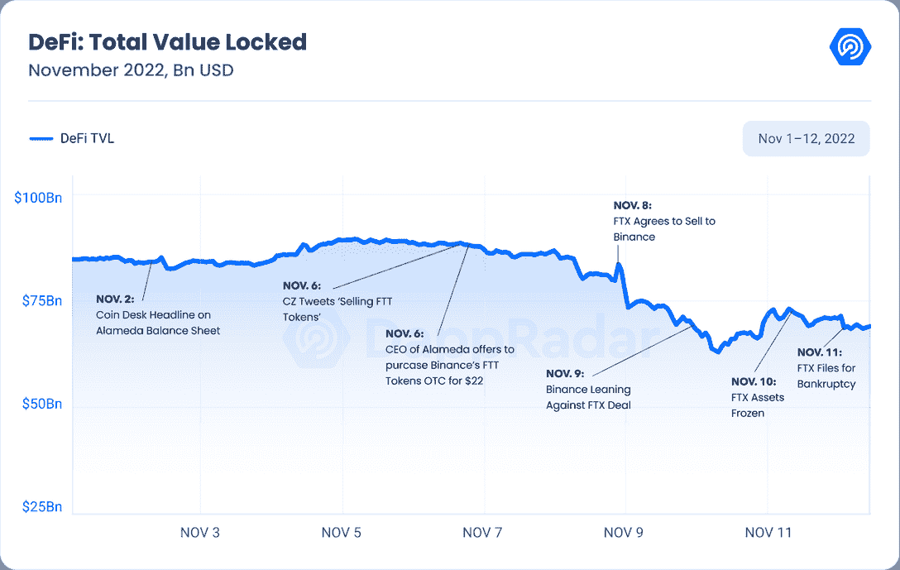

领先的区块链以太坊在 TVL 的市值从 11 月 1 日的 510 亿美元下降到 11 月 13 日的 410 亿美元，相当于下降了 14%。在最大的以太坊液体赌注服务提供商 Lido 上，ETH 赌注收益率增长了 10.16%以上，创下历史最高纪录。斯泰斯失去了与乙醚挂钩的地位，目前为 0.9883。

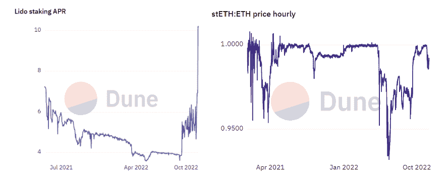

source: [Dune Analytics](https://web.archive.org/web/20221216223724/https://dune.com/LidoAnalytical/Lido-Finance-Extended)

此外，BNB 的 TVL 也下跌了 14%，至 73 亿美元。Tron 的 TVL 从 61 亿美元降至 46 亿美元，降幅为 25.05%。在相同的趋势下，雪崩、多边形和 Arbitrum 的 TVL 分别下降了 25.06%、8.76%和 10.26%。

11 月 13 日，在 Crypto.com 可能破产的传言之后， [Cronos](https://web.archive.org/web/20221216223724/https://dappradar.com/rankings/protocol/cronos) 的交易量达到 15，000 dUAW 和 25，000 笔交易。过去两周，其 TVL 以美元计下跌了 19%，但在 CRO 却上涨了 45%。

区块链经历了 TVL 最大的损失。从 16.5 亿美元到 5.85 亿美元，换算成美元下降了 64.66%，但以 SOL 衡量仅下降了 18%。

![Total_Value_Locked_of_the_Top_Protocols[1]](img/1e3dd0643a611a4d6ef86653f7c8c75c.png)

在 Solana 的顶级 DeFi 项目中，贷款平台 [Solend](https://web.archive.org/web/20221216223724/https://dappradar.com/solana/defi/solend) 在过去两周内损失了 87%的 TVL，目前约有 6000 万美元被锁定在协议中，而 11 月 1 日为 4.56 亿美元。

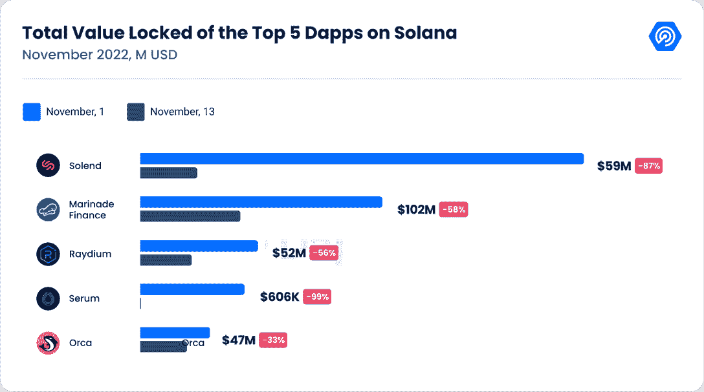

[Marinade Finance](https://web.archive.org/web/20221216223724/https://dappradar.com/solana/defi/marinade-finance) 失去了其 TVL 58.79%的股份，目前拥有 1.02 亿美元，成为索拉纳最大的 DeFi 项目。分散交易所 [Raydium](https://web.archive.org/web/20221216223724/https://dappradar.com/solana/defi/raydium) 、 [Serum](https://web.archive.org/web/20221216223724/https://dappradar.com/solana/defi/serum) 和 [Orca](https://web.archive.org/web/20221216223724/https://dappradar.com/solana/defi/orca) 在过去两周内分别损失了 56.71%、99.44%和 33.33%的 TVL。

血清的下降是艰难的，因为它是索拉纳 DeFi 基础设施的基石；它是交易生态系统的主要中央限价指令簿，是 DeFi 交易所流行的“自动做市商”配置的更有效替代方案。在 Jump 和 Alameda 等大型做市商的帮助下，该公司今年的交易额超过了 320 亿美元。

与竞争对手相比，SOL 的 token SOL 也大幅下跌，过去两周的价格下跌了 59.36%，至 13.25 美元。

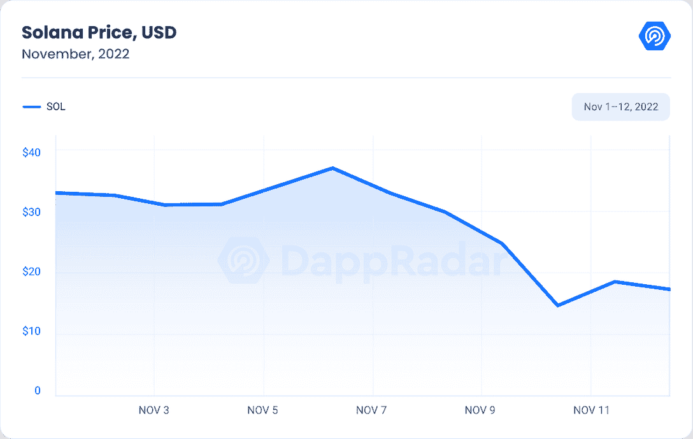

在币安可能最终收购 FTX 的消息传出后，该股票曾短暂上涨，但在币安退出交易后下跌，理由是消费者基金被不当处理以及监管机构的调查。

尽管 SOL 最近面临挑战，Solana Labs 的联合创始人阿纳托利·亚科文科在推特上重申了他对该网络的乐观立场，尽管最近有所损失。

如果你想了解更多关于 FTX 对 DeFi dapps 的影响，请阅读这篇[文章](https://web.archive.org/web/20221216223724/https://dappradar.com/blog/defi-heats-up-as-ftx-melts-down)。

## 人们对 NFT 收藏品的兴趣仍然很高

NFT 市场远未死亡，其目前交易量的下降是由于社会经济因素，而不是收藏家兴趣的下降，因为这两周的销售数量仅下降了 24.50%。

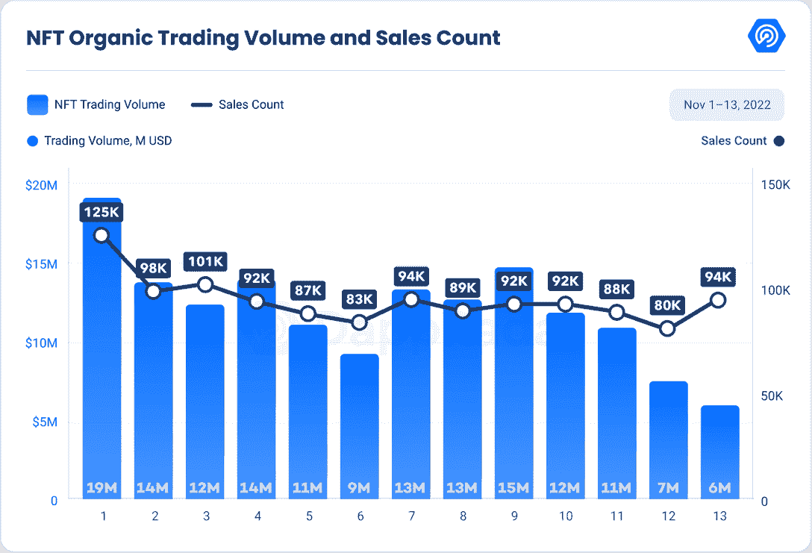

观察 11 月 1 日以来的数据，我们看到大多数连锁店的 NFT 交易量都有所下降。以太坊的每日 NFT 交易量从 1700 万美元降至 440 万美元，降幅达 73.75%。随后，Flow 在本月初的 NFT 日交易量为 307，830 美元，到 11 月 13 日，该交易量下降了 67%，至 101，375 美元。在与 Flow 相同的时间框架内，Polygon 的 NFT 日交易量为 235，794 美元，但此后降至 114，465 美元。

Ronin 和 Wax 这两家知名的游戏内 NFT 区块链似乎没有经历 NFT 交易量的大幅波动。月初以来，WAX 上涨 71.29%，Ronin 下跌 7.66%。

自 11 月 1 日以来，索拉纳的 NFT 交易量增加了 380%，NFT 交易量增加了 396%。值得注意的是，自 11 月 1 日以来，领先的 NFT 藏品 [DeGods](https://web.archive.org/web/20221216223724/https://dappradar.com/solana/collectibles/degods) 的底价在索尔下跌了 24.01%，在美元下跌了 69.11%。此外，列入清单的非森林交易数量增加了 58.04%。

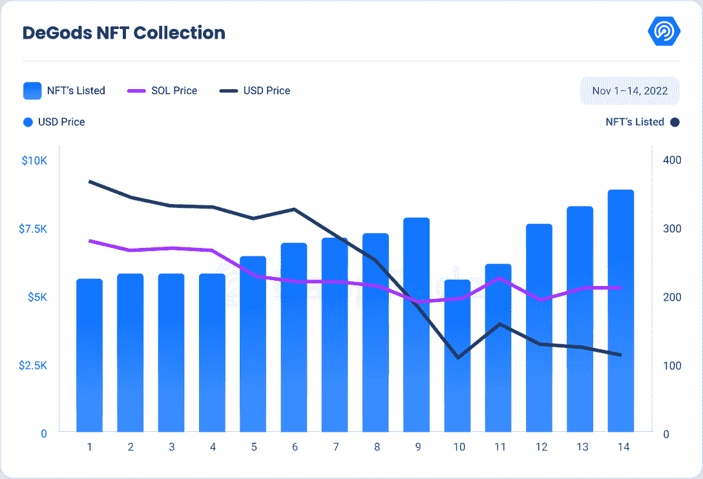

由于宇迦实验室的收藏品主导了 NFT 市场，我们想看看泰拉和 FTX 崩溃的影响之间是否有任何关联。我们考虑了 5 月 1 日和 5 月 14 日，11 月 1 日和 11 月 14 日的价格。

正如我们在下表中看到的，Terra 的崩溃对蓝筹股集合的影响大于 FTX。从数据来看，平均而言，后地球时代的藏品底价下降了 18.24%，后 FTX 时代仅下降了 15%。在同样的趋势下，美元在 Terra 之后平均下跌了 41.99%，而在 FTX 之后仅下跌了 33.60%。

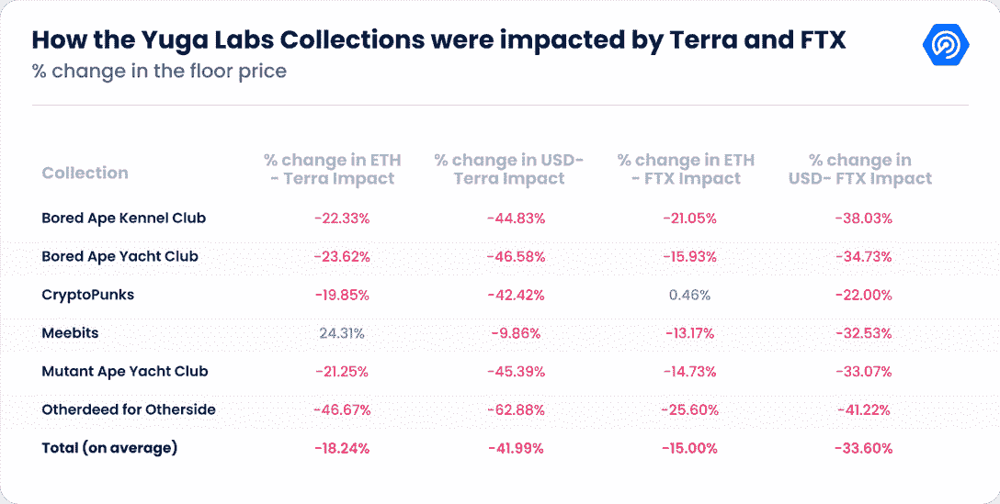

值得注意的是，尽管市场形势严峻，宇迦实验室仍在不断建设，11 月 14 日，他们宣布收购 NFT 初创公司 WENEW 和他们的 10KTF Web3 时尚品牌，该品牌由著名艺术家 Mike“Beeple”winkel Mann 共同创立。

WENEW 的联合创始人兼首席执行官迈克尔·菲格(Michael Figge)将担任新的首席内容官。Beeple 因在 2021 年 3 月的拍卖会上以 6930 万美元的价格出售一件 NFT 艺术品而闻名，他将担任宇迦实验室的顾问。

在此期间，许多 NFT 藏品价格暴跌。但这在很大程度上与相关区块链代币的贬值有关。

## 过去两周，游戏以 814K 的 dUAW 再次证明了它们的弹性

FTX 的崩溃似乎没有影响到区块链博彩业。平均而言，在这两周内，每天有 814，305 个独立活动钱包，11 月 10 日，该数字达到峰值，接近 90 万个。

自上个月以来，由于 DeFi 活动的增加，该部门活动的主导地位有所下降，目前为 41.95%。

FTX 的崩溃对索拉纳区块链博彩项目产生了巨大的影响，许多与博彩相关的代币价值下降。受到影响的一些最受欢迎的游戏包括 [Aurory](https://web.archive.org/web/20221216223724/https://dappradar.com/solana/games/aurory) 、 [TapFantasy](https://web.archive.org/web/20221216223724/https://dappradar.com/multichain/games/tap-fantasy) 、 [Star Atlas](https://web.archive.org/web/20221216223724/https://dappradar.com/solana/games/star-atlas) 和迷你皇室国度。

[Solana Games Rankings over the past 30 days](https://web.archive.org/web/20221216223724/https://dappradar.com/rankings/protocol/solana/category/games)

如果你想更深入地了解游戏行业是如何受到影响的，请阅读本文。

## FTX 和阿拉米达钱包的稳定硬币余额分别为 72.9%和 84.8%

根据沙丘分析公司(Dune Analytics)的数据，截至 11 月 8 日，FTX 和阿拉米达研究公司的钱包分别有 17.5 亿美元和 1.773 亿美元。11 月 14 日，两个钱包的净值都有明显减少，分别下降了 94%和 69%。

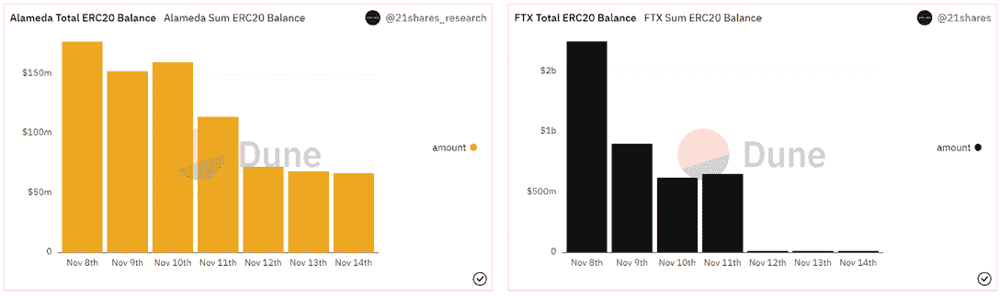

Source: [Dune Analytics](https://web.archive.org/web/20221216223724/https://dune.com/21shares_research/alameda-and-ftx-tracker)

11 月 14 日，FTX 钱包的总余额为 1.001 亿美元代币，其中 72.9%为稳定币，27.1%为替代币。FTX 的钱包里似乎没有 NFT 的资产。

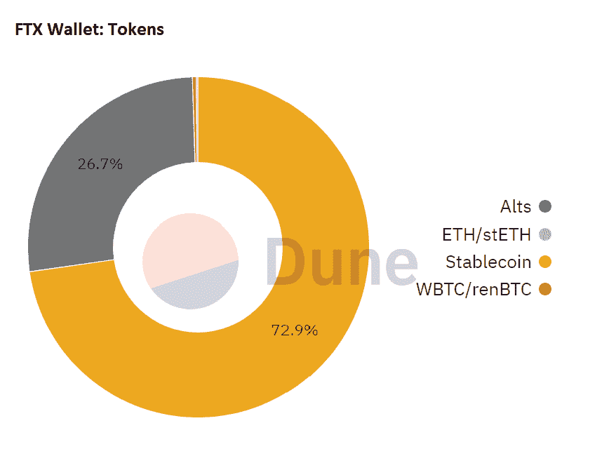

Source: [Dune Analytics](https://web.archive.org/web/20221216223724/https://dune.com/21shares_research/alameda-and-ftx-tracker)

在阿拉米达研究钱包中，共有价值 5490 万美元的代币，其中 84.8%为 stablecoins，15.2%为 altcoins。在他们持有的不可替代代币中，76.5%在沙盒土地上，15.5%在 MAYC，5.9%在其他契约上，1.16%在 MFER 上。值得注意的是，这 81 块沙盒土地仅占土地总供应量的 0.04%。

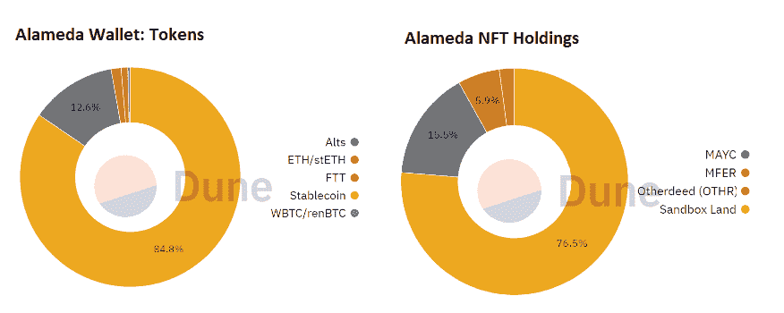

Source: [Dune Analytics](https://web.archive.org/web/20221216223724/https://dune.com/21shares_research/alameda-and-ftx-tracker)

## 结束语

与投资者和储户的资金得到保险的传统金融机构和交易所相比，加密交易所的风险要高得多。由于加密货币的性质，交易所用户必须转移其持有的所有权才能进行交易(这意味着他们不再是储户，而是债权人)。

因此，密码交易员应该避免将他们的资产存放在中央交易所。由于加密货币的波动性，如果加密货币的价格大幅下跌，投资者可能无法清算他们在交易所的持股。这可能会使消费者难以检索他们的加密资产。

[Difference between DEX and CEX](https://web.archive.org/web/20221216223724/https://dappradar.com/blog/dex-vs-cex-which-is-right-for-you)

尽管如此，还是有一些积极的消息与 FTX 的垮台有关:认识到加密货币可能不是新手投资者的“金蛋”是一个积极的市场趋势。在市场微观结构中，这些投资者被称为“非理性交易者”，他们通常被拥有更多知识的交易者所利用。

过去，非理性交易者过度影响了定价，这对有效市场的运行是不利的。一旦它们不再存在，市场将反映加密资产的真实价值。

最突出的加密货币比特币缺乏商业模式；因此，其价格(和价值)是主观的，并不断由供求关系决定。然而，其余的(包括乙醚、腰果和茄胺)应被视为实用代币，而不是硬币。在这个意义上，它们允许分散金融(DeFi)交易，赋予不可替代代币(NFT)价值，并最终作为未来元宇宙服务的货币。

好消息是，这些代币可以被视为价值创造者，而不是传统意义上的硬币。举一个有用的例子，我们目前的处境与 2001 年互联网泡沫破裂后的情况相似，当时真正的基于互联网的商业模式终于出现了。

尽管 FTX 失败了，但区块链技术依然强劲，并且是改变我们金融体系和经济的其他创新项目的基础。该技术没有退缩，继续提供服务，并允许每个用户发送和接收资产。

这项技术有许多潜在用途，包括数字资产在金融市场的应用，碳排放定价的区块链解决方案，以及破坏传统互联网平台的公用事业令牌。