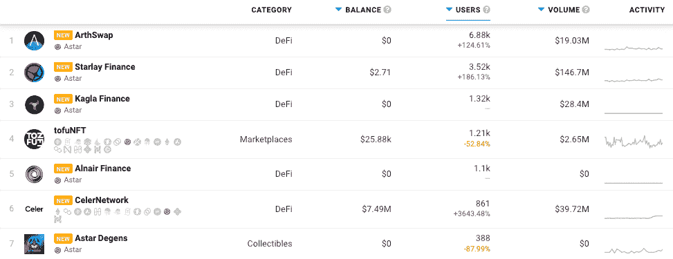
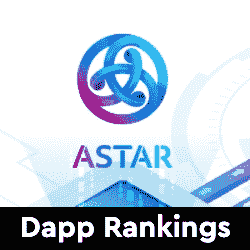
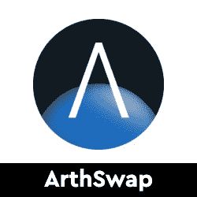
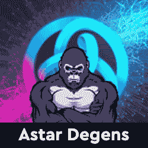

# Astar 网络 Dapps 现在在 DappRadar 上跟踪

> 原文：<https://web.archive.org/web/https://dappradar.com/blog/astar-network-dapps-now-tracked-on-dappradar>

## 支持多台区块链和虚拟机的智能合约平台

DappRadar 很高兴宣布 Astar 网络及其 dapps 生态系统的整合。DappRadar 的 100 万月度网站访问者现在可以通过 Astar dapp 排名分析哪些 dapp 吸引了最多的交易量、独特的用户钱包或处理了最多的交易。这样，每个人都可以了解哪些 dapps 和令牌在 Astar 网络上建立了稳固的社区和价值。

Astar Network 是波尔卡多特上 WASM 和 EVM 的智能合同中心。自 2022 年 1 月赢得 Parachain 拍卖以来，Astar Network 已成为 Polkadot 生态系统中领先的 Parachain。它的总锁定价值(TVL)超过 10 亿美元，同时也是转让价值超过 1.8 亿美元的以太坊资产最多的。Astar 网络将波尔卡多特生态系统连接到以太坊、宇宙和主要的第一层区块链。

更重要的是， [Astar 网络支持使用多个虚拟机的 dapps](https://web.archive.org/web/20221127145000/https://dappradar.com/rankings/protocol/astar)—即 WASM 和 EVM。此外，区块链生态系统为 Web3 开发者提供技术解决方案和财务激励，以构建安全、可扩展和可互操作的区块链。

## Astar DappRadar 排名

在发布时，DappRadar 将[跟踪 Astar Network](https://web.archive.org/web/20221127145000/https://dappradar.com/rankings/protocol/astar) 上的 12 个 dapp，涵盖几个类别，包括 DeFi 和交易所、NFT 收藏、市场和游戏，随着生态系统的扩展，未来将会有更多的 dapp。[artswap](https://web.archive.org/web/20221127145000/https://dappradar.com/astar/defi/arthswap)是目前 DeFi 的领导者，为其用户提供简单的用户界面和设计，以获得高额 APY 奖励。

Starlay Finance 紧随 ArthSwap 之后，提供 Astar 网络固有的分散式贷款协议。多链 NFT 市场 [TofuNFT](https://web.archive.org/web/20221127145000/https://dappradar.com/astar/marketplaces/tofunft) 从 Astar 开始运作，在多个区块链上为用户提供 NFT，更重要的是给 Astar 上的收藏一个交易的地方。我们鼓励社区查看 DappRadar 上的 [Astar dapp 排名。](https://web.archive.org/web/20221127145000/https://dappradar.com/rankings/protocol/astar)

## dapp 开发者之星

Astar 建设者计划旨在帮助 Astar 生态系统的进一步发展、成长和采用。Stake Technologies 运营着这个项目。Astar 对构建基础设施和集成的高质量团队感兴趣，以帮助开发人员构建社区想要的 dapps。Dapp 开发者可以在这里找到更多关于 Astar Builders 计划的信息。

dappRadar 邀请 Dapp 开发者[向 DappRadar](https://web.archive.org/web/20221127145000/https://dappradar.com/submit-dapp) 提交他们的 Dapp，为 Astar 生态系统在世界 Dapp 商店上创造更多的可见性。那些有兴趣了解更多关于 Astar 和可用可能性的人可以从 [Astar docs 网站](https://web.archive.org/web/20221127145000/https://docs.astar.network/)开始。

[<picture></picture>](https://web.archive.org/web/20221127145000/https://dappradar.com/rankings/protocol/astar)[<picture></picture>](https://web.archive.org/web/20221127145000/https://dappradar.com/astar/defi/arthswap)[<picture></picture>](https://web.archive.org/web/20221127145000/https://dappradar.com/astar/collectibles/astar-degens) NewsletterUnsubscribe at any time. [T&Cs](https://web.archive.org/web/20221127145000/https://dappradar.com/terms) and [Privacy Policy](https://web.archive.org/web/20221127145000/https://dappradar.com/privacy-policy)