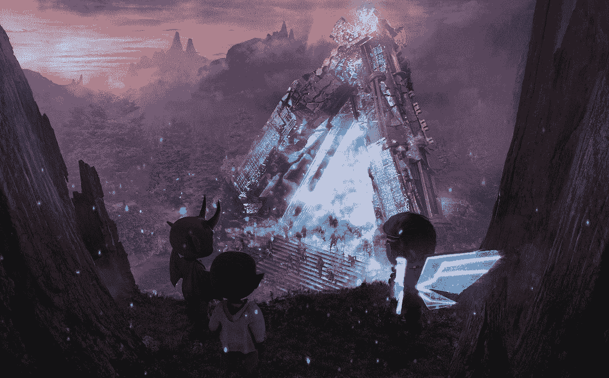
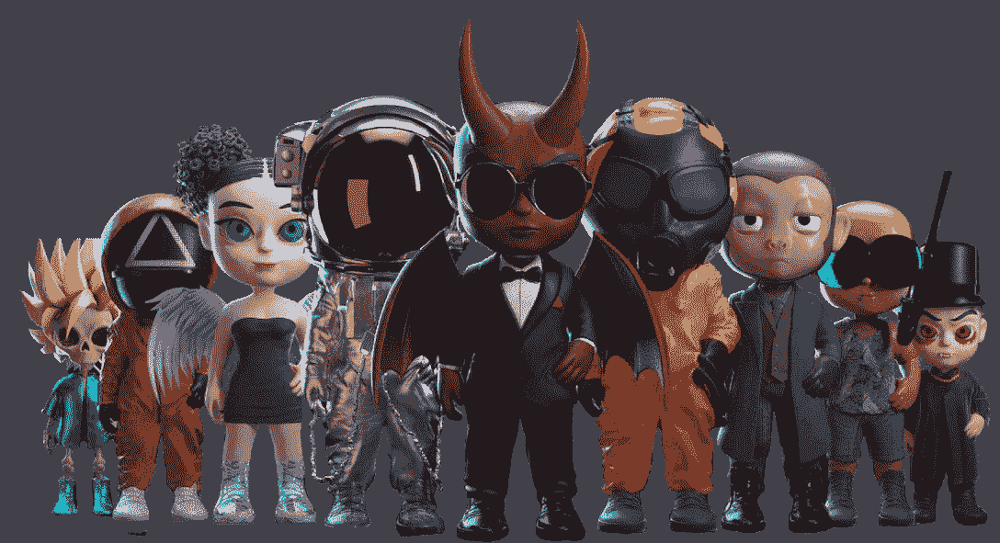

# Astra Nova 向其非正常人群提供 500 张免费造币券

> 原文：<https://web.archive.org/web/https://dappradar.com/blog/astra-nova-offers-500-free-mint-passes-to-its-deviants-nfts>

## 离经叛道者是生活在阿斯特拉诺瓦游戏世界中不断进化、可升级的 3D 角色。

Astra Nova 是一款 metaRPG 游戏，带领玩家探索沉浸式虚拟世界并赢得现实世界的奖励，如可收集的异常人物和异常人物穿着的 IRL 服装。异常者是 10，000 个具有惊人视觉效果的游戏中的 NFT 角色。值得注意的是，这些角色是阿斯特拉新星游戏的关键。该项目刚刚宣布了 500 张免费造币券，供用户认领他们独特的头像。

## **内容表**

*   [什么是 Astra Nova？](https://web.archive.org/web/20230131230258/https://dappradar.com/blog/astra-nova-offers-500-free-mint-passes-to-its-deviants-nfts/#what)
*   谁是越轨者？
*   游戏中的越轨者是如何工作的？
*   拥有异常者有什么好处？
*   [收集离经叛道的 NFT，成为社区的一部分](/web/20230131230258/https://dappradar.com/blog/wp-admin/post.php)

元宇宙承诺模糊虚拟和现实世界之间的界限，邀请玩家沉浸在幻想世界中。然而，元宇宙仍处于早期阶段，其游戏体验远远不能满足现代游戏玩家的期望。例如，一些游戏充满了乏味的游戏内游戏赚钱机制，低分辨率的游戏环境，以及空旷的元宇宙游乐场，这让真正的游戏玩家望而却步。

Astra Nova 希望通过为狂热的游戏玩家和 NFT 爱好者创造真正可玩的游戏体验来改变这种情况。作为回应，它召集了一支由游戏行业资深人士、获奖创意人员和品牌营销负责人组成的团队，基于 Web3 的核心原则打造无与伦比的 MetaRPG 游戏体验。

在探索阿斯特拉新星中闪烁着精灵光芒的山脉和精神溪流时，玩家将有虚拟世界的第一批居民，即小发电站，来陪伴他们。

这些动画化身对玩家在阿斯特拉诺瓦游戏中的进度至关重要。在这篇文章中，我们将带你走进阿斯特拉新星的世界，并分享你如何铸造你的自由的变态 NFT

## Astra Nova 是什么？

阿斯特拉诺瓦是一个创新的超 RPG 世界，沉浸在数千年的星际知识中。随着玩家探索新的和被毁坏的世界，他们将需要收集现代材料、古代文物和遗失已久的魔法遗物，并使用它们来重建他们的社会，团结他们的文明，并准备与他们的敌人战斗。

## 谁是离经叛道者？

10，000 个游戏中可升级的 3D 角色，是解开阿斯特拉诺瓦游戏世界之谜的关键。这些角色是以太坊网络上不可替换的令牌(NFT ),每个都是完全唯一的。

离经叛道者来自 15 个不同的种族，每个离经叛道者都有自己的故事。这些故事将通过多渠道的传说展开，这些传说将随着 Astra Nova 的发展而增长。除了游戏中的故事，传说将通过 Discord、Twitter、Medium 和其他渠道发布。

[Learn more about The Deviants](https://web.archive.org/web/20230131230258/https://astranovaofficial.medium.com/deviant-art-the-terrorizing-tikes-who-call-astra-nova-home-175519d1c003)

## 离经叛道者在游戏中是如何工作的？

变异者是阿斯特拉·诺瓦·元宇宙和他们正在建造的超远程火箭筒的中心支柱。与他们相关的故事和他们角色的塑造将通过游戏、网络漫画、视频、传说等方式进行塑造。同时，他们也是 Astra Nova 中吸引玩家的关键因素，并作为 Astra Nova 团队奖励和建立社区的渠道。

关于游戏性，异常者是可下载的自定义 3D 化身资产，可以在阿斯特拉诺瓦世界的任何地方使用，作为玩家在阿斯特拉诺瓦的自定义档案或荣誉徽章。然而，在游戏开始时，它们将主要作为可穿戴的护身符存在，赋予玩家角色特殊的属性。

离经叛道者也是非玩家角色(NPC ),他们在阿斯特拉新星中提供任务、掠夺、启动事件和操作重要地点。玩家可以很快遇到一些异常者，而其他异常者则隐藏在整个虚拟世界中。

[Meet The Deviants](https://web.archive.org/web/20230131230258/https://astranova.world/)

## 拥有离经叛道者有什么好处？

随着故事的展开，异常者将变得越来越重要，每个不同的种族都有一个独特的故事和与之相关的特殊事件。从项目的第一天起就有一个离经叛道的人将是玩家最大限度地利用阿斯特拉诺瓦的关键。

### 异常的 NFTs 解锁所有游戏内容

作为“创世阿斯特拉·新星 NFT ”,变异者将为未来的阿斯特拉·新星 NFT 空投获得一个特殊的白名单位置。这些包括猎户座领域的土地和哨兵收集，这在阿斯特拉新星有极大的重要性。

但这还不是全部……Astra Nova 是一个在游戏内外都建立了广泛知识的项目。离经叛道的 NFTs 将让玩家接触到特殊的网络漫画，这些漫画为未来重大的阿斯特拉新星事件埋下了种子。此外，所有策划的内容将充满玩家可以发现的游戏秘密的线索。

### 他们是元宇宙的全栈头像

离经叛道的 NFT 也将充当整个元宇宙的全栈头像。它们是元宇宙的独特系列，具有动画视觉效果(VFX)。此外，Astra Nova 还与一家专门创建虚拟化身的公司合作，提供人脸映射的虚拟 AR 化身，持有者可以在 Teams、Google Meet 和 Zoom 等流行的视频应用程序上使用。

重新发明了 NFT 的概念，偏离者不是一个静态的 NFT，无论是视觉上还是功能上。用户可以对它们进行标记和升级，但这取决于离经叛道者的 DNA。一些异常者甚至可以进化到完全超越原始状态。

### 他们允许持有者提前试用 Astra Nova

最重要的是，异常 NFT 的持有者将在 Astra Nova beta 发布时拥有独家的第一次访问权。他们将是第一批踏上这个新世界的玩家，在这片土地上建立自己的权利，并探索隐藏在阿斯特拉诺瓦洞穴和瀑布背后的许多奇妙的秘密。

离经叛道者还会给玩家提供在游戏中从 P2P 市场赚钱的途径。例如，持有者可以访问独家越轨游戏，以获得额外奖励。领先于后来加入这个世界的玩家，然后立即成为离经叛道的主人。

[Collect The Deviants](https://web.archive.org/web/20230131230258/https://astranova.world/)

## 如何铸造异常者

Astra Nova 的异常 NFT 铸币即将到来，加入 allowlist 将为率先行动的用户提供好处，如**免费铸币**。

*关注最新消息，* [*加入他们的社区吧！*](https://web.archive.org/web/20230131230258/https://discord.gg/ncdF3cRv)

所有 allowlist 通行证都是可自由铸造的 NFT，称为“万能钥匙”。他们允许名单上的用户有更高的机会铸造他们最喜欢的品种，折扣价，和预铸造的机会。还有额外津贴，如报销和身体异常的数字。

用户需要通过社区竞赛和[任务](https://web.archive.org/web/20230131230258/https://app.quest3.xyz/)获得资格，才能成为这些万能钥匙的合格持有者。

值得注意的是，10，000 个异常者中的 4，500 个将在 allowlist 上分三个阶段进行铸造，而剩余的 5500 个将公开出售。此外，每一阶段将有五场不同的比赛对 mint 开放，每场比赛持续 48 小时。名单上的每个用户每个阶段可以铸造 2 个异类。

最重要的是，Astra Nova 提供了 500 个钻石钥匙，允许用户免费拥有 NFT。钻石万能钥匙持有者享有以下特权。

*   在 3 个阶段中，每个阶段有机会铸造最多 2 个异常者。
*   3 个阶段中的任何一个阶段都有 1 个免费的可铸造偏差。
*   如果用户在所有阶段都创造了三个异常者(一组),则有资格赢得 RVV(游戏内令牌)的保证退款。
*   持有者还将获得一个他们创造的三个异常人物之一的 3D 打印异常人物。

## 收集离经叛道的 NFT，成为社区的一部分

错过免费铸币通行证的人仍有机会加入其他 allowlists。获得一个位置的有效方法是参加各种社区竞赛。

Astra Nova 团队还将鼓励社区中的真人角色扮演(LARP)活动，并将粉丝艺术作为整个项目的延伸。如果你太忙而无法参加这些聚会，不要担心，Astra Nova 希望创建一个包容性的社区。有些事件需要简单的注册才能获得 allowlist 访问权限。

立即加入 Astra Nova 社区，了解更多信息。

*   [网站](https://web.archive.org/web/20230131230258/https://astranova.world/)
*   [推特](https://web.archive.org/web/20230131230258/https://twitter.com/TheDeviantsNFT)
*   [不和](https://web.archive.org/web/20230131230258/https://discord.com/invite/79sQjCm3uh)

**免责声明** —这是一篇赞助文章。DappRadar 不认可本页面上的任何内容或产品。DappRadar 旨在提供准确的信息，但读者应该在采取行动之前总是自己做研究。DappRadar 的文章不能被认为是投资建议。