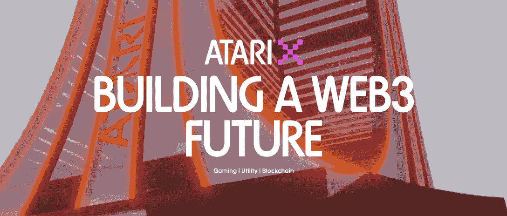
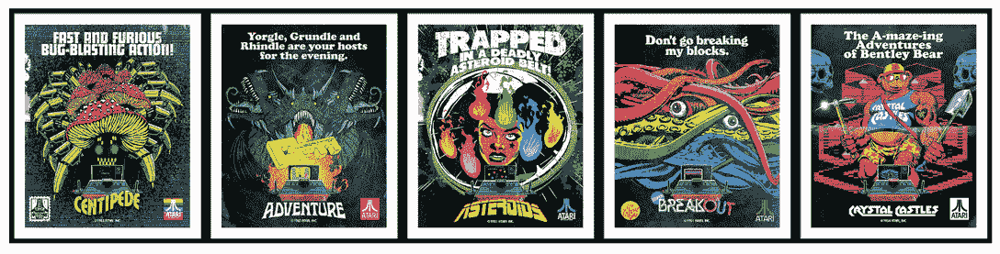
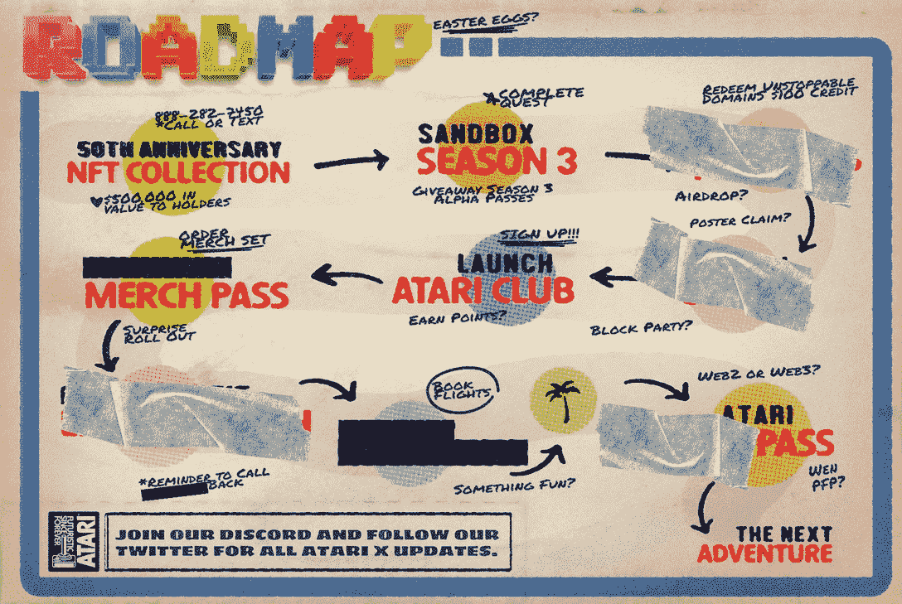

# Atari X:从传统游戏到 Web3

> 原文：<https://web.archive.org/web/https://dappradar.com/blog/atari-x-from-traditional-gaming-to-web3>

## Atari X 将 Atari 的区块链利益整合到一个统一的操作中，增强了用户体验。

游戏老手雅达利推出了其 Web3 计划 Atari X。该项目旨在将雅达利的区块链利益注入一个服务于游戏玩家和雅达利粉丝的统一平台。雅达利的最终目标是建立一个强大的区块链生态系统，将游戏、公用事业和社区结合在一起，同时确保 web3 仍然是雅达利计划的战略组成部分。

雅达利今年 50 岁了。可以说，正是这家传奇游戏公司培育了第一代游戏玩家。雅达利开辟了从街机游戏到家用游戏机的道路，其经典游戏的遗产延续至今。

当我们迎来 Atari 的 50 岁生日时，人们很好奇这家老牌游戏公司将如何走向未来。显然，Atari 的目标很好:它的目标是通过 Atari X 进军 Web3。

## 目录

*   [什么是雅达利 X？](https://web.archive.org/web/20221201140933/https://dappradar.com/blog/atari-x-from-traditional-gaming-to-web3/#what)
*   [谁创造了共济失调 X？](https://web.archive.org/web/20221201140933/https://dappradar.com/blog/atari-x-from-traditional-gaming-to-web3/#who)
*   [探索雅达利 X 的 Web3 世界](https://web.archive.org/web/20221201140933/https://dappradar.com/blog/atari-x-from-traditional-gaming-to-web3/#explore)
    *   [NFT 收藏:雅达利 50 年](https://web.archive.org/web/20221201140933/https://dappradar.com/blog/atari-x-from-traditional-gaming-to-web3/#nft)
    *   [雅达利在沙盒中推出桑尼维尔](https://web.archive.org/web/20221201140933/https://dappradar.com/blog/atari-x-from-traditional-gaming-to-web3/#sandbox)
*   [不断了解下一代游戏](https://web.archive.org/web/20221201140933/https://dappradar.com/blog/atari-x-from-traditional-gaming-to-web3/#learning)

## 雅达利 X 是什么？

Atari X 是一个强大的区块链生态系统，融合了游戏、社区和公用事业。这是一项举措，将雅达利的区块链利益整合到一个统一的运营中，使雅达利能够为其粉丝群策划无与伦比的娱乐体验。将 Web3 开发与顶级合作伙伴关系相结合，Atari X 将发展成为一个充满活力的区块链生态系统。

[Check out Atari X](https://web.archive.org/web/20221201140933/https://dappradar.com/ethereum/collectibles/atari-x)

## 雅达利 X 是谁创造的？

雅达利 X 是雅达利的心血结晶吗？是啊！

Atari 成立于 1972 年，在街机游戏、游戏机和个人电脑领域有着不可替代的地位。雅达利的招牌游戏包括 Pong，Space Invader，Pac-Man 等。这些家喻户晓的名字激励了一代又一代的玩家和游戏开发者。

雅达利已经在区块链领域尝试了几次合作和实验。但它最终决定自己动手，为用户带来最佳、最无缝的体验。该团队认为，区块链将成为雅达利业务的重要组成部分，为该公司带来与合作伙伴、球员和粉丝互动和合作的新方式。

## 探索 Atari X 的 Web3 世界

Atari X 基于三大支柱:游戏、可用性和社区。

毫不夸张地说，雅达利和游戏是同义词，因为游戏让雅达利闻名于世。在 Web3 中，Atari 还希望利用其多年的经验为玩家创造有趣而难忘的游戏记忆。

Atari 努力为其参与者和社区提供实用工具。这包括代币，区块链游戏，NFT 倡议，等等。此外，雅达利邀请其社区在发展其业务时发出积极的声音。该社区将成为 Atari X 的灵感源泉和关键驱动力。

[Atari Single Dapp Page](https://web.archive.org/web/20221201140933/https://dappradar.com/ethereum/collectibles/atari-x)

那么目前可供用户体验的项目有哪些呢？

### NFT 收藏:雅达利 50 年

雅达利 50 年是以太坊推出的创世纪 NFT 系列。该系列由巴西著名艺术家 Butcher Billy 创作，由 2，600 张独特的生殖艺术海报组成，这些海报允许持有者进入 Atari X Web3 生态系统。

#### 持有这些非专利证书有什么好处？

所有 NFT 持有者都将获得独家 discord 渠道、Web3 alpha 和仅限持有者的合作伙伴名单机会。还有呢？如果持有者想要展示他们独一无二的收藏品，雅达利也可以提供帮助。持有者可以选择将这些 NFT 制成高质量的印刷品，挂在墙上供客人欣赏。更多详情可在本页[找到。](https://web.archive.org/web/20221201140933/https://kb.888atari50.com/nft)

额外津贴不止于此。雅达利 X 团队将丰富雅达利 50 年收藏的益处和效用。

[Roadmap](https://web.archive.org/web/20221201140933/https://888atari50.com/)

[Explore Atari X](https://web.archive.org/web/20221201140933/https://dappradar.com/ethereum/collectibles/atari-x)

### 雅达利在沙盒中推出桑尼维尔

沙盒最近发布了最新的阿尔法第三季，解锁了 90 个新的元宇宙体验。值得注意的是，雅达利是沙盒中最重要的土地所有者之一。现在，它已经推出了 Sunnyvale，这是一种独特的体验，允许玩家探索，社交，并会见基于 Atari 角色的非玩家角色。

在与 DappRadar 的 AMA 中，Atari X 的董事 Tyler Drewitz 与我们分享了 Atari 对 Web3、元宇宙和区块链游戏未来的愿景和计划。

[Check out The Sandbox](https://web.archive.org/web/20221201140933/https://dappradar.com/multichain/games/the-sandbox)

观看完整的 AMA

[https://web.archive.org/web/20221201140933if_/https://www.youtube.com/embed/rbI45IXL92k?feature=oembed](https://web.archive.org/web/20221201140933if_/https://www.youtube.com/embed/rbI45IXL92k?feature=oembed)

## 不断了解下一代游戏

Atari X 将为游戏玩家带来的 Web3 游戏体验值得期待。

除了雅达利之外，许多游戏团队都在准备带领用户踏上前所未有的游戏之旅。不用担心迷失在游戏的海洋里。DappRadar 会随时关注最新最热的游戏。

点击下面的按钮查看现在的流行趋势！

[<picture></picture>](https://web.archive.org/web/20221201140933/https://dappradar.com/rankings/category/games)[<picture></picture>](https://web.archive.org/web/20221201140933/https://dappradar.com/hub/nft-explorer)[<picture></picture>](https://web.archive.org/web/20221201140933/https://dappradar.com/blog/10-games-to-play-and-earn-for-less-than-10-dollars)

## 随身携带您的 Web3 之旅

使用 DappRadar 移动应用程序，再也不会错过 Web3。查看最受欢迎的 dapps 的性能，并关注您投资组合中的 NFT。您在 DappRadar 上的帐户会与我们的移动应用程序同步，这样您很快就可以选择实时接收提醒。

[Download the DappRadar app now](https://web.archive.org/web/20221201140933/https://dappradar.app.link/blog)[<picture></picture>](https://web.archive.org/web/20221201140933/https://play.google.com/store/apps/details?id=com.portfolio.dappradar) NewsletterUnsubscribe at any time. [T&Cs](https://web.archive.org/web/20221201140933/https://dappradar.com/terms) and [Privacy Policy](https://web.archive.org/web/20221201140933/https://dappradar.com/privacy-policy)