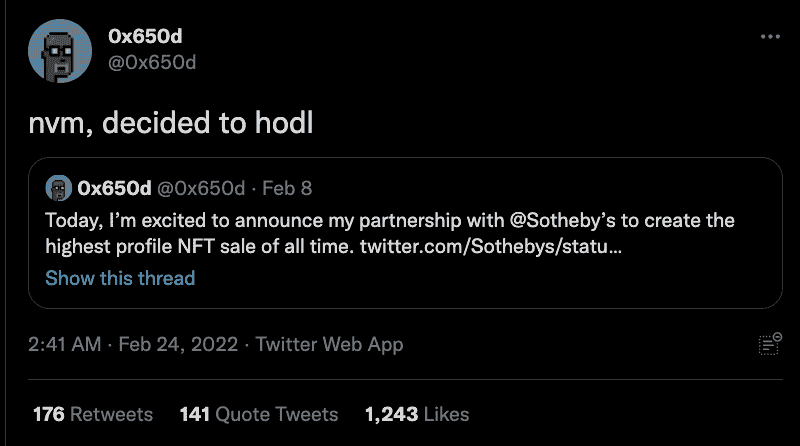
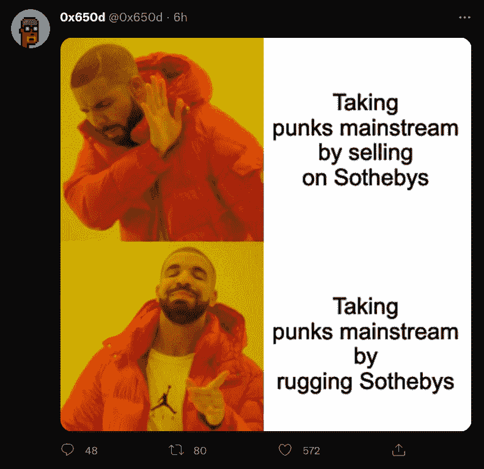

# 苏富比拍卖行由隐朋克收藏家设计

> 原文：<https://web.archive.org/web/https://dappradar.com/blog/auction-house-sothebys-rugged-by-cryptopunk-collector>

## 拍卖结束前几分钟，卖家“地毯”3000 万美元的 crypto 朋克收藏

估价为 3000 万美元的 104 件 crypto 朋克 NFT 藏品的拍卖在最后一刻被取消，这让艺术收藏家和 NFT 爱好者感到困惑。这场由世界著名拍卖行苏富比主办的活动有望成为有史以来最大的 NFT 拍卖会之一——直到' [**的所有者朋克它！**](https://web.archive.org/web/20221129081504/https://www.sothebys.com/en/digital-catalogues/punk-it?locale=en)**’藏品突然退出拍卖，只留下一条推文作为原因线索。**

隐朋克主人的原因仍不清楚，但在拍卖取消后，推特上署名为'[0x 650d【T1]'的匿名主人向他的 12000 名粉丝发了一条推特说，“nvm，决定 hodl。”这意味着他们不想再卖了。相反，他们宁愿持有这些股票，直到实现更高的价值。](https://web.archive.org/web/20221129081504/https://twitter.com/0x650d)

这位收藏家继续对这种情况轻描淡写，发布了一个迷因，称他们“通过抢劫苏富比将朋克纳入主流”。重要的是，这不是一个真正的“拉地毯”,投资者被非法剥夺资金，因为没有资金转移发生。

有兴趣的可以看看[钱包里的 0x650d 的 104 个小混混](https://web.archive.org/web/20221129081504/https://dappradar.com/hub/wallet/eth/0x650dcdeb6ecf05ae3caf30a70966e2f395d5e9e5/nfts)。这些朋克可以说是收藏中最常见的。该系列的底价为 15.3 万美元，这表明该系列至少价值 1610 万美元。

## 拍卖行已经进入 NFTs

苏富比已经表现出利用利润丰厚的 NFT 市场的愿望，仅去年一年就售出了价值超过 1 亿美元的非艺术珍品，其中 2400 万美元发生在一次拍卖中。

今年 1 月，NFT 的销售额达到 107 亿美元，交易额达 53 亿美元；几乎 90%是在公海交易的。此外，NFT 收藏 100 强的[最低市值估计为 148 亿美元，比 11 月份仅下降了 15%，尽管同期 ETH 的价格下降了 50%。](https://web.archive.org/web/20221129081504/https://dappradar.com/blog/dapp-industry-report-january-2022)

然而，这一最新事件进一步表明，随着两个世界的碰撞，美术和 NFT 边缘收藏家与 web3 社区之间存在着相当大的分歧。可以说，CryptoPunk 收藏的持有者认为，尽管与苏富比达成了任何协议，但在这个时候出售将是一个糟糕的举动。不管多么任性，收回藏品是 NFT 持有者的权利。

 NewsletterUnsubscribe at any time. [T&Cs](https://web.archive.org/web/20221129081504/https://dappradar.com/terms) and [Privacy Policy](https://web.archive.org/web/20221129081504/https://dappradar.com/privacy-policy)

***以上不构成投资建议。此处给出的信息仅供参考。请行使尽职调查，做你的研究。作者持有 ETH、BTC、AGIX、HEX、LINK、GRT、CRO、OMI、不可变 X、GALA、AVASTR、GMEE、CUBE、RADAR、FLOW、FTM、BNB、SPS、WRLD、ATOM 和 ADA。***