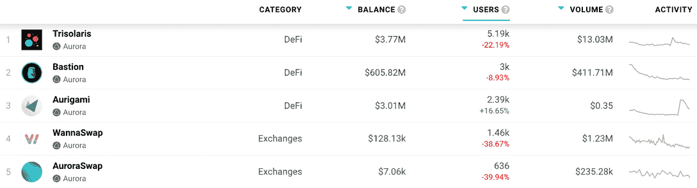
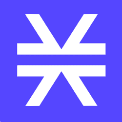

# 极光区块链 Dapps 现在在 DappRadar 上追踪

> 原文：<https://web.archive.org/web/https://dappradar.com/blog/aurora-blockchain-dapps-now-tracked-on-dappradar>

## 以太坊兼容性、接近协议的可扩展性和可负担的交易

DappRadar 很高兴宣布极光区块链和它的 dapps 生态系统的整合。DappRadar 每月 100 万的网站访问者现在可以通过 Aurora dapp 排名来分析哪些 dapp 吸引了最多的交易量，独特的用户钱包，或者处理了最多的交易。这样，每个人都可以了解哪些 dapps 和令牌在 Aurora 上建立了稳固的社区和价值。

Aurora 是一个以太坊虚拟机(EVM)兼容生态系统，由 NEAR Protocol 的团队创建，旨在为开发人员提供一个交钥匙解决方案，以便在一个以太坊兼容、高吞吐量、可扩展的平台上运行 dapps，同时为用户降低交易成本。

Aurora 的交易费用以基础货币 ETH 支付，为用户提供了巨大的 UX。同时，极光桥作为近彩虹桥的一部分，是以太坊生态系统中唯一完全不可信的资产桥。此外，希望在 Aurora 上发布的开发人员不需要重写任何代码，因为 Aurora 与以太坊完全兼容，这导致了一个已经开发的 dapps 生态系统。

## DappRadar 上极光区块链 dapp 排名

在发布时，DappRadar 将在 Aurora 区块链上跨多个类别跟踪 XYZ dapp，包括 DeFi 和交易所、NFT 收藏、市场和游戏，随着生态系统的扩展，将会有更多 dapp 出现。

Trisolaris 是极光网络的领先 dapp 并迎合 DeFi 观众。它为用户提供了简单直观的用户界面、高速交易和可忽略不计的费用，以及提供流动性和互换任何 ERC20 代币的能力。

[Bastion 是建立在 Aurora 基础上的借贷和稳定货币互换协议](https://web.archive.org/web/20220630033807/https://dappradar.com/aurora/defi/bastion),具有卓越的资本效率、低滑动互换、快速交易、低费用、精确清算，并利用了 NEAR 的潜在 UX 优势。这是 TVL 最大的协议，耗资超过 3 亿美元。

[<picture></picture>](https://web.archive.org/web/20220630033807/https://dappradar.com/rankings/protocol/aurora)

[Explore Aurora Dapps](https://web.archive.org/web/20220630033807/https://dappradar.com/rankings/protocol/aurora)

我们鼓励社区在 DappRadar now 上深入探索[Aurora dapps 的全部产品。](https://web.archive.org/web/20220630033807/https://dappradar.com/rankings/protocol/aurora)

## 面向 dapp 开发者的 Aurora

Aurora 提供了以太坊开发体验，具有第二层速度和可伸缩性。如果你是一个以太坊开发者，在 Aurora 上入门就像改变 RPC 端点一样简单。

Aurora 支持以太坊生态系统中所有可用的工具，此外，NEAR 到以太坊的无信任桥意味着甚至 Aurora 上的资产都与以太坊相同。

dappRadar 邀请 dapp 开发者[向 DappRadar](https://web.archive.org/web/20220630033807/https://dappradar.com/submit-dapp) 提交他们的 Dapp，为 Aurora dapp 生态系统在世界 Dapp 商店上创造更多的可见性。有兴趣了解更多关于 Aurora 和可能性的人可以从 Aurora 开发者文档开始。

[<picture></picture>](https://web.archive.org/web/20220630033807/https://dappradar.com/rankings/protocol/stacks)[<picture></picture>](https://web.archive.org/web/20220630033807/https://dappradar.com/stacks/defi/alex-1)[<picture></picture>](https://web.archive.org/web/20220630033807/https://dappradar.com/stacks/collectibles/megapont) NewsletterUnsubscribe at any time. [T&Cs](https://web.archive.org/web/20220630033807/https://dappradar.com/terms) and [Privacy Policy](https://web.archive.org/web/20220630033807/https://dappradar.com/privacy-policy)