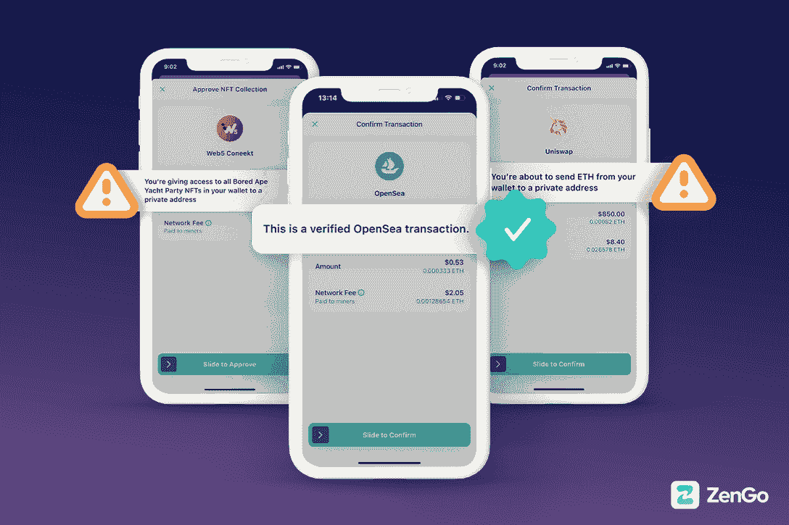
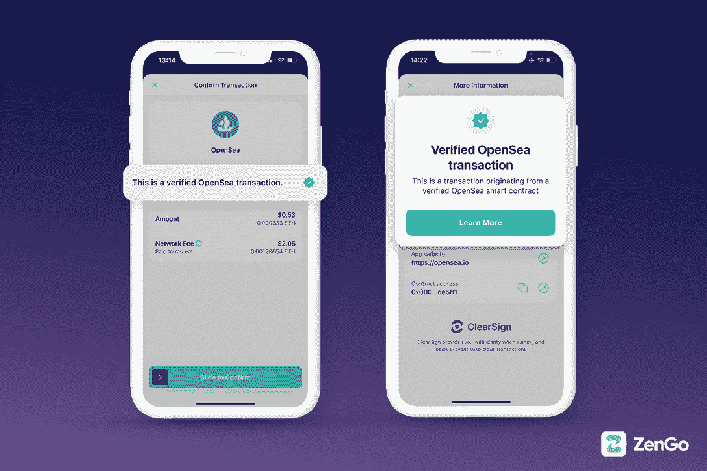
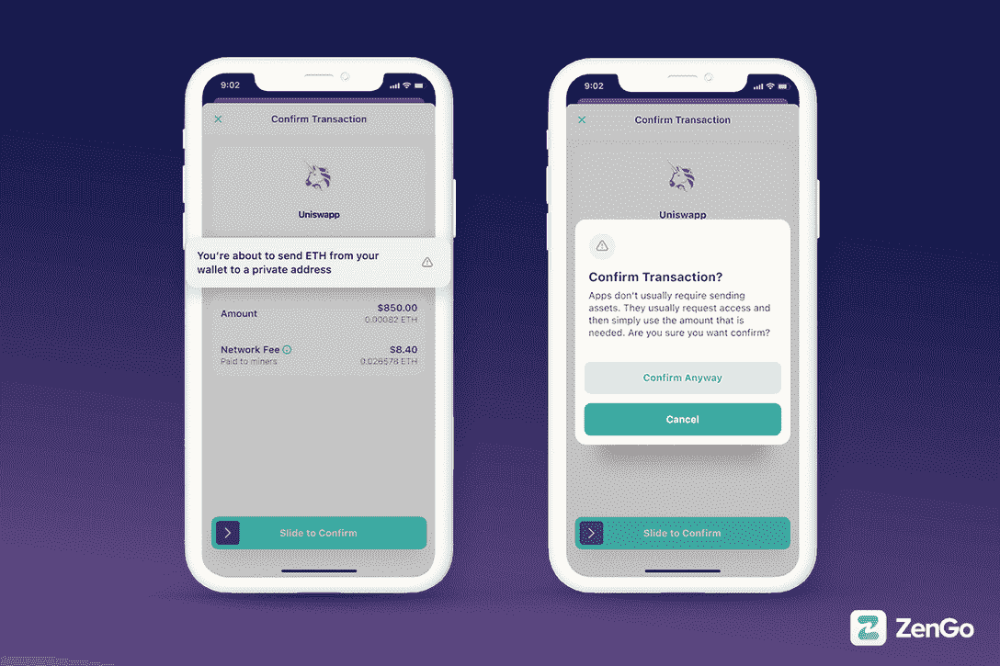
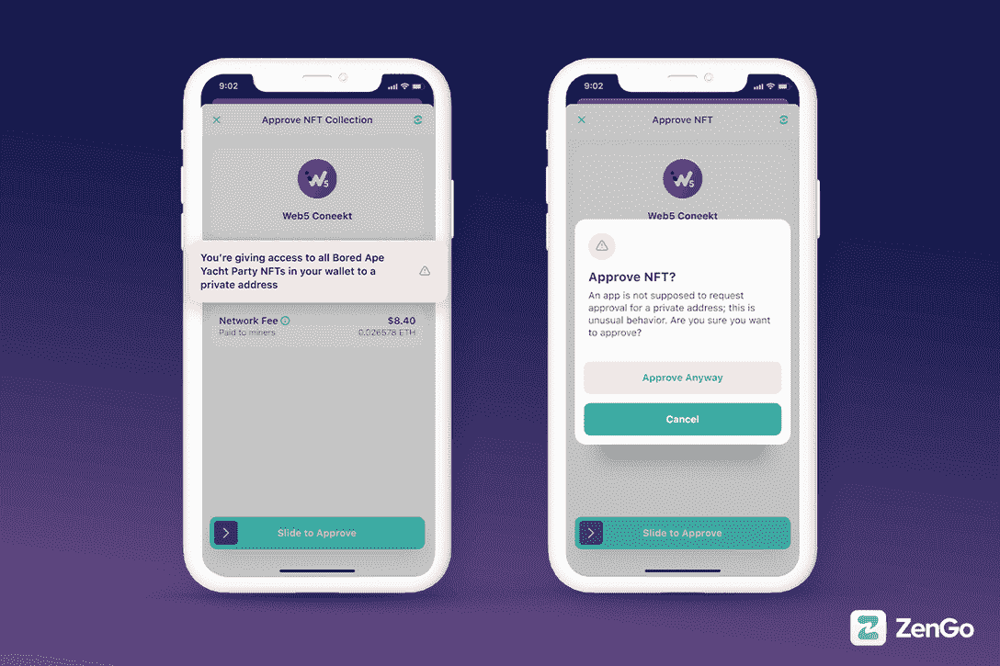

# 使用 ZenGo 的 clear sign-web 3 防火墙避免加密诈骗

> 原文：<https://web.archive.org/web/https://dappradar.com/blog/avoid-crypto-scams-using-zengos-clearsign-the-web3-firewall>

## ZenGo 保护用户免受最危险和最常见的 Web3 攻击。

**ZenGo Wallet 利用创新的 ClearSign 和 MPC 技术为用户提供行业领先的加密资产保护。有了 ClearSign，用户就有了一个 Web3 防火墙，可以警告黑客的恶意攻击和欺诈。**

**概要:**

*   钱包服务提供商必须站在用户的立场，同时提供加密资产保护。
*   ZenGo 的 Web3 防火墙 ClearSign 旨在帮助用户快速识别恶意交易。
*   此外，钱包利用 MPC 而不是私钥，消除了传统加密钱包中的这一巨大漏洞。

仅在 2022 年，就有近 20 亿美元的 NFT、DeFi 和其他加密资产通过骗局和黑客被盗。被认为相对更安全的硬件钱包也不能幸免于这些骗子。

Web3 对审查的抵制是一把双刃剑。一方面，它让用户体验到前所未有的金融和商业创新。但另一方面，用户往往无从得知交易中的对方是否居心不良。

在 ZenGo 看来，一个关心用户的负责任的钱包服务提供商应该努力告知并保护用户免受潜在风险。这就是为什么 [ZenGo 推出了 Web3 防火墙——clear sign](https://web.archive.org/web/20221130145742/https://zengo.com/hello-web3-firewall/),这是一个保护交易安全的强大功能。

# 什么是 ClearSign，它是如何工作的？

当用户用他们的钱包登录访问 dapps 或在区块链上进行交易时，他们只能看到由复杂的数字和字母组成的一串信息。通常，当用户遭遇骗局时，钱包无法通知用户，结果是:用户被蒙在鼓里。

ZenGo 的 Web3 防火墙 ClearSign 可以通知、警告和保护用户，防止他们批准最危险和最常见的 Web3 攻击。那么它是如何工作的呢？

ClearSign 技术根据交易敏感度、授予外部系统的权限级别和已知的欺诈行为，将用户将看到的链上交易分为三个风险级别。[加密钱包](https://web.archive.org/web/20221130145742/http://www.zengo.com/)有红、黄、绿三种颜色代表的三个安全等级，就像一个交通信号灯，一眼就能认出来。这就是团队向用户提供直观信息的方式。

下载钱包，了解如何从开创性的 ClearSign 功能中获益。

[Download ZenGo Wallet now](https://web.archive.org/web/20221130145742/http://www.zengo.com/)

### 绿色代表经过验证的 dapps 和智能合约

当用户与 OpenSea 或 Uniswap 等领先的 Web3 dapps 交互时，ZenGo 确保他们连接到原始合同。试图迷惑用户，让他们放弃你的资产的假冒或钓鱼网站是没有机会的。

下载并在签名过程中寻找绿色勾号。

### 黄色通知用户可疑的批准和异常行为。

当用户看到黄色警告时，他们需要格外注意。这是因为有些交易是潜在可疑的，而其他交易是绝对没有问题的。

用户在看到此警报时是否应该处理交易取决于上下文和用户的意图。例如，在使用 Web3 dapp 智能合约时，您是否意识到您正在向私有地址发送或传输您的加密或 NFTs？如果答案是否定的，这个 ClearSign 警报可能会让你避免损失数百万美元。

### 红色需要用户立即注意

最有害的安全攻击之一是当用户授予恶意行为者访问其资产的权限时。黑客可能会误导用户将他们的资产发送到私人地址。在这种情况下，ZenGo 可以有效地提醒用户。

另一种收到红色警报的情况是黑客试图访问用户的整个帐户。ClearSign 在这种关键时刻提醒用户，以保护用户免受加密丢失。

## ZenGo 如何解决私钥漏洞

在过去十年中，由于糟糕的私钥和种子短语管理，超过 1000 亿美元的比特币丢失或被盗。除非在私钥管理方面有根本性的技术突破，否则用户将继续面临这种单点故障带来的损失。

所有传统的加密货币钱包都依赖于相同的易受攻击的安全架构。从 Metamask 这样的基于浏览器的钱包，到 Ledger 这样的硬件钱包，无一例外。但是，ZenGo 不一样。

钱包的基本安全架构利用 MPC 而不是私钥来保护用户的加密资产。因此，它使用户免除了丢失私钥的焦虑。这要归功于 MPC 技术，也称为多方计算。它包括将传统的私钥分成几个单独的“部分”。这样，钱包可以为用户提供多层次的保护。

了解更多关于这个高度安全的 MPC 钱包，给你的加密资产最好的保护！

你现在可以从 [App Store](https://web.archive.org/web/20221130145742/https://go.zengo.com/uCxL/b6hjo9hz) 和 [Google Play](https://web.archive.org/web/20221130145742/https://go.zengo.com/uCxL/b6hjo9hz) 下载你的 ZenGo 钱包。

[网站](https://web.archive.org/web/20221130145742/https://zengo.com/)

[推特](https://web.archive.org/web/20221130145742/https://www.twitter.com/zengo)

[电报](https://web.archive.org/web/20221130145742/https://t.me/zengo)

[中等](https://web.archive.org/web/20221130145742/https://www.medium.com/zengo)

[Youtube](https://web.archive.org/web/20221130145742/https://youtube.com/zengo)