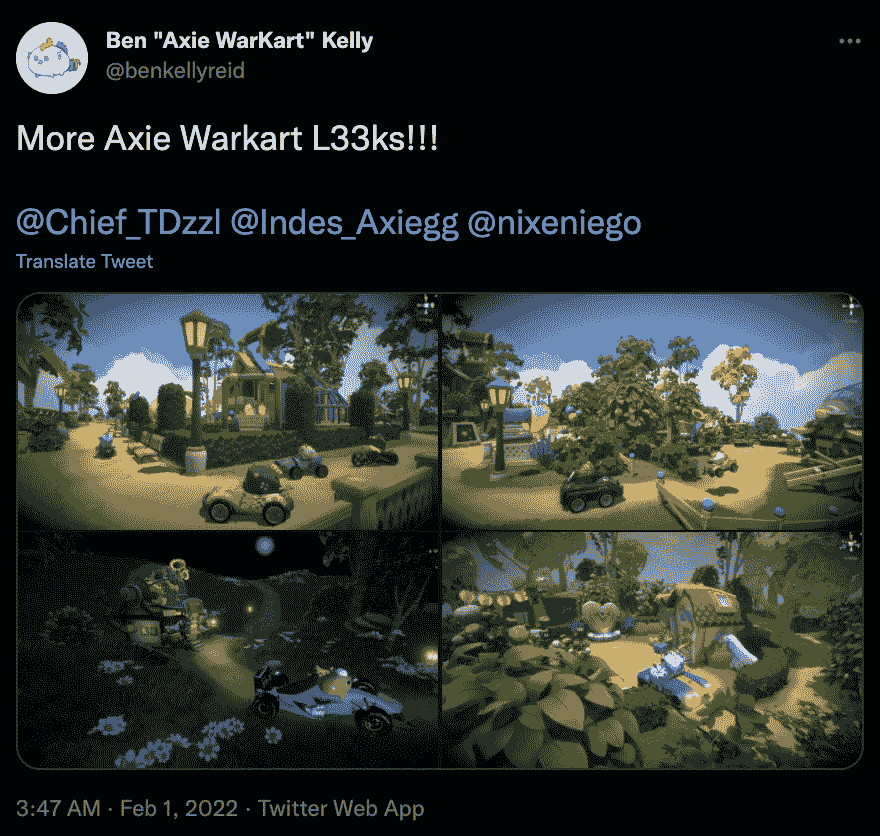

# Axie 社区开始开发衍生游戏

> 原文：<https://web.archive.org/web/https://dappradar.com/blog/axie-community-starts-building-spin-off-games>

## Axie WarKart 是第一批从建筑者计划中诞生的项目之一

Axie Infinity 在几周前宣布启动建造者计划，项目已经在进行中。Axie 衍生游戏中最受关注的是 Axie WarKart，这是一款赛车游戏，采用了 Axie 和原游戏中的其他元素。

根据 Axie Infinity 的联合创始人 Jihoz Zirlin 最近的推文，该项目已经迎来了 1500 多名申请人。有些，像 Axie WarKart，已经和 Axie 社区分享了进展和设计。

Axie WarKart 将为社区带来赛车体验。通过选择使用他们的轴作为游戏中的角色，玩家将能够相互比赛并获胜。据创作者本凯利称，玩家也将有机会在比赛中使用能量和武器。这两个元素都是在最初的 Axie Infinity 游戏中已经出现的物品和细节。

关于 Axie WarKarts 的更多细节将很快公布，然而，对游戏的兴奋已经开始。ENS 域名 [axiewarkart.eth](https://web.archive.org/web/20230124143449/https://dappradar.com/hub/wallet/eth/0x129cca387eacfe191d8edde1d8d9723b6b891a8b) 已经注册在 Ben Kelly 名下。他还每天吸引新的关注者到他的推特账户。

## Axie 社区建设者计划

Axie WarKart 并不是唯一一个因 Axie Builders 计划而酝酿的项目。其他开发者已经分享了各种衍生项目的模型和设计。例如， [binoyaragon.eth](https://web.archive.org/web/20230124143449/https://twitter.com/binoyaragoneth) 已经在开发一款以 Axies 为特色的 MOBA 游戏。

重要的是，开发者可以自由地使用 Axie Infinity 的资源和 NFT 创建任何类型的游戏。赛车游戏，塔防游戏，斗殴，以及任何其他类型的游戏，包括 Axie 人物和令牌，都非常受欢迎。

这看起来像是 Sky Mavis 放弃了他们非常努力的设计的重要版权。然而，建设者计划是一个非常强大的社区建设活动，进一步加强了玩家与 Axie Infinity 的联系。此外，还鼓励衍生项目使用 AXS 和 SLP 来整合游戏中的经济。这也加强了生态系统的游戏赚钱机制。

要了解更多关于构建者计划的信息，请查看此[详细概述](https://web.archive.org/web/20230124143449/https://dappradar.com/blog/axie-infinity-welcomes-members-in-new-builders-program/)。随着更多游戏和 dapps 的加入，DappRadar 将继续监控 Axie Infinity 生态系统。你也可以通过下面的链接跟踪游戏的各个方面。

 NewsletterUnsubscribe at any time. [T&Cs](https://web.archive.org/web/20230124143449/https://dappradar.com/terms) and [Privacy Policy](https://web.archive.org/web/20230124143449/https://dappradar.com/privacy-policy)