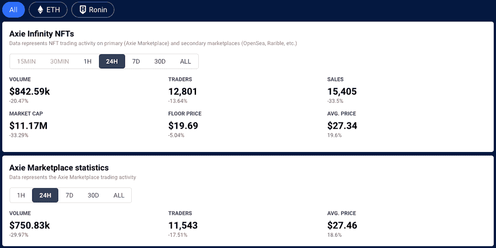
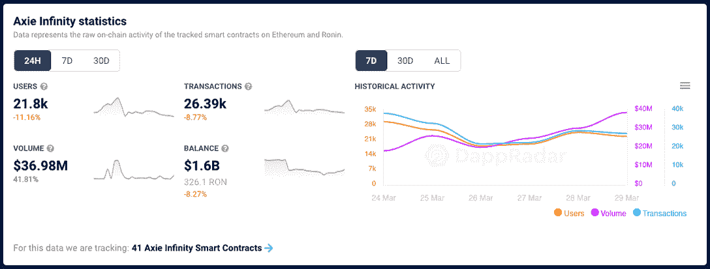
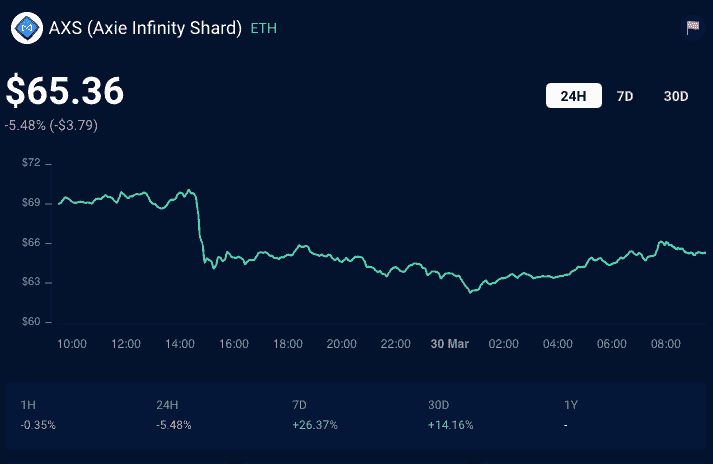
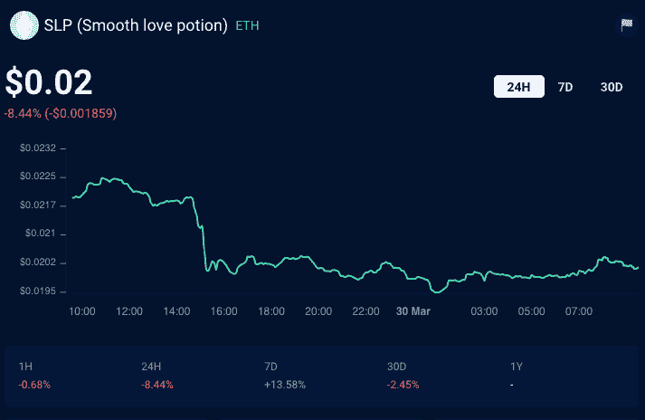
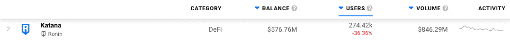
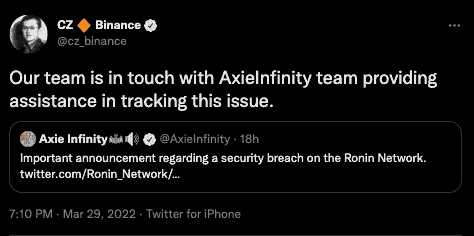
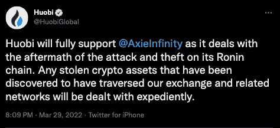
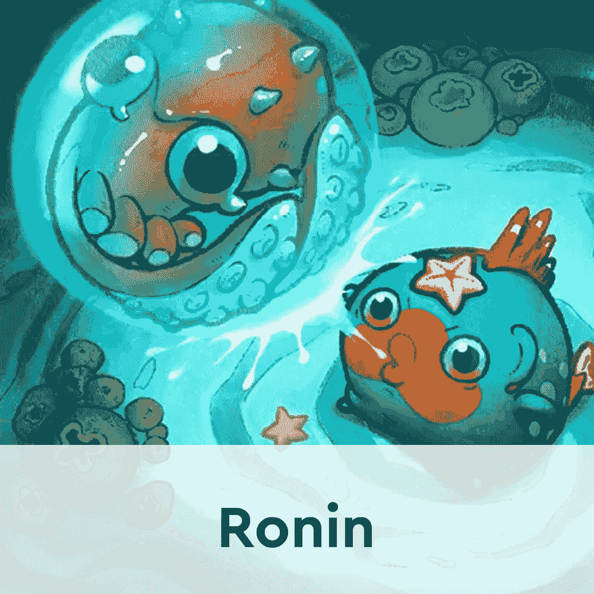
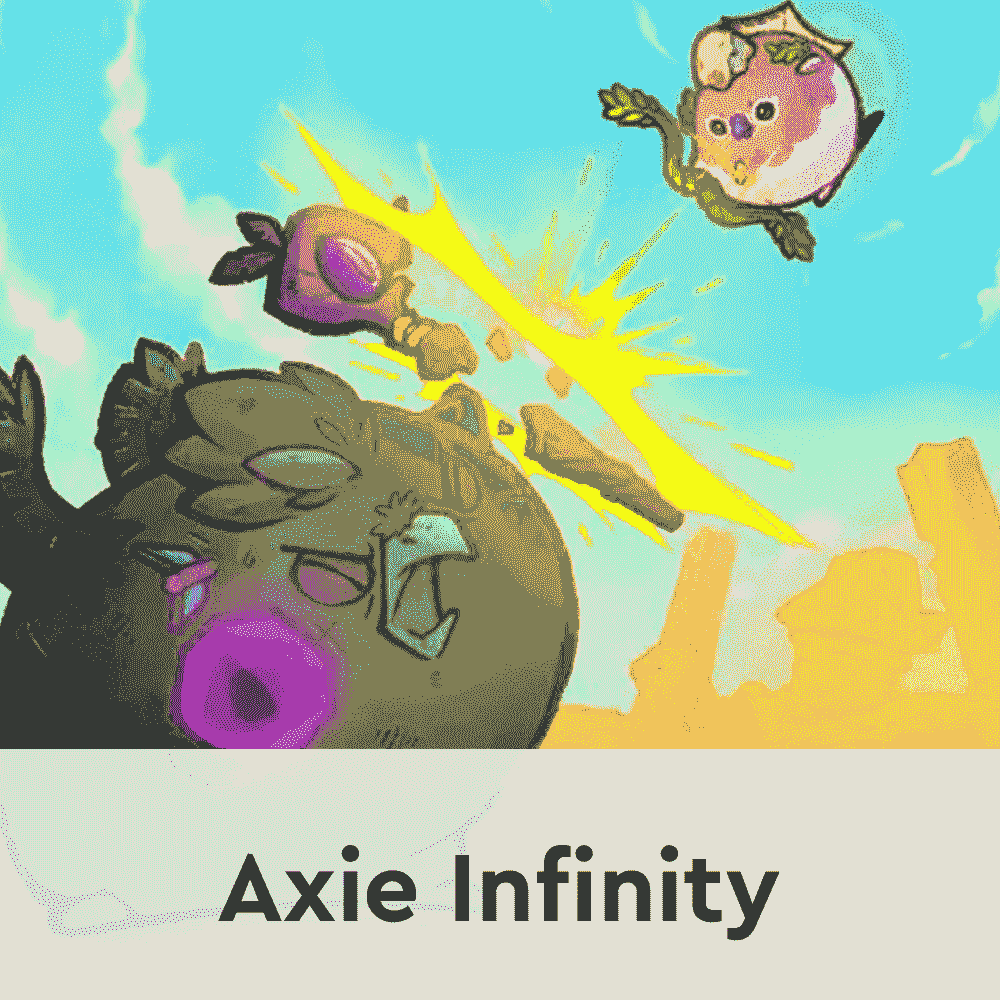
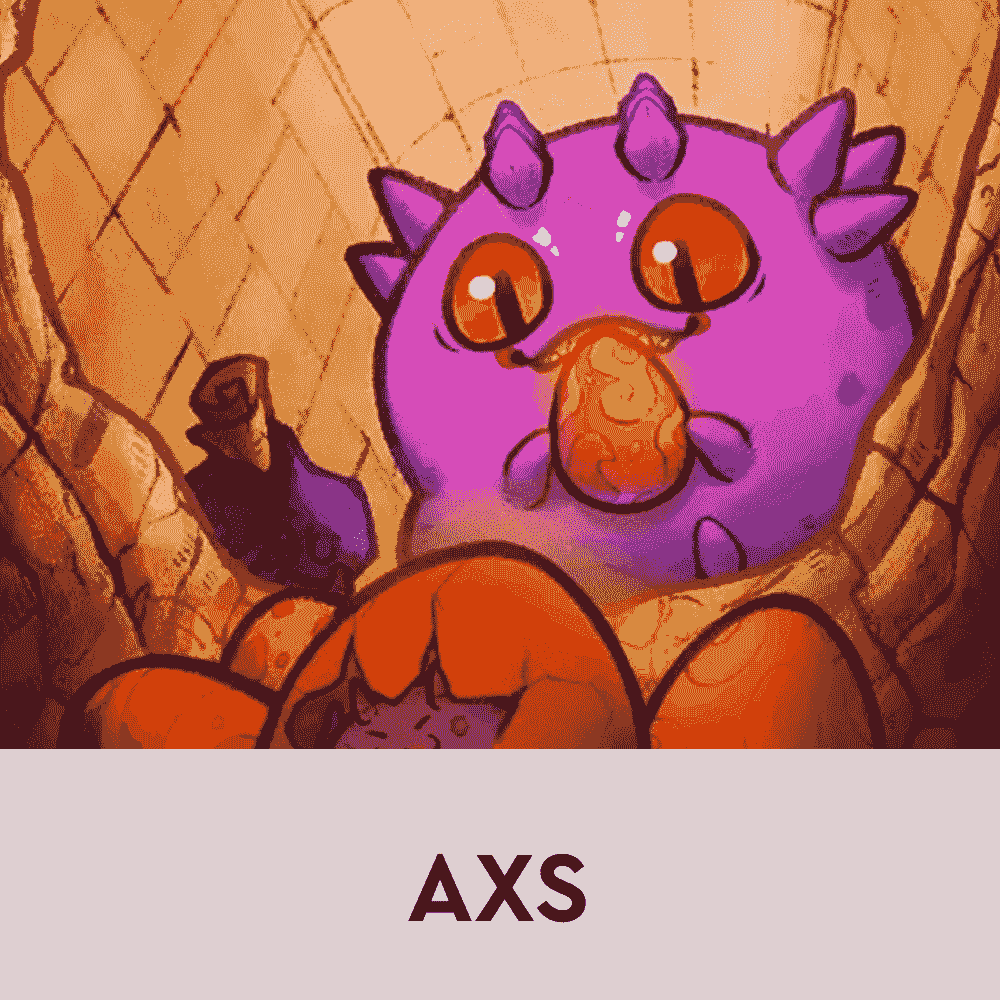

# Axie Infinity 的活动在 6 亿美元的浪人剥削后直线下降

> 原文：<https://web.archive.org/web/https://dappradar.com/blog/axie-infinity-activity-plummets-after-600-million-ronin-exploit>

## 黑客从平台上盗取了 173,600 ETH 和 2550 万 USDC

浪人桥漏洞已经导致 Axie Infinity 游戏和相应的 NFT 市场的活动严重下降。在过去的 24 小时内，游戏的活跃玩家减少了 11%。**与前一天相比，其本地市场失去了 17%的用户群。昨天，Sky Mavis 爆料称，一名黑客利用 Ronin bridge 获得了总额超过 6 亿美元的资金。**

活动的明显下降已经蔓延到区块链生态系统中的所有 dapps，包括 Ronin 的本地分散交换武士刀。负面影响也蔓延到了游戏的本土代币 AXS 和 SLP。在如今臭名昭著的浪人桥事件之后，达普拉达对后果进行了更深入的研究。

## Axie Infinity 受到冲击

不幸的是，随着漏洞利用的消息传播开来，整个 Axie Infinity 生态系统都感到了震惊。在过去的 24 小时里，Axie 市场的交易量下降了超过 17%。此外，该平台产生的交易量减少了约 30%。

Axie Infinity NFTs 也受到了冲击，交易量最大的 NFT 藏品之一的交易量下降了 20%以上。活跃交易者的数量也大幅减少。该系列的市值也缩水了 33%，仅略高于 1，100 万美元。

就 Axie Infinity 本身而言，该游戏的活跃玩家减少了 11%，交易量也有所下降。有趣的是，该平台处理的数据量飙升了 41%以上。这个数字来自人们将代币从一个地方移动到另一个地方，例如要求代币奖励。交易量不应该与交易量混淆，这是完全不同的东西。

虽然活动全面下降，但 Axie Infinity 生态系统的本地令牌 AXS 和 SLP 受到的冲击最大。生态系统的治理标志——AXS 损失了超过 5%的价值。不幸的是，这无意中扭转了它最近经历的积极趋势。

游戏的奖励标志 [SLP](https://web.archive.org/web/20220930091832/https://dappradar.com/hub/token/eth/SLP?from=0xcc8fa225d80b9c7d42f96e9570156c65d6caaa25) 受到了更大的冲击。其估值在过去 24 小时内下跌超过 8%。

不幸的是，随着黑客攻击的程度变得明显，这两种代币的价格趋势都在下跌。

## 浪人桥和武士刀德克斯暂停

在 Sky Mavis 发现漏洞后不久，团队决定暂停浪人桥上的所有活动。此外，该团队过于谨慎，停止了浪人网络的主要分散交易武士刀的所有交易。

目前，没有关于 Ronin 网络是否以及何时恢复其功能的信息。 [Katana DEX](https://web.archive.org/web/20220930091832/https://dappradar.com/ronin/defi/katana) 在过去的三十天里迎来了超过 274，000 个独特的活动钱包。它还创造了超过 8.46 亿美元的交易量。这只能说明浪人生态系统的规模。

不幸的是，在黑客攻击之后，交易所已经对所有用户关闭了一段时间。根据 Sky Mavis 团队的说法，这种活动暂停将有助于调查黑客是谁。尽管如此，在黑客入侵后的几天里，Katana DEX 和 Ronin bridge 处理了数千笔交易。

## 浪人桥漏洞

Sky Mavis 团队[昨晚宣布了黑客攻击](https://web.archive.org/web/20220930091832/https://twitter.com/Ronin_Network/status/1508828719711879168)。从那以后， [Axie Infinity](https://web.archive.org/web/20220930091832/https://dappradar.com/multichain/games/axie-infinity) 生态系统因为各种错误的原因成为头条新闻的焦点。根据来自浪人团队的[官方新闻稿](https://web.archive.org/web/20220930091832/https://roninblockchain.substack.com/p/community-alert-ronin-validators?s=w)，剥削者设法获得了 9 个浪人桥验证器节点中的 5 个。其中四个节点由 Sky Mavis 团队操作，阿谢道控制第五个。

新闻稿解释说，攻击者通过 Ronin bridge gas-free RPC 节点找到了一个后门。这使得坏人可以获得 Axie DAO 验证器的签名。

2021 年 11 月，当 Ronin 推出其无气交易时，阿谢道允许 Sky Mavis 代表其签署各种交易。尽管这项工作在 2021 年 12 月停止，但 allowlist 访问权限并没有被撤销。像这样的一个小错误让黑客们能够访问浪人桥上的资金并进行盗取。

## 六天前

围绕 Ronin bridge 黑客攻击的一个更令人担忧的细节是，Sky Mavis 在黑客攻击发生六天后才发现有问题。根据 Etherescan 的记录，被盗资金于 3 月 23 日从浪人桥转移到[剥削者的钱包](https://web.archive.org/web/20220930091832/https://etherscan.io/address/0x098b716b8aaf21512996dc57eb0615e2383e2f96)。

值得注意的是，Sky Mavis 团队只是在接到用户投诉后才发现这种情况。一位 Ronin bridge 用户希望通过桥接服务提取 5,000 ETH，但他们的交易失败。5,000 ETH 对于这么大的桥来说不是很多的流动资金。因此，Sky Mavis 团队开始调查，发现超过 6 亿美元的资金从平台上流失。

黑客使用了三个不同的钱包试图掩盖他们的踪迹。当然，区块链记录了每一笔交易，所以由于浪人桥漏洞，钱包被隔离了。不幸的是，这发生在黑客攻击发生六天后。

在此期间，剥削者成功转移了几次资金。他们甚至在 FTX 存放了一些偷来的 ETH。考虑到他们处理被盗资金的时间延长，黑客们选择尽可能多地进行交易也就不足为奇了。然而，像 FTX 这样的集中交易所的安全性问题开始出现。

受到关注的一个更突出的问题是 CEXs 进行的 KYC 检查的有效性。从技术上讲，这些检查的目标是验证平台上用户的身份。然而，黑客们似乎仍然设法通过获得假的身份证明文件和像其他人一样通过 KYC 检查来隐藏自己。

## 交易所冻结资金帮助天空航空

随着黑客攻击的消息曝光，一些知名交易所加入了阻止黑客交换更多被盗资产的努力。与 Sky Mavis 团队合作的币安暂停了其内部到 Ronin 网络的桥接，以保护用户免受进一步的攻击。此外，这种交换有助于 Sky Mavis 团队追踪黑客，因为从剥削者的钱包中购买的用于执行交易的一些 ETH 是在币安上购买的。

总部位于塞舌尔的交易所霍比也加入了阻止黑客从银行盗取资产的努力。根据官方声明，Huobi 团队积极监控其网络中被盗资产，并阻止与被调查钱包相关的交易。

## Axie Infinity 的下一步是什么？

尽管 2022 年第一季度相当成功，但未来现在看起来很暗淡。Axie Infinity 目前正致力于推出其原始版本，该版本将吸引游戏及其生态系统的新一轮活动。然而，如此规模的黑客攻击并不是一个小挫折。

Axie 社区急切地等待着浪人桥和整个游戏生态系统未来的更新。根据 Sky mavis 的说法，该团队已经聘请了调查人员和法医密码学家，他们正在调查黑客，以追捕剥削者。

目前，Sky mavis 还没有就这次攻击对整个系统的影响做出任何声明。目前唯一可获得的信息是，AXS 的一大部分从授权合同中撤出，以便在关闭之前向 Ronin bridge 提供流动性。根据[公告](https://web.archive.org/web/20220930091832/https://twitter.com/AxieInfinity/status/1508898611060477958)，部分流动资金将作为游戏奖励分配给 Axie Infinity 第 20 季的获胜者。

随着围绕黑客攻击的更多细节浮出水面，DappRadar 将继续监控 Axie 生态系统。不幸的是，这是迄今为止最大的区块链游戏漏洞之一，对整个生态系统的后果可能是毁灭性的。要了解最新的 Axie Infinity 新闻，请在 Twitter 上关注 DappRadar。此外，如果您查看下面的链接，您可以监控 Axie 生态系统的活动。

[<picture></picture>](https://web.archive.org/web/20220930091832/https://dappradar.com/rankings/protocol/ronin)[<picture></picture>](https://web.archive.org/web/20220930091832/https://dappradar.com/multichain/games/axie-infinity)[<picture></picture>](https://web.archive.org/web/20220930091832/https://dappradar.com/hub/token/eth/AXS?from=0xbb0e17ef65f82ab018d8edd776e8dd940327b28b) NewsletterUnsubscribe at any time. [T&Cs](https://web.archive.org/web/20220930091832/https://dappradar.com/terms) and [Privacy Policy](https://web.archive.org/web/20220930091832/https://dappradar.com/privacy-policy)