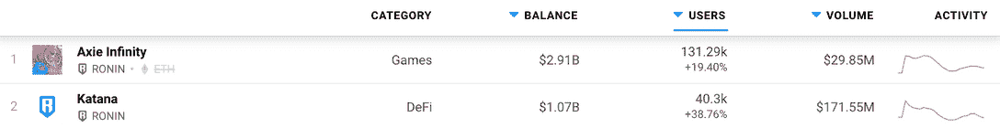
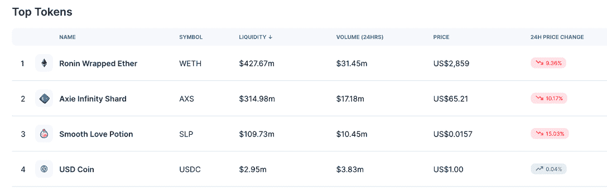
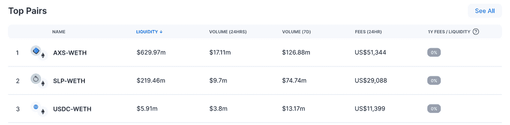

# Axie Infinity Builders 计划促进浪人活动

> 原文：<https://web.archive.org/web/https://dappradar.com/blog/axie-infinity-builders-program-boosts-ronin-activity>

## 新的建设者计划和发布机制带来了人群

领先的即玩即赚游戏 Axie Infinity 推出了新的构建程序和发布机制，这使得更多用户本周开始使用其 Ronin sidechain。这项新举措允许社区成员为游戏生态系统的发展做出贡献。因此，在过去的 24 小时内，分散式交换武士刀和玩赚游戏 Axie Infinity 的活动激增。

自宣布以来，Axie Infinity 已经吸引了超过[近 20%的用户钱包，使这一数字超过 13 万。而 Katana，本地分散的 Ronin 交换，方便玩家用户活动的令牌交换，跃升了近 40%。](/web/20220930102237/https://dappradar.com/blog/axie-infinity-welcomes-members-in-new-builders-program/)

Katana 在过去 24 小时内处理了超过 [82，000 笔交易，并且仅允许 Axie 平台、SLP 和 AXS 的本地令牌之间的互换。USDC 和韦德可以用来套现，HODL 可以用来交换球员。从数据来看，Ronin Wrapped Ether (WETH)的交易量超过 3100 万美元，而 AXS token 24 小时交易量刚刚超过 1700 万美元。](https://web.archive.org/web/20220930102237/https://katana-analytics.roninchain.com/home)

交易最多的是 AXS-韦瑟和 SLP-韦瑟，因为玩家继续在游戏中赚取和利用 SLP，并让 AXS 参与治理和未来的决策。

然而，这并不是 Sky Mavis 本周的唯一声明。工作室还宣布推出一个备受期待的游戏内功能，玩家现在有机会释放他们的 Axies，在 Lunacia 独立生活。在技术层面上，这意味着游戏玩家将摧毁他们自己的 Axies。作为回报，他们将获得专属礼物。目前，这些礼物将以独占土地物品的形式出现，玩家可以将装饰物品放在他们的虚拟土地上。

在发布机制的预期中，玩家可能会在市场上获得更多[低价 Axie](https://web.archive.org/web/20220930102237/https://marketplace.axieinfinity.com/axie/?sort=Latest&auctionTypes=Sale)来发布它们并获得土地物品，随着游戏的进一步发展，这些物品可能会变得更有价值。

## 轴进化

虽然 Axie Infinity 是游戏赚取领域的明显市场领导者，但许多追求者紧随其后。进化是生存的关键，也是在一个充斥着新进入者的领域保持领先的关键。目前，游戏推动区块链产业更接近大众化，因为大约有一半连接到区块链的钱包与游戏 dapps 互动。

在原有平台上添加构建 Axie 主题迷你游戏的能力是一种在不增加核心团队的情况下推动显著用户活动和发展平台的方式。反过来，他们为 AXS 治理令牌带来更多价值，并将 Axie Infinity 进一步推向元宇宙。此外，该运动要求开发商在他们的游戏设计中使用 AXS 或 SLP，创造了对这两种标志的需求。

 NewsletterUnsubscribe at any time. [T&Cs](https://web.archive.org/web/20220930102237/https://dappradar.com/terms) and [Privacy Policy](https://web.archive.org/web/20220930102237/https://dappradar.com/privacy-policy)

***以上不构成投资建议。此处给出的信息仅供参考。请行使尽职调查，做你的研究。作者持有 ETH、BTC、AGIX、HEX、LINK、GRT、CRO、OMI、不可变 X、ENS、GALA、AVASTR、GMEE、CUBE、RADAR、FLOW、FTM、BNB、SPS、WRLD、ATOM 和 ADA。***