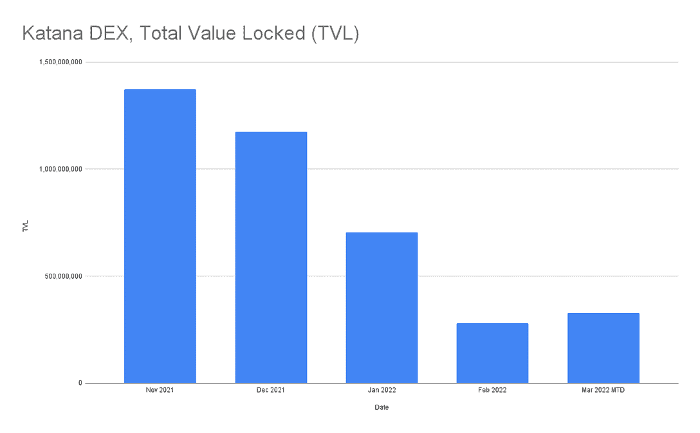
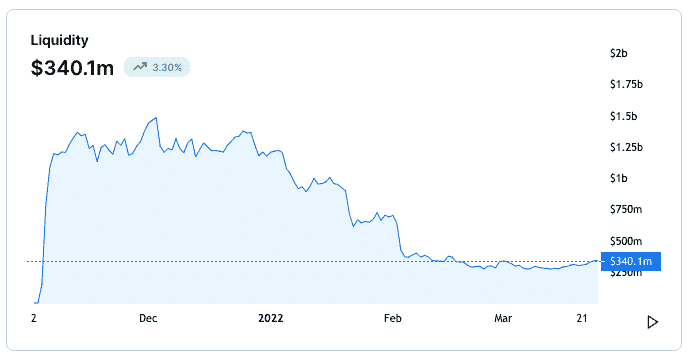
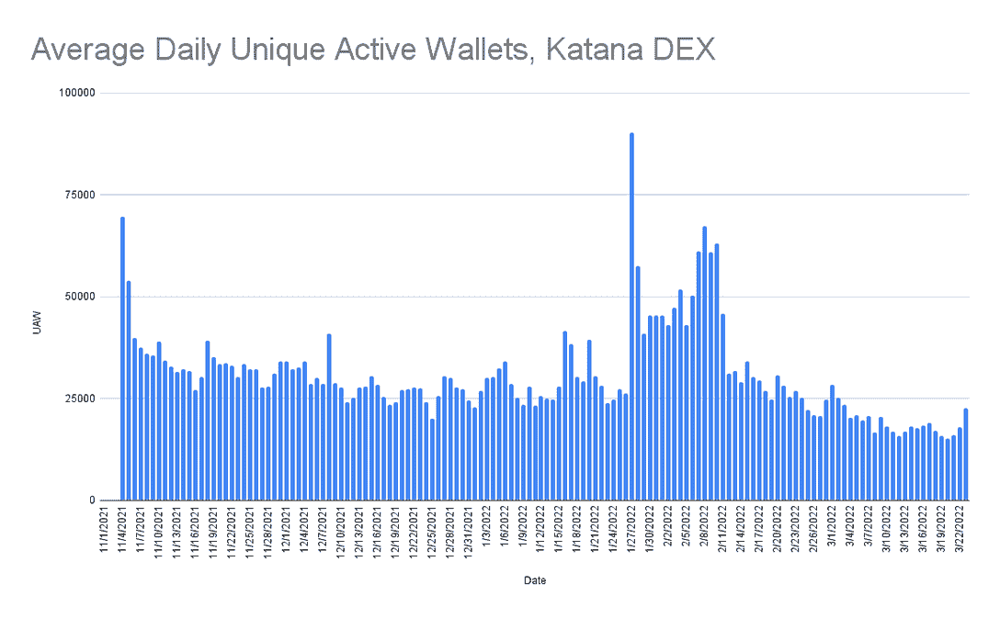
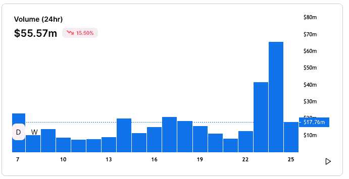
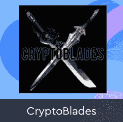
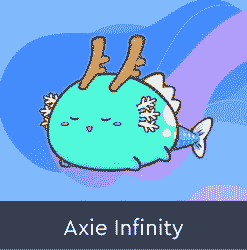
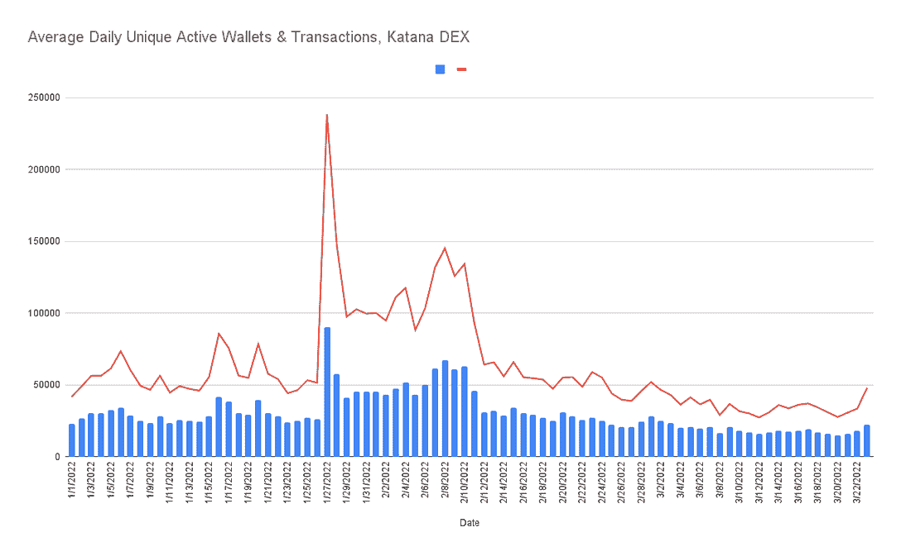
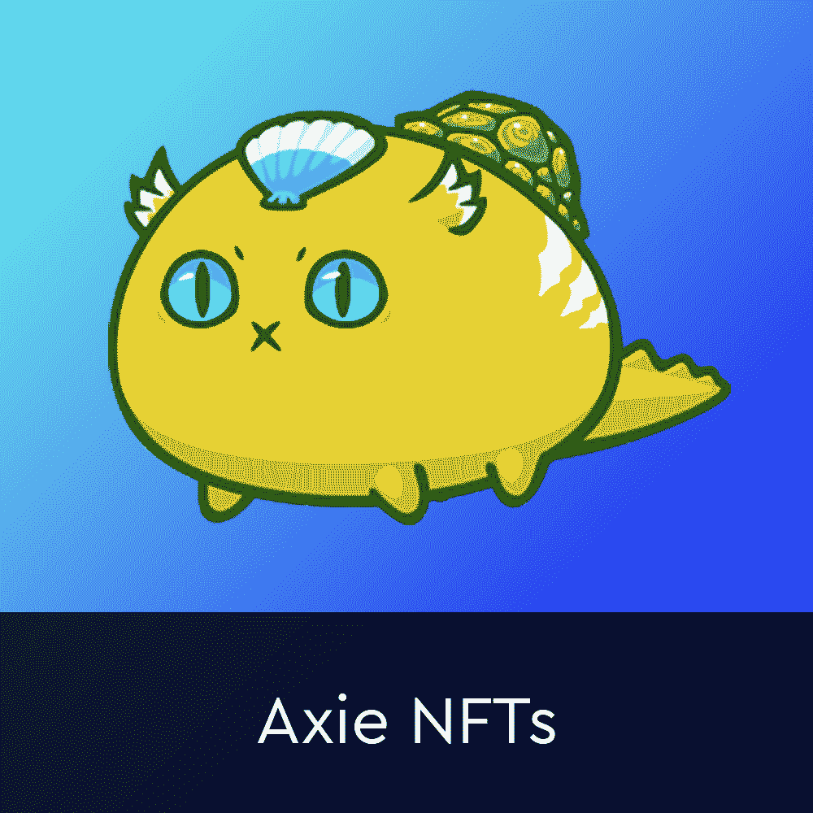

# Axie Infinity 参与升空和武士刀 DEX 显示复出

> 原文：<https://web.archive.org/web/https://dappradar.com/blog/axie-infinity-engages-lift-off-katana-dex-shows-comeback>

## 定制 Axie DEX 在经历了艰难的第一季度后显示出了生机

在加密价格下跌的背景下，领先的游戏赚取游戏 Axie Infinity 的定制 DEX 武士刀在 2022 年 1 月和 2 月初达到历史高点后，TVL 和活跃度都出现了严重下降。现在，随着空间的平静和价格的下跌将小麦从谷壳中分离出来，武士刀在 Axie Infinity 的一系列内向开发升级和令牌实用程序中显示出坚实的回归。

随着 2021 年接近尾声，游戏，更具体地说，即玩即赚行业[引领区块链产业](https://web.archive.org/web/20221129083444/https://dappradar.com/blog/2021-dapp-industry-report/)。许多新玩家和投资者被吸引到[行业现象 Axie Infinity](https://web.archive.org/web/20221129083444/https://dappradar.com/multichain/games/axie-infinity) 来投资或游戏和赚钱。

武士刀是由 Axie Infinity 背后的团队 Sky Mavis 推出的定制分散式交易所,它采用定制的区块链解决方案，也是由 Sky Mavis，Ronin 构建的。[浪人区块链](/web/20221129083444/https://dappradar.com/blog/ronin-now-solves-ethereum-problems-for-axie-infinity/)也有自己的令牌罗恩，2022 年 1 月底发布。

武士刀有助于将 Axie 生态系统中的代币兑换成可兑换的收益券。它还允许用户提供流动资金和产出农场资产来赚取回报。建立它的主要动机是为了避免以太坊区块链油费，并允许玩家快速和低成本地进出位置。此外，核心受众是那些与 Axie Infinity 合作的人，而不是随机用户。

另外值得一提的是[虽然 TVL 是整个区块链和 dapp 行业广泛使用的指标](/web/20221129083444/https://dappradar.com/blog/the-trouble-with-tvl/)，但这一指标的下降反映了智能合约中锁定的代币的美元价值下降。因此，随着价格下跌，TVL 也在下跌。

[Source: DappRadar](https://web.archive.org/web/20221129083444/https://dappradar.com/)

该指数将于 2021 年第四季度飙升，于 12 月 3 日达到顶峰，TVL 的市值攀升至 14 亿美元以上。具体来说，截至发稿时，TVL 为 3.35 亿美元，不到三分之一。如前所述，由于 AXS 的成本从 12 月 3 日的 134 美元下降到 50 美元左右，直到最近价格开始回升，令牌价格下降在这里发挥了作用。尽管如此，价格下跌并没有反映出武士刀在 TVL 的整体下跌，这意味着随着赚钱变得更加困难，玩家开始撤回资金并退出游戏——为真正的 Axie Infinity 社区和团队介入并创新铺平了道路。

## 用户呢？

当钱包连接到武士刀时，它们会交换代币，下注代币，或提供流动性。后两种行为是造成 TVL 数字的原因。如前所述，TVL 大幅下跌，但据评估，并不完全是由于 Axie 令牌的价格下跌。随着市场开始显示出看跌信号，人们开始将资金完全撤出武士刀。

这一想法与该时间段内连接到武士刀的唯一活动钱包的数量一致。我们看到用户和交易的激增，这是由急于转移资金和其他更乐观的投资者急于将资金存入 Katana DEX 造成的。然后，我们看到活动下降，直到最近，恰逢一个更积极的游戏领先令牌 AXS 的前景。

[Source: DappRadar](https://web.archive.org/web/20221129083444/https://dappradar.com/)

## 阿西把小麦从糠皮中挑选出来

铁杆玩家和更乐观的投资者留了下来，而更不稳定、或许没受过教育的用户跳了出来。而且很多人玩 Axie 是为了赚钱，而不是为了玩一款游戏。当好时光结束时，新手似乎已经跳出来了，由于玩家的丰富，奖励变得微不足道。与此同时，硬核社区留下来构建 Axie Infinity 冒险的下一阶段。

看看 24 小时的交易量，我们可以看到，随着核心社区投入时间和精力确保 Axie Infinity 仍然是领先的游戏赚取游戏，Katana 度过了美好的一周。更重要的是，维持并为生态系统带来更多的流动性。3 月 22 日，交易量为 1210 万美元，两天后，即 3 月 24 日，交易量增加到 6500 多万美元。

## 育种费用调整

12 月 8 日，[我们报道了](https://web.archive.org/web/20221129083444/https://dappradar.com/blog/axie-infinity-boosts-slp-token-with-breeding-fee-adjustments) Axie Infinity 在来自其核心社区的巨大压力下调整育种费用。Sky Mavis 宣布改变 SLP 育种费，这意味着玩家需要支付三倍的 SLP 和一半的 AXS 来创造一个新的 NFT 游戏角色。

SLP 是一种加密令牌，这意味着玩家可以在市场上出售令牌。然后，其他游戏玩家可以购买代币，并使用这些代币来创建或培育新的 Axie 游戏角色。每个 Axie 都有数量有限的“品种”,每次使用它们时，育种成本都会增加。在宣布之前，SLP 本土的代币是 0.041 美元。改变后，价格猛涨了 0.05 美元以上。因此，现在在 SLP 饲养一只 Axie 大约需要 85 美元，在 AXS 需要 55 美元。这使得创建一个 Axie 游戏角色的总成本达到 140 美元。然而，每个玩家都需要 3 个。

三个月前，SLP 一直处于 0.10 美元的区间，远低于 2021 年 7 月近 0.40 美元的历史高点。由于 Axie 的从游戏到赚钱的机制，发展中国家受疫情病毒影响最严重的人转向 Axie 作为一个安全网。随着象征性价格的下降，人们的收入减少了。结果，游戏的经济在现实生活中付出了代价，让人们对象征性的价格变化直言不讳。

房间里的大象是，只有当新球员涌入时，才会有对 SLP 的需求。随着代币价格下跌，从游戏中谋生的潜力消失了。这是一个恶性循环。突然之间，SLP 的月收入低于最低工资水平，当家庭依赖这种收入时，这就成了一个问题。

## 康复之路

Sky Mavis 认识到了这一点，并开始致力于各种新产品和调整，以添加到 Axie Infinity 生态系统中，并承诺彻底检查战斗系统并引入陆地游戏。此外，引入资源，并允许部分升级。此外，SLP 将成为这些新产品的核心。

1 月 20 日，[我们报道了](https://web.archive.org/web/20221129083444/https://dappradar.com/blog/axie-infinity-welcomes-members-in-new-builders-program) Axie Infinity 推出了一个构建者计划，该计划将允许社区成员为游戏生态系统的开发做出贡献。Builders 计划为 Sky Mavis 专家团队提供资金和访问权限，符合条件的团队将在 AXS 获得至少 5000 美元的资助，用于他们的项目。建设者计划的总预算是 5000 AXS，或约 40 万美元。

该计划更侧重于扩展 Axie Infinity 生态系统，而不是建立在原始游戏的基础上。Sky Mavis 希望推动社区使用 Axie 品牌创建更多的游戏和工具。这种工具的例子包括 Axie 主题的迷你游戏，如塔防和象棋以及数据跟踪工具。重要的是，这些游戏将需要使用 [AXS](https://web.archive.org/web/20221129083444/https://dappradar.com/hub/swap/eth/ETH/AXS) 或 [SLP](https://web.archive.org/web/20221129083444/https://dappradar.com/hub/token/eth/SLP?from=0xcc8fa225d80b9c7d42f96e9570156c65d6caaa25) ，此外，他们还需要烧掉 SLP 或把 AXS 送到社区金库。减少流通中代币数量的机制有助于抬高价格。

[<picture></picture>](https://web.archive.org/web/20221129083444/https://dappradar.com/binance-smart-chain/games/cryptoblades-1)[<picture></picture>](https://web.archive.org/web/20221129083444/https://dappradar.com/ethereum/games/axie-infinity)[<picture></picture>](https://web.archive.org/web/20221129083444/https://dappradar.com/wax/games/alien-worlds)

为了补充建设者计划，Axie 还推出了 NFT 燃烧事件。玩家有机会释放他们的 Axies 在 Lunacia 独立生活。在技术层面上，玩家必须摧毁他们的 Axie 生物。

作为回报，他们的 Axies 将发回独家礼物。这些礼物将以农历新年专属土地项目的形式出现。此外，这些都是化妆品，玩家可以在他们的土地上炫耀。除了有保证的独家礼物外，将 Axie 放归野外还会让主人的钱包进入抽奖活动以赢取奖品。包括 5 枚 Axie Origin Coin (AOC)代币、10 件 Kitsune 神秘地物品和 100 件 CoinGecko 或 Ganbaru CrypTon 史诗地物品。

在这些声明之后， [Axie Infinity 吸引了](https://web.archive.org/web/20221129083444/https://dappradar.com/multichain/games/axie-infinity)多了近 20%的用户钱包，而武士刀用户活跃度跃升了近 40%。而且，NFTs 的燃烧达到了预期的效果，Axie 再次跃居 DappRadar 游戏排名第一。
Katana 在随后的 24 小时内处理了超过 [82，000 笔交易，并且只允许在 Axie 平台、SLP 和 AXS 的本地令牌之间进行互换。USDC 和韦德可以用来套现，HODL 可以用来交换球员。](https://web.archive.org/web/20221129083444/https://katana-analytics.roninchain.com/home)

[Source: DappRadar](https://web.archive.org/web/20221129083444/https://dappradar.com/)

## Axie Origin 即将推出

然后，在 2 月 14 日，我们报道了 Axie 将发布 Axie Origin，并为 Axie 生态系统带来全新水平的可访问性。Sky Mavis 团队发布了即将到来的游戏更新细节，Alpha 测试版本可能会在 2022 年 3 月推出。

根据[公告](https://web.archive.org/web/20221129083444/https://axie.substack.com/p/origin)，Axie Infinity: Origin 将提供一系列新功能。最重要的是，Sky Mavis 希望进一步推动 [Axie Infinity](https://web.archive.org/web/20221129083444/https://dappradar.com/ronin/games/axie-infinity) 平台的采用。为了实现这一点，团队决定给所有 Origin 玩家三个免费轴。这无形中消除了新人的准入门槛。重要的是，这些起始轴不是 NFT，玩家不能通过使用它们获得 SLP。

这对于 Axie 玩家现在的体验是一个重大的改变。一个玩家现在需要购买 3 把斧头来组队并开始游戏。随着 Axie Infinity: Origin 的推出，入口点将完全免费，为游戏提供潜在的更大受众。

在之前的设置中，玩家可以等待一个回合，以保存他们的能量或卡片。然而，有了原点，就只有连续的转弯了。这意味着卡片和能量将持续给定的回合，玩家将只有一次机会使用它们。像这样动摇游戏机制将会给 [Axie Infinity](https://web.archive.org/web/20221129083444/https://dappradar.com/ronin/games/axie-infinity) 带来参与度的提升。玩家将不得不仔细考虑如何最好地利用他们每回合获得的卡片和能量。在撰写本文时，阿谢已经进一步宣布 Origin 指日可待。Origin 的软发布将分阶段进行，大约在本月底首次在桌面上推出。

此外，陆地游戏预计将于今年晚些时候推出。在第一个测试阶段，这些土地将主要提供给土地所有者，因为 Axie 专注于制作一个新的城镇建设游戏。更新提到，他们计划引入链外典当轴为土地所有者做他们的土地内的任务。随着更新，他们说，他们正在寻找纳入 AXS 作为一个资源，出售制作材料给 NPC。

[https://web.archive.org/web/20221129083444if_/https://www.youtube.com/embed/o6kAdSYR0uQ?feature=oembed](https://web.archive.org/web/20221129083444if_/https://www.youtube.com/embed/o6kAdSYR0uQ?feature=oembed)

2021 年，两个最大的元宇宙平台，分散土地和沙盒，在数字房地产方面的总交易量约为 4.6 亿美元。Axie Infinity 在他们的陆地游戏中建造了他们各自的元宇宙世界以获得有价值的资源。因此，Axie 将很快积极进入区块链空间最热门的发展之一:虚拟土地。

## 保持领先地位

DappRadar 将继续监测 Axie Infinity，因为 Sky Mavis 团队正在推动进一步扩展这个生态系统。虽然游戏开始时是一个简单的回合制战斗者，但 Axie Infinity 现在已经成为区块链上一个由 dapps 和功能组成的完整宇宙。

随着 Ronin 侧链的引入，Sky Mavis 不仅为游戏提供了一个几乎没有气体的环境，还提供了基本的 DeFi 产品。Katana DEX 和 RON token 在 Axie Infinity 品牌的成功中发挥了巨大作用。随着 Axie Infinity: Origin 的推出，Sky Mavis 希望进一步扩大该品牌的影响力。

要了解更多关于 [Axie Infinity](https://web.archive.org/web/20221129083444/https://dappradar.com/ronin/games/axie-infinity) 、[浪人](https://web.archive.org/web/20221129083444/https://dappradar.com/rankings/protocol/ronin)和 Axie 生态系统的本地令牌，请查看下面的链接。此外，你可以在 [Twitter](https://web.archive.org/web/20221129083444/https://twitter.com/dappradar) 上关注 DappRadar，并加入我们的 [Discord](https://web.archive.org/web/20221129083444/https://discord.gg/4ybbssrHkm) 社区，首先了解最新的游戏和游戏赚钱新闻。

[<picture></picture>](https://web.archive.org/web/20221129083444/https://dappradar.com/ethereum/games/axie-infinity)[<picture></picture>](https://web.archive.org/web/20221129083444/https://dappradar.com/blog/axie-infinity-biggest-contributor-to-august-game-nft-trading/)[<picture></picture>](https://web.archive.org/web/20221129083444/https://dappradar.com/hub/swap/eth/ETH/AXS?to=0xbb0e17ef65f82ab018d8edd776e8dd940327b28b)

***以上不构成投资建议。此处给出的信息仅供参考。请行使尽职调查，做你的研究。作者持有多种加密货币的头寸，包括 BTC、瑞士法郎和雷达。***

 NewsletterUnsubscribe at any time. [T&Cs](https://web.archive.org/web/20221129083444/https://dappradar.com/terms) and [Privacy Policy](https://web.archive.org/web/20221129083444/https://dappradar.com/privacy-policy)