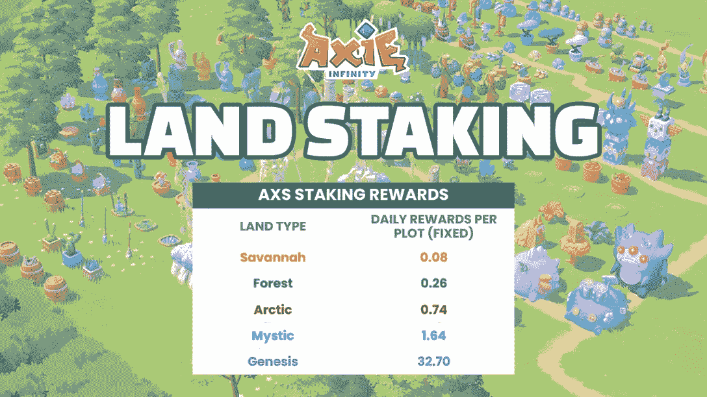
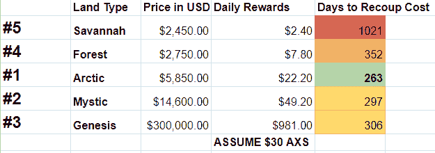
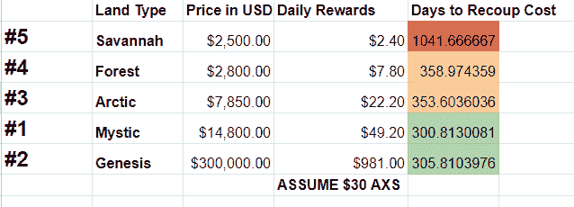
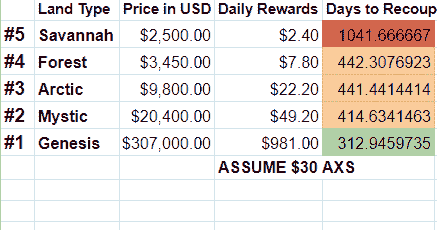
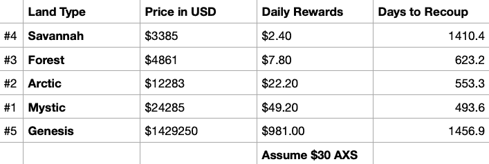

# axie infinity 土地饥饿导致价格波动

> 原文：<https://web.archive.org/web/https://dappradar.com/blog/axie-infinity-land-staking-causes-price-volatility>

## 土地价格变化如此之快，以至于做出最佳决策成了一个精确把握时机的问题

5 月 3 日，Sky Mavis 宣布了其旗舰和大获成功的游戏 Axie Infinity 中土地的标桩过程。在此后的 12 个小时里，随着人们寻找最佳投资机会，土地价格一直在波动。

**总结**

*   Sky Mavis 最近宣布了 Axie Infinity 中的土地游戏，随后进行了土地标桩更新。
*   ***[Axie Infinity](https://web.archive.org/web/20220925214634/https://dappradar.com/multichain/games/axie-infinity) 将从每月 337，500 [AXS](https://web.archive.org/web/20220925214634/https://dappradar.com/hub/token/eth/AXS?from=0xbb0e17ef65f82ab018d8edd776e8dd940327b28b) 的资金池中奖励土地赌注者。越贵的土地给赌注者带来越多的 AXS。***
*   自从 Sky Mavis 向用户介绍了其新的赌注机制后，顶级地块的价格大幅上涨。
*   到目前为止，这家越南公司经历了艰难的 2022 年，[浪人桥](https://web.archive.org/web/20220925214634/https://dappradar.com/ethereum/defi/ronin-bridge)漏洞和游戏中的经济问题对游戏之前的强势地位产生了负面影响。

DappRadar [早在四月份就报道过陆地游戏即将进入 Axie Infinity。既然 Sky Mavis 透露了他们的土地标桩计划，我们有机会评估它是如何工作的，以及他们打算如何推进它。](https://web.archive.org/web/20220925214634/https://dappradar.com/blog/how-does-axie-infinity-land-gameplay-work)

我们还将看看什么是最有利可图的土地，以及用户需要多久才能收回成本。

## Axie Infinity 中的土地标桩是如何工作的

Sky Mavis 宣布,“Axie Infinity 土地标桩是一项旨在增加土地所有者对本地令牌 [AXS](https://web.archive.org/web/20220925214634/https://dappradar.com/hub/token/eth/AXS?from=0xbb0e17ef65f82ab018d8edd776e8dd940327b28b) 的所有权的举措”。玩家可以通过耕种他们的土地来获得奖励；不同类别的土地决定了玩家可以获得的资源类型。

Sky Mavis 的新土地标桩功能将使持有者能够锁定他们的土地。这使得土地更加稀缺，因为它不能出售，这反过来又保持了它的价值，并让持有人满意。为此，赌注者在 AXS 会得到回报。

下表显示了每个地块的每日奖励。这些奖励是固定的，每月 337，500 AXS(在撰写本文时为 10，087，875 美元)，Sky Mavis 已经将这些奖励留给用户，以奖励他们的土地。

Axie Infinity graphic showing AXS rewards

## 在 Axie Infinity 买什么地最好？

一位 Twitter 用户发布了这张表格，显示购买哪块土地最有利可图。它表明，购买一块北极土地将使买方能够最迅速地收回成本，然后开始盈利。假设 AXS 原油价格保持在 30 美元左右，盈亏平衡时间为 263 天。

Twitter user’s first spreadsheet

但是有一个问题。一旦人们发现北极的土地是最有利可图的，他们就开始把它买下来，很快，它就不是最有利可图的了。几个小时后，这位 Twitter 用户发布了一个更新版的表格:\

Twitter user’s second spreadsheet

然后另一个:

Twitter user’s third spreadsheet

很快就清楚了，试图维护这个电子表格的更新版本就像试图在飓风中抓住一个塑料袋。对于任何想得到最好价格的人来说，他们需要自己计算并立即执行交易。就在发表这篇文章之前，我整理了自己的表格来展示现在的情况。

My updated table showing Mystic as the current best investment

这些价格会很快变化，所以强烈建议您制作自己的电子表格。

从这一系列表格中我们还可以看到，三块最好的土地——北极、神秘和创世纪——的土地价格上涨如此之快，以至于大多数人都买不起其中的一块。类似于宇迦实验室的另一边，在 Axie Infinity 拥有一块像样的土地现在是最富有的人的领地。

## 对于 Sky Mavis 和 Axie Infinity 来说，2022 年是艰难的一年

Sky Mavis 最近的两个公告——陆地游戏和赌注——是在一系列危机中出现的，这些危机动摇了这个曾经至高无上的游戏赚取平台。这款游戏在 DappRadar 的 dapp 排名中的下滑证明了 Axie Infinity 今年的糟糕开局。

今年 Sky Mavis 的大新闻是 [Ronin bridge 漏洞](https://web.archive.org/web/20220925214634/https://dappradar.com/blog/axie-infinity-activity-plummets-after-600-million-ronin-exploit)黑客从用户那里窃取了超过 6 亿美元。在接下来的 24 小时里，游戏的活跃玩家减少了 11%，本地市场失去了 17%的用户。

DappRadar 还在二月份报告称，通货膨胀问题和增长停滞对游戏在用户中的受欢迎程度产生了负面影响。

这两个问题都是在一个熊市的背景下出现的，在这个熊市中，大多数加密货币和本地代币的价值都下降了。外部事件，如乌克兰战争、不断上涨的大宗商品价格和中国持续的 Covid 问题，都在促使人们削减风险，尽可能地存钱。

看看 Sky Mavis 的新土地投资是否会对 Axie Infinity 的业绩产生积极影响，这将是一件有趣的事情。你可以在我们的[排名](https://web.archive.org/web/20220925214634/https://dappradar.com/rankings)页面中了解它的最新排名，并看看它的[土地 NFTs](https://web.archive.org/web/20220925214634/https://dappradar.com/nft) 表现如何。

关注我们的[博客](https://web.archive.org/web/20220925214634/https://dappradar.com/blog/)以了解该平台正在发生的故事，并在[推特](https://web.archive.org/web/20220925214634/https://twitter.com/DappRadar)上关注我们的突发新闻。世界协调时每周五下午 5 点收听我们的新播客[脱离区块链](https://web.archive.org/web/20220925214634/https://www.youtube.com/watch?v=uASQIhKkczA&list=PL0L1ZfahiAoOq8hl_dUQBxSCiQIGtaGJK)，在这里我们将谈论来自 Web3、元宇宙、DeFI 和 NFTs 世界的所有最新故事。