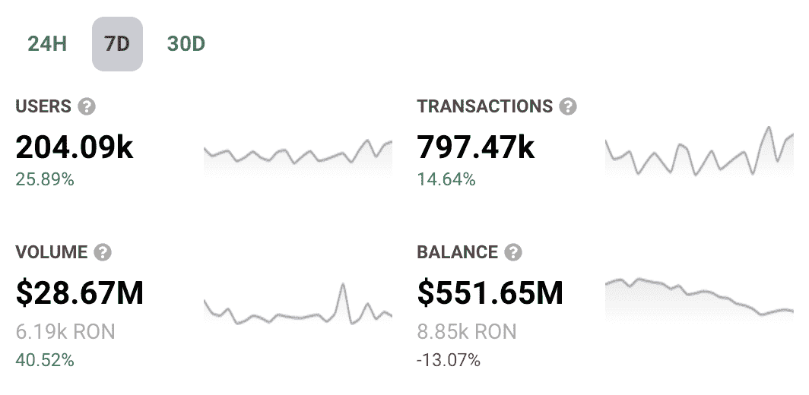

# axie 无限之地星际争霸是活的

> 原文：<https://web.archive.org/web/https://dappradar.com/blog/axie-infinity-land-staking-is-live>

## 无限轴中的土地将成为游戏的一个重要特征

用户现在可以在 Axie Infinity 中下注他们的土地，并获得 AXS 代币作为奖励。这款游戏背后的公司 Sky Mavis 今天宣布了这一消息。新闻稿还暗示，随着更多实用程序的加入，这只是 land 在 Axie Infinity 生态系统中的旅程的开始。

**总结**

*   对于 Axie Infinity 来说，2022 年是跌宕起伏的一年，但该平台最近的消息大多是积极的。看起来今年下半年对 Sky Mavis 来说是个好年头。
*   *[***【AXS】***](https://web.archive.org/web/20220813150058/https://dappradar.com/hub/token/eth/AXS?from=0xbb0e17ef65f82ab018d8edd776e8dd940327b28b)***的现价比其历史最高价低 91.32%。如果 Sky Mavis 能让其旗舰头衔接近过去的位置，这个低价可能看起来很划算。****
*   ****购买土地，需要去***[***Axie Infinity market place***](https://web.archive.org/web/20220813150058/https://marketplace.axieinfinity.com/land/?type=Savannah)***。持有人可以*** [***押上自己的土地***](https://web.archive.org/web/20220813150058/https://stake.axieinfinity.com/land/) ***，即按*** [***这一块******计息。***](https://web.archive.org/web/20220813150058/https://explorer.roninchain.com/block/15021773)*

 *土地所有者可以用他们的土地做赌注，并获得 AXS 代币作为奖励。这是 Sky Mavis 公司已经承诺了一段时间的，该公司希望将它的承诺贯彻到底。

尽管土地标桩是向前迈出的一大步，但该团队仍在朝着更大规模的 Project K 项目迈进。Project K 是该平台试图将 Axie Infinity 转变为一个重要的数字生态系统的代号。此举将见证虚拟世界在蓬勃发展的元宇宙成为一个大玩家。

不过在此之前，用户可以通过标桩他们的土地来获得代币。尽管第一块土地将于 2019 年出售，但这是土地所有者享有的第一个适当的公用事业。

## 星际争霸上线了

Axie Infinity 的土地标桩计划已经启动，并准备好回报社区。2022 年将永远是登陆平台的一年。Axie Infinity 的白皮书中的[路线图已经指出陆地游戏是今年的一个重要里程碑。](https://web.archive.org/web/20220813150058/https://whitepaper.axieinfinity.com/roadmap)

随着最近[大卖地](https://web.archive.org/web/20220813150058/https://dappradar.com/blog/axie-infinity-land-nfts-attract-new-investments/)和[增加土地效用](https://web.archive.org/web/20220813150058/https://dappradar.com/blog/6-things-you-need-to-know-about-axie-infinity-land-alpha/)，Sky Mavis 宣布其土地标桩功能也就不足为奇了。用户可以在一次交易中下注最多三块土地，并根据其土地的大小和稀有程度，获得不同级别的土著代币 AXS。

[https://web.archive.org/web/20220813150058if_/https://www.youtube.com/embed/GbdlbDCpcI0?start=3&feature=oembed](https://web.archive.org/web/20220813150058if_/https://www.youtube.com/embed/GbdlbDCpcI0?start=3&feature=oembed)

Sky Mavis 团队在最近的 Substack 帖子中写道:“Axie Infinity 令人难以置信的增长和成功为我们提供了一个为陆地创造游戏体验的广阔愿景的机会，这远远超出了我们在最初发布这一游戏概念时分享的最初描述。”。

似乎 Axie Infinity 中土地的目的随着游戏的成长和 Sky Mavis 对新机会和想法的反应而不断变化。说到这里，该团队向其用户保证，他们致力于兑现他们早先的承诺，即持有土地的土地所有者将获得 AXS 作为回报。

要购买 Axie Infinity 土地，你需要[访问 Axie Infinity 市场](https://web.archive.org/web/20220813150058/https://marketplace.axieinfinity.com/land/)，那里最便宜的地块目前的价格是 1.2 ETH(11264 美元)。这些价格随时都在变化，所以在购买之前一定要做好调查。

## Axie Infinity 的命运正在转变

2022 年对于 Axie Infinity 来说是喜忧参半的一年。首先，他们游戏内资产的价值从 2021 年的高点下降了。然后，平台被打破纪录的 6 亿美元的浪人桥攻击震惊了。

但最近的事件表明，对于其中一个最大的游戏赚钱平台来说，事情可能会有所转机。

几块 Axie Infinity 地块最近以每块超过 130 ETH 的价格售出。Sky Mavis 举办了 AxieCon: Barcelona，这是 Axie 社区最大的真实事件之一。该团队还宣布了 Axie Builders 计划的第一位获奖者。

随着 Sky Mavis 在整个生态系统中的应用增加，一个陆地游戏玩法预告也发布了。随着人们对 Axie Infinity 重拾信心，所有这些进步都导致了用户数量、交易数量和交易量的上升。

[DappRadar’s 7-day analytics for Axie Infinity](https://web.archive.org/web/20220813150058/https://dappradar.com/multichain/games/axie-infinity)

[<picture></picture>](https://web.archive.org/web/20220813150058/https://dappradar.com/hub/nft-explorer) NewsletterUnsubscribe at any time. [T&Cs](https://web.archive.org/web/20220813150058/https://dappradar.com/terms) and [Privacy Policy](https://web.archive.org/web/20220813150058/https://dappradar.com/privacy-policy)*