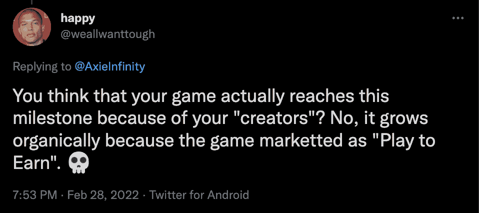
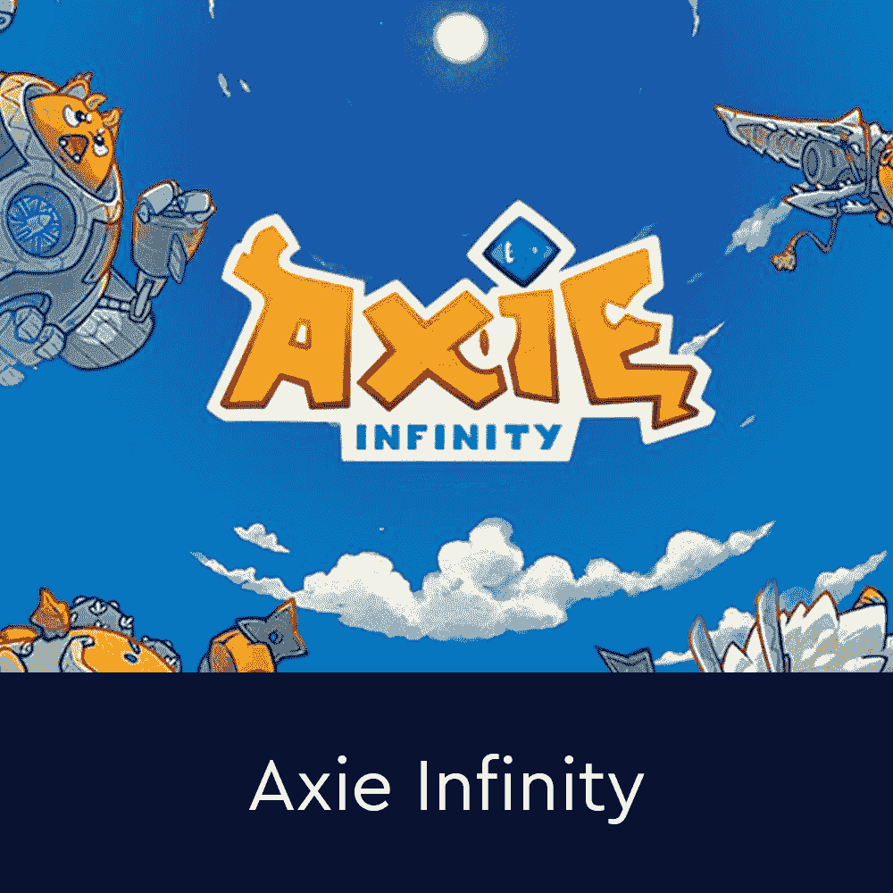

# Axie Infinity 推出新收费结构，玩家不同意

> 原文：<https://web.archive.org/web/https://dappradar.com/blog/axie-infinity-launches-new-fee-structure-players-disagree>

## Axie Marketplace 的交易费将跃升至 5.25%

Axie Infinity 宣布更新其本地市场的费用结构。从 3 月 7 日开始，T2 将提高交易费用。目前，Axie Marketplace 收取的交易费用为 4.25% 。**然而，从下周开始，它将上涨一个百分点至 5.25%。**

这种增长背后的原因是允许创作者因 Axie Infinity 社区的增长而获得奖励。根据 Sky mavis 的说法，这将使生态系统中的每个人受益。根据官方[公告](https://web.archive.org/web/20221228023736/https://axie.substack.com/p/marketplacefee?utm_source=url&s=r)，下周 Sky Mavis 将推出 Axie Creator 代码。这将允许与 Axie 社交媒体社区分享其作品、游戏玩法和游戏想法的 Axie 支持者获得贡献奖励。

实质上，通过将市场费用提高到所有交易的 5.25%，Axie Infinity 团队可以奖励推荐新玩家到游戏的创作者。最重要的是，增加费用的目的不是影响 Axie 社区的财政，而是通过 creator codes 计划回馈社会。

创作者代码在游戏行业中并不是一种革命性的方法。《火箭联盟》和《堡垒之夜》等大型游戏的创造者 Epic Games 也在他们的 Epic Games 商店中使用它。然而，由于 Axie 拥有全球最大的游戏赚取社区之一，这似乎是该项目的一个有趣的步骤。

## Axie 玩家并不完全满意

创作者代码可能有利于那些拥有大量追随者和围绕其个人社交媒体账户的发达社区的玩家。不幸的是，创造者代码计划不会给每个人带来回报。虽然拥有足够追随者的精选玩家群体将有资格获得创造者代码，但所有玩家都必须支付更高的交易费。

一些玩家已经表达了他们对新机械师的担忧。一些人认为，新的费用上涨是不公平的，因为它将从所有球员那里拿走资金，只给少数人。此外，Axie 的粉丝指出，游戏正在有机增长，因为广泛的游戏赚取机制，而不是因为创作者和影响者。

其他玩家并不太担心 1%的费用增加，他们说这是一种奖励那些努力赚钱的内容创作者的流媒体和影响者的好方法。目前，市场上最便宜的 Axie 售价约为 22 美元，这意味着销售所得的 1%将价值 0.22 美元。

然而，如果我们看一下市场上最便宜的阿协土地 NFT，计算有点不同。在撰写本文时，市场上最便宜的 Axie land 售价为 2.5 ETH，约合 7436 美元。按照目前 4.5%的收费标准，这将让卖家多花 335 美元。然而，随着费用的增加，成本将跃升至 410 美元，额外的 75 美元将进入创作者基金。这不是一个可以忽略不计的增长，尤其是如果你要卖的 NFT 很贵的话。考虑到这一点，问题仍然存在，对生态系统的营销利益会超过玩家的不满吗？

随着新的改进和发展出现，DappRadar 将继续监测 Axie Infinity 生态系统。如果你想了解更多关于 Axie Infinity 的信息，请点击下面的链接。此外，您可以在 Twitter 上关注 DappRadar，以首先获得最新的 Axie 新闻。

[<picture></picture>](https://web.archive.org/web/20221228023736/https://dappradar.com/ethereum/games/axie-infinity)[<picture></picture>](https://web.archive.org/web/20221228023736/https://dappradar.com/blog/axie-infinity-biggest-contributor-to-august-game-nft-trading/)[<picture></picture>](https://web.archive.org/web/20221228023736/https://dappradar.com/hub/swap/eth/ETH/AXS?to=0xbb0e17ef65f82ab018d8edd776e8dd940327b28b) NewsletterUnsubscribe at any time. [T&Cs](https://web.archive.org/web/20221228023736/https://dappradar.com/terms) and [Privacy Policy](https://web.archive.org/web/20221228023736/https://dappradar.com/privacy-policy)