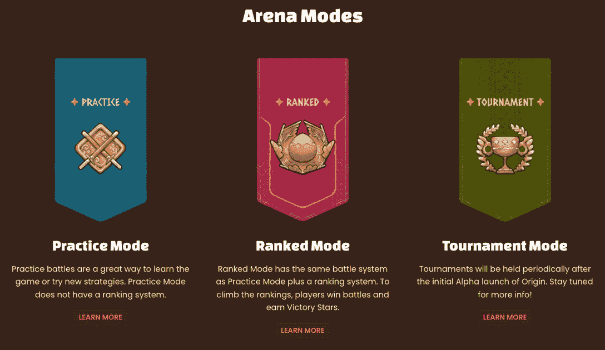
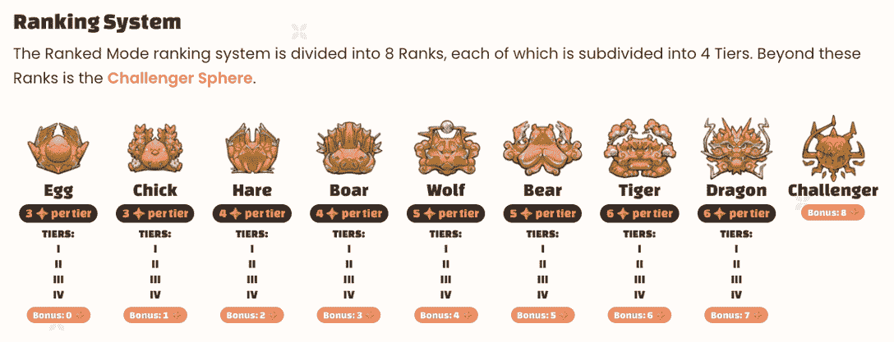
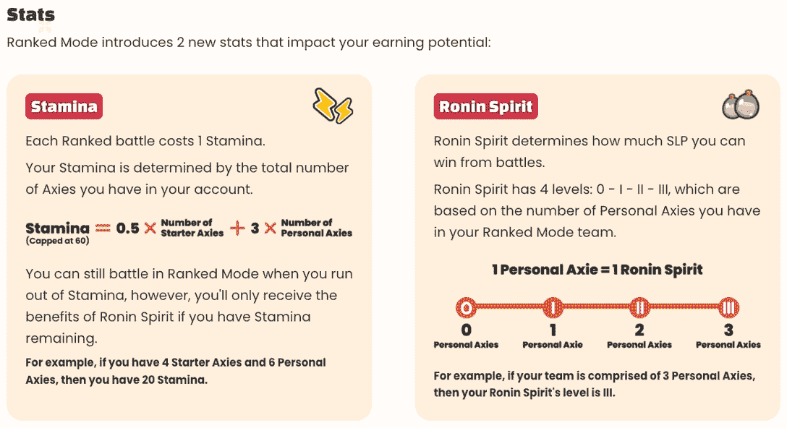
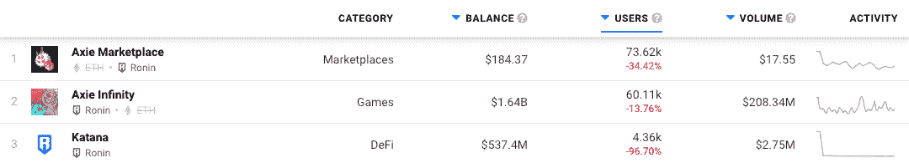
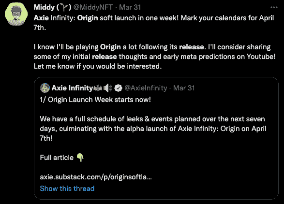

# Axie Infinity Origin 带来全新竞技场模式

> 原文：<https://web.archive.org/web/https://dappradar.com/blog/axie-infinity-origin-brings-brand-new-arena-mode>

## 玩家将能够凭借浪人精神赢得更多积分和奖励

Axie Infinity Origin 是即将于四月推出的最受关注的游戏赚取版本之一。该游戏将于 4 月 7 日推出，带来了一个完全改进的竞技场游戏模式。竞技场是玩家互相战斗的地方，为分数而战，以提升整体排名并获得 AXS 奖励。

***概要:***

*   [***轴协无限原点***](https://web.archive.org/web/20220930091120/https://dappradar.com/blog/sky-mavis-to-launch-axie-infinity-origin-amidst-hack-crisis/) ***将于 4 月 7 日发射***
*   ***游戏将为玩家*** 带来改版的[竞技场模式](https://web.archive.org/web/20220930091120/https://dappradar.com/blog/axie-infinity-origin-brings-brand-new-arena-mode/#Arena-battles)
*   ***变更为[排名结构](https://web.archive.org/web/20220930091120/https://dappradar.com/blog/axie-infinity-origin-brings-brand-new-arena-mode/#ranked)***
*   ***[收入潜力](https://web.archive.org/web/20220930091120/https://dappradar.com/blog/axie-infinity-origin-brings-brand-new-arena-mode/#earning-potential)变化***
*   *[***浪人钻营***](https://web.archive.org/web/20220930091120/https://dappradar.com/blog/axie-infinity-activity-plummets-after-600-million-ronin-exploit/) ***之后会发生什么？****

 *在由 [Axie 发布的详细概述中。Sky Mavis 概述了即将到来的 Origin 版本中主要游戏模式之一的主要变化。新的竞技场模式将允许玩家尝试他们的 Axie 团队对抗其他玩家。每年总共有 4 个竞技场赛季，每个赛季持续 2 个月，不同赛季之间有一个月的休息时间。](https://web.archive.org/web/20220930091120/https://welcome.axie.tech/arena)

竞技场战斗将分为三种模式:练习，排名，和比赛。练习赛和排名赛将随时开放，而锦标赛将定期组织。重要的是，玩家只能在排名和锦标赛模式中获得奖励。练习模式允许玩家测试他们的团队，并找出最佳的轴组合，以奖励模式战斗。

## Axie Infinity 原点排名战

Axie Infinity Origin 竞技场将有 8 个等级，每个等级有 4 个分支。当在等级模式下战斗时，玩家将通过攀爬等级和后续等级来收集星星。获得更高的等级会影响每个玩家的季末奖励。在每个起源赛季结束时，玩家会根据自己的排名获得 [AXS](https://web.archive.org/web/20220930091120/https://dappradar.com/hub/token/eth/AXS/ETH?from=0xbb0e17ef65f82ab018d8edd776e8dd940327b28b) 。

玩家在特定等级成功完成所有关卡还将获得奖励星星。重要的是，输掉战斗会影响玩家的排名。以平局结束的战斗不会影响星级分数，而赢得一场战斗会给玩家 2 颗星。每一层都要求玩家积累不同数量的星星才能进入下一层。

当玩家达到最终挑战者等级时，他们将进入挑战者范围。挑战者球体没有等级。取而代之的是，玩家的排名(第 1，第 2…第 100，等等)是基于从 Challenger sphere 胜利中收集到的胜利之星的数量。

## 新的统计将影响玩家的收入潜力

Axie Infinity 拥有游戏赚钱领域最大的奖学金项目之一。这使得玩家可以用其他人的 NFT 参与游戏。然而，新的 Axie Infinity Origin 将重点奖励拥有 Axie 的玩家。两个新引入的统计数据将根据玩家拥有的个人轴数而有所不同。个人 Axies 只是玩家直接购买的，而不是通过奖学金计划分发的。

为了在排名战中竞争，玩家将需要耐力点。耐力点上限为每个玩家每天 50 点。然而，并不是每个人都保证得到 50 分耐力。一个玩家获得的耐力取决于他们拥有的个人 Axies 的数量。

除了耐力，玩家还需要保持浪人精神。这个标准决定了 SLP 玩家将赢得多少战斗。再说一次，浪人精神分数会受到玩家拥有的轴数的影响。如果整个 3 轴队伍都是玩家所有，那么他们的浪人精神将等于 3，最大值。

## Axie 无穷原点能带来正的结果吗？

Axie Infinity Origin 是一个重要的版本，已经工作了很长时间。重要的是，[4 月 7 日的发布将发生在巨大的浪人桥事件](https://web.archive.org/web/20220930091120/https://dappradar.com/blog/sky-mavis-to-launch-axie-infinity-origin-amidst-hack-crisis/)之后仅仅几天。这一不幸事件是整个 Axie Infinity 生态系统的严重挫折。价值超过 6 . 15 亿美元的联邦理工学院和 USDC 失踪，这是迄今为止对从游戏到赚钱生态系统的最大利用。

根据 DappRadar 数据，生态系统中的所有 dapps 在过去七天中都经历了显著下降。Axie Infinity Marketplace 的用户数量减少了 34%,而游戏本身的活跃钱包数量下降了 13%。重要的是，如图中的突然下降所示，[武士刀敏捷](https://web.archive.org/web/20220930091120/https://dappradar.com/ronin/defi/katana)仍然被禁用。

尽管有负面的背景，Axie Infinity Origin 已经在 Axie 社区成员中引起了很多兴奋的讨论。更重要的是，Sky Mavis 组织了 Origin 发布周，其中包括一个关于游戏信息的水滴式发布。这为新版本带来了更多的兴奋和炒作。

DappRadar 将继续监控 Axie Infinity 生态系统，因为 Origin 版本即将发布。要了解更多关于 Axie Infinity 的信息，请查看下面有用的链接。此外，你可以在[的 Twitter](https://web.archive.org/web/20220930091120/https://twitter.com/dappradar) 上关注 DappRadar，首先获得最新的 Axie 新闻。

[<picture></picture>](https://web.archive.org/web/20220930091120/https://dappradar.com/ethereum/games/axie-infinity)[<picture></picture>](https://web.archive.org/web/20220930091120/https://dappradar.com/blog/axie-infinity-biggest-contributor-to-august-game-nft-trading/)[<picture></picture>](https://web.archive.org/web/20220930091120/https://dappradar.com/hub/swap/eth/ETH/AXS?to=0xbb0e17ef65f82ab018d8edd776e8dd940327b28b) NewsletterUnsubscribe at any time. [T&Cs](https://web.archive.org/web/20220930091120/https://dappradar.com/terms) and [Privacy Policy](https://web.archive.org/web/20220930091120/https://dappradar.com/privacy-policy)*