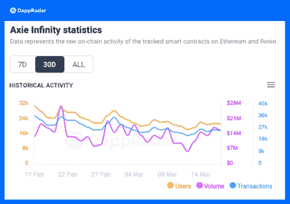

# Axie Infinity Origin 将首先在桌面上启动

> 原文：<https://web.archive.org/web/https://dappradar.com/blog/axie-infinity-origin-will-launch-first-on-desktop>

## Axie Infinity Origin 将于 2022 年在 Q1 推出

Axie Infinity 将首先仅在台式电脑上推出其原始更新。稍后，更新将推出更多功能的移动平台。这款受欢迎的游戏将推出新版本，希望吸引更多玩家，增加留存率，提高趣味性。

Axie Infinity 在其官方推特账号上宣布，Origin (Battles V3)即将面世。Origin 的软发布将分阶段进行，大约在本月底首次在桌面上推出。正如 DappRadar 在[的一篇早期文章中介绍的那样，Axie Infinity Origin 将拥有全新的界面、游戏机制、艺术、特效、故事情节和丰富的入职体验。](https://web.archive.org/web/20220925005722/https://dappradar.com/blog/axie-infinity-origin-promises-a-brand-new-battle-experience)

软发布将使 Axie Infinity 能够收集重要反馈，测试服务器的可扩展性，并使社区能够适应新的机制。然后，在桌面版本发布大约一个月后，游戏将为安卓用户做好准备，而 iOS 用户需要稍微等一会儿。这是为了避免服务器过载，因为更新后的游戏旨在支持数百万玩家。

最值得注意的是，Origin 将允许玩家从三个免费轴开始，使其更容易为主流观众所接受。此外，Origin 将在新版本中引入符文和符咒，通过赋予 Axies 新的效果和能力，为其提供额外的力量。团队设计了符文和符咒作为 Axie Infinity 新的消耗和燃烧机制的一部分。

## 动荡时代后的新曙光

尽管《起源》的发布备受期待，但这款业界排名第一的游戏最近的记录却令人略感失望。[根据 DappRadar 的数据，](https://web.archive.org/web/20220925005722/https://dappradar.com/multichain/games/axie-infinity) Axie Infinity 的用户数量在过去 30 天内跌至 112，046 人，比上一个周期下降了 38%。此外，过去 30 天游戏内交易量为 4.2464 亿美元，同比下降约 38%。最后，就 NFT 交易量而言，阿协已累计 6099 万美元，较前 30 天下跌近 50%。

Source: DappRadar

然而，值得一提的是，Axie Infinity 的终身 NFT 交易量超过了 40 亿美元。对于像 Axie Infinity 这样的新兴区块链游戏来说，这是一个出色的成绩。

虚拟货币市场的波动影响了 Axie 玩家的信心，这并不奇怪。但幸运的是，Origin 在这里开启了 Axie Infinity 的新篇章，将游戏推广到更广泛的用户群。同时，团队不忘游戏通常是有生命周期的，即使你不断升级产品，用户也可能有一天会厌倦。为了解决这个问题，Sky Mavis 团队宣布了 [Builders 计划](https://web.archive.org/web/20220925005722/https://dappradar.com/blog/axie-community-starts-building-spin-off-games)，邀请开发者为 Axie 游戏矩阵带来创新。自启动以来，该计划已经收到了 1500 多名申请人。Axie WarKart 是其中之一，它已经以其可爱的设计迷住了 Axie 社区。

除此之外，去年推出的 [Ronin sidechain](https://web.archive.org/web/20220925005722/https://dappradar.com/rankings/protocol/ronin) 让 Axie Infinity 得以崛起。它的目标是推动快速增长的“玩即赚”浪潮，并成为游戏界的区块链。随着 Axie 在 Ronin 上的蓬勃发展，许多人认为更多的 dapps 将加入 Ronin 生态系统。

有关 Axie Infinity 最新数据性能的更多信息，您可以在 DappRadar 上查看其 [dapp 页面。此外，您](https://web.archive.org/web/20220925005722/https://dappradar.com/multichain/games/axie-infinity)还可以使用我们的 [NFT 跟踪工具](https://web.archive.org/web/20220925005722/https://dappradar.com/nft)来比较 Axie Infinity 及其竞争对手的 NFT 相关统计数据。此外，达普拉达还追踪[浪人侧链上的最新动态。](https://web.archive.org/web/20220925005722/https://dappradar.com/rankings/protocol/ronin)

## 有用的 Axie Infinity 链接

[<picture></picture>](https://web.archive.org/web/20220925005722/https://dappradar.com/ethereum/games/axie-infinity)[<picture></picture>](https://web.archive.org/web/20220925005722/https://dappradar.com/blog/axie-infinity-biggest-contributor-to-august-game-nft-trading/)[<picture></picture>](https://web.archive.org/web/20220925005722/https://dappradar.com/hub/swap/eth/ETH/AXS?to=0xbb0e17ef65f82ab018d8edd776e8dd940327b28b)