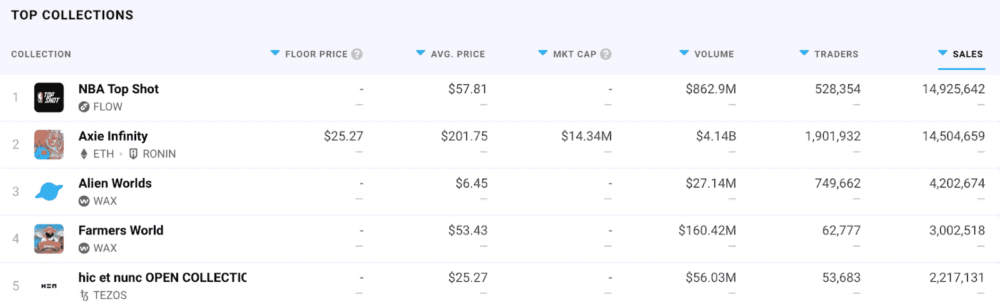

# Axie Infinity 的终身 NFT 交易量超过 40 亿美元

> 原文：<https://web.archive.org/web/https://dappradar.com/blog/axie-infinity-surpasses-4-billion-in-lifetime-nft-trading-volume>

## Axie Infinity 是有史以来交易量最大的 NFT 收藏

Axie Infinity 突破了又一个里程碑式的数字，其 NFT 交易总额超过 40 亿美元。这是相当大的成就，因为该系列于 2018 年 3 月推出。在三年时间里，这款游戏及其角色和土地 NFTs 已经成为一个游戏赚取黄金的标准和有史以来交易量最大的收藏。

虽然 Axie Infinity 的终身交易量为 40 亿美元，但其他 NFT 收藏也有数十亿美元的交易量。根据 DappRadar 的排名，亚军是 NFT 交易量为 26.1 亿美元的 [CryptoPunks](https://web.archive.org/web/20220929043149/https://dappradar.com/ethereum/collectibles/cryptopunks) 系列。 [Bored Ape 游艇俱乐部](https://web.archive.org/web/20220929043149/https://dappradar.com/ethereum/collectibles/bored-ape-yacht-club)以 13.5 亿美元的终身 NFT 交易额排名第三。

当谈到该系列的智能合同处理的交易数量时，Axie Infinity 以 14，504，659 的销售额接近最高。然而，基于流量的 NBA 顶级射击以近 1500 万的销售额遥遥领先。有趣的是，当谈到加工销售的数量时，以太坊巨头 CryptoPunks 和 BAYC 很难跟上。这清楚地强调了另类区块链允许更便宜的 NFT 交易的范式。因此，这将吸引更广泛的受众，带来更高的交易数量。

## 轴无限向前推进

Axie Infinity 率先将 NFT 整合到游戏平台中，这一创新正在取得回报。凭借创纪录的交易量，该系列已成为从玩到赚模式的代名词。

这篇新闻文章中的数据不再呈现 Axie Infinity 的现状。在我们的指南中了解你需要知道的关于 Axie Infinity 的一切。访问[Axie Infinity dapp 页面](https://web.archive.org/web/20220929043149/https://dappradar.com/multichain/games/axie-infinity)获取所有最新数据、NFT 销售和社区工具。

重要的是，Sky Mavis 继续推进和发展 Axie 生态系统。最近，团队 a [宣布了即将到来的起源发布](https://web.archive.org/web/20220929043149/https://dappradar.com/blog/axie-infinity-origin-promises-a-brand-new-battle-experience/)，它将建立在现有的 NFT 收集。Origin 将在游戏中引入全 3D 设计，让玩家沉浸在全新的虚拟体验中。

此外，团队还努力为 Axie land NFTs 带来功能。土地在 Axie 的 NFT 销售中占了很大一部分，然而，到目前为止还没有与这些 NFT 相关的游戏性或可用性。一旦土地成为 Axie 生态系统中完全活跃的一部分，这些 NFT 将吸引更多的关注。该团队将介绍收获，手工艺，交易资源，建设和升级结构。土地游戏将允许土地所有者获得 AXS，Axie Infinity 生态系统的治理令牌。

随着游戏不断突破里程碑，DappRadar 将继续监控 Axie Infinity 宇宙。如果你想密切关注 Axie Infinity，请查看下面的链接。此外，您还可以在 [Twitter](https://web.archive.org/web/20220929043149/https://twitter.com/dappradar) 上关注 DappRadar，并加入我们的 [Discord](https://web.archive.org/web/20220929043149/https://discord.gg/4ybbssrHkm) 社区，首先了解最新的 Axie Infinity 新闻。

[<picture></picture>](https://web.archive.org/web/20220929043149/https://dappradar.com/ethereum/games/axie-infinity)[<picture></picture>](https://web.archive.org/web/20220929043149/https://dappradar.com/blog/axie-infinity-biggest-contributor-to-august-game-nft-trading/)[<picture></picture>](https://web.archive.org/web/20220929043149/https://dappradar.com/hub/swap/eth/ETH/AXS?to=0xbb0e17ef65f82ab018d8edd776e8dd940327b28b)