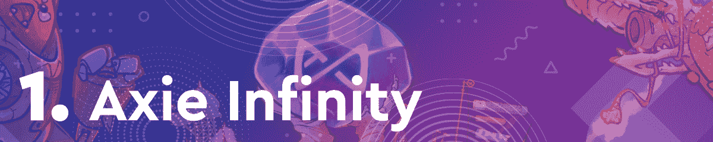
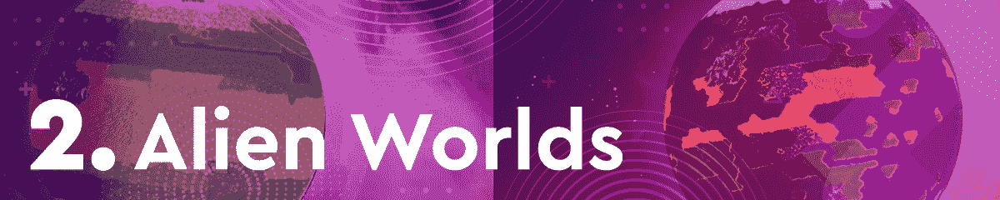
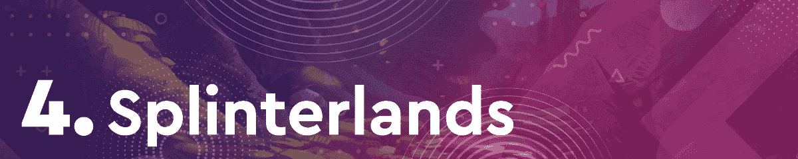
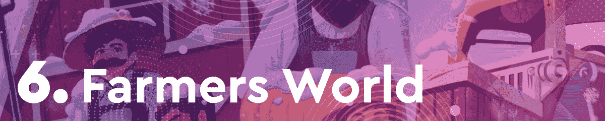
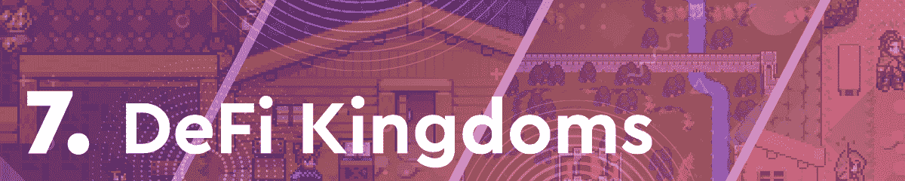
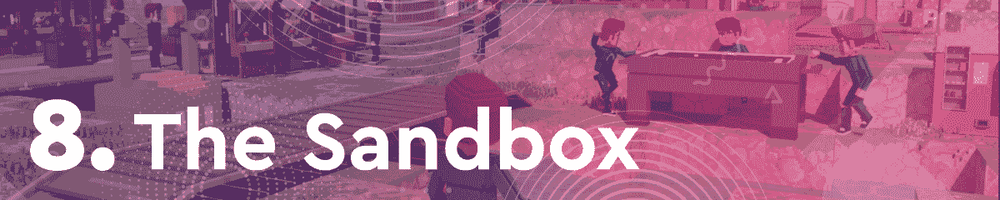

# 多亏了罗恩，Axie Infinity 荣登排行榜榜首

> 原文：<https://web.archive.org/web/https://dappradar.com/blog/axie-infinity-tops-the-charts-thanks-to-ron>

## 本月十大游戏–2022 年 1 月

Axie Infinity 再次证明了它是区块链游戏领域的王者。由于几个重大的公告，包括推出本地罗恩令牌，这款游戏在本月的十大区块链游戏排行榜上名列榜首。

紧随其后，我们有一些常见的嫌疑人，比如外星世界和分裂之地。令人印象深刻的是，尽管加密估值大幅下降，但 NFT 世界、沙盒和万维网 3 等虚拟世界也榜上有名。

在过去的几个月里，区块链游戏一直处于加密活动的前沿。通过这篇文章，DappRadar 了解了最热门的游戏 dapps。为了编制这个排名，我们考虑了链上活动，NFT 交易量，令牌估值，以及围绕每个 dapp 的新闻和事件。

在下面浏览本周十大区块链游戏的完整列表。单击相应的图片，了解每个平台的更多信息。或者，看看下面的视频，它总结了排名，可以快速查看。

[https://web.archive.org/web/20221208163715if_/https://www.youtube.com/embed/6iBvLFgERrk?feature=oembed](https://web.archive.org/web/20221208163715if_/https://www.youtube.com/embed/6iBvLFgERrk?feature=oembed)

## 2022 年 1 月区块链十大赛事

Axie Infinity 是 2022 年 1 月不可否认的赢家。游戏和浪人生态系统经历了几次重大升级。在游戏性方面，Axie Infinity 引入了一个重要的燃烧机制，允许玩家通过燃烧 Axie 获得奖励。说到浪人网络，它现在正式拥有了一个本地令牌。RON 令牌现已启用，方便了 Ronin 上的所有交易，以及与之相关的费用。这是一个备受期待的事件，为 Axie 粉丝和 DeFi 爱好者带来了额外的赚钱机会。

《异形世界》本月排名第二，整体表现稳定。在过去的三十天里，采矿游戏吸引了 123 万个独特的活动钱包。这使得《异世界》成为了上个月 DappRadar 上追踪的全区块链访问量最大的游戏 dapp。此外，该平台记录了超过 100 万美元的 NFT 交易量。

得益于其本土代币 WRLD 的推出和大量的 NFT 土地销售， [NFT 世界](https://web.archive.org/web/20221208163715/https://dappradar.com/ethereum/games/nft-worlds)在 2022 年 1 月的区块链顶级游戏排行榜上排名第三。NFT 世界正在稳步建立一个强大的游戏玩家和虚拟世界爱好者社区。该平台已经举办了几次测试活动，并取得了成功。考虑到像 NFT 世界这样的虚拟世界平台越来越受欢迎，这个项目在过去三十天里吸引了超过 900 万美元的 NFT 交易量也就不足为奇了。****

基于 Hive 的卡牌交易游戏 Splinterlands 在我们本月的每周游戏排名中一直是一个不变的存在。游戏广泛的混乱军团战役推动了活动和 NFT 的销售。随着混乱军团卡销售接近尾声，夹板地享受迄今为止最好的一个月。凭借一月份记录的近 600.000 个独特的活动钱包，这是目前最受欢迎的区块链游戏之一。

万维网 3 正在成为元宇宙最热门的地方之一。这个月，游戏在 NFT 卖地收入超过 2300 万美元。WWW3 发起了迄今为止最大的一次探索，吸引了大量的观众。这个任务让玩家有机会沉浸在万维网 3 的世界中，如果他们成功完成任务，可能会赢得稀有的 NFT。

农民世界是蜡上玩得最多的游戏之一。重要的是，它也是所有连锁店中交易量最大的 NFT 系列之一。农民世界在过去的三十天里记录了超过 4100 万美元的 NFT 交易量。除了是 NFT 地区票房最高的，Farmers World 还有一个稳定的追随者和不断增长的社区。在撰写本文时，这款游戏的官方 Twitter 账户有超过 110，000 名粉丝，其中大部分可能也是玩家。

DeFi 王国是 Harmony 的奇迹 dapp，它在 2021 年底经历了大规模的受欢迎程度。该平台的原生 token JEWEL 估值大幅飙升，吸引了成千上万的新玩家。尽管失去了一些宣传，以及全面的加密令牌的崩溃价格，DeFi 王国仍然在 1 月份的区块链游戏排行榜上名列前茅。更重要的是，该平台推出了一项重要的雪崩式整合，进一步提升了其受众。

沙盒可能是目前最大的虚拟世界。除了大量的土地销售，产生了超过 2.1 亿美元的 NFT 交易量，沙盒还设法吸引了名人。Snoop Dog 现在在虚拟世界中拥有一整栋豪宅，而其他名人则在该平台的原生令牌 SAND 上下了重注。此外，该平台举办了多次活动、空投和以社区为重点的活动，在此过程中增加了用户数量。

由于几周前举行的大型可穿戴活动和抽奖，Aavegotchi 进入了本月的顶级游戏排名。除此之外，Aavegotchi 还拥有一个稳定而活跃的游戏玩家社区。此外，这款游戏在 NFT 的销售额接近 1500 万美元。

最后但同样重要的是，我们在本月的顶级区块链游戏排名中有高地。由于几笔里程碑式的销售，这款虚拟房地产游戏确保了在榜单上的一席之地。在过去的三十天里，该平台吸引了超过 338，000 个独特的活动钱包，使 EOS 区块链成为游戏行业的焦点。

## Axie Infinity 在一月份有一个好的开始

由于几周以来发布的公告和令人兴奋的开发，Axie Infinity 再次占据了榜首。Sky Mavis 通过引入一整套基于 Ronin 的服务生态系统，成功地彻底重塑了“玩即赚”的理念。

随着 Ronin 的原生令牌 RON 的推出，用户现在可以使用 Axie 玩到赚，以及使用 Katana DEX 的成熟的 DeFi 生态系统。结合最近的建设者计划和游戏中引入的烧录机制，Axie 理所当然地荣登 1 月区块链游戏排行榜榜首。

DappRadar 将监测区块链的游戏空间，因为新的和令人兴奋的项目和发展每天都在涌现。如果你想了解更多关于区块链游戏的信息，请查看官方的 [DappRadar 游戏排名](https://web.archive.org/web/20221208163715/https://dappradar.com/rankings/category/games)。或者，你可以在[推特](https://web.archive.org/web/20221208163715/https://twitter.com/dappradar)上关注 DappRadar，或者加入我们的 [Discord](https://web.archive.org/web/20221208163715/https://discord.gg/4ybbssrHkm) 社区，首先了解最新的游戏新闻。

 NewsletterUnsubscribe at any time. [T&Cs](https://web.archive.org/web/20221208163715/https://dappradar.com/terms) and [Privacy Policy](https://web.archive.org/web/20221208163715/https://dappradar.com/privacy-policy)