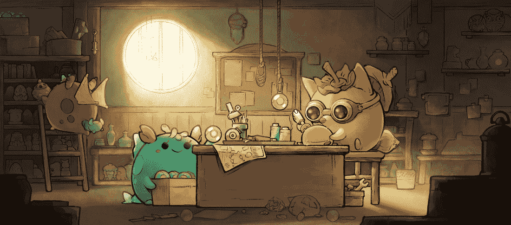
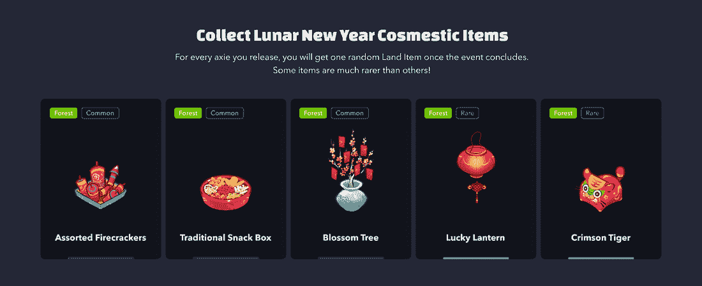

# Axie Infinity 欢迎新建设者计划的成员

> 原文：<https://web.archive.org/web/https://dappradar.com/blog/axie-infinity-welcomes-members-in-new-builders-program>

## 天空 Mavis 介绍了社区对游戏开发的贡献

Axie Infinity 正在启动构建者计划，该计划将允许社区成员为游戏生态系统的开发做出贡献。Axie Infinity 可以说是最大的游戏赚钱项目，Sky Mavis 的开发团队希望让社区进一步参与进来。

重要的是， [Axie Infinity](https://web.archive.org/web/20220930092531/https://dappradar.com/multichain/games/axie-infinity) 已经创建了区块链游戏领域最紧密的社区之一。然而，通过 Builders 计划，Sky Mavis 旨在激励基于社区的开发团队的进一步参与。

建设者计划将向 Sky Mavis 专家团队提供资金和访问权限，而工作室希望创新产品来自他们的活动。根据官方宣布的消息，符合条件的团队将在 AXS 获得至少 5000 美元的资助，用于他们的项目。建设者计划的总预算是 5000 AXS，或约 40 万美元。

重要的是，该计划更侧重于扩展 Axie Infinity 生态系统，而不是建立在原始游戏本身的基础上。Sky Mavis 希望推动社区使用 Axie 品牌创建更多的游戏和工具。此类工具的例子包括 Axie 主题的迷你游戏，如塔防和象棋，以及数据跟踪工具。这些游戏将需要使用 [AXS](https://web.archive.org/web/20220930092531/https://dappradar.com/hub/swap/eth/ETH/AXS) 或 [SLP](https://web.archive.org/web/20220930092531/https://dappradar.com/hub/token/eth/SLP?from=0xcc8fa225d80b9c7d42f96e9570156c65d6caaa25) ，此外，他们还需要烧掉 SLP 或把 AXS 送到社区金库。

Axie Infinity 现在推出了一个独家的 Builders Program Discord 频道，志同道合的社区成员可以在这里进行合作。当然，该计划有一套资格要求和规则，你可以查看[这里](https://web.archive.org/web/20220930092531/https://axie.substack.com/p/axie-infinity-builders-program)。

## Axie Infinity 还引入了释放功能

新推出的建设者计划是参与社区并让玩家试验他们的 Axies 的重要一步。然而，这并不是 Sky Mavis 本周的唯一声明。该工作室还宣布推出一个备受期待的游戏功能。

玩家现在有机会释放他们的 Axies 在 Lunacia 独立生活。在技术层面上，这意味着玩家将摧毁他们自己的 Axie 生物。作为回报，他们的 Axies 将发回独家礼物。目前，这些礼物将以农历新年专属土地项目的形式出现。这些是装饰物品，玩家可以在他们的土地上炫耀。

重要的是，除了有保证的独家礼物外，将 Axie 放归野外还将进入所有者的钱包参加抽奖。抽奖将为 111 名玩家带来额外的礼物，包括 5 枚 Axie Origin Coin (AOC)代币、10 件 Kitsune 神秘土地物品和 100 件 CoinGecko 或 Ganbaru CrypTon Epic 土地物品。

[Axie Infinity](https://web.archive.org/web/20220930092531/https://dappradar.com/multichain/games/axie-infinity) 已经成为游戏赚钱领域社区建设的黄金标准。重要的是，Sky Mavis 继续朝着这个方向推进，发布了新的事件和功能，如 Builders 程序。

DappRadar 将继续关注 Axie Infinity，因为这款游戏在从玩到赚的空间中征服了新的高度。为了密切关注这个革命性的项目，请查看官方的 [Axie Infinity DappRadar 页面](https://web.archive.org/web/20220930092531/https://dappradar.com/multichain/games/axie-infinity)。此外，你可以在 [Axie marketplace](https://web.archive.org/web/20220930092531/https://dappradar.com/ethereum/marketplaces/axie-marketplace) 上追踪 NFT 的销售情况，或者在 [Ronin sidechain](https://web.archive.org/web/20220930092531/https://dappradar.com/rankings/protocol/ronin) 上监控活动。在 Twitter 上关注 DappRadar，加入我们的 Discord 社区，首先了解最新的 Axie 新闻。

 NewsletterUnsubscribe at any time. [T&Cs](https://web.archive.org/web/20220930092531/https://dappradar.com/terms) and [Privacy Policy](https://web.archive.org/web/20220930092531/https://dappradar.com/privacy-policy)