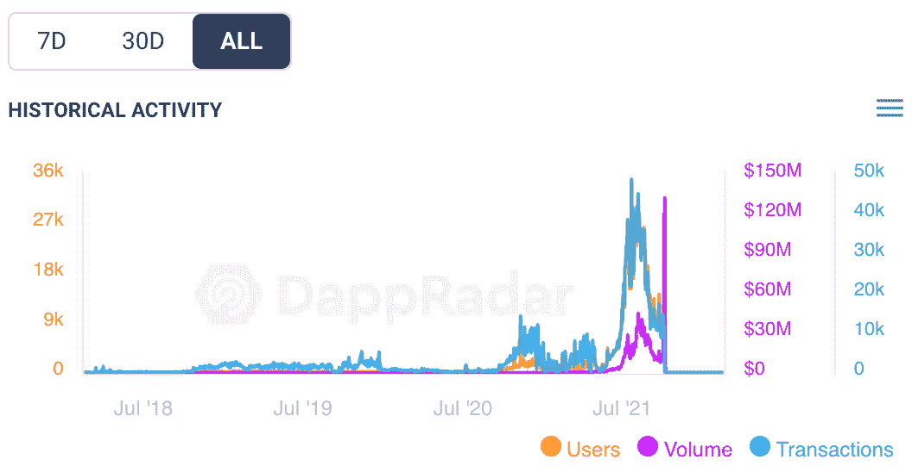

# Axie 农历事件于 2 月 20 日结束

> 原文：<https://web.archive.org/web/https://dappradar.com/blog/axie-lunar-event-ending-february-20th>

## 玩家将获得限量版的土地物品和奖券，以换取释放他们的 Axies

[**Axie Infinity**](https://web.archive.org/web/20221215082516/https://dappradar.com/ethereum/games/axie-infinity) **的农历新年赠品在 2 月 20 日结束。玩家还有几天的时间将他们的 Axies 释放到 Luna's Landing，并获得限量版的土地物品和传奇抽奖的门票作为回报。迄今为止，已有超过 13 万只 Axie NFTs 被放归野外。**

为了庆祝中国农历新年，Axie Infinity 将向玩家提供有保证的奖励，以换取将他们的战斗 Axie 释放到野外。该活动于 1 月 31 日开始，于本周日，2 月 20 日结束。

玩家可以从一系列礼物中获胜，有些礼物比其他礼物更珍贵。参与者还将获得三张传奇抽奖的门票。英雄奖的承诺足以吸引人们释放他们深爱的斧头吗？

Axie Infinity giveaway offer

玩家每释放一把斧头，就可以赢得五件地中的一件。赢得每件物品的机会取决于该物品的稀有程度:

*   各种鞭炮(35%)
*   传统快餐盒(35%)
*   开花树(20%)
*   幸运灯笼(9%)
*   深红虎(1%)

The five land items players can win

在撰写本文时，[超过 46000 名 Axie Infinity 玩家已经烧掉了超过 130000 个 Axie NFT](https://web.archive.org/web/20221215082516/https://marketplace.axieinfinity.com/lunacian-express/release-stats/)。释放的 Axie 的[稀有度与玩家获得的奖励](https://web.archive.org/web/20221215082516/https://support.axieinfinity.com/hc/en-us/articles/4415871665819-Lunar-New-Year-2022#h_01FSQQK2D9AN79Z4ZZVV00H00P)没有关系。所以不管你放开什么斧头，那只珍贵的深红老虎仍然是你的。

## Axie Infinity 从去年的高点回落

去年，Axie Infinity 是镇上的热门话题。但是投机的扭曲压力影响了 Axie 经济，平台现在正试图纠正这种影响。这个农历新年赠品看起来是 Axie Infinity 开发商 [Sky Mavis](https://web.archive.org/web/20221215082516/https://dappradar.com/blog/tag/sky-mavis) 协调策略的一部分，以管理紧张市场中供过于求的通缩效应。

Axie Infinity on-chain activity

除了为从市场上拿走 Axies 的人提供奖励，Sky Mavis 还改变了第 20 季冒险模式中的奖励系统，这样玩家不再能够通过完成简单的任务来赢得 Smooth Love 药水(SLP)。游戏玩家需要 SLP 来培育新的 Axies，而 SLP 代币在二级市场上有其自身的转售价值。游戏玩家玩了几个小时，赚了几千个 SLP。这最终导致 Axies 和 SLP 供应过剩。再加上最近密码价格的下降，玩家看到他们的资产价值大幅下降。

Sky Mavis 最近的所有举动都是基于 Axie Infinity 是由增长驱动的这一事实。赚大钱的机会依赖于不断有新玩家加入并创造更多需求。由于价格下降，人们加入的动力也减少了。这种通缩负反馈循环对 Axie Infintiy 的长期前景不利。

随着时间的推移，看看 Sky Mavis 如何在管理庞大经济的同时创造一套让玩家着迷的娱乐游戏，这将是一件有趣的事情。Sky Mavis 最近邀请了第三方来开发基于 Axie 生态系统的游戏。更多这样的动作将是游戏未来的关键。

[<picture></picture>](https://web.archive.org/web/20221215082516/https://dappradar.com/ethereum/games/axie-infinity)[<picture></picture>](https://web.archive.org/web/20221215082516/https://dappradar.com/blog/axie-infinity-biggest-contributor-to-august-game-nft-trading/)[<picture></picture>](https://web.archive.org/web/20221215082516/https://dappradar.com/hub/swap/eth/ETH/AXS?to=0xbb0e17ef65f82ab018d8edd776e8dd940327b28b)