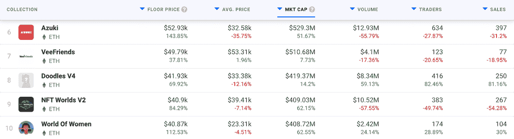
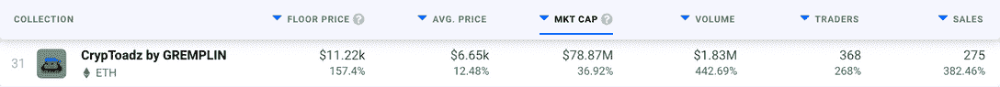
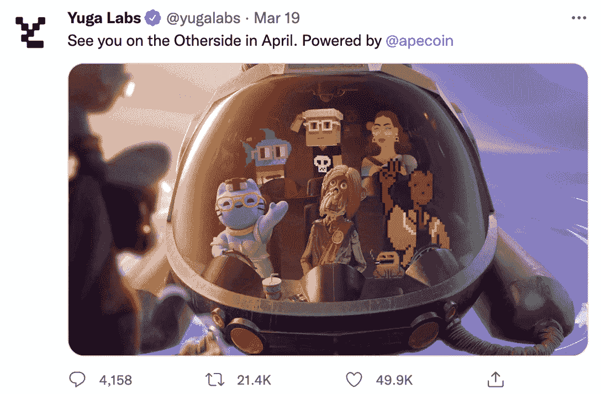
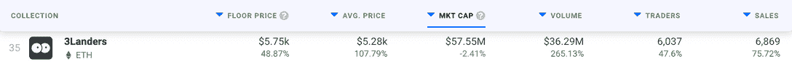
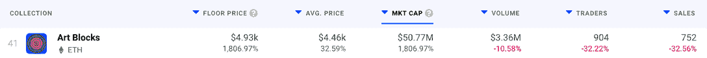
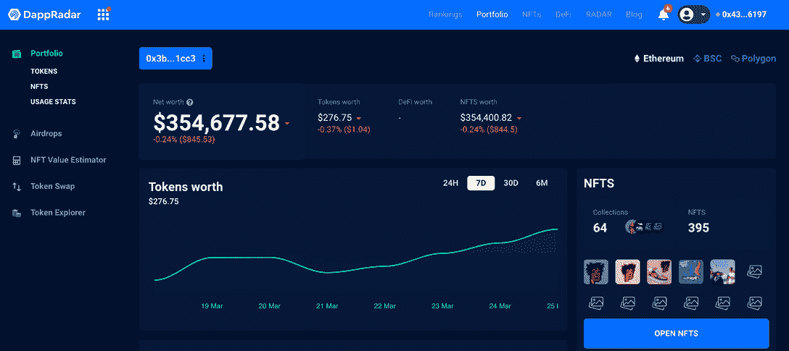

# 志那都红豆&从地面发射的火箭燃料 NFT 中的 3 个着陆器

> 原文：<https://web.archive.org/web/https://dappradar.com/blog/azuki-3landers-among-rocket-fuelled-nfts-launching-from-the-floor>

## 别管底价了，这些 NFT 正在抬高屋顶

随着底价的大幅上涨，五个受欢迎的 NFT 系列本周涨幅更大。志那都红豆和世界妇女都看到他们的底价上升，而他们的平均销售价格下降。其他三个系列——3 landers、Art Blocks 和 CrypToadz——实现了多个类别的收益。

在 NFTs 的世界里，一周是一段很长的时间。并且在 [DappRadar 的排名页面](https://web.archive.org/web/20221007095022/https://dappradar.com/nft/collections)中查看七天的上链活动，我们可以看到在那段时间里没有任何东西是静止不动的。

志那都红豆和世界女性系列各自的底价都大幅上涨。志那都红豆的价格飙升了 143.85%，达到 52，930 美元，该项目目前的市值为 5.293 亿美元。NFT 的持有者可以进入花园，花园可以被最好地定义为一个分散的互动媒体社区。志那都红豆将自己描述为“互联网的一个角落，艺术、社区和文化在这里融合，创造奇迹”。

下表突出了志那都红豆目前正在进行的挤兑。在 DappRadar 的当前市值排名页面上，该公司排名第六。尽管交易量和交易者数量下降，但底价的上升表明社区仍然认为 NFT 有很大的价值。

[DappRadar NFT rankings](https://web.archive.org/web/20221007095022/https://dappradar.com/nft/collections)

这可能是由于一些因素，如志那都红豆[加快其路线图](https://web.archive.org/web/20221007095022/https://www.azuki.com/mindmap)和释放波布(志那都红豆#40)作为一个分裂的 NFT。该公司目前也在大肆招聘，这表明该项目正在进行中。

市值仅略低于志那都红豆的是 NFT 系列的女性世界。在过去的七天里，它的底价飙升了 112.53%，达到 40，870 美元。虽然每个 NFT 的平均销售价格下降了 4.15%，但其他所有统计类别都有所上升，这表明这个基于以太坊的项目持续受欢迎。《女性银河世界》(GWOW)的推出提升了原 NFTs 的价值。

## CrypToadz、3Landers 和艺术街区

过去一周，知名度较低的小型项目的 NFT 底价也有所上涨。以像素化蟾蜍为特色的 Gremplin CC0 项目 CrypToadz ，经历了每个统计类别 DappRadar 记录的激增。这可以归因于 3 月 19 日出现的活动高峰。

CrypToadz in DappRadar’s rankings

继[宇迦实验室的 BAYC 3D 元宇宙戏弄](https://web.archive.org/web/20221007095022/https://twitter.com/yugalabs/status/1505014986556551172)和宇迦实验室将密码朋克的版权移交给所有者之后，CrypToadz 出现了激增。这表明 CrypToadz 一直走在正确的道路上，从一开始就给予其 NFT 持有者版权。

Yuga Lab’s Twitter tease

3Landers 于 2022 年 2 月 21 日发射，在过去的一个月里取得了巨大的成功。 [DappRadar 在我们测量的六个统计类别中的五个最近价格飙升之前报道了这个项目](https://web.archive.org/web/20221007095022/https://dappradar.com/blog/new-dapps-report-animated-avatars-kickoff-spring-sales)。

3Landers in DappRadar’s rankings

对于一个今年推出的项目来说，它在我们的市值排名中上升到第 35 位令人印象深刻，这可能要归功于它将创造力和互惠放在首位的社区精神。在 NFT 世界，强大的支持基础(几乎)是无价之宝。

我们要看的最后一个项目艺术街区(Art Blocks)的 NFT 底价出现了真正荒谬的爆炸。增长了 1807%。这意味着它被放大了大约 19 倍。但是为什么上涨了这么多呢？

Art Blocks in DappRadar’s rankings

我们认为 3 月 21 日与 Stella Artois 为 Water.org 筹款的合作伙伴关系下降是飙升的原因。此外，当一个新的 NFT 在艺术街区推出时，底价往往会下降。之后，随着新的艺术收藏变得流行，价格开始攀升。

## 使用 DappRadar 跟踪 NFT

使用 DappRadar 的[投资组合跟踪器](https://web.archive.org/web/20221007095022/https://dappradar.com/hub/wallet/)来可视化您的持有量，并查看您在以太坊、BSC 或 Polygon 网络上的 NFT 的当前价值。你也可以检查别人的钱包。看看[的史努比狗狗](https://web.archive.org/web/20221007095022/https://dappradar.com/hub/wallet/eth/0xce90a7949bb78892f159f428d0dc23a8e3584d75/nfts/1)的 NFT 收藏，或者瞥一眼[史蒂夫·青木](https://web.archive.org/web/20221007095022/https://dappradar.com/hub/wallet/eth/0xe4bbcbff51e61d0d95fcc5016609ac8354b177c4)的藏品价值。

[Jay Z’s Ethereum-based assets](https://web.archive.org/web/20221007095022/https://dappradar.com/hub/wallet/eth/0x3b417faee9d2ff636701100891dc2755b5321cc3)