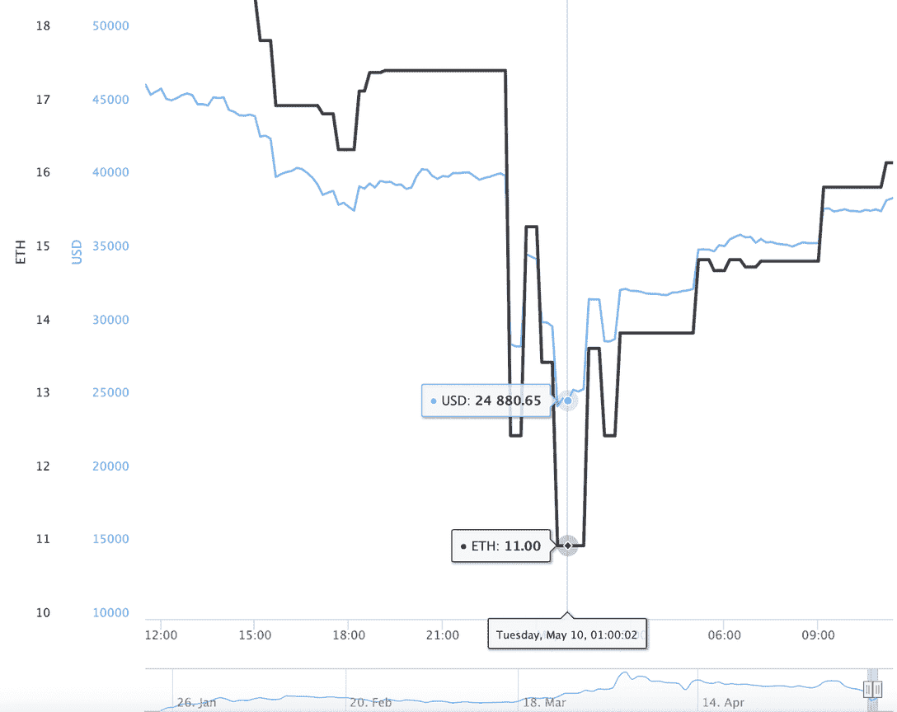
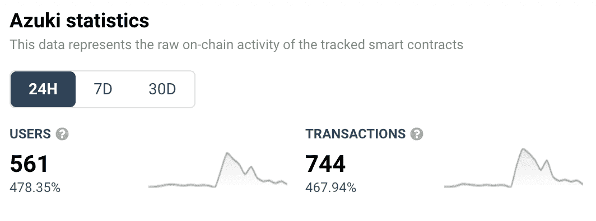
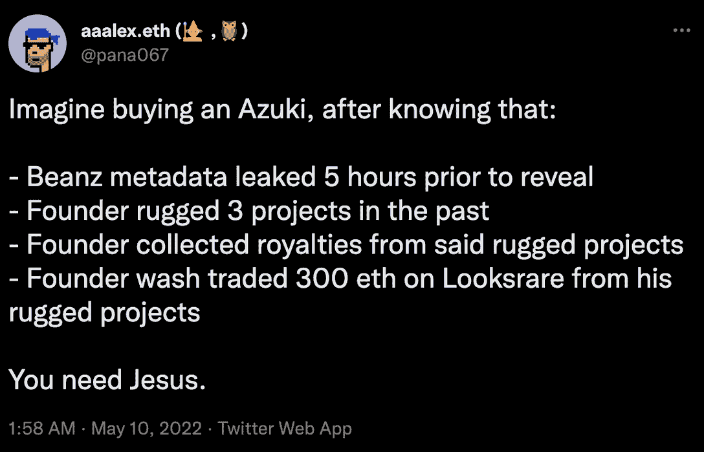
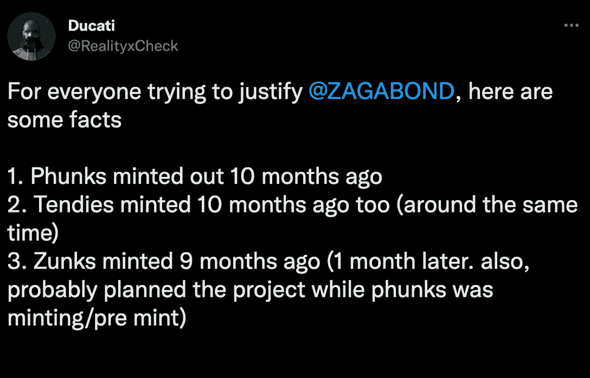

# 创始人揭露拉地毯的历史后，志那都红豆社区陷入混乱

> 原文：<https://web.archive.org/web/https://dappradar.com/blog/azuki-community-in-chaos-after-founder-reveals-rug-pull-history>

## 该收藏的创作者在博客上发表的一篇文章打乱了这个项目

志那都红豆正在经历一些严重的磨难，因为该项目的创始人之一在 NFT 空间揭露了他不光彩的拉地毯历史。志那都红豆是过去几个月最热门的 NFT 系列之一。该项目的受欢迎程度大幅上升，也带来了楼面价格的飙升。最近，志那都红豆背后的团队还推出了一个名为 Beanz 的后续系列。虽然这一切听起来不错，令人愉快，但该项目周围已经形成了一些乌云。有趣的是，这个动荡时期是由这个项目的创始人之一 Zagabond 提出的。

总结:

*   [Zagabond 发布了一篇博客，详细描述了他之前参与的其他三个 NFT 系列，这些他都在某个时候放弃了](https://web.archive.org/web/20220930090247/https://dappradar.com/blog/azuki-community-in-chaos-after-founder-reveals-rug-pull-history/#blog-post)
*   这位志那都红豆创始人和他的团队创造了 [CryptoPhunks](https://web.archive.org/web/20220930090247/https://dappradar.com/ethereum/collectibles/cryptophunks) 、Tendies 和 CryptoZunks。然而，所有这三个都留给了社区管理
*   在二级市场 OpenSea 上，志那都红豆的价格从 19 ETH(约 42，000 美元)跌至 11 ETH(约 24，000 美元)。在撰写本文时，该指数已反弹至 16.2 ETH(约 3.86 万美元)。
*   [这一版本发布后，NFT 空间爆发了指责和迷因](https://web.archive.org/web/20220930090247/https://dappradar.com/blog/azuki-community-in-chaos-after-founder-reveals-rug-pull-history/#Community)

## 开始这一切的流浪者博客帖子

Zagabond 是志那都红豆项目的核心创始成员之一。5 月 9 日，他发布了一篇详细的博文,概述了他迄今为止在 NFT 和 web3 空间的经历。重要的是，这段文字揭示了他过去参与的几个 NFT 项目。

原来 Zagabond 是 CryptoPhunks，Tendies 和 CryptoZunks 背后的驱动力。根据博客文章，这些都是作为实验构思的，挑战 NFT 空间和其中的大牌。当然，目标主要是幼虫实验室，也就是最初的[crypto 朋克](https://web.archive.org/web/20220930090247/https://dappradar.com/ethereum/collectibles/cryptopunks)的创造者。

博文中突出的一个更重要的细节是 Zagabond 离开了这三个项目。根据他的说法，CryptoPhunks 最适合作为一个社区管理的项目，这就是团队决定离开的原因。Tendies 和 CryptoZunks 都表现不佳，似乎是自然死亡，至少根据 Zagabond 的说法是这样。

尽管如此，这种模式仍然存在。Zagabond 和他的团队很快就离开了成千上万的社区成员，开始了下一个 NFT 项目。直到今天他们还在积极研究志那都红豆。

## 志那都红豆价格波动

这篇博文发布后，NFT 空间爆发了反应，但稍后会有更多的反应。志那都红豆收藏本身发生了一件有趣的事情。考虑到 Zagabond 的博客帖子中分享的颇具争议的信息，志那都红豆 NFTs 出现一些严重的价格波动就不足为奇了。

在过去的 24 小时里，志那都红豆的地板价从 19.5 ETH 的高点跌至 5 月 10 日中午 11 ETH 时的近一半。截至发稿时，楼面价已反弹至 16 ETH 左右。这仍然低于志那都红豆在 Zagabond 发表博文之前的出价。

Source: [CoinGecko](https://web.archive.org/web/20220930090247/https://www.coingecko.com/en/nft/azuki)

尽管市场波动剧烈，但志那都红豆智能合约的交易量在过去 24 小时内飙升。一些人正在快速清理他们的包。另一方面，其他公司利用底价下跌，收购了大量志那都红豆非金融资产。这些已经升值了。

这种相关性导致了社交媒体上更大规模的意见爆发。首先，Zagabond 的博文引起了足够的争议，在志那都红豆引发了一场讨论。但随后，利用这一点的投资者和交易者只是火上浇油，提出了更多令人担忧的问题。创始人发布这个帖子是否有不可告人的目的？促进贸易活动，进而增加版税收入？时间会证明一切。

在过去的 24 小时里，志那都红豆在 NFT 产生了 2550 万美元的交易量。该系列的版税设定为 5%，这意味着该团队在此期间的收入超过了 120 万美元。您可以在此跟踪该系列的当前表现[。](https://web.archive.org/web/20220930090247/https://dappradar.com/nft/collections)

## 社区反应和侦查

不出所料，在过去的 24 小时里，NFT 社区有很多话要说，而志那都红豆是最热门的话题。当像史蒂夫·青木这样的名人公开炫耀他们新买的志那都红豆 NFTs 时，其他推特成员正在剖析 Zagabond 帖子中透露的细节。

由 [aaalex.eth](https://web.archive.org/web/20220930090247/https://dappradar.com/hub/wallet/eth/0xa9d508815d1216914706c03c566dc20dd972b383) (谁拥有 [Phunk #9161](https://web.archive.org/web/20220930090247/https://dappradar.com/hub/assets/eth/0xf07468ead8cf26c752c676e43c814fee9c8cf402/9161) )发布的这条 [Twitter 帖子](https://web.archive.org/web/20220930090247/https://twitter.com/pana067/status/1523829890608295937)揭露了一些与志那都红豆收藏有关的其他指控。在这个帖子中，aaalex.eth 详细描述了志那都红豆 Beanz 元数据可能在 mint 之前 5 小时泄露，从而允许机器人和收集者锁定罕见的 NFT。此外，他指出，Zagabond 和他的团队在离开之前，从所有三个“失败”的项目中收取了版税。

另一个 Twitter 用户提出了一个事实，尽管 Zagabond 声称，他的三个项目都经历了铸造阶段，CryptoPhunks 甚至已经铸造出来了。重要的是，看起来 Zagabond 同时在做所有这些系列，这也可能被认为是一个危险信号。

最后但同样重要的是，在博文发布后，一个相当令人担忧的细节也出现在 Twitter 帖子中。据称，Zagabond 在通过这个 [Twitter 账户 0xMandy](https://web.archive.org/web/20220930090247/https://twitter.com/0xMandy) 开发 CryptoZunks 时，冒充了一位名叫 Amanda 的女性。

这些指控曝光几个小时后，Zagabond 在 Discord 上发布了一个名为 Liz 的团队成员，他实际上是 0xMandy 的帐户所有者。然而，在这种令人困惑的情况下，没有办法确定谁是谁非。

## 志那都红豆的下一步是什么？

这里需要注意的一点是，在撰写本文时，志那都红豆团队还没有发布任何官方声明。官方 Twitter 账户上的最后一条推文是 5 月 7 日的，Discord announcements 频道上的最后一条帖子也是如此。尽管如此，似乎 mods 和社区在不和谐上很活跃。

重要的是，Zagabond 计划在今天晚些时候出现在 Twitter Spaces 的直播活动中。你可以在这里收听。希望这一事件能对围绕 Twitter 的指控有所帮助。与此同时，志那都红豆的地板价格似乎正朝着积极的方向发展，这对持有者来说应该是一个好兆头。

为了以更轻松的方式结束，志那都红豆的情况也成为了喜剧诠释的灵感。看看这段有趣的视频，它将志那都红豆的戏剧与当前动荡的 UST 及其挂钩问题联系起来。

> 观点:azuki 创始人讨论今天发布文章。[pic.twitter.com/W6zfPJ3Vnl](https://web.archive.org/web/20220930090247/https://t.co/W6zfPJ3Vnl)
> 
> — kmoney (@kmoney_69) [May 10, 2022](https://web.archive.org/web/20220930090247/https://twitter.com/kmoney_69/status/1523842701468217344?ref_src=twsrc%5Etfw)

请继续关注 DappRadar 将继续关注围绕志那都红豆收藏和其创始人展开的戏剧。你可以通过关注 DappRadar Twitter 账户并打开通知来获取最新的 NFT 新闻。

 NewsletterUnsubscribe at any time. [T&Cs](https://web.archive.org/web/20220930090247/https://dappradar.com/terms) and [Privacy Policy](https://web.archive.org/web/20220930090247/https://dappradar.com/privacy-policy)