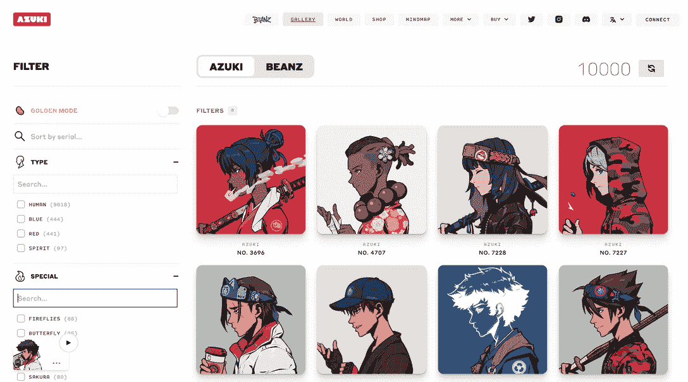
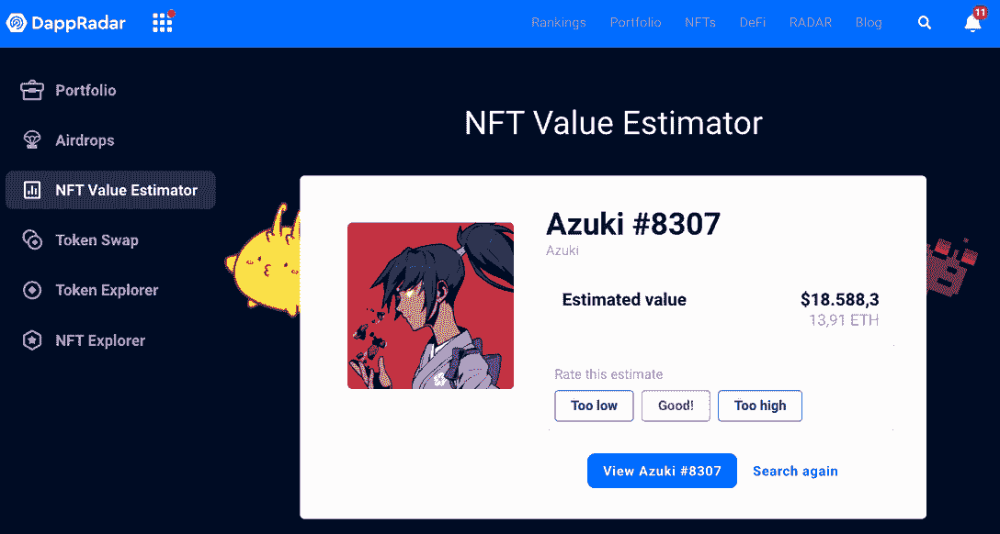
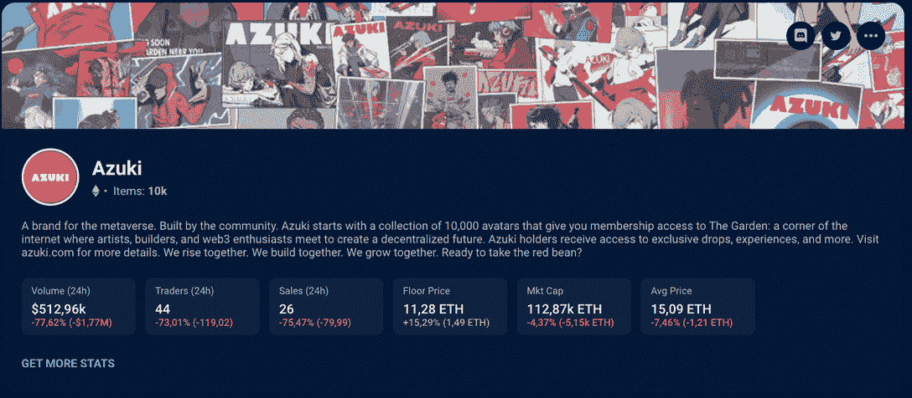

# 志那都红豆 NFTs:关于品牌的过去、现在和未来

> 原文：<https://web.archive.org/web/https://dappradar.com/blog/azuki-nfts>

## 作为 Web3 最强大的品牌之一，志那都红豆有着成功的故事和更加光明的未来

如果你是数码收藏品的爱好者，你很有可能见过志那都红豆 NFTs。这个品牌出现的时间不长，但已经成为网络 3 中最受欢迎的品牌之一。但是是什么让志那都红豆如此特别呢？

在这篇文章中，我们将进一步了解志那都红豆国家森林公园、泥土和黄金的历史。我们还将深入未来的项目，推测品牌可能的发展方向。所以，如果你对这个标志性的 NFT 品牌感到好奇，请继续阅读！

## 目录

*   什么是志那都红豆？
    *   [成功发射](https://web.archive.org/web/20221127192417/https://dappradar.com/blog/azuki-nfts/#The-successful-launch)
*   志那都红豆背后的团队是谁？
*   [志那都红豆 NFT 世界](https://web.archive.org/web/20221127192417/https://dappradar.com/blog/azuki-nfts/#The-Azuki-NFT-world)
*   志那都红豆成功的背后是什么？
    *   [NFT 艺术品的质量和稀有程度](https://web.archive.org/web/20221127192417/https://dappradar.com/blog/azuki-nfts/#NFT-art-quality-and-rarity)
    *   [志那都红豆效用与评书前景](https://web.archive.org/web/20221127192417/https://dappradar.com/blog/azuki-nfts/#Azuki-utility-and-storytelling-prospect)
    *   [社区参与度](https://web.archive.org/web/20221127192417/https://dappradar.com/blog/azuki-nfts/#Community-engagement)
*   有史以来卖得最贵的志那都红豆 NFT 有哪些？
*   [你如何评价和跟踪志那都红豆的非技术人员？](https://web.archive.org/web/20221127192417/https://dappradar.com/blog/azuki-nfts/#How-do-you-value-and-track-Azuki-NFTs?)
*   志那都红豆的 Beanz 是什么？
*   哪里可以买到志那都红豆 NFT？
*   志那都红豆国家森林公园的下一步是什么？
*   [新时代:志那都红豆的实物支持代币](https://web.archive.org/web/20221127192417/https://dappradar.com/blog/azuki-nfts/#A-new-era:-Azuki’s-Physical-Backed-Tokens)
*   [跟踪蓝筹股 NFT 集合](https://web.archive.org/web/20221127192417/https://dappradar.com/blog/azuki-nfts/#Keep-track-of-blue-chip-NFT-collections)

## 什么是志那都红豆？

志那都红豆是一个 Web3 品牌，最初是通过志那都红豆 NFTs 的推出而活跃起来的。自 2022 年初推出以来，收集 10，000 个独特的不可替代的令牌是一个巨大的成功，尽管我们稍后将深入了解丑闻，但仍在继续。

志那都红豆的灵感来自动漫——NFT 空间中备受期待的东西——并因其精美的艺术、藏品的多样性和稀有性、项目网站上广泛而简单的导航功能以及大量的社区参与而脱颖而出。

[<picture></picture>](https://web.archive.org/web/20221127192417/https://dappradar.com/hub/nft-explorer/collection/azuki)

Azuki NFTs | Source: Azuki.com

此外，随着志那都红豆巩固自己作为蓝筹股 NFT 集合的地位，它优先考虑透明度和清晰度。

[View Azuki NFT Collection & Track Top Sales](https://web.archive.org/web/20221127192417/https://dappradar.com/hub/nft-explorer/collection/azuki)

### 成功的发射

志那都红豆 NFTs 于 2022 年 1 月推出，使其成为最成功的发行名单之首。在荷兰的一场拍卖会上，OpenSea 和 looks 上出售的 8700 件收藏品在四分钟内售罄。这产生了约 2900 万美元的收入，并引起了整个 NFT 空间的注意。

其余的 NFT 是由白名单创造的，到目前为止，收集的总容量已经达到 7.5553 亿美元。这使得志那都红豆在 NFT 排名中名列第八。也就是说，它是有史以来最大、最赚钱的公司之一。

## 志那都红豆背后的团队是谁？

Chiru Labs 是志那都红豆背后的公司，当核心团队公开了一个事实，即项目的联合创始人之一 [Zagabond](https://web.archive.org/web/20221127192417/https://twitter.com/ZAGABOND) 透露他之前已经参与了三个 NFT 项目并放弃了它们时，他们面临了来自社区的许多批评。

这使得社区的许多人对志那都红豆失去了信心，并担心这一巨大的成功只是另一场骗局。

尽管如此，风暴已经过去，志那都红豆已经证明了它远不止是它的创始人——事实上，他们不仅在 NFTs，而且在技术、游戏设计和品牌方面都有丰富的经验。

志那都红豆品牌已经因其独特性而得到认可，并且已经真正被社区所接受。尽管 NFT 的价格在 2022 年 3 月发布时有所下降，但志那都红豆继续发布新品，并继续雄心勃勃、充满希望的路线图。

## 志那都红豆 NFT 世界

从一开始，志那都红豆团队就致力于不仅仅是作为个人资料图片的 NFT 的集合，他们总是向社区暗示他们对未来有很大的计划。

除了与 NFT 获得的公用事业，如进入专属花园，物理事件，等等，该项目从一开始也表明，它是在一个游戏化的元宇宙工作。

这促使收藏家持有他们的投资，而不仅仅是翻翻艺术品，并在志那都红豆身上看到不可估量的价值。此外，该系列中的一种非传统食物，波布，也将被细分并转化为志那都红豆生态系统的本土象征。

现在知道这个志那都红豆·元宇宙将给社区带来什么还为时过早，但它肯定会涉及很多 NFT 的故事。

## 志那都红豆成功的背后是什么？

在 2022 年初，有这么多的亲民党 NFT 收藏，乍一看，没有什么让志那都红豆脱颖而出的。也就是说，直到你真正停下来审视这个项目，看到他们在品牌的每个方面所做的伟大工作。以下是可能帮助志那都红豆 NFTs 取得如此巨大成功的一些因素。

### NFT 艺术的品质和稀有性

说到 NFT，你可以通过封面来判断一本书，或者通过他们的作品来判断一个项目，至少有一点。志那都红豆以动漫为灵感的设计不仅漂亮且精心打造，还透露出高质量的战略准备。

[<picture></picture>](https://web.archive.org/web/20221127192417/https://dappradar.com/hub/nft-explorer/collection/azuki)

Azuki NFT Gallery | Source: Azuki.com

NFT 的各种特性赋予了它们独特的稀有性，收藏者可以很容易地对其进行筛选。没有秘密，你可以在志那都红豆的官网上浏览 10000 个动漫头像的画廊，并潜入收藏的世界。

### 志那都红豆效用与讲故事前景

作为对艺术品的补充，志那都红豆国家艺术基金还为其持有者提供优惠，例如:

> ***“会员进入花园:艺术家、建筑商和 web3 爱好者聚会的互联网角落，创造一个去中心化的未来。志那都红豆持有者可以享受独家优惠、体验等更多优惠。”***

但是除此之外，还有一点希望，那就是这个项目会发展成比我们所知的非功能性测试更复杂的东西。该团队非常好地证明了他们正在投资于他们正在创造的宇宙的扩张，观众迫不及待地想看到它具体化。

### 社区参与

志那都红豆的核心价值观之一是把社区放在第一位。*“一切始于社区，止于社区”，*据网站报道。在这种情况下确实如此。

一些建立志那都红豆形象的倡议来自活跃的社区成员、收藏家和鲸鱼，他们希望看到自己的投资增值——出于经济利益，也出于对志那都红豆所能实现的简单钦佩。

## 志那都红豆有史以来卖的最贵的 NFT 是什么？

正如你可以在 DappRadar 的 NFT 探索者中看到的，前 5 名最昂贵的志那都红豆 NFT 都有精神特质。

这些收藏品的最后售价从 161.25 到 420.7 ETH 不等(在撰写本文时价值 210，036 到 547，982 美元)，既稀有又几乎不可能得到。

这是因为所有精神小樽的持有者聚集在一起，在志那都红豆社区内成立了一个专属俱乐部，在那里他们分享如何改进品牌的想法。他们甚至组织了所谓的精神道，一起决定集体投资等等。

## 你如何评价和跟踪志那都红豆的非技术人员？

很难定义一个 NFT 项目的市场价值，因为有太多的变量在起作用。

志那都红豆 NFTs 的估值根据该项目的声誉和公众信任度而有所不同，尽管存在此类负面声明，但该项目的估值仍保持稳定。同样，稀有的性格特征使得非天赋技能更加稀有和珍贵，就像灵和金非天赋技能一样。

你可以阅读我们关于[如何对志那都红豆 NFTs](https://web.archive.org/web/20221127192417/https://dappradar.com/blog/how-to-value-azuki-nft-collection) 进行深入估值的报告，但你可以使用机器学习和[达普拉达 NFT 估值器](https://web.archive.org/web/20221127192417/https://dappradar.com/hub/nft-value-estimator/)更快地计算出估值。

[<picture></picture>](https://web.archive.org/web/20221127192417/https://dappradar.com/hub/nft-explorer/collection/azuki)

Azuki #8307 estimated price according to DappRadar’s NFT Value Estimator

要跟踪总体收藏表现和最新的 NFT 销售，您可以使用 [NFT 收藏浏览器](https://web.archive.org/web/20221127192417/https://dappradar.com/hub/nft-explorer/collection/azuki)。

看看下面收集的关于志那都红豆收集的关于昨天表现的数据。

[<picture></picture>](https://web.archive.org/web/20221127192417/https://dappradar.com/hub/nft-explorer/collection/azuki)

Azuki collection overview on NFT Explorer

*   **读也:** [你的 NFT 不值钱吗？如何分析他们的价值](https://web.archive.org/web/20221127192417/https://dappradar.com/blog/are-your-nfts-worthless)

## 志那都红豆的豆子是什么？

除了最初的志那都红豆·NFT 系列，该项目还在 2022 年 4 月推出了第二个系列，名为 Beanz。除了作为社区的一个更便宜的入口点，Beanz 是志那都红豆一个新时代的开始。

每一个志那都红豆·NFT 原创系列的拥有者都会在他们的钱包里收到一个神秘的盒子——一个空投的 NFT(T1)——这个盒子后来被披露为 Beanz 系列的一个新角色。

[<picture></picture>](https://web.archive.org/web/20221127192417/https://dappradar.com/hub/nft-explorer/collection/azuki)

Azuki with Beanz | Source: Azuki.com

被描绘成有个性的志那都红豆·宾兹，非功能性思维被描述为:

> ***“一个从花园的泥土中发芽的小物种，被帮助他们的志那都红豆朋友的愿望所驱使”***

他们取得了巨大的成功，在两周内创造了 5200 万美元的销售额，你可以在我们的官方报告中看到。

## 哪里可以买到志那都红豆 NFTs？

来自最初的志那都红豆系列和第二个，Beanz 的 NFT 在二级市场 OpenSea 和 LooksRare 有售。

它们是建立在以太坊区块链上的代币，具有任何不可替代代币的相同特征。也就是说，它们的特征、占有和历史是不可改变和不容置疑的。

将来，这些数字资产可能会包含在比现在更广阔的世界中。这就解释了为什么如此多的收藏家会花数千美元购买他们无法持有的东西。

你可以在 [NFT 收藏浏览器](https://web.archive.org/web/20221127192417/https://dappradar.com/hub/nft-explorer/collection/azuki)中查看每件志那都红豆 NFT 的预估价和最后成交价。

## 志那都红豆 NFTs 的下一步是什么？

正如我们已经在文章中探讨过的，志那都红豆一直表示希望带着 NFTs 加入一个更广阔的宇宙，拥有自己的元宇宙游戏。

志那都红豆角色 Bobu 将成为生态系统的本地标志，他有自己的 Twitter 账户，社区不时会得到一些即将发生的事情的暗示。

> 让我们玩一个小游戏…有奖👀
> 
> 波布就藏在废墟的某处。在这张图片中找到波布，并留下他的位置的评论。
> 
> 明天，
> 将随机抽取 5 名获奖者，免费获得
> 博布令牌。这不是一场比赛，所以不需要作弊——祝你狩猎愉快！[pic.twitter.com/OgJXw0FkGy](https://web.archive.org/web/20221127192417/https://t.co/OgJXw0FkGy)
> 
> — Bobu the Bean Farmer (@BobuBeanFarmer) [October 18, 2022](https://web.archive.org/web/20221127192417/https://twitter.com/BobuBeanFarmer/status/1582473421169971200?ref_src=twsrc%5Etfw)

在志那都红豆世界推出新的废墟部分后，社区开始寻找如何加入即将到来的迹象。互动图像中的一条信息说:

> ***“有很多关于蝴蝶的迷信。所有人都认为他们的出现是一个信号。”***

这导致了带有蝴蝶的志那都红豆角色的搜索量和新记录购买量的增加。不管这些短语是真的预示着什么，还是仅仅是复活节彩蛋，社区对它们的反应都是迅速而强烈的。

在志那都红豆世界里，已经有小巷空间和废墟。接下来，我们将看到第三个，显然也是最后一个空间的开放，这可能是志那都红豆元宇宙的开始。

志那都红豆团队和社区通过讲故事来提高人们的意识和兴趣，这是令人钦佩的工作，这种趋势似乎已经在今年的系列中蔓延开来。

*   **阅读 nex** t: [讲故事 NFTs:参与收藏的趋势&社区](https://web.archive.org/web/20221127192417/https://dappradar.com/blog/storytelling-nfts)

## 一个新时代:志那都红豆的实物支持代币

今年 10 月宣布的物理支持令牌(PBT)承诺模糊数字和物理之间的界限。这种创新的开源令牌标准是由 Chiru Labs 创建的，增加了一种新的对物理物品的链上“扫描到拥有”体验。

PBT 完全在链上(以太坊)，提供了一种分散的方式来验证物理商品，只需用手机扫描即可。

看看下面的公告:

> 介绍物理支持令牌(PBT):一种开源令牌标准，将物理项目绑定到以太坊区块链上的数字令牌。[pic.twitter.com/iXavmJR5xv](https://web.archive.org/web/20221127192417/https://t.co/iXavmJR5xv)
> 
> — Azuki (@AzukiOfficial) [October 17, 2022](https://web.archive.org/web/20221127192417/https://twitter.com/AzukiOfficial/status/1582057921516474368?ref_src=twsrc%5Etfw)