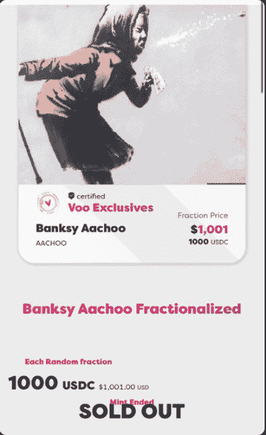
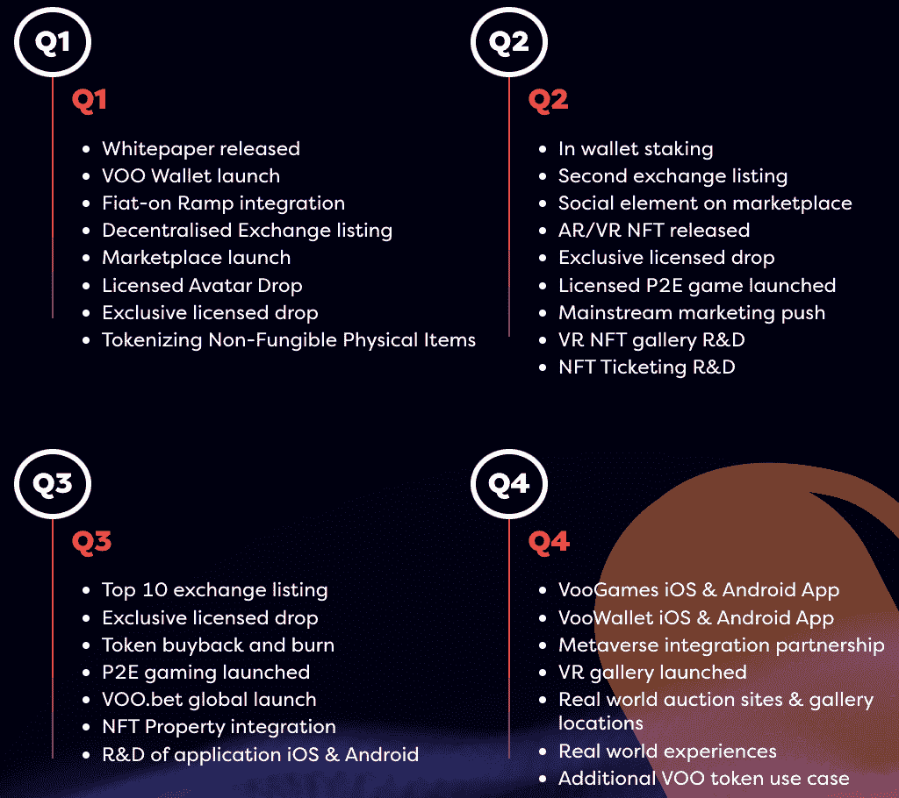

# 班克斯·阿乔！！NFT 在 Solana VooVoo 市场上销售一空

> 原文：<https://web.archive.org/web/https://dappradar.com/blog/banksy-aachoo-nfts-sell-out-on-solana-voovoo-marketplace>

## 4900 件完全复原的数字复制品

世界著名的街头艺术家班克斯与总部位于索拉纳的 NFT 市场 VooVoo 联手推出了 Aachoo！！这周。修复后的艺术品经过法医扫描，生成了 4900 份完整的数字复制品 [**，这些复制品在 24 小时内以每件 1000 USDC 的价格售罄**](https://web.archive.org/web/20221231195602/https://twitter.com/VooVooNFT/status/1496933822067138560) **，销售收入约为 490 万美元。**

班克斯阿啾！！这幅长 5 英尺宽 8 英尺的壁画是在英国布里斯托尔的一座半独立式房屋中被发现后，用起重机从墙上吊起来的。声名狼藉的街头艺术家的故乡。这件艺术品随后由费德里科·博戈尼进行了专业修复。这张图片展示了一个女人打喷嚏时，她的假牙从嘴里飞了出来。

每件作品都是独一无二的，买家无法选择他们收到的图像，这让收藏家们与班克斯·阿乔的原作有了个人联系！！艺术品。这些艺术品的每一部分在 USDC 以 NFT 的名义售价 1000 美元，每位收藏家可以选择竞拍多件作品。

## 什么是伏伏

VooVoo 是索拉纳区块链上的一个 NFT 市场，它希望将数字所有权带到一个更广阔的市场，并改善每个人的体验。NFT 市场汇集了体育、娱乐和文化领域的品牌和名字，计划与领先的足球俱乐部、现任和前任球员、所有体育领域的领先运动员以及知名名人建立独家合作伙伴关系，以帮助创建和营销独家认证的 NFT 系列。

本机钱包和 VOO 令牌完成了核心产品集，并与市场一起构成了路线图下一阶段所需的构建模块。

## 细分的 NFTs

不可替代令牌或简称为 NFT 的东西最近主导了区块链和加密叙事。随着百万美元销售额成为头条新闻，许多潜在买家可能会感到被冷落，更糟糕的是，他们完全错过了机会。然而，许多人不知道的是，[可以购买小块的某些有价值的 NFT](https://web.archive.org/web/20221231195602/https://dappradar.com/blog/what-are-fractionalized-nfts-how-to-invest-in-them)。以总 NFT 价值的一小部分出售。

这个过程被称为分割，给新碎片持有者一个有价值物品的权益，给 NFT 所有者一个释放他们数字收藏品流动性的机会。在撰写本文时，[细分的 NFTs 市场总市值超过 1.07 亿美元](https://web.archive.org/web/20221231195602/https://dappradar.com/nft/fractionalized)——表明人们对这个想法的兴趣越来越大。

在这个场景中，流程以同样的方式工作。原始图像已被分割成数千个较小的项目，购买成本低于购买整个艺术品。有趣的是，有些碎片可能比其他的更值钱。例如，众所周知，班克斯会在他的街头艺术作品上签名，一个包含他签名的碎片可能会比一个只显示白墙背景的碎片卖得更多。

收藏家现在持有大量稀有艺术品，随着时间的推移，这些艺术品可能会变得更有价值，也可能不会。鉴于班克斯的名字与出售联系在一起，我们预计会有更多的需求，看看二级市场的出售如何进行，以及持有者是否会为了潜在的利润而翻转碎片，这将是一件有趣的事情。

 NewsletterUnsubscribe at any time. [T&Cs](https://web.archive.org/web/20221231195602/https://dappradar.com/terms) and [Privacy Policy](https://web.archive.org/web/20221231195602/https://dappradar.com/privacy-policy)

***以上不构成投资建议。此处给出的信息仅供参考。请行使尽职调查，做你的研究。作者持有 ETH、BTC、AGIX、HEX、LINK、GRT、CRO、OMI、不可变 X、GALA、AVASTR、GMEE、CUBE、RADAR、FLOW、FTM、BNB、SPS、WRLD、ATOM 和 ADA。***