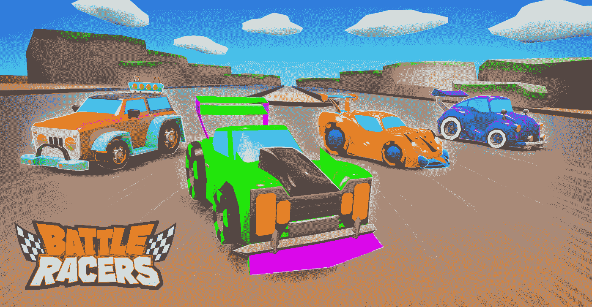
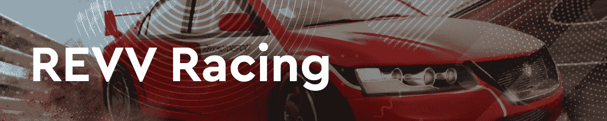
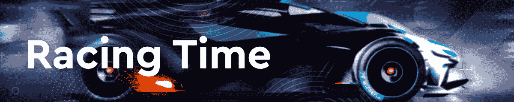
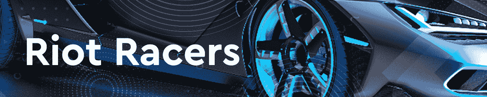
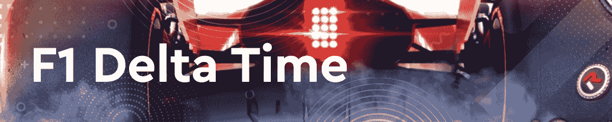
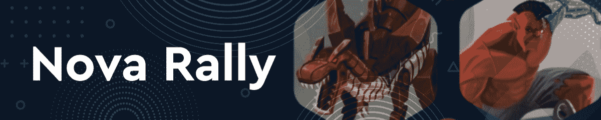

# 战斗赛车关闭，这 5 个选择呢

> 原文：<https://web.archive.org/web/https://dappradar.com/blog/battle-racers-shuts-down-what-about-these-5-alternatives>

## Playcheck Games 将于 2 月 17 日关闭战斗赛车

三年前,《赛车战斗》是首批在区块链推出的 NFT 游戏之一，但 Playcheck Games 现在已经退出了。尽管游戏开始吸引玩家并产生一些 NFT 交易量，但从 2 月 17 日开始，战斗玩家将停止接受升级和支持。

根据[官方公告](https://web.archive.org/web/20221207000312/https://medium.com/battle-racers/announcing-the-closure-of-battle-racers-59f17b39a5ee)，Playcheck Games 在综合了内部和外部因素后做出了艰难的决定。考虑到这一点，该团队将停止进一步开发基于浏览器和移动版本的战斗赛车。

由于对游戏的支持将停止，该团队已确保解释游戏内资产，NFT 板条箱和废弃令牌持有量将会发生什么。玩家可以在 2 月 16 日之前打开零件箱。之后，网站将变得无法访问，未打开的板条箱将永远关闭。此外，废料将从任何集中和分散的交易所退市。游戏中的代币仍然会出现在持有者的钱包里，但是，它的价值会慢慢减少。

## 看看这 5 个战斗赛车的替代品

鉴于战斗赛车的完全关闭，许多玩家将在区块链上寻找替代的赛车游戏。DappRadar 正在跟踪许多这样的项目，以下是五大战斗赛车备选方案。看看这些赛车游戏，找到你最喜欢的。

REVV Racing 是区块链最受欢迎的赛车游戏之一。在 Polygon 上运行，游戏有三个本地令牌，REVV 令牌是主要的奖励令牌。REVV Racing 允许您购买 NFT 汽车，升级它们并参加锦标赛。探索赛道，并获得最佳单圈时间，为您的比赛技能赢得奖励。

Racing Time 是由一群顶级游戏设计师开发的次世代 RAC 游戏。他们的背景包括世界级的视频游戏公司，如艺电、腾讯、CodeMasters 和网易。在流量区块链和独特的 NFT 建筑设计的支持下，Racing Time 允许玩家收集和交易稀有汽车，还可以用 50 多个零件和小工具修改和组装他们的个性化赛车。

Riot Racers 是一款从玩到赚的赛车游戏，玩家拥有游戏的一部分。所有游戏内的活动都是通过本地 RIOT 令牌进行的。该游戏提供免费和付费比赛，而参赛费用取决于比赛的等级、级别和奖励池大小。玩家还可以加入暴动主人的俱乐部，申领免费的暴动代币。

另一个 REVV 赛车运动的副产品，F1 Delta Time 参加了臭名昭著的一级方程式赛车比赛。该游戏允许玩家成为全球一级方程式赛车队的所有者和经理。组装最好的赛车，升级它，成为最好的一级方程式车队，在世界各地的赛道上比赛。重要的是，作为 REVV 赛车生态系统的一部分，玩家有机会因成功赢得比赛而获得 REVV 代币。

最后但并非最不重要的是，我们有新星拉力赛，这是一个在蜡像区块链上的古怪而神奇的赛车游戏。玩家选择两名司机和一辆车代表他们参加比赛，并与他人竞争赢得奖品。新星拉力赛车手是银河系中最优秀的赛车天才之一。然而，车辆的类型和每个独特角色隐藏的额外津贴对比赛结果有影响。玩家可以发现车手和车辆的强大组合，并适应不同的比赛条件，以爬上新星联盟的行列。

## 区块链上的赛车游戏找到牵引力

战斗赛车关闭的声明让许多人失望。然而，在众多的区块链，赛车行业正在稳步发展。以上五种选择只是游戏领域众多新星中的几个。

在撰写本文的时候，赛车游戏占据了 DappRadar 游戏排行榜的一些榜首位置。在过去的七天里，REVV Racing 吸引了一千多个独特的钱包到平台上。此外，Nova Rally 现在是排名前 100 的区块链游戏之一。

考虑到“玩到赚”作为区块链领先的赚钱机制越来越受欢迎，附带奖励计划的赛车游戏越来越受重视。DappRadar 很高兴能够追踪这些游戏行业的新星。如果你想探索更多的区块链游戏，请查看 DappRadar 游戏排名。此外，你可以在[推特](https://web.archive.org/web/20221207000312/https://twitter.com/dappradar)上关注 DappRadar，或者加入我们充满活力的 [Discord](https://web.archive.org/web/20221207000312/https://discord.gg/4ybbssrHkm) 社区，展示你最近的比赛，以及你最喜欢的 NFT 赛车。

 NewsletterUnsubscribe at any time. [T&Cs](https://web.archive.org/web/20221207000312/https://dappradar.com/terms) and [Privacy Policy](https://web.archive.org/web/20221207000312/https://dappradar.com/privacy-policy)