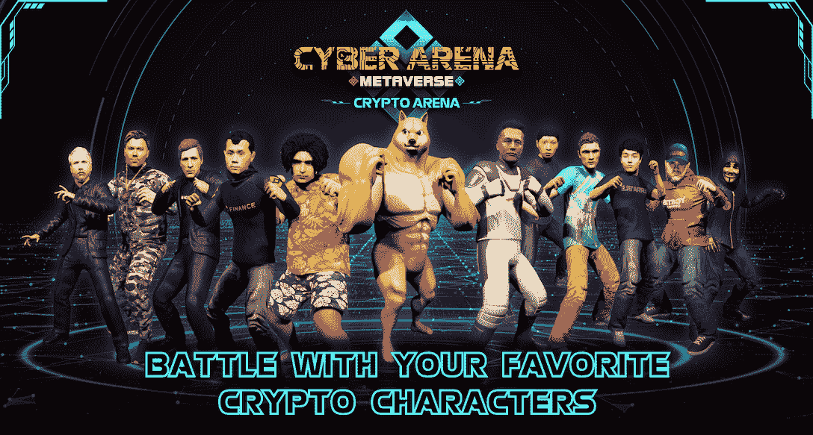
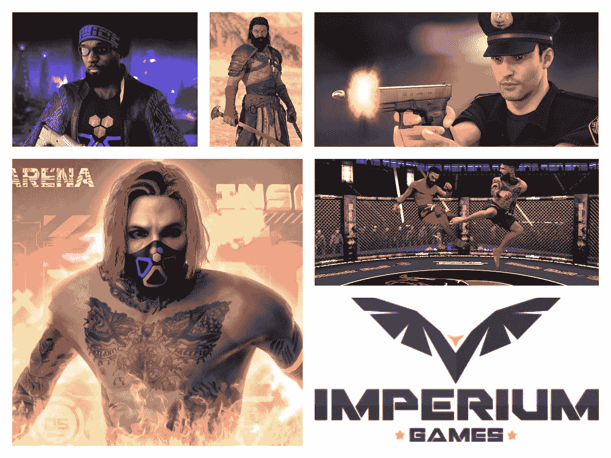
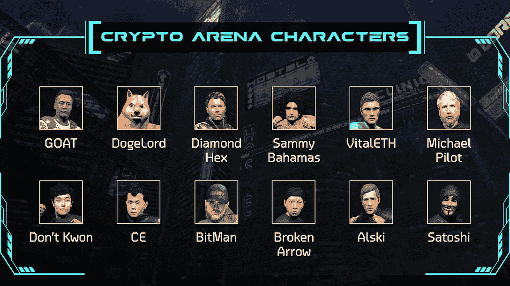

# 在 CryptoArena 与您最喜爱的行业图标战斗

> 原文：<https://web.archive.org/web/https://dappradar.com/blog/battle-with-your-favorite-industry-icons-in-cryptoarena>

## 帝国游戏制作了一个免费的战斗游戏，参考了加密图标

CryptoArena 是一款由 Imperium Games 开发的免费格斗游戏，玩家可以使用密码图标在元宇宙网络竞技场进行战斗。凭借移动和桌面友好的直观游戏机制，玩家可以快速轻松地开始游戏。

CryptoArena 是一款免费的加密游戏，当你在史诗阶段与其他玩家战斗时，它会让你穿上你最喜欢的加密图标的鞋子。让我们深入这场加密之战，看看 CryptoArena 能提供什么。

## 内容

*   [什么是隐竞技场？](https://web.archive.org/web/20230307183407/https://dappradar.com/blog/battle-with-your-favorite-industry-icons-in-cryptoarena/#what)
*   [crypto arena 游戏说明](https://web.archive.org/web/20230307183407/https://dappradar.com/blog/battle-with-your-favorite-industry-icons-in-cryptoarena/#the)
    *   [游戏机制](https://web.archive.org/web/20230307183407/https://dappradar.com/blog/battle-with-your-favorite-industry-icons-in-cryptoarena/#game)
    *   [英雄 vs 反派](https://web.archive.org/web/20230307183407/https://dappradar.com/blog/battle-with-your-favorite-industry-icons-in-cryptoarena/#heroes)
*   [准备好网络竞技场完整版](https://web.archive.org/web/20230307183407/https://dappradar.com/blog/battle-with-your-favorite-industry-icons-in-cryptoarena/#get)
*   [有游戏币吗？](https://web.archive.org/web/20230307183407/https://dappradar.com/blog/battle-with-your-favorite-industry-icons-in-cryptoarena/#any)
*   [不是另一个 Web3 探听者](https://web.archive.org/web/20230307183407/https://dappradar.com/blog/battle-with-your-favorite-industry-icons-in-cryptoarena/#not)

## 什么是隐竞技场

CryptoArena 是由 Imperium Games 开发的新格斗游戏，Imperium Games 是一家著名的电影游戏工作室，以参与开发《巫师》、《战地 3》、《疯狂的麦克斯》和《星球大战-叛乱》等 3a 游戏而闻名。作为元宇宙赛博竞技场中的一款迷你游戏，CryptoArena 可以让你完全控制你选择的密码角色。随着每一次敲击键盘，你可以发动一连串强大的攻击，让你的对手望而生畏。

凭借 Imperium 在游戏行业的专业知识和丰富经验，他们精心制作了一款游戏，让您体验前所未有的加密世界的高潮和低谷。

所以让我们一头扎进充满动作的游戏中。

[Join the battle in CryptoArena now](https://web.archive.org/web/20230307183407/https://crypto-arena.net/game/)

## 隐竞技场游戏解释

CryptoArena 有一个有趣的特点。它让玩家虚拟地面对那些误导他们投资不成功的加密货币项目的骗子，并发泄他们的沮丧。然而，需要注意的是，这款游戏的真正价值在于其精心制作的设计，包括快节奏的动作游戏和精美的图形。

所以不仅能满足你“复仇”的欲望，还能享受身临其境的游戏体验。

[https://web.archive.org/web/20230307183407if_/https://www.youtube.com/embed/g8MwTX5Un74?feature=oembed](https://web.archive.org/web/20230307183407if_/https://www.youtube.com/embed/g8MwTX5Un74?feature=oembed)

### 游戏机制

这款动作游戏提供了基于技能的 PvP 战斗，可以在桌面和移动设备上使用。桌面版本允许快速和无缝的移动和攻击使用箭头键和字符键。很快就会有另一个版本只支持字符键。而对于手机玩家来说，他们可以使用屏幕上的按钮来移动，并用手指点击进行攻击。

一旦你选择了你的角色，你将进入元宇宙的网络竞技场，在多个关卡与不同的对手战斗。随着每个角色独特的移动和组合，玩家需要掌握他们的能力来取得胜利。

### 英雄大战恶棍

在密码世界里，也许每个英雄都是其他人的恶棍。

CryptoArena 的首次发布允许玩家在几个角色之间进行选择，包括 BitMan，Broken Arrow，CE Finance，Diamond Hex，DogeLord，Dont Kwon，GOAT，Michael Pilot，Sammy Bahamas，Satoshi，VitalEth 和 Alski。

该游戏让你控制你最喜欢的密码人物，并使用他们独特的天赋来击败对手。举例来说，作为比特人，你可以在面对对手时变得更好，而作为钻石妖术，你可以在离开之前口头攻击你的对手。凭借激光眼的力量，你可以像迈克尔·派洛特一样穿过竞争者。

[Fight as your favorite icon in CryptoArena now](https://web.archive.org/web/20230307183407/https://crypto-arena.net/game/)

## 为网络竞技场完整版做好准备

CryptoArena 提供了今年晚些时候网络竞技场完整版本的免费预览。

在故事模式下，你将探索一个迷人的世界，在这个世界里，每个角色都有一条独特的道路可走，都有自己的目标要实现。感觉好强？进入锦标赛模式，您可以从一系列难度级别和玩家人数中进行选择，开始赢取奖励。

对于那些寻求更多真正挑战的人来说，联盟模式提供了一条通往伟大的长期道路，每个赛季结束时都有专属奖励等着你。为什么不与你的朋友合作，创建你自己的队伍，进行更多惊心动魄的冒险和更高价值的奖励呢？

升级能力，完成目标，并要求独家 NFT，令牌和路径，因为你爬上排名，并实现像老板在游戏中的地位。

[Test your skills in CryptoArena now](https://web.archive.org/web/20230307183407/https://crypto-arena.net/game/)

## 有游戏内货币吗？

CAT 是 Cyber Arena 的原生令牌，为生态系统提供动力，使令牌持有者能够参与游戏内经济。赛博竞技场的代币机制包括赌注、流动性激励、回购、烧钱等等。

值得一提的是，赛博竞技场努力为玩家提供一个可持续的元宇宙经济。有了这个目标，上面提到的所有代币活动都将由游戏性的需求驱动。这意味着代币的价值来源于元宇宙经济。

CATs 还授予治理权，因此所有者可以对项目的未来方向发表意见。

## 不是另一个网络 3 窥探者

加密和游戏的交集一直在稳步增长，最近的数据只是加强了这一趋势。2023 年 1 月，在线游戏活动激增 1.31%，达到 858，621 dUAW，占 1 月 dapp 活动的 48%。

[Read the full BGA Report](https://web.archive.org/web/20230307183407/https://dappradar.com/blog/game-and-metaverse-tokens-rally-with-strong-on-chain-metrics)

然而，也值得指出的是，并不是每个加密游戏都是精心制作的。

与其他简单的 Web3 游戏相比，CryptoArena 为寻求挑战技能和参与惊险战斗的玩家提供了引人入胜的游戏体验。通过体现他们最喜欢的加密图标并掌握他们的能力，玩家可以沉浸在一个令人兴奋的游戏世界中，并参与由猫令牌驱动的蓬勃发展的游戏经济。

你准备好步入密码竞技场，证明你作为终极密码冠军的价值了吗？让战斗开始吧！

### 了解更多关于 CryptoArena 的信息

*   [游戏](https://web.archive.org/web/20230307183407/https://crypto-arena.net/game/)
*   [网络竞技场](https://web.archive.org/web/20230307183407/https://www.cyber-arena.co/)
*   [推特](https://web.archive.org/web/20230307183407/https://twitter.com/CyberArena_NFT)
*   [不和](https://web.archive.org/web/20230307183407/https://discord.gg/h3vxEurQF3)
*   [帝国运动会](https://web.archive.org/web/20230307183407/https://www.imperiummultimedia.com/)

**免责声明** —这是一篇赞助文章。DappRadar 不认可本页面上的任何内容或产品。DappRadar 旨在提供准确的信息，但读者应该在采取行动之前总是自己做研究。DappRadar 的文章不能被认为是投资建议。