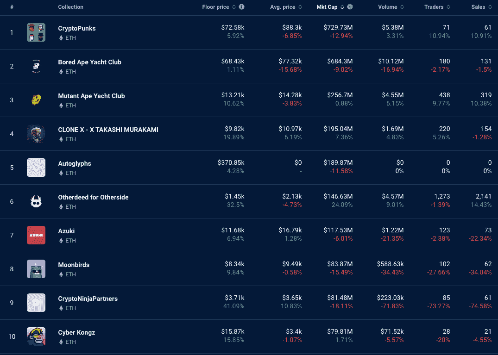

# BAYC 持有者交易他们的蓝筹股

> 原文：<https://web.archive.org/web/https://dappradar.com/blog/bayc-holders-trading-away-their-blue-chips>

## 一些 NFT 收藏家甚至在亏本出售朋克和猿猴

过去 7 天，NFT 交易出现了有趣的变化。CryptoPunks 和 Bored Ape 游艇俱乐部在榜单上占据主导地位，这并不奇怪。但这两个系列在最昂贵的 50 件作品中所占的比例表明，市场正在发生变化。这种转变可能是持续的熊市、FTX 崩盘的影响以及更广泛的全球经济衰退的结果。

[Explore NFT Rankings](https://web.archive.org/web/20221130134622/https://dappradar.com/nft)

## 朋克和猿主宰了最高销售额

在过去一周 NFT 最昂贵的 50 件作品中，有 42 件不是无聊的猿人就是神秘的朋克。这相当于 94%的销售额来自两个系列。这告诉我们什么？

这表明许多持有人正在出售他们的蓝筹股 NFT。自从 FTX 崩溃以来，Ape 和 Punks 一直保持着很高的价值，似乎人们想通过交易这些仍然昂贵的资产来释放他们的 ETH。

买家在寻找便宜货。这两个收藏仍然保持着一定的声望，有闲钱的收藏者觉得现在是买入的时候了。过去一周，无聊猿类的平均售价为 68430 美元，远低于 ATH 312101 美元的平均售价(2022 年 4 月)。

过去一周 crypto 朋克的平均售价为 88，300 美元，比前一周下降了 6.85%。在巅峰时期，CryptoPunks 的底价为 429，564 美元。因此，如果这是一个 Web3 社区仍然相信的项目，当前的价格代表了良好的价值。

[Check Top NFT Collections](https://web.archive.org/web/20221130134622/https://dappradar.com/nft/collections)

## 总体交易量下降

在市值最高的 10 个 NFT 项目中，70%的藏品的交易人数下降了。半数藏品的交易量(通过买卖易手的美元数量)下降，这意味着另一半藏品的交易量上升。

Data source: [DappRadar NFT Rankings](https://web.archive.org/web/20221130134622/https://dappradar.com/nft/collections)

有趣的是，所有藏品的底价都在上涨，这表明我们可能会在当前价格下看到某种形式的整合。这可能意味着我们处于底部，价格可能会从这里上涨，但这不太可能。

如果我们[看一下 30 天的视图](https://web.archive.org/web/20221130134622/https://dappradar.com/nft/collections)，我们可以看到大多数藏品的平均销售价格、底价和市值都下降了，其中大多数都是两位数。由于许多国家的利率提高，系统中的自由资金减少，人们可能会开始将 PFP 收藏视为一种奢侈。

## 查看 NFT 销售亮点列表

*注意:出售时给出的美元价值是正确的。*

每周，DappRadar 不仅会重点报道 NFT 最昂贵的[销售](https://web.archive.org/web/20221130134622/https://dappradar.com/nft/sales)，还会报道过去七天中最有趣的销售。虽然庞大的数字肯定会占据头条，但同样重要的是[突出新兴趋势](https://web.archive.org/web/20221130134622/https://dappradar.com/nft/sales)并保持 DappRadar 社区的领先地位。

*   [Bored Ape 游艇俱乐部# 8633](https://web.archive.org/web/20221130134622/https://dappradar.com/hub/assets/eth/0xbc4ca0eda7647a8ab7c2061c2e118a18a936f13d/8633)-738，130 美元/613.06 ETH-[业主的钱包](https://web.archive.org/web/20221130134622/https://dappradar.com/hub/wallet/eth/0x7eb413211a9de1cd2fe8b8bb6055636c43f7d206)
*   [crypto punk # 7519](https://web.archive.org/web/20221130134622/https://dappradar.com/hub/assets/eth/0xb47e3cd837ddf8e4c57f05d70ab865de6e193bbb/7519)-$ 155130/124.95 ETH-[主人的钱包](https://web.archive.org/web/20221130134622/https://dappradar.com/hub/wallet/eth/0xcc2a855946a3c20683858fe6ee15acf8b836f0b3)
*   [志那都红豆# 6737](https://web.archive.org/web/20221130134622/https://dappradar.com/hub/assets/eth/0xed5af388653567af2f388e6224dc7c4b3241c544/6737)-$ 145020/120 ETH-[车主的钱包](https://web.archive.org/web/20221130134622/https://dappradar.com/hub/wallet/eth/0xe473cd1c83663a1f32f81ca34c647c4e8ffbdcf2)
*   [fiden za # 125](https://web.archive.org/web/20221130134622/https://dappradar.com/hub/assets/eth/0xa7d8d9ef8d8ce8992df33d8b8cf4aebabd5bd270/78000125)–＄110，220/91 WETH—[车主钱包](https://web.archive.org/web/20221130134622/https://dappradar.com/hub/wallet/eth/0x36fea1ca849ab138aed5ede18c8adf9286529043)
*   [other side # 82785](https://web.archive.org/web/20221130134622/https://dappradar.com/hub/assets/eth/0x34d85c9cdeb23fa97cb08333b511ac86e1c4e258/82785)-$ 109280/90 ETH-[车主的钱包](https://web.archive.org/web/20221130134622/https://dappradar.com/hub/wallet/eth/0xc0738649740929ef714cc5c0229a1d5fa8138c29)
*   [传奇海马# 307](https://web.archive.org/web/20221130134622/https://dappradar.com/hub/assets/eth/0x92342459caca0dadf2da27772b4945bd3e46c33d/307)——106090 美元/88 ETH—[主人的钱包](https://web.archive.org/web/20221130134622/https://dappradar.com/hub/wallet/eth/0xf8f79a2518a6da818e51efc74651f8e2eeff9d3c)
*   [无聊猿游艇俱乐部 0 号](https://web.archive.org/web/20221130134622/https://dappradar.com/hub/assets/eth/0xe5b52eb1250a6c860a0088a2ba275c5fed8457b9/0)——84730 美元/70 WETH—[业主的钱包](https://web.archive.org/web/20221130134622/https://dappradar.com/hub/wallet/eth/0xe506849f6e0951aa9cb73f7d259f0c68ac7e9e14)

## 看看这些有趣的销售

看看上面列表中的前两个钱包，我们可以看到两只鲸鱼收集了更多的蓝筹 NFT。让人惊叹的是 BAYC #8633 的价格。在今天或其他任何一天的市场上，738，130 美元对于一只猿来说都是一大笔钱。检查车主的钱包，深入了解活动情况。你可能会发现一些有趣的东西。

一个志那都红豆和一个菲登扎也在许多朋克和猿的销售中卖得很好。有趣的是，NFT 的另一块土地卖到了 109280 美元。这件物品当然更值得关注，买家的钱包也是如此。所以你可以看看这两个网站，看看你是否能发现为什么有人花这么多钱买了一个最近表现不佳的系列。

一只传说中的海马卖到了 106，090 美元，这对于一个今年 9 月才推出的系列来说是令人惊讶的，这个系列在 NFT 空间并不那么知名。和以往的突击销售一样，使用 DappRadar 的工具来检查整个系列的连锁活动，并深入了解买家的钱包。我们并不是说这是不道德的行为，但这可能是不正当交易的迹象。所以绝对是 DYOR。

列表中的最后一项——“无聊的猿类游艇俱乐部”# 0——看起来像是被骗了。Durmann collection 的 Black Paint 类似于 Splat 项目，人们可以将一罐数字番茄汤扔在他们选择的 NFT 上。在这个游戏中，用户可以将一罐黑漆扔在 NFT 上。

似乎有人把 NFT 扔在一张无聊的猿的照片上，然后一个谦逊的人付给无聊的猿不是真品的价格。看到这种事情发生是一种耻辱，我们希望这不是发生在这里的事情。或者，买方可能试图吸引人们对项目的注意(这可能是另一个清洗交易的例子)。

## 随身携带您的 Web3 之旅

使用 DappRadar 移动应用程序，再也不会错过 Web3。查看最受欢迎的 dapps 的性能，并关注您投资组合中的 NFT。您在 DappRadar 上的帐户会与我们的移动应用程序同步，这样您很快就可以选择实时接收提醒。

[Download the DappRadar app now](https://web.archive.org/web/20221130134622/https://dappradar.app.link/blog)[<picture></picture>](https://web.archive.org/web/20221130134622/https://play.google.com/store/apps/details?id=com.portfolio.dappradar)